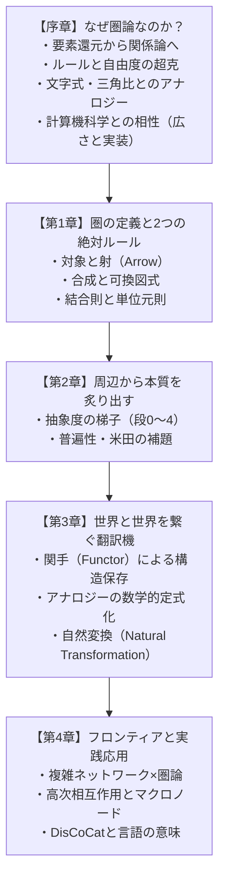

# 圏論（Category Theory）直感と構造の探求ガイド

> **「中身（要素）」を暴くのではなく、「関係性（矢印）」によって世界の構造を捉えるメタ言語。**

本書は、数学・計算機科学・認知・複雑ネットワーク・量子論の交差点に位置する「圏論（Category Theory）」を、直感的な比喩と厳密な構造の両面から一から効率的に振り返り、学べるように構成された学習教材です。

---

## 🗺️ 学習ロードマップ



---

## 📚 章立て一覧

| 章 | タイトル | 主なテーマ | 原稿リンク |
| :--- | :--- | :--- | :--- |
| **序章** | なぜ圏論なのか？ | 動機、要素から関係へ、代数・三角比アナロジー、**計算機科学との相性**、自由度の拡張 | [`chapters/00_motivation_and_paradigm_shift.md`](./chapters/00_motivation_and_paradigm_shift.md) |
| **📖 用語集** | 超重要キーワード図鑑 | 環・半環・体、射・関手・自然変換・普遍性・米田の補題 | [`chapters/00b_glossary_and_concepts.md`](./chapters/00b_glossary_and_concepts.md) |
| **📐 前提知識** | 5分でわかる線形代数とべき乗 | 行列の本質（関係性マップ）、掛け算の意味（1歩進む）、べき乗（タイムマシン） | [`chapters/00c_linear_algebra_primer.md`](./chapters/00c_linear_algebra_primer.md) |
| **第1章** | 圏の定義と2つの絶対ルール | 対象・射・合成・可換図式・結合則・単位元則・具体例 | [`chapters/01_category_and_axioms.md`](./chapters/01_category_and_axioms.md) |
| **★特別コラム** | トロピカル代数と最短経路行列計算 | 3駅モデル数値手計算・対比表・記号併記・半環大統一 | [`chapters/01b_tropical_algebra_worked_example.md`](./chapters/01b_tropical_algebra_worked_example.md) |
| **🌐 特別解説** | 巨大ネットワークが数回で収束する魔法 | 鳩ノ巣原理（N-1上限）、直径D、スモールワールド、log₂ D の奇跡 | [`chapters/01c_convergence_and_network_diameter.md`](./chapters/01c_convergence_and_network_diameter.md) |
| **第2章** | 周辺から本質を炙り出す | **抽象度の梯子**、普遍性、米田の補題 | [`chapters/02_universal_properties_and_yoneda.md`](./chapters/02_universal_properties_and_yoneda.md) |
| **第3章** | 世界と世界を繋ぐ翻訳機 | 関手（Functor）、構造保存、アナロジー、自然変換 | [`chapters/03_functors_and_natural_transformations.md`](./chapters/03_functors_and_natural_transformations.md) |
| **第4章** | フロンティアと実践応用 | 複雑ネットワーク、高次相互作用、DisCoCat・言語の意味、知識構造化 | [`chapters/04_applications_and_frontiers.md`](./chapters/04_applications_and_frontiers.md) |

---

## 🖥️ ブラウザでの閲覧・実践ツール

本教材は単一の HTML ファイルでも快適に閲覧できます（KaTeX 数式・Mermaid 図・モダンUI対応）。

- **HTML版教材**: [`index.html`](./index.html) をブラウザで開く（ダブルクリック / `file://` 直開き対応）
- **🧰 実践ツール（半環カートリッジ実験室）**: [`tool/index.html`](./tool/index.html)（ルート最適化インタラクティブツール）
- **💱 応用実験室（裁定・波及・停止ドミノ）**: [`tool/applications-lab.html`](./tool/applications-lab.html)（第4章 §2 の3例を体験）

---

## 🛠️ 教材品質の自動検証（Quality Assurance）

本教材は、共通品質検査ツール [`verify_material.py`](../tools/verify_material.py) により、数式（KaTeX）・ダイアグラム（Mermaid）・太字レンダリング・目次アンカーの整合性が常に自動検証されています。

```bash
# 本教材の品質を自動検証
python ../tools/verify_material.py .
```

