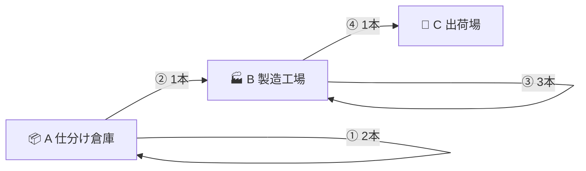
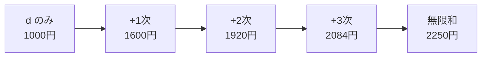

# 【前提知識】5分でわかる線形代数 — 行列の掛け算と「べき乗」がひらく未来

> **「行列」は無味乾燥な計算ドリルではなく、世界の関係性を一望し、未来をシミュレーションする「タイムマシン」です。**

本章では、高校・大学数学の難解な証明をすべて抜きにして、「**行列の直感」「手で追える掛け算の計算過程」「べき乗の威力」「無限乗（$M^\infty$）の正体**」を、具体的な数字でスッキリ解説します。

---

## 1. 行列とは何か？ — 点と点の「関係性マップ」

数学で行列 $\begin{pmatrix} a & b \\ c & d \end{pmatrix}$ と書くと難しそうに見えますが、本質は「**誰と誰が、どんな関係で繋がっているかを整理した表（マップ）**」です。

先に**図（マップ）**を見てから表（行列）に落とすと、一気に腹落ちします。以下は、**物流センター**をイメージした具体例です（数字は手計算用に簡略化しています）。

### 📏 この例の数字は何を表すか？（時間でも距離でもない）

**本章の $M$ に入る数字は、すべて「経路の本数」です。** 単位は **本**（または単位なしの個数）で、**時間（分）でも距離（km）でもありません。**

| 言い方 | 意味 | 例 |
|:---|:---|:---|
| **1ステップ** | 今日、1回だけ選んで完了する搬送・工程 | トラックを1便走らせる／コンベアを1周させる |
| **経路が 2本** | 同じ出発・同じ到着でも、**区別できる選択肢が2つ** | 東コンベアで1周 **または** 西コンベアで1周 |
| **経路が 0本** | その1ステップでは行けない | 倉庫から出荷場へ直行便なし |
| **自己ループ** | 出発と到着が同じ拠点の経路 | 倉庫の中だけで完結する搬送 |

```text
【用語の統一（本章）】
  「系統」「便」「ルート」→ すべて「経路 ○本」と数える
  「2」   → 「2本の経路がある」（2時間でも2kmでもない）
```

> **別モデルとの違い:** [`tool/index.html`](../tool/index.html) の電車ツールでは、同じ形の行列に **時間（分）・運賃（円）** などを入れます。そちらは半環カートリッジで「最短時間」などを求める別の話です。**形は同じ、マスの中身の意味が違う** — 混同しないよう、本章は最初から「本数だけ」に固定します。

### 🏭 設定：倉庫 → 工場 → 出荷場

| 拠点 | 現実のイメージ |
|:---|:---|
| **A** 仕分け倉庫 | 荷物を仕分けする物流倉庫 |
| **B** 製造工場 | 部品を組み立てる工場 |
| **C** 出荷場 | トラックに積み込んで終わり（ここから先は追わない） |

**1ステップ** = 今日、荷物に対して**1回だけ**適用する搬送・工程（何分かかるかはこの章では問いません）。

### 🗺️ 搬送マップ（関係性の図）

矢印のラベルは「**その1ステップで選べる経路が何本あるか**」だけを示します。



```text
   【A 仕分け倉庫】
    ① 倉庫内経路 … 2本（東コンベア1周 / 西コンベア1周）→ どちらも A着
    ② 倉庫→工場 … 1本（昼便トラック1台）→ B着
   【B 製造工場】
    ③ 工場内経路 … 3本（ライン1 / ライン2 / ライン3 の局内1周）→ どちらも B着
    ④ 工場→出荷 … 1本（出荷トラック1台）→ C着
   【C 出荷場】… ここから先はモデル外（経路 0本）
```

#### 各マスの意味（数字＝本数）

| 番号 | マス | 本数 | 現実のイメージ（何を数えているか） |
|:---:|:---:|:---:|:---|
| ① | A→A | **2本** | 倉庫内で完結する搬送が**2通り**ある（東ループ・西ループ）。**時間は問わず**「選び方が2つ」 |
| ② | A→B | **1本** | 倉庫→工場のトラック便が**1通り**だけ |
| ③ | B→B | **3本** | 工場内で完結する工程が**3通り**ある（ライン1・2・3） |
| ④ | B→C | **1本** | 工場→出荷場の出荷便が**1通り**だけ |

> **自己ループ（A→A, B→B）** = 「拠点の外に出ず、1ステップで終わる経路」。本数だけを $M$ に書き、各経路が何分かかるかは別表にできます（半環ツールの話）。

### 📋 図 → 行列 $M$（出発が「行」、到着が「列」）

**読み方:** 行の拠点から出発し、列の拠点へ向かう「1ステップ経路」が**何本あるか**を書く（単位は**本**）。

|  | **着 A** | **着 B** | **着 C** |
|:---:|:---:|:---:|:---:|
| **発 A** | ① **2本** | ② **1本** | **0本** |
| **発 B** | **0本** | ③ **3本** | ④ **1本** |
| **発 C** | **0本** | **0本** | **0本** |

数式で書くと次の**隣接行列 $M$** です（上の表と同じ）：

$$M = \begin{pmatrix}
2 & 1 & 0 \\
0 & 3 & 1 \\
0 & 0 & 0
\end{pmatrix}$$

- **1行目（A発）**: 倉庫内 **2本**、工場へ **1本**、出荷場へ **0本**
- **2行目（B発）**: 工場内 **3本**、出荷場へ **1本**、倉庫へ **0本**
- **3行目（C発）**: 出荷場は終端 — 出発経路 **0本**（行はすべて 0）

> **ポイント:** $(i,j)$ の数字は常に **「本数」**。同じ行列の形で、別の章ではマスに**時間や運賃**を入れることもある（そのときは単位が分・円になる）。

### 🎯 なぜ「経路の本数」を数えるのか？（意識的に選んだ問い）

物流の現場でいちばんよく聞くのは「**何分で届くか**」「**いくらかかるか**」です（→ [`tool/index.html`](../tool/index.html) の半環ツール）。  
**「何通りの経路があるか」** だけを数えるのは、日常の第一目的ではありません。

それでも、**経路数が答えになる問い**はちゃんとあります。本章は、行列の掛け算を学ぶうえで **いちばん素直な問い** として、あえて「本数」を選んでいます。

| 知りたいこと | 経路数が効く場面（この例での読み方） |
|:---|:---|
| **届くか？** | $M$ で A→C が **0本** → 1ステップでは不可。$M^2$ で **1本** → **2ステップ以内なら届く**と判定できる |
| **余裕（冗長性）はあるか？** | A→A が **2本** → 東ループが止まっても西ループが残る、など**バックアップの本数**がわかる |
| **分散できるか？** | B→B が **3本** → 工場内に **3系統**あり、ピーク時に荷を分けられる余地がある |
| **ランダムに選ぶときの確率** | 2ステップで A→C に行ける経路が **1本だけ**なら、その経路を通る確率は 1/1。本数が増えれば「どの道を通るか」の組合せが増える |
| **設計を比較する** | コンベアを1本増設したら $M$ のどのマスが何本増えるか — **ネットワーク改修の効果**を表で比べられる |

### ⚡ 行列の有効性：1ステップなら不要、複数ステップで力を発する

**1ステップだけ**の経路本数なら、図を見て数えれば足ります。行列 $M$ は「関係を表に整理したもの」であり、**必須ではありません**。

問題は **2ステップ・3ステップ…と段が増えるとき** です。

| やり方 | 1ステップ | 複数ステップ（$k$ 段） |
|:---|:---|:---|
| **素朴に数える** | 図の矢印を数えるだけでよい | 経由地の組み合わせが爆発し、全ペアを手で追うのは現実的でない |
| **行列で求める** | $M$ にそのまま書ける（整理用） | **$M^k$ を1回計算**すれば、**すべての出発・到着ペア**の $k$ ステップ経路本数が一括でわかる |

```text
  1ステップ … 「A→C は何本？」→ 図で 0本 と分かる（行列はなくても可）
  2ステップ … 「A→C は何本？」→ 経由 B を足し合わせる必要がある → M² で一発
  kステップ … 拠点が増えると手計算は破綻 → Mᵏ が有効（§4 の繰り返し自乗法で加速）
```

**経路数を数える例を使う理由は二つあります。**  
(1) 上の表のように、経路数そのものに意味がある問いがある。  
(2) **「複数ステップの経路本数は、行列の掛け算・べき乗で求められる」** — これが §2 以降で学ぶ計算の正当化です。

```text
【本章のスタンス】
  「経路数」は万能ではない。でも上のような問いには答えになる。
  → 1ステップは図で足りる。複数ステップこそ行列の掛け算が効く。
  → §3 以降は「円」の産業連関へ。問いは変わるが、掛け算の形は同じ。
```

電車・時間・運賃版 → [`tool/index.html`](../tool/index.html)　｜　本数版（本章）→ 上の $M$

---

## 2. 行列の掛け算（行 $\times$ 列）の具体的な手計算ステップ

### この節で何を求めるか？（先にここだけ読む）

**問い（意識的に選んでいる）:** 「出発拠点 $X$ から到着拠点 $Y$ へ、**ちょうど 2 回**搬送・工程を選んだとき、**区別できる経路は何本あるか？**」

§1 で述べた通り、本数そのものより「何分・いくら」が欲しい場面は多いです。  
ここでは **経路数が答えになる問い** に絞り、行列の掛け算を手で追います。

> **行列が要る理由:** 1ステップの本数は図を数えればよい。**2ステップ以上**は経由の組み合わせが増えるので、$M \times M = M^2$ で**全ペアを一括**求める — これが掛け算の有効性です。

| この節の計算でわかること | 例（A→C） |
|:---|:---|
| **2ステップ以内に届くか** | $M$ では 0本 → 不可。$M^2$ で 1本 → **届く** |
| **何通りの道があるか** | B経由が $1\times1=1$ 本 — 設計変更で本数が増えるか比較できる |
| **次の段（$M^3, M^4, \ldots$）の土台** | 本数モデルの掛け算が身につく → §3 の「円」の波及に同じ形を使う |

| 言葉 | 意味 | 単位 | 例 |
|:---|:---|:---:|:---|
| **ステップ** | 荷物が**何回**搬送・工程を踏むか（回数） | 回 | 「2ステップ」＝今日と明日の2回、または連続2回の選択 |
| **本** | その回数で行ける**経路の種類数**（答え） | 本 | 「1本」＝選び方が1通りだけ、「3本」＝3通りある |

> **ステップと本は別物です。**  
> - **ステップ** … 問題の**条件**（「何回で行くか」）  
> - **本** … 計算の**答え**（「その条件を満たす経路が何通りあるか」）

$M$（1ステップの表）を $M$ と掛けると **$M^2$（2ステップの表）** ができます。  
各マスの数字は、いつも **「○ステップで行ける経路が何本か」** です。

```
【この節のゴール】
  M   … 1ステップで行ける経路の本数（§1 で作った表）
  M²  … 2ステップで行ける経路の本数（これから手計算する）
  目的 … 「何通りあるか」がわかると、届くか・余裕があるか・確率などが論じられる（§1 の表）
```

---

### 📐 行列の掛け算の型：$A \times B = C$ の1マスはどう決まる？

$A$ と $B$ を掛けて $C$ ができるとき、**$C$ の $(i,j)$ マス**（$i$ 行・$j$ 列）は次のように決まります。

$$\boxed{C(i,j) = A(i,1)\,B(1,j) + A(i,2)\,B(2,j) + \cdots + A(i,n)\,B(n,j)}$$

**読み方:** $C$ の **$(i,j)$ マス** ＝ 左の $A$ の **$i$ 行目** と、右の $B$ の **$j$ 列目** を、同じ番号どうしで掛けて**全部足す**。

#### 図：$C(1,1)$ のイメージ（$3 \times 3$ の場合）

```text
        ← B の 1列目（縦に読む）→
         (1,1)  (2,1)  (3,1)
           │      │      │
A の 1行目 →(1,1)─×─(1,1)  (1,2)×(2,1)  (1,3)×(3,1)─→ 全部足す ＝ C(1,1)
           └──────── 同じ「途中番号」k でペアになる ────────┘

  C(1,1) = A(1,1)×B(1,1) + A(1,2)×B(2,1) + A(1,3)×B(3,1)
```

#### 図：$C(1,3)$ のイメージ（§2 の A→C と同じマス）

```text
         B の 3列目
           (1,3)
           (2,3)     A の 1行目 × B の 3列目
           (3,3)  →  C(1,3)

  C(1,3) = A(1,1)×B(1,3) + A(1,2)×B(2,3) + A(1,3)×B(3,3)
```

#### すべてのマスに同じルール

**$C$ のどのマスでも**「$A$ の**ある1行**」×「$B$ の**ある1列**」です。行・列の番号が $(i,j)$ のマスに対応します。

| $C$ のマス | $A$ の行 | $B$ の列 | 計算式（$3\times3$） |
|:---:|:---:|:---:|:---|
| $(1,1)$ | **1行目** | **1列目** | $A(1,1)B(1,1) + A(1,2)B(2,1) + A(1,3)B(3,1)$ |
| $(1,2)$ | **1行目** | **2列目** | $A(1,1)B(1,2) + A(1,2)B(2,2) + A(1,3)B(3,2)$ |
| $(1,3)$ | **1行目** | **3列目** | $A(1,1)B(1,3) + A(1,2)B(2,3) + A(1,3)B(3,3)$ |
| $(2,1)$ | **2行目** | **1列目** | $A(2,1)B(1,1) + A(2,2)B(2,1) + A(2,3)B(3,1)$ |
| $(2,2)$ | **2行目** | **2列目** | $A(2,1)B(1,2) + A(2,2)B(2,2) + A(2,3)B(3,2)$ |
| $\vdots$ | $\vdots$ | $\vdots$ | 同じパターン |
| $(3,3)$ | **3行目** | **3列目** | $A(3,1)B(1,3) + A(3,2)B(2,3) + A(3,3)B(3,3)$ |

```text
  【指の動き】
    ① C のマス (i,j) を決める
    ② A の i 行目を指でなぞる（横）
    ③ B の j 列目を指でなぞる（縦）
    ④ 同じ k 番の要素どうし A(i,k)×B(k,j) を足す
```

#### この例で：$A = B = M$（§1 の搬送マップ）のとき

$$M = \begin{pmatrix} 2 & 1 & 0 \\ 0 & 3 & 1 \\ 0 & 0 & 0 \end{pmatrix}$$

| $C=M^2$ のマス | 計算 | 結果 | 物流の読み方 |
|:---:|:---|:---:|:---|
| $(1,1)$ | $2{\times}2 + 1{\times}0 + 0{\times}0$ | **4** | A→A が2ステップで4本 |
| $(1,3)$ | $2{\times}0 + 1{\times}1 + 0{\times}0$ | **1** | A→C が2ステップで1本 |
| $(2,3)$ | $0{\times}0 + 3{\times}1 + 1{\times}0$ | **3** | B→C が2ステップで3本 |

> **ここが §1 の「途中点」話と一致:** $C(1,3)$ では $k=1$ が A経由、$k=2$ が **B経由**（$A(1,2){\times}B(2,3)=1{\times}1$）、$k=3$ が C経由 — **途中番号 $k$ が経由拠点**になっています。

---

### なぜ「掛けて、足す」のか？（経路の話）

2ステップの経路は、必ず**途中の拠点**を1つ通ります。

```text
  A ──1本──▶ B ──1本──▶ C     … 2ステップで A→C へ行ける経路
       ②           ④
```

「A→C を**ちょうど2ステップ**」と決めたとき、途中点は **A・B・C のどれか** です。

| 途中点 | 1歩目 | 2歩目 | 組み合わせ |
|:---:|:---:|:---:|:---|
| **A経由** | A→A が 2本 | そのあと A→C は **0本** | $2 \times 0 = 0$ 本 |
| **B経由** | A→B が 1本 | そのあと B→C が 1本 | $1 \times 1 = \mathbf{1}$ 本 |
| **C経由** | A→C は **0本** | （そもそも1歩目に行けない） | $0 \times 0 = 0$ 本 |

**途中点ごとに「1歩目の本数 × 2歩目の本数」** を掛け、**全部足す**と、A→C の2ステップ経路の総本数が出ます。  
これが高校数学の「**行 × 列 を掛けて足す**」の意味です。

---

### 🔍 手計算：A→C（$M^2$ の 1行3列目）

**問い（再掲）:** 倉庫Aから出荷場Cへ、**2ステップ**で行ける経路は**何本**？

左の $M$ の **1行目**（Aから1歩で行ける本数）と、右の $M$ の **3列目**（各拠点から1歩でCへ行ける本数）を組み合わせます：

$$\begin{aligned}
\text{【1行3列目】} &= (\text{A経由}) + (\text{B経由}) + (\text{C経由}) \\
&= (2 \times 0) + (1 \times 1) + (0 \times 0) \\
&= 0 + 1 + 0 \\
&= \mathbf{1 \text{ 本}}
\end{aligned}$$

**読み下し:**

- $M$ では A→C は **0本**（直行便なし）
- でも **2ステップ**に広げると、A→B→C が **1本** 見つかる
- その1本 = ② 昼便トラック（A→B）のあと ④ 出荷トラック（B→C）を続けた経路

```text
  M¹ で A→C = 0本  … 1ステップでは届かない
  M² で A→C = 1本  … 2ステップなら B経由で1通り
```

この **1本** という答えから、「2段以内なら届く」「経路は B経由に一本化されている（分散の余地は工場側の3本など別マスで見る）」と読み取れます。経路数を数えた**目的**は、こうした判定に使うことです。

---

### 🧮 9マスすべて：$M^2$ の全貌

同じルールで全マスを計算すると **$M^2$** になります。  
**どのマスも「2ステップの経路が何本か」** です。

$$\begin{aligned}
M^2 = \begin{pmatrix} 2 & 1 & 0 \\ 0 & 3 & 1 \\ 0 & 0 & 0 \end{pmatrix} \begin{pmatrix} 2 & 1 & 0 \\ 0 & 3 & 1 \\ 0 & 0 & 0 \end{pmatrix}
&= \begin{pmatrix}
4 & 5 & \mathbf{1} \\
0 & 9 & \mathbf{3} \\
0 & 0 & 0
\end{pmatrix}
\end{aligned}$$

| マス | 問い | 答え（本数） | イメージ |
|:---:|:---|:---:|:---|
| A→A | Aから**2ステップ**でAに戻る経路は？ | **4本** | 倉庫内ループ2本 × また2本 = $2\times2$ |
| A→B | Aから**2ステップ**でBへ行く経路は？ | **5本** | 倉庫内を回ってから工場へ、など |
| A→C | Aから**2ステップ**でCへ行く経路は？ | **1本** | 上で計算した A→B→C |
| B→C | Bから**2ステップ**でCへ行く経路は？ | **3本** | 工場内ループ3本のあと出荷便1本 = $3\times1$ |

> **$M$ と $M^2$ の対応:**  
> - $M$ の数字 … **1ステップ**で行ける経路の**本数**  
> - $M^2$ の数字 … **2ステップ**で行ける経路の**本数**  
> ステップ数が1増えるごとに、$M$ をもう1回掛けます。

たった1回の行列の掛け算で、**「全拠点ペア × 2ステップ」** の本数が9マス一気に求まります。

---

## 3. 行列のべき乗（$M^k$） — サプライチェーンの「波及」を段ごとに見る

§2 の物流例は、**行列の掛け算の手順**を追うための道具でした。ここからは、**べき乗の各段に意味がある**例を使います。

### 🏭 身近な例：公共事業の発注が経済を動かす（産業連関）

政府が「**工業品を 1000円分**」発注したとします。  
その 1000円だけで経済が止まるわけではありません。

- 工場は部品・原料を**農業**や**他の工業**から買う（**1次波及**）
- 農家や部品メーカーも、さらに種苗・機械を買う（**2次波及**）
- その先の先も…（**3次波及**）

この「何段先まで仕入れが連鎖するか」を、行列 $M$ とそのべき乗で表します。

#### 設定：2部門のミニ経済

| 部門 | 例 |
|:---|:---|
| **農**（1行目・1列目） | 農業（米・野菜・原料） |
| **工**（2行目・2列目） | 工業（機械・部品・製品） |

##### 行列 $M$ の読み方（ここを押さえる）

$M$ は **2行2列** の表です。まず **行と列の意味** を固定します。

| | **列＝「誰が」100円分を生産するか** | |
|:---|:---:|:---:|
| | **農が100円作る** | **工が100円作る** |
| **行＝「どこから」仕入れるか** | | |
| **農から仕入れ** | マス $(1,1)$ | マス $(1,2)$ |
| **工から仕入れ** | マス $(2,1)$ | マス $(2,2)$ |

**1マスの意味（丁寧版）:**

> **$M_{\text{行},\text{列}}$** ＝ その**列の部門**が製品を100円作るとき、**行の部門**から**直接**買い入れる金額（円）

表では「100円あたり何円か」を書き、計算用に **100で割った数**（係数）を行列に入れます。

| マス | 表の金額 | 係数 $M$ | 現場のイメージ |
|:---:|:---:|:---:|:---|
| $(1,1)$ | **30円** | **0.3** | 農が100円の農産物を作る → 種・肥料など**農業内**の仕入れが30円 |
| $(2,1)$ | **10円** | **0.1** | 農が100円作る → **工業**から農機・肥料加工品などを10円分買う |
| $(1,2)$ | **20円** | **0.2** | 工が100円の製品を作る → **農業**から原料を20円分買う |
| $(2,2)$ | **40円** | **0.4** | 工が100円作る → **工業内**の部品・中間品を40円分買う |

```text
  【列を見る】「誰が100円生産する側か」  農の列 │ 工の列
  【行を見る】「どこから仕入れるか」      農の行 │ 工の行

  例：M(1,2)=0.2 は
    「工が100円作る（列＝工）とき、農から20円仕入れる（行＝農）」
```

**なぜ 0.3 ではなく 30円と両方書くのか**  
発注が **1000円** のとき、農からの仕入れは $0.2 \times 1000 = 200$ 円とすぐ計算できるように、**1円あたり何円仕入れるか**（＝0.2）を $M$ に入れています。

$$M = \begin{pmatrix} 0.3 & 0.2 \\ 0.1 & 0.4 \end{pmatrix}
\quad
\begin{matrix} \leftarrow \text{農・工が作る} \\ \text{農・工から買う} \uparrow \end{matrix}$$

**単位:** $M$ の数字は **「円/円」**（1円の生産あたり何円仕入れるか）。§2 の「本数」とは別物ですが、掛け算の形は同じ $(+, \times)$ です。

##### ベクトル $\boldsymbol{d}$ の読み方

$$\boldsymbol{d} = \begin{pmatrix} 0 \\ 1000 \end{pmatrix}$$

| 成分 | 意味 |
|:---:|:---|
| 上（農）**0** | 政府は**農産物を直接は買わない** |
| 下（工）**1000** | 政府が**工業品を1000円分**発注する |

これが **最終需要** — 経済の「最初のきっかけ」です。$M$ には入りません（表の外）。

##### $M\boldsymbol{d}$ の計算と、数字の意味

$$\boldsymbol{d} = \begin{pmatrix} 0 \\ 1000 \end{pmatrix}
\quad\Rightarrow\quad
M\boldsymbol{d} =
\begin{pmatrix} 0.3 \times 0 + 0.2 \times 1000 \\ 0.1 \times 0 + 0.4 \times 1000 \end{pmatrix}
=
\begin{pmatrix} 200 \\ 400 \end{pmatrix}$$

| 結果 | どのマスが効いたか | 読み方 |
|:---:|:---|:---|
| 農 **200円** | $M(1,2)=0.2$ × 工の発注1000 | 工が1000円作るために、**農から200円分**の原料を直接仕入れる |
| 工 **400円** | $M(2,2)=0.4$ × 工の発注1000 | 工が1000円作るために、**工の中間品を400円分**仕入れる |

農の列（$d$ の上段＝0）には今回発注がないので、$M$ の**1列目**は $0.3, 0.1$ と掛けても **0** — 1次波及では動きません。

#### 各段で何を求めているか

| 式 | 段（何次波及） | 意味 | 農業 | 工業 |
|:---|:---:|:---|:---:|:---:|
| $\boldsymbol{d}$ | 発注そのもの | 政府が直接買う | 0 | **1000** |
| $M\boldsymbol{d}$ | **1次** | 1000円の工業品を作るための**直接**の仕入れ | **200** | **400** |
| $M^2\boldsymbol{d}$ | **2次** | 200・400円を作るための**その次の**仕入れ | **140** | **180** |
| $M^3\boldsymbol{d}$ | **3次** | さらに一段奥の仕入れ | 78 | 86 |
| $\vdots$ | $k$次 | サプライチェーンの $k$ 段目 | だんだん小さくなる | だんだん小さくなる |

**2次の例（農140円の内訳）:** $M^2\boldsymbol{d}$ の農200円・工400円をさらに作る仕入れ。  
農140円 ≒ 工400円分の生産に付随する農原料（$0.2 \times 400$ など）＋ 農200円分の生産に付随する農内仕入れ（$0.3 \times 200$ など）が合流した結果です。

```text
  政府発注 1000円（工）
       │
       ▼ 1次波及 Md … 工400円・農200円の生産が動く
       │
       ▼ 2次波及 M²d … その生産のための仕入れ
       │
       ▼ 3次波及 M³d … さらに奥
       ⋮
```

**$M^k \boldsymbol{d}$ の意味:** 「発注 $\boldsymbol{d}$ から見て、**$k$ 段目のサプライチェーン**で動く生産額（円）」

§2 では $M \times M$ で「2ステップの経路本数」を**表全体**に求めました。  
ここでは $M^k \boldsymbol{d}$ で「**$k$ 段目の波及額**」を**ベクトル**に求めます。掛け算の骨組みは同じです。

#### なぜ「ありがたい」のか

- **1次だけ見ると** … 工業 1000＋400、農業 200 → 合計 1600円  
- **2次まで足すと** … さらに農 140、工 180  
- **全部足し合わせると** … 農業 **500円**、工業 **1750円** の生産が必要

$$\text{必要な総生産} = \boldsymbol{d} + M\boldsymbol{d} + M^2\boldsymbol{d} + M^3\boldsymbol{d} + \cdots = (I - M)^{-1}\boldsymbol{d}$$

「公共事業 1000円」が、経済全体では **2250円分** の生産を引き起こす — これが **レオンチェフ産業連関** の考え方です。  
**$M^k$ の各段**が「何段目の仕入れか」を表し、**足し合わせた先**に「波及の収束値（総効果）」があります（§5–6）。

```
【指数 k ＝ サプライチェーンの何段目か】
  Md    … 1次波及（直接の仕入れ）
  M²d   … 2次波及（サプライヤーのサプライヤー）
  Mᵏd   … k次波及
  全部の和 … 経済全体で必要な総生産（§5 の収束）
```

---

## 4. 繰り返し自乗法 — 深いサプライチェーンを「たった10回」で追う

産業連関が **20段・50段** も続くとき、$M^{50}$ を1回ずつ掛けるのは大変です。  
**繰り返し自乗法（二乗を繰り返す）** で、べき乗を飛ばし飛ばしに計算します：

$$M \xrightarrow{\times M} M^2 \xrightarrow{\times M^2} M^4 \xrightarrow{\times M^4} M^8 \xrightarrow{\times M^8} M^{16} \dots \xrightarrow{\times M^{512}} M^{1024}$$

| 掛け算の回数 | 得られるべき乗 | 産業連関での使い方 |
| :---: | :---: | :--- |
| 1回 | $M^2$ | $M^2\boldsymbol{d}$ ＝ **2次波及** |
| 2回 | $M^4$ | $M^4\boldsymbol{d}$ ＝ **4次波及** |
| 3回 | $M^8$ | $M^8\boldsymbol{d}$ ＝ **8次波及** |
| **10回** | $M^{1024}$ | **1024次波及**まで一気に |

#### この例での $M^2$ と $M^4$（手計算できる大きさ）

§3 の $M$ を2回掛けると：

$$M^2 = \begin{pmatrix} 0.11 & 0.14 \\ 0.07 & 0.18 \end{pmatrix},
\quad
M^4 = M^2 \times M^2 = \begin{pmatrix} 0.022 & 0.041 \\ 0.020 & 0.042 \end{pmatrix}$$

（繰り返し自乗法なら $M^4$ は **$M^2 \times M^2$ の1回** で求まる。$M$ を4回掛けなくてよい。）

各段の波及ベクトル（$\boldsymbol{d}=(0,\,1000)^\top$）：

| べき乗 | 計算 | 農 | 工 | 合計 |
|:---:|:---|:---:|:---:|:---:|
| $M^1\boldsymbol{d}$ | $M\boldsymbol{d}$ | 200 | 400 | 600 |
| $M^2\boldsymbol{d}$ | $M^2 \boldsymbol{d}$ | 140 | 180 | 320 |
| $M^3\boldsymbol{d}$ | $M \cdot M^2\boldsymbol{d}$ | 78 | 86 | 164 |
| $M^4\boldsymbol{d}$ | $M^4 \boldsymbol{d}$ | **41** | **42** | **83** |

段が進むと **1段あたりの波及がどんどん小さくなる** のが見えます。$M^4\boldsymbol{d}$ はもう全体の数％程度です。

---

## 5. 「無限回べき乗」の正体 — 総波及 $(I-M)^{-1}$ と直接発注の比較

### 産業連関でいう「無限」とは何か

ここで注意：**$M^k$ という行列そのもの**は、段を増やすと **だんだんゼロに近づきます**（$M^{1024}$ はほぼ0行列）。

一方、経済で欲しいのは **各段の波及を全部足した総和** です：

$$\boxed{
\boldsymbol{x}
= \boldsymbol{d} + M\boldsymbol{d} + M^2\boldsymbol{d} + M^3\boldsymbol{d} + \cdots
= (I + M + M^2 + M^3 + \cdots)\,\boldsymbol{d}
= (I - M)^{-1}\boldsymbol{d}
}$$

左の **$I + M + M^2 + \cdots$** を、口語では「**無限回べき乗を足し合わせた行列**」と呼ぶことがあります（§2 の $M^\infty$ とは別の意味 — こちらは**級数の和**）。

#### 各次の行列 $M^k$ の数字（べき乗そのもの）

$M^0 = I$（単位行列・0次の「何もしない」）から並べます。$M^k$ は段が進むと**どのマスも小さく**なります。

$$I = \begin{pmatrix} 1 & 0 \\ 0 & 1 \end{pmatrix},
\quad
M^1 = \begin{pmatrix} 0.3 & 0.2 \\ 0.1 & 0.4 \end{pmatrix},
\quad
M^2 = \begin{pmatrix} 0.11 & 0.14 \\ 0.07 & 0.18 \end{pmatrix}$$

$$M^3 = \begin{pmatrix} 0.047 & 0.078 \\ 0.039 & 0.086 \end{pmatrix},
\quad
M^4 = \begin{pmatrix} 0.022 & 0.041 \\ 0.020 & 0.042 \end{pmatrix},
\quad
M^5 \approx \begin{pmatrix} 0.010 & 0.019 \\ 0.009 & 0.019 \end{pmatrix}
\;\Rightarrow\; \text{だんだん } 0 \text{ に近づく}$$

#### 行列を無限次まで足す：$S_k = I + M + M^2 + \cdots + M^k$

**部分和行列** $S_k$ を1マスずつ足していくと、**$(I-M)^{-1}$ に収束**します。

| 何次まで足したか | 部分和行列 $S_k = I + M + \cdots + M^k$ |
|:---|:---|
| $k=0$（$I$ だけ） | $\begin{pmatrix} 1.000 & 0.000 \\ 0.000 & 1.000 \end{pmatrix}$ |
| $k=1$ | $\begin{pmatrix} 1.300 & 0.200 \\ 0.100 & 1.400 \end{pmatrix}$ |
| $k=2$ | $\begin{pmatrix} 1.410 & 0.340 \\ 0.170 & 1.580 \end{pmatrix}$ |
| $k=3$ | $\begin{pmatrix} 1.457 & 0.418 \\ 0.209 & 1.666 \end{pmatrix}$ |
| $k=4$ | $\begin{pmatrix} 1.479 & 0.459 \\ 0.229 & 1.708 \end{pmatrix}$ |
| $k \to \infty$ | $\begin{pmatrix} \mathbf{1.5} & \mathbf{0.5} \\ \mathbf{0.25} & \mathbf{1.75} \end{pmatrix} = (I-M)^{-1}$ |

**1マスの中身だけ見ると**（右上マス $(1,2)$ の例）：

$$0 + 0.2 + 0.14 + 0.078 + 0.041 + \cdots = \mathbf{0.5}$$

同様に $(1,1)$ は $1 + 0.3 + 0.11 + 0.047 + \cdots = \mathbf{1.5}$、$(2,2)$ は $1 + 0.4 + 0.18 + 0.086 + \cdots = \mathbf{1.75}$ へ近づきます。

```text
  各 Mᵏ の行列 … だんだん小さくなる（単体では「消えていく」）
  I + M + M² + … の和 … マスごとに収束して (I−M)⁻¹ になる（「無限和」）
```

#### $(I-M)^{-1}$ ＝ 無限和行列の確定値

$$I - M = \begin{pmatrix} 0.7 & -0.2 \\ -0.1 & 0.6 \end{pmatrix}
\quad\Rightarrow\quad
\boxed{(I-M)^{-1} = I + M + M^2 + M^3 + \cdots = \begin{pmatrix} 1.5 & 0.5 \\ 0.25 & 1.75 \end{pmatrix}}$$

**この行列の読み方:** 最終需要が **工1円** だけ増えると、経済全体では農 **0.5円**・工 **1.75円** の総生産が追加で必要になる（無限段の仕入れ連鎖をすべて含む）。

#### 部分和行列 × 発注 $\boldsymbol{d}$ ＝ ベクトルの累計と同じ

部分和行列 $S_k$ に $\boldsymbol{d}$ を掛けると、§4 の「各次の金額を足す」のと同じ結果になります。

| $S_k$ | $S_k \boldsymbol{d}$（農, 工） | 合計 | 倍率 |
|:---|:---|:---:|:---:|
| $S_0 = I$ | $(0,\,1000)$ | 1000 | 1.00倍 |
| $S_1 = I+M$ | $(200,\,1400)$ | 1600 | 1.60倍 |
| $S_2 = I+M+M^2$ | $(340,\,1580)$ | 1920 | 1.92倍 |
| $S_3$ | $(418,\,1666)$ | 2084 | 2.08倍 |
| $S_4$ | $(459,\,1708)$ | 2167 | 2.17倍 |
| $S_\infty = (I-M)^{-1}$ | $(\mathbf{500},\,\mathbf{1750})$ | **2250** | **2.25倍** |

例：$S_2 \boldsymbol{d}$ の農340円は、行列の $(1,2)$ マス **0.34** × 工の発注1000 ＝ $0.34 \times 1000$ と一致します。

**総生産ベクトル**（無限和行列で一発）：

$$(I-M)^{-1}\boldsymbol{d}
= \begin{pmatrix} 1.5 & 0.5 \\ 0.25 & 1.75 \end{pmatrix}
\begin{pmatrix} 0 \\ 1000 \end{pmatrix}
= \begin{pmatrix} 500 \\ 1750 \end{pmatrix}$$

農 **500円** ＋ 工 **1750円** ＝ 経済全体で **2250円** の生産が必要、と確定します。

#### ベクトルだけの累計表（同じ内容・別の見方）

$\boldsymbol{d} + M\boldsymbol{d} + M^2\boldsymbol{d} + \cdots$ を1項ずつ足しても、上の $S_k\boldsymbol{d}$ と同じです。

| 何まで足したか | 農（累計） | 工（累計） | **合計** | 政府1000円との比 |
|:---|:---:|:---:|:---:|:---:|
| **$\boldsymbol{d}$ だけ**（直接発注） | 0 | 1000 | **1000** | **1.00倍**（きっかけのみ） |
| **＋ $M\boldsymbol{d}$**（1次まで） | 200 | 1400 | **1600** | **1.60倍** |
| **＋ $M^2\boldsymbol{d}$**（2次まで） | 340 | 1580 | **1920** | **1.92倍** |
| **＋ $M^3\boldsymbol{d}$**（3次まで） | 418 | 1666 | **2084** | **2.08倍** |
| **＋ $M^4\boldsymbol{d}$**（4次まで） | 459 | 1708 | **2167** | **2.17倍** |
| **$\cdots$ 無限（$(I-M)^{-1}\boldsymbol{d}$）** | **500** | **1750** | **2250** | **2.25倍** |

```text
  政府が直接払う 1000円（工）
       │
       ├─ 1次まで見ると 1600円分の生産が動く（+60%）
       ├─ 2次まで見ると 1920円分（+92%）
       └─ 無限（全部足す）と 2250円分（×2.25）

  → 「公共事業の波及効果」は、直接の1.0倍と、
     サプライチェーン全体の 2.25倍 を並べて比べられる
```



#### 💡 この流れの大きなメリット（逆行列なしで「無限」に近づける）

大学の教科書では、いきなり $(I-M)^{-1}$（**逆行列**）を求める式が出てきます。  
しかし実際に必要なのは、次の **2つの操作だけ** です。

| 操作 | やること | この例 |
|:---|:---|:---|
| **繰り返し自乗法** | $M \to M^2 \to M^4 \to \cdots$ と、**少ない回数**で高次の $M^k$ を得る | $M^4$ は $M^2 \times M^2$ の **1回** |
| **部分和を足す** | $I + M + M^2 + \cdots + M^k$（行列）または $\boldsymbol{d} + M\boldsymbol{d} + \cdots$（金額）を順に足す | $S_4$ で合計 **2167円**（真値2250円の96%超） |

```text
【中学生が順に読んで追える理由】
  ① 掛け算のルール（§2）… 行×列を掛けて足す
  ② べき乗（§3–§4）… 同じ M を掛け続ける／二乗を繰り返す
  ③ 足し算（§5）… だんだん小さくなる項を足していく
  → 逆行列・行列式・大学数学は一切不要
  → (I−M)⁻¹ は「最終的にこう収束する」という答え合わせ用の記号
```

**1回ずつ $M$ を掛けて1000回足す**必要はありません。  
**逆行列を手で求める**必要もありません。  
「掛け算 → 二乗を繰り返す → 足す」の3段で、**無限回の波及に十分近い数字**（2.25倍）まで到達できます — これが、行列のべき乗を産業連関で教える大きな実用面です。

> **打ち切りの目安:** $M^4\boldsymbol{d}$ や $S_4$ で合計が **2167円**（真値の約96%）まで来ていれば、実務・教材ともに十分。残りは $(I-M)^{-1}$ で答え合わせできます。

```
【別の収束の形（最短経路・半環ツール側）】
  駅が N 個なら、最短ルートは最大 N−1 回の乗り換えで済む
  → Mᵏ の「表の数字」が N−1 段以降でピタッと止まる（クリーネ閉包 M*）
  ※ 産業連関は「Mᵏ そのもの」ではなく「Mᵏd の和」が収束する
```

---

## 6. 世界を動かす $M^\infty$ の実例

| 例 | $M$ の中身 | 各段 $M^k$ | 収束（総効果） |
|:---|:---|:---|:---|
| **レオンチェフ産業連関**（§3） | 仕入れ係数（円/円） | $k$ 次波及額 $M^k\boldsymbol{d}$ | 総生産 $(I-M)^{-1}\boldsymbol{d}$ |
| **Google PageRank** | リンク確率 | $k$ クリック後の滞在分布 | 定常状態 $M^\infty$（検索順位） |
| **最短経路**（半環ツール） | 区間時間（分） | $k$ 回乗り換え以内の最短 | $N-1$ 段で停止（全ペア最短） |

§3 の公共事業 1000円 → 総生産 2250円は、**減税・公共投資の経済効果**を議論するとき、今も使われる枠組みです。

---

## 7. まとめ：圏論・半環への架け橋

線形代数で手に入れたこの「**行列の掛け算とべき乗・無限収束の骨組み**」は、そのまま圏論の世界で最強の武器になります。

| マスの中身 | 半環の例 | 何を求めるか |
|:---|:---|:---|
| **経路の本数**（§2） | $(+, \times)$ | 2ステップで何通り行けるか |
| **仕入れ・波及**（§3） | $(+, \times)$ | $k$ 次波及で何円動くか |
| **時間・距離** | $(\min, +)$ トロピカル | **最短**時間の経路 |
| **確率・信頼度** | $(\max, \times)$ | **最大**の到達確率 |
| **お金** | $(\min, +)$ | **最安**ルート |

- 「掛けて足す」ルールをそのまま使えば ➔ **経路本数・経済波及・Google検索**
- 「足して最小値を選ぶ（$\min, +$）」に変えれば ➔ **カーナビ・最短経路（トロピカル代数）**
- 「$\text{AND}$ して $\text{OR}$ する」に変えれば ➔ **迷路脱出・SNSの友達繋がり（ブール代数）**

**計算の骨組み（行列のべき乗）は同じ**です。変えるのは **マスに何を書くか（本数か時間か）** と **半環カートリッジ（⊕ と ⊗ の意味）** だけです。

---

## 💡 友達に話したくなる！3行まとめカード

```
┌──────────────────────────────────────────────────────────────┐
│ 🌟 線形代数のまとめ                                          │
│ 1. 行列は「関係性マップ」、掛け算は「1段先の波及・経路」 │
│ 2. Mᵏ は k 段目の効果（仕入れの連鎖・経路の本数）        │
│ 3. 足し終われば収束！公共投資の波及も同じ骨組み           │
└──────────────────────────────────────────────────────────────┘
```

---

## ❓ ちょっと考えてみよう！ミニチェック

> **Q. 5つの駅が一本道（A ➔ B ➔ C ➔ D ➔ E）で繋がっている路線図があります。全駅間の最短時間を求めるには、最大で何乗（$M^k$）まで計算すれば確実に収束（$M^\infty$）するでしょうか？**  
> ① 2乗（$M^2$）  
> ② 4乗（$M^4$）  
> ③ 100乗（$M^{100}$）  
> 
> *➔ 正解は **② 4乗（$M^4$）**！駅が $N=5$ 個あるので、端から端への移動は最大でも $N-1 = 4$ 回の乗り換えで済みます。これ以上掛けても数字は変わりません！*
