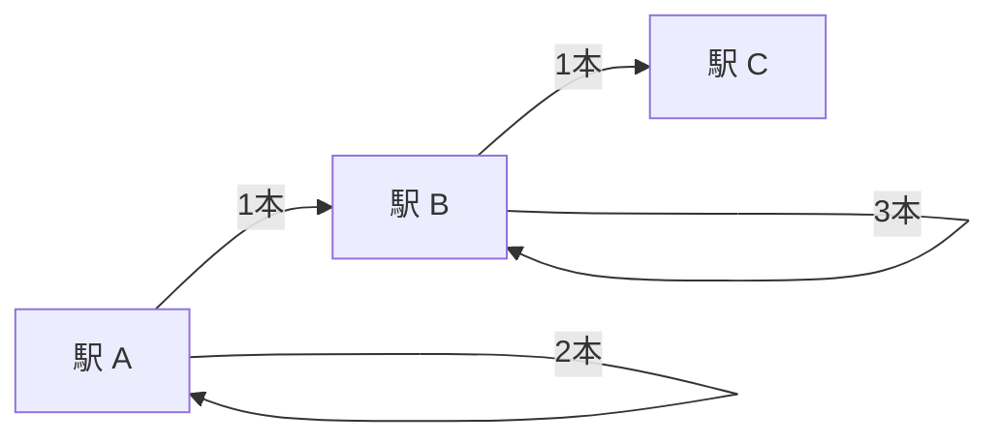
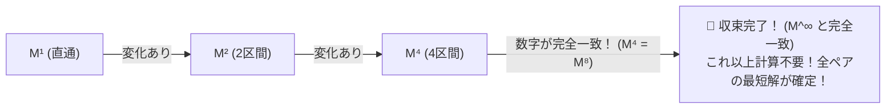

# 【前提知識】5分でわかる線形代数 — 行列の掛け算と「べき乗」がひらく未来

> **「行列」は無味乾燥な計算ドリルではなく、世界の関係性を一望し、未来をシミュレーションする「タイムマシン」です。**

本章では、高校・大学数学の難解な証明をすべて抜きにして、「**行列の直感」「手で追える掛け算の計算過程」「べき乗の威力」「無限乗（$M^\infty$）の正体**」を、具体的な数字でスッキリ解説します。

---

## 1. 行列とは何か？ — 点と点の「関係性マップ」

数学で行列 $\begin{pmatrix} a & b \\ c & d \end{pmatrix}$ と書くと難しそうに見えますが、本質は「**誰と誰が、どんな関係で繋がっているかを整理した表（マップ）**」です。



この「行き来できるルートの本数」を出発地（行）$\to$ 到着地（列）の表に並べたものが**隣接行列 $M$** です：

$$M = \begin{pmatrix}
2 & 1 & 0 \\
0 & 3 & 1 \\
0 & 0 & 0
\end{pmatrix}$$
- **1行目（A発）**: A $\to$ A は 2本、A $\to$ B は 1本、A $\to$ C は 0本（直通なし）
- **2行目（B発）**: B $\to$ A は 0本、B $\to$ B は 3本、B $\to$ C は 1本
- **3行目（C発）**: どこへも行けない（すべて 0）

---

## 2. 行列の掛け算（行 $\times$ 列）の具体的な手計算ステップ

高校数学で習う「横（行）と縦（列）を掛けて足す」というルール。  
その本当の意味は、「**1回乗り換えて（2ステップで）行くルートの総数を調べる**」ということです！

実際に、上の行列 $M$ 同士を掛けて **$M^2 = M \times M$（2回乗り換えのルート数）** を手計算してみましょう。

```
【計算ルール：左の「横（行）」× 右の「縦（列）」】
  「Aから出発する道（1行目）」 × 「Cへ到着する道（3列目）」
  ＝ Aから「どこかの駅を経由して」Cへ行くすべての組み合わせ！
```

### 🔍 具体例：「AからCへ 2ステップで行くルート数（1行3列目）」の計算

左の行列の **1行目 $[2, 1, 0]$** と、右の行列の **3列目 $\begin{pmatrix} 0 \\ 1 \\ 0 \end{pmatrix}$** を指でなぞって掛け合わせます：

$$\begin{aligned}
\text{【1行3列目の計算】} &= (\text{A}\to\text{A経由}) + (\text{A}\to\text{B経由}) + (\text{A}\to\text{C経由}) \\
&= (2 \times 0) + (1 \times 1) + (0 \times 0) \\
&= 0 + 1 + 0 \\
&= \mathbf{1 \text{ 本}}
\end{aligned}$$

「AからBへ行って、BからCへ行くルート（$1 \times 1 = 1$ 本）」が、**掛け算によって自動的に洗い出されました！**

---

### 🧮 9マスすべての手計算結果（全貌）

すべてのマス（9箇所）で同じ「横 $\times$ 縦」を行うと、以下のようになります：

$$\begin{aligned}
M^2 = \begin{pmatrix} 2 & 1 & 0 \\ 0 & 3 & 1 \\ 0 & 0 & 0 \end{pmatrix} \begin{pmatrix} 2 & 1 & 0 \\ 0 & 3 & 1 \\ 0 & 0 & 0 \end{pmatrix}
&= \begin{pmatrix}
(2\times 2 + 1\times 0 + 0\times 0) & (2\times 1 + 1\times 3 + 0\times 0) & (2\times 0 + 1\times 1 + 0\times 0) \\
(0\times 2 + 3\times 0 + 1\times 0) & (0\times 1 + 3\times 3 + 1\times 0) & (0\times 0 + 3\times 1 + 1\times 0) \\
(0\times 2 + 0\times 0 + 0\times 0) & (0\times 1 + 0\times 3 + 0\times 0) & (0\times 0 + 0\times 1 + 0\times 0)
\end{pmatrix} \\
&= \begin{pmatrix}
4 & 5 & \mathbf{1} \\
0 & 9 & \mathbf{3} \\
0 & 0 & 0
\end{pmatrix}
\end{aligned}$$

- **A $\to$ C（1行3列目）**: 直通は 0本だったのに、**2ステップで「1本」のルートが開通**！
- **B $\to$ C（2行3列目）**: 直通は 1本だったが、Bで回ってから行く道も含めて**「3本」に増加**！

たった1回の行列の掛け算で、**「全駅間の2ステップ後の関係性」が9マス一気に求まる**のです！

---

## 3. 行列のべき乗（$M^k$） — 未来を計算するタイムマシン

行列を自分自身と何度も掛け合わせる操作（**べき乗**）を行うと、指数 $k$ はそのまま「**進んだ時間（ステップ数）**」を表すようになります！

```
【指数の数字 k ＝ 進んだステップ数】
  M¹ （1乗） ➔  1ステップ（直通・1日後・1回の接触）
  M² （2乗） ➔  2ステップ（1回乗り換え・2日後・友達の友達）
  M³ （3乗） ➔  3ステップ（2回乗り換え・3日後・3世代先）
   ⋮
  Mᵏ （k乗） ➔  kステップ後の世界（k日後の未来）
```

---

## 4. 繰り返し自乗法 — 1000日後が「たった10回」で求まる魔法

「1000ステップ後の未来」を知りたいとき、1000回掛け算を繰り返す必要はありません。
求めた結果を自分自身と掛けていく「**繰り返し自乗法（Binary Exponentiation）**」を使います：

$$M \xrightarrow{\times M} M^2 \xrightarrow{\times M^2} M^4 \xrightarrow{\times M^4} M^8 \xrightarrow{\times M^8} M^{16} \dots \xrightarrow{\times M^{512}} M^{1024}$$

| ステップ数 | 掛け算の回数 | わかる未来の範囲 |
| :---: | :---: | :--- |
| $M^2$ | 1回 | 最大 2 回乗り換え |
| $M^4$ | 2回 | 最大 4 回乗り換え |
| $M^8$ | 3回 | 最大 8 回乗り換え |
| $M^{16}$ | 4回 | 最大 16 回乗り換え |
| $M^{1024}$ | **たった10回！** | **最大 1024 回乗り換えの超巨大路線網** |

たった10回の掛け算で、1000ステップ先の世界の最適ルートが瞬時に判明します。

---

## 5. 無限回のべき乗（$M^\infty$）の正体 — 問答無用で「数字が止まったら」そこがゴール！

「無限回掛ける（$M^\infty$）」と聞くと、難解な微積分や極限の公式（$\lim$）が必要に思えますよね。
しかし、現実の最適化やネットワークの世界では、**「掛け算を繰り返して、表の数字がピタッと変わらなくなった（収束した）瞬間」が、そのまま『無限回掛けた行列（$M^\infty$）』になります！**

```
【止まった瞬間に起きる魔法（不動点の原理）】
  もし、k 回掛けた表（Mᵏ）と、k+1 回掛けた表（Mᵏ⁺¹）が完全一致したら…

  Mᵏ⁺² ＝ Mᵏ⁺¹ ⊙ M ＝ Mᵏ ⊙ M ＝ Mᵏ⁺¹ ＝ Mᵏ
  Mᵏ⁺³ ＝ Mᵏ
   ⋮
  M^∞  ＝ Mᵏ （未来永劫、1ミリも変わらない！）
```

### 🚉 有限回で勝手に無限に届く保証（トロピカル代数の奇跡）
駅が $N$ 個ある路線図では、最短ルートは最大でも $N-1$ 回しか乗り換えません（それ以上回るのは無駄な遠回りループだからです）。

そのため、**たった $N-1$ 回（4駅なら3回〜4回）べき乗した時点で、確実に数字がピタッと停止し、問答無用で $M^\infty$（全駅間の究極の最短マップ）に到達**します！（これを数学で**クリーネ閉包 $M^*$** と呼びます）



---

## 6. 世界を動かす $M^\infty$ の実例：Google PageRank と 経済予測

この「止まるまでべき乗を繰り返す」という超シンプルな仕組みが、現代社会のあらゆる予測エンジンを動かしています：

1. **Google PageRank（ウェブ検索順位）**:
   ウェブページのリンク確率行列 $M$ を何度もべき乗し、数値が落ち着いた定常状態（$M^\infty$）で「最も人が多く集まるページ」を検索1位にする。
2. **レオンチェフ産業連関モデル（経済波及効果の予測）**:
   直接効果 $M$、1次波及 $M^2$、2次波及 $M^3 \dots$ の無限の波及効果の総和 $I + M + M^2 + M^3 \dots = (I - M)^{-1}$ によって、国全体のGDPや減税効果を正確に予測する。

---

## 7. まとめ：圏論・半環への架け橋

線形代数で手に入れたこの「**行列の掛け算とべき乗・無限収束の骨組み**」は、そのまま圏論の世界で最強の武器になります。

- 「掛けて足す」ルールをそのまま使えば ➔ **確率・AI・Google検索・経済予測**
- 「足して最小値を選ぶ（$\min, +$）」に変えれば ➔ **カーナビ・最短経路（トロピカル代数）**
- 「$\text{AND}$ して $\text{OR}$ する」に変えれば ➔ **迷路脱出・SNSの友達繋がり（ブール代数）**

計算の「骨組み（行列のべき乗）」はそのままに、ルールのカートリッジを差し替えるだけで、世界中のあらゆる問題が解けるようになります！

---

## 💡 友達に話したくなる！3行まとめカード

```
┌──────────────────────────────────────────────────────────────┐
│ 🌟 線形代数のまとめ                                          │
│ 1. 行列は「関係性マップ」、掛け算は「1歩進む（乗り換える）」 │
│ 2. べき乗（M^k）は、k ステップ後の未来を計算するタイムマシン │
│ 3. 数字が変わらなくなったら収束（M^∞）！Googleや経済も動かす │
└──────────────────────────────────────────────────────────────┘
```

---

## ❓ ちょっと考えてみよう！ミニチェック

> **Q. 5つの駅が一本道（A ➔ B ➔ C ➔ D ➔ E）で繋がっている路線図があります。全駅間の最短時間を求めるには、最大で何乗（$M^k$）まで計算すれば確実に収束（$M^\infty$）するでしょうか？**  
> ① 2乗（$M^2$）  
> ② 4乗（$M^4$）  
> ③ 100乗（$M^{100}$）  
> 
> *➔ 正解は **② 4乗（$M^4$）**！駅が $N=5$ 個あるので、端から端への移動は最大でも $N-1 = 4$ 回の乗り換えで済みます。これ以上掛けても数字は変わりません！*
