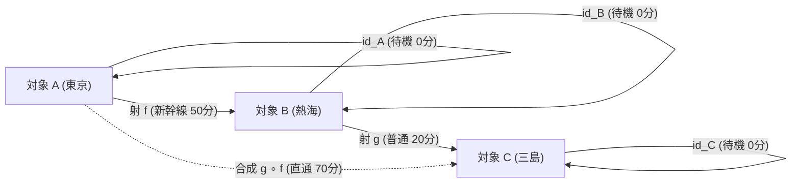
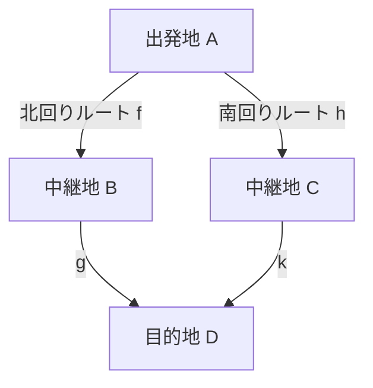

# 第1章：圏の定義と2つの絶対ルール — 「矢印の繋ぎ方」の最小マナー

> **「対象（点）」と「射（矢印）」、そして「たった2つのマナー（結合律・恒等射）」。**  
> これだけで、数学からプログラミング、日常のあらゆるシステムまでを記述できる広大な宇宙が生まれます。

---

## 1. 圏（Category）を作る「4つのパーツ」

圏 $\mathbf{C}$（カテゴリー）は、以下の4つのシンプルなパーツからできています。



1. **対象（Objects）**: $A, B, C, \dots$
   - 「駅」「ゲームのキャラ」「データ型」「状態」。中身は何でも自由！
2. **射（Morphisms / 矢印）**: $f: A \to B$
   - 対象と対象を繋ぐ「線路」「技の進化」「変換処理」「因果関係」。
3. **射の合成（Composition）**: $\circ$
   - $A \to B$（東京 $\to$ 熱海）と $B \to C$（熱海 $\to$ 三島）を繋げて、直通ルート $A \to C$（東京 $\to$ 三島）を作ること（$g \circ f$ と書きます）。
4. **恒等射（Identity）**: $\mathrm{id}_A$
   - 各駅にある「何もしないでその場で待機する（所要時間0分）」という特別な矢印。

---

## 2. 圏を満たす「たった2つの絶対ルール」

どんな世界でも、以下の**2つのマナー**さえ守っていれば、すべて立派な「圏」と認められます！

### ① 結合律（Associativity / けつごうりつ）
3つの区間（東京 $\to$ 熱海 $\to$ 三島 $\to$ 静岡）を移動するとき、途中で**どこで息継ぎ（カッコでまとめる）をしても、全体の旅の結果は完全に一致する**というルールです。

$$(h \circ g) \circ f = h \circ (g \circ f)$$

```
【電車の乗り継ぎで見る結合律】
  (熱海〜静岡の直通チケット) に 「東京〜熱海」 を繋いでも、
  「東京〜三島の直通チケット」 に (三島〜静岡) を繋いでも、
  最終的な「東京 ➔ 静岡」の旅としては全く同じ！
```

---

### ② 単位元律（Identity Laws / たんいげんりつ）
電車の移動の前後に、「駅で0分待機（何もしない）」を挟んでも、移動全体は何も変わらないというルールです。

$$f \circ \mathrm{id}_A = f \quad \text{かつ} \quad \mathrm{id}_B \circ f = f$$

```
【待機しても旅は同じ】
  「東京で0分待機」してから熱海へ行っても ➔ 東京から熱海へ行ったのと同じ！
  熱海に着いた後で「熱海で0分待機」しても ➔ 東京から熱海へ行ったのと同じ！
```

---

## 3. 可換図式（Commutative Diagrams）の読み方

圏論では、難しい文章や方程式の代わりに「地図（図式）」を使って考えます。



上の図において、「**この図式は可換（かかん）である**」とは：
> 「**北回り（$g \circ f$）で行っても、南回り（$k \circ h$）で行っても、最終的な到着結果が完全に一致する（$g \circ f = k \circ h$）**」

という意味です。複雑な数式を追わなくても、「どの道を通っても合流して同じになるか？」を目で見て一発で確認できるのが可換図式の大きな魅力です。

---

## 4. 身近にある「圏」の具体例

| 圏の名前 | 対象（Objects） | 射（矢印） | 身近なイメージ |
| :--- | :--- | :--- | :--- |
| **鉄道の圏** | 駅 | 路線（電車） | 電車の乗り継ぎと0分待機 |
| **ゲーム合成の圏** | アイテム・装備 | クラフト合成レシピ | レシピの連続合成 |
| **プログラミングの圏** | データ型（数値・文字） | 関数（処理） | 関数のパイプライン結合 |
| **順序の圏（$\le$）** | 数（$1, 2, 3 \dots$） | $a \le b$ という大小関係 | 「$1 \le 2$ かつ $2 \le 3$ なら $1 \le 3$」 |

---

## 💡 友達に話したくなる！3行まとめカード

```
┌──────────────────────────────────────────────────────────────┐
│ 🌟 第1章のまとめ                                             │
│ 1. 圏は「点（対象）」と「矢印（射）」でできたシンプルな世界  │
│ 2. ルールは2つだけ！「どこで区切っても同じ（結合律）」と     │
│    「何もしないを挟んでも変わらない（単位元律）」！          │
│ 3. 可換図式は「どの道を通ってもゴールが一致する地図」のこと！│
└──────────────────────────────────────────────────────────────┘
```

> **第2章への橋（抽象度の梯子）:** 第1章は主に **段1〜2**（グラフ＝圏の入り口）でした。第2章 §1 では **段0〜4の地図** を示し、本章の後半（普遍性・米田＝**段4**）へ進みます。グラフのイメージはそのまま足場として使えます。

---

## ❓ ちょっと考えてみよう！ミニチェック

> **Q. ゲームで「木の棒」➔「木の剣」➔「鉄の剣」➔「炎の剣」と3回進化させるとします。この進化の順番をどうカッコでまとめても（前半を先に進化させても、後半を先に進化させても）最終的に「炎の剣」になる性質を、圏論の言葉で何と呼ぶでしょうか？**  
> ① 単位元律  
> ② 結合律  
> ③ 可換図式  
> 
> *➔ 正解は **② 結合律**！途中のまとめ順序によらず、最初と最後の繋がりが一致することを保証する大原則です。*
