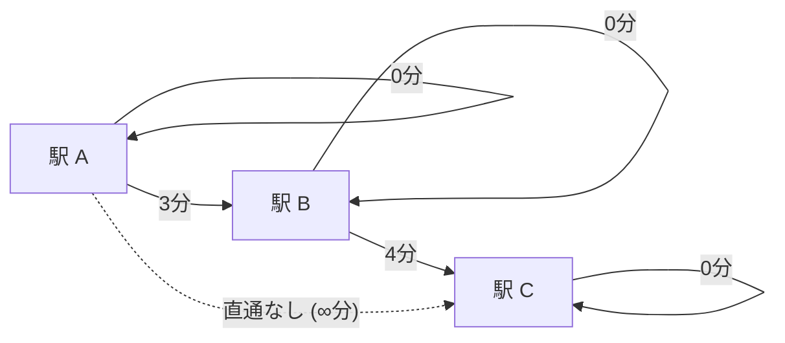

# 【特別コラム】トロピカル代数と最短経路行列計算 — 3駅モデルで掴む具体例と半環大統一

> **「足す・掛ける」という言葉の罠を外し、「選ぶ（$\min$）」と「繋ぐ（$+$）」という機能で捉え直すことで、全駅間の最短乗り換えルートが一瞬で求まる魔法。**

---

## 1. 通常の代数 vs トロピカル代数（Min-Plus代数）完全対比表

記号の混乱を防ぐため、常に「通常の演算」と「トロピカル専用記号（$\oplus, \otimes$）」をセットで併記します。

| 概念・役割 | 通常の代数（算数） | トロピカル代数（$(\min, +)$ 半環） | トロピカルでの実際の計算 | 乗り換えでの直感イメージ |
| :--- | :---: | :---: | :---: | :--- |
| **加法（まとめる・選ぶ）** | $a + b$ | $a \oplus b$ | $\min(a, b)$ | 複数のルートから**最短時間を選ぶ** |
| **乗法（つなぐ・連続）** | $a \times b$ | $a \otimes b$ | $a + b$ | 電車を乗り継いで**時間を足し合わせる** |
| **加法単位元（不変の選択）** | $0$ ($a + 0 = a$) | $\infty$ ($a \oplus \infty = a$) | $\min(a, \infty) = a$ | 「直通なし（$\infty$分）」と比較しても最短ルートは変わらない |
| **乗法単位元（滞在ゼロ）** | $1$ ($a \times 1 = a$) | $0$ ($a \otimes 0 = a$) | $a + 0 = a$ | 「その場で0分滞在」して乗り継いでも合計時間は変わらない |
| **ゼロ元（吸収元）** | $0$ ($a \times 0 = 0$) | $\infty$ ($a \otimes \infty = \infty$) | $a + \infty = \infty$ | 「どこか1区間でも不通（$\infty$分）」なら、全体としても到達不能（$\infty$） |

---

## 2. 3駅モデルの設定と初期時間表（隣接行列 $M$）



- **駅A $\to$ 駅B**: 3分 ($d_{AB} = 3$)
- **駅B $\to$ 駅C**: 4分 ($d_{BC} = 4$)
- **駅A $\to$ 駅C**: 直通電車なし（所要時間 $\infty$ 分, $d_{AC} = \infty$）
- **駅自身へ**: 0分 ($d_{AA} = d_{BB} = d_{CC} = 0$)

これを「1回（直通）で行ける時間表」として並べたものが**隣接行列 $M$** です：

$$M = \begin{pmatrix}
0 & 3 & \infty \\
\infty & 0 & 4 \\
\infty & \infty & 0
\end{pmatrix}$$

---

## 3. 【ステップ 1】まず「駅Aから駅Cへの最短時間」を1本求める

AからCへ行くルートは、経由する中間駅（A, B, C）に応じて**3つの選択肢**があります：

1. **Aで留まってからCへ直通する**: $d_{AA} + d_{AC} = 0 + \infty = \infty$ 分
2. **Bを経由してCへ行く**: $d_{AB} + d_{BC} = 3 + 4 = 7$ 分
3. **Cへ直通してからCで留まる**: $d_{AC} + d_{CC} = \infty + 0 = \infty$ 分

この3つの選択肢から「最短（$\min$）」を選びます。

### 🧮 併記による厳密な計算式

$$\begin{aligned}
\text{A} \to \text{C の最短時間} &= (d_{AA} \otimes d_{AC}) \;\boldsymbol{\oplus}\; (d_{AB} \otimes d_{BC}) \;\boldsymbol{\oplus}\; (d_{AC} \otimes d_{CC}) \\
&= \min\Bigl( (d_{AA} + d_{AC}), \; (d_{AB} + d_{BC}), \; (d_{AC} + d_{CC}) \Bigr) \\
&= \min\Bigl( (0 + \infty), \; (3 + 4), \; (\infty + 0) \Bigr) \\
&= \min\Bigl( \infty, \; \mathbf{7}, \; \infty \Bigr) \\
&= \mathbf{7 \text{分}}
\end{aligned}$$

---

## 4. 【ステップ 2】全駅間の最短時間を「トロピカル行列積」で一網打尽にする！

上の計算を行列の全9マスに対して一括で行うのが、**トロピカル行列積 $M \odot M = M^2$** です。

$$M^2 = M \odot M = \begin{pmatrix} 0 & 3 & \infty \\ \infty & 0 & 4 \\ \infty & \infty & 0 \end{pmatrix} \odot \begin{pmatrix} 0 & 3 & \infty \\ \infty & 0 & 4 \\ \infty & \infty & 0 \end{pmatrix} = \begin{pmatrix} 0 & 3 & \mathbf{7} \\ \infty & 0 & 4 \\ \infty & \infty & 0 \end{pmatrix}$$

- **1行目（A発）**: A→A: $0$分, $\quad$ A→B: $3$分, $\quad$ A→C: $\mathbf{7}$分 ★
- **2行目（B発）**: B→A: $\infty$分, $\quad$ B→B: $0$分, $\quad$ B→C: $4$分
- **3行目（C発）**: C→A: $\infty$分, $\quad$ C→B: $\infty$分, $\quad$ C→C: $0$分

直通がなかったはずの A $\to$ C に、**最短乗り換え時間「7分」が一発で自動算出**されました！

---

## 5. 半環カートリッジの大統一（圏論への架け橋）

| 解きたい問題 | 「選ぶ（加法 $\oplus$）」 | 「繋ぐ（乗法 $\otimes$）」 | 求まるもの |
| :--- | :---: | :---: | :--- |
| **最短時間（トロピカル）** | $\min$ | $+$ | **最速乗り換えルート** |
| **通信信頼性** | $\max$ | $\times$ | **最も途切れない高品質ルート** |
| **最大流量（配管）** | $\max$ | $\min$ | **一番太いボトルネック容量** |
| **到達判定（論理）** | $\text{OR}$ | $\text{AND}$ | **目的地へ行けるか（Yes/No）** |
| **経路パターン数** | $+$ | $\times$ | **行けるルートの総数（通常の算数）** |

---

## 💡 友達に話したくなる！3行まとめカード

```
┌──────────────────────────────────────────────────────────────┐
│ 🌟 トロピカル代数のまとめ                                    │
│ 1. 加法 ⊕ は「最短を選ぶ(min)」、乗法 ⊗ は「時間を足す(+)」  │
│ 2. 行列を1回掛ける(M²)だけで、全駅の乗換最短ルートが一撃で出る│
│ 3. ルールの組み合わせを変えるだけで、通信や配管も一括解決！  │
└──────────────────────────────────────────────────────────────┘
```

---

## ❓ ちょっと考えてみよう！ミニチェック

> **Q. トロピカル代数において、「加法単位元（足しても結果が変わらない特別な数）」が $0$ ではなく $\infty$ である理由はなぜでしょうか？**  
> ① $\infty$ はとても大きな数字で目立つから  
> ② どんなルート $a$ 分と「直通なし（$\infty$ 分）」を比べても、$\min(a, \infty) = a$ となって最短ルートが変わらないから  
> ③ トロピカル数学では $0$ という数字を使ってはいけないから  
> 
> *➔ 正解は **②**！「直通なし」と比較しても、元々のルートの所要時間は1ミリも変わらないため、$\infty$ こそがトロピカルの足し算の単位元なのです。*
