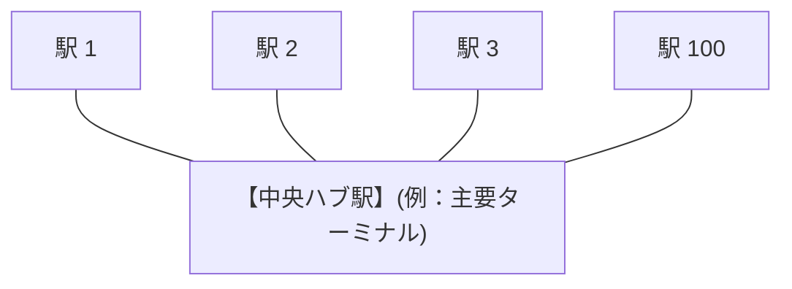
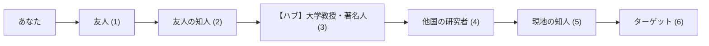

# 【特別解説】巨大ネットワークが「たった数回」で収束する魔法 — グラフの直径、スモールワールド、そして log₂ D の奇跡

> 「**駅やコンピュータが何億個あっても、なぜたった数回のべき乗で全宇宙の最短ルート（$M^\infty$）が確定するのか？**」

本章では、一見不思議に思える「べき乗の高速な収束」の裏側にある**厳密な数学的根拠**と、**現実の巨大社会・インターネットを支えるネットワーク構造の数理**を、順を追って丁寧に解き明かします。

---

## 1. 理論的根拠 ①：なぜ最大でも「$N - 1$ 回」で絶対に止まるのか？

駅の数を $N$ 個（例えば $N = 4$）とします。
数学において、「**どのような構造の路線図であっても、最大 $N - 1$ 回（4駅なら3回）べき乗を計算した時点で、すべてのマスの数値が完全に停止する**」ことが厳密に証明されています。

その根底にあるのが、数学の古典的な道具である「**鳩ノ巣原理（Pigeonhole Principle）**」です。

```mermaid
graph LR
    subgraph 4つの駅 (N=4) における「4回乗り換え」の軌跡
        A["駅 A (1)"] --> B1["駅 B (2)"]
        B1 --> C["駅 C (3)"]
        C --> B2["★ 駅 B 再訪 (4)"]
        B2 --> D["駅 D (5)"]
    end
```

### 💡 鳩ノ巣原理による証明的直感
「鳩ノ巣原理」とは、『**5羽の鳩を4つの巣に入れると、少なくとも1つの巣には2羽以上の鳩が入る**』という、当たり前ですが極めて強力な論理です。

これを路線図の移動に当てはめてみましょう：

1. 駅が $N = 4$ 個（A, B, C, D）あるとします。
2. もし 「**4回乗り換えるルート（線路を4本通るルート）**」 を選んだとすると、通過する駅の数は **出発駅 ＋ 4回の移動 ＝ 合計 5 つ** になります。
3. **4種類しか駅がないのに、5つの駅を訪問している**のですから、鳩ノ巣原理により「**必ずどこかの駅を 2 回以上重複して訪問している**」ことになります。
   $$\text{例：} \quad \text{A} \to \mathbf{B} \to \text{C} \to \mathbf{B} \to \text{D} \quad (\text{駅 B が重複})$$
4. 同じ駅を2回通るということは、その途中に「$\text{B} \to \text{C} \to \text{B}$」という**無駄な寄り道（ループ）**が含まれていることを意味します。
5. 寄り道を取り除けば、必ず **3回以下の乗り換え（線路 3 本以下）** で目的地に到達できます。

> **結論**:  
> 「最短ルート」には、同じ駅を2度通る無駄なループは絶対に現れません。  
> したがって、駅が $N$ 個あるネットワークにおいて、最短ルートが通る線路の数は**最大でも $N - 1$ 本**です。  
> これにより、$M^{N-1}$ を計算した時点ですべての最短ルートが出尽くし、これ以上べき乗を繰り返しても数値が変化しないこと（$M^\infty = M^{N-1}$）が保証されます。

---

## 2. 理論的根拠 ②：収束回数を決める真の支配者「グラフの直径（Diameter）」

「最大でも $N - 1$ 回」というのは、あくまで一本道のような最も細長い構造（最悪ケース）の上限です。
現実のネットワークでは、**もっと遥かに少ない回数で収束**します。

その収束ステップ数を真に決定しているのが、ネットワークの「**直径（Diameter $D$）**」という幾何学的指標です。

```
【グラフの直径（Diameter D）の定義】
  ネットワークの中に存在する「すべてのペア」の中で、
  最も遠い2点間を結ぶ最短経路のステップ数（乗り換え回数）。
```

$$M^D = M^{D+1} = M^\infty \quad (\text{ネットワークの直径 } D \text{ 回で完全収束})$$

### 🌟 具体例：ハブを持つスター型ネットワーク
中心に巨大なターミナル駅（ハブ）が存在するネットワークを考えます：



このネットワークには駅が $N = 101$ 個存在しますが、任意の駅 $X$ から駅 $Y$ へ行く最短ルートは：
$$\text{駅 } X \xrightarrow{\text{1ステップ}} \text{中央ハブ} \xrightarrow{\text{1ステップ}} \text{駅 } Y \quad (\text{合計 2 ステップ})$$
となります。つまり、最も離れた駅同士であっても 2 回の移動で到達できるため、**直径は $D = 2$** です。

そのため、駅が 100 個以上あっても、**たった 2 回のべき乗（$M^2$）を計算しただけで、全 $101 \times 101 = 10,201$ マスの最短ルートが一撃で確定（完全収束）**します。

---

## 3. 現実世界の奇跡：80億人でも「たった6回」で届くスモールワールド現象

現実の人間社会やインターネットは、一本道でも完全なスター型でもなく、「**局所的な友達の輪（クラスター）**」と「**遠くへ繋がる少数のショートカット（ハブ）**」が混ざり合った「**スモールワールド・ネットワーク**」という構造をしています。

1967年、心理学者スタンレー・ミルグラムが行った「スモールワールド実験」では、アメリカのランダムな住人から見知らぬターゲットまで手紙を転送したところ、**平均わずか 5.5 人（約6ステップ）の知り合い関係**を経て手紙が届きました。



### 🧮 なぜ 80 億人もいるのに 6 回で繋がるのか？（指数の爆発的拡大）
この現象は、中学数学の「掛け算の繰り返し（指数の拡大）」で論理的に説明できます。

仮に、1 人が平均して **50 人** の知人を持っているとします：
- **1ステップ先（直接の友人）**: $50$ 人
- **2ステップ先（友人の友人）**: $50 \times 50 = 2,500$ 人
- **3ステップ先**: $2,500 \times 50 = 125,000$ 人（12.5万人）
- **4ステップ先**: $125,000 \times 50 = 6,250,000$ 人（625万人）
- **5ステップ先**: $6,250,000 \times 50 = 312,500,000$ 人（3.1億人 ➔ アメリカの全人口）
- **6ステップ先**: $312,500,000 \times 50 = \mathbf{15,625,000,000 \text{ 人}} \quad \text{（156億人！）}$

たった 6 回関係性を辿るだけで、**地球の総人口（約80億人）を遥かに超える計算**になります。
知人の重複があるため単純な掛け算通りにはなりませんが、少数の広域ハブが存在することで、**地球全体のネットワークの直径は実質的に $D \approx 6$ 前後に収まってしまう**のです。

インターネットの Web ページ群（数十億ノード）や世界中の航空路線網も全く同様の構造を持っており、**ノード数が天文学的に増えても、直径 $D$ はせいぜい 6〜20 程度にしかなりません**。

---

## 4. 繰り返し自乗法との合体：計算回数は「$\log_2 D$ 回」という神速へ

コンピュータが行列をべき乗するときは、$M \to M^2 \to M^3 \dots$ と 1 つずつ掛けるのではなく、求めた行列を自乗していく「**繰り返し自乗法（Binary Exponentiation）**」を採用します：

$$M \xrightarrow{\times M} M^2 \xrightarrow{\times M^2} M^4 \xrightarrow{\times M^4} M^8 \xrightarrow{\times M^8} M^{16} \dots$$

この手法を使うと、直径 $D$ のネットワーク全体を解くために必要な掛け算の回数は、**$\lceil \log_2 D \rceil$ 回（2を何乗したら $D$ を超えるか）** に激減します。

| ネットワークの規模 | ネットワークの直径 $D$ | 必要な掛け算の回数（$\lceil \log_2 D \rceil$） |
| :--- | :---: | :---: |
| **小規模路線図（本教材の4駅モデル）** | $D = 3$ | **たった 2 回** ($M^4$) |
| **全世界の人間関係（80億人 / 六次の隔たり）** | $D \approx 6 \sim 8$ | **たった 3 回** ($M^8$) |
| **超巨大インターネット・Web空間** | $D \approx 30$ | **たった 5 回** ($M^{32}$) |
| **1000 回乗り継ぐ広大な宇宙交通網** | $D = 1000$ | **たった 10 回** ($M^{1024}$) |

---

## 5. まとめ：なぜ圏論と線形代数はこれほど強力なのか？

1. **有限性の保証（鳩ノ巣原理）**: 最短経路にループは存在しないため、最大でも $N-1$ ステップで計算は必ず停止する。
2. **トポロジーの恩恵（直径 $D$）**: ハブを持つ現実のネットワークは、ノード数が何億あっても直径 $D$ が驚くほど小さい。
3. **対数時間の加速（$\log_2 D$）**: 繰り返し自乗法により、地球規模の最適解であっても片手で数えられる回数の掛け算で $M^\infty$（不動点）に到達できる。

「単に行列の掛け算を繰り返すだけで、世界の最適ルートが瞬時に解ける」——
このシンプルな仕組みの背後には、**グラフ理論・スモールワールド現象・代数構造（半環）が見事に調和した数学の美しさ**が息づいています。

---

## 💡 友達に話したくなる！3行まとめカード

```
┌──────────────────────────────────────────────────────────────┐
│ 🌟 ネットワーク収束のまとめ                                  │
│ 1. 鳩ノ巣原理により、最短ルートに寄り道はなく最大N-1回で終了 │
│ 2. 収束回数は「直径D」で決まり、80億人でも指数爆発で約6回！  │
│ 3. 繰り返し自乗法を使えば、地球規模の最適化もたった数回の計算│
└──────────────────────────────────────────────────────────────┘
```

---

## ❓ ちょっと考えてみよう！ミニチェック

> **Q. 1人が平均50人の知人を持つ世界で、3ステップ先（友人の友人の友人）には理論上最大でおよそ何人の人が繋がるでしょうか？**  
> ① 約 150 人（$50 \times 3$）  
> ② 約 12 万 5 千人（$50 \times 50 \times 50$）  
> ③ 約 80 億人  
> 
> *➔ 正解は **② 約 12 万 5 千人**！掛け算がステップごとに掛け合わされていく（指数の爆発）ため、足し算とは比較にならない猛スピードで人数の輪が拡大します。これがスモールワールドの数学的根拠です。*
