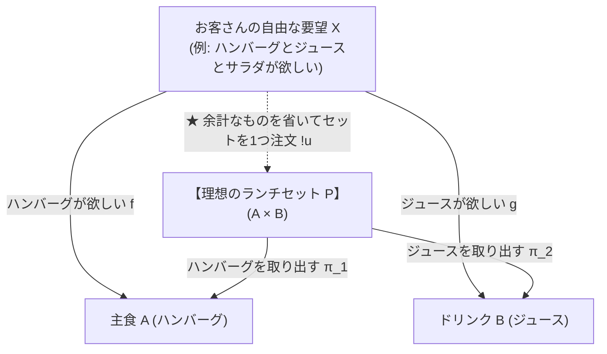
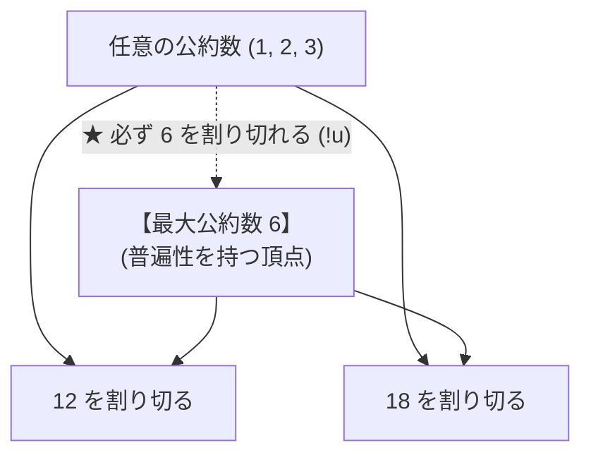
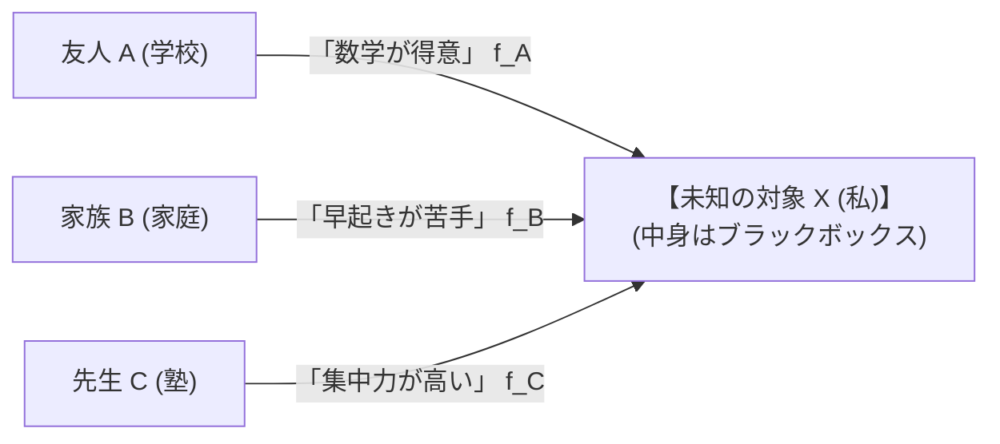

# 第2章：周辺から本質を炙り出す — 普遍性と米田の補題

> 「**中身をこじ開けて作らなくても、『外側からの注文をすべて一発で解決できるベストな仲介役』を指定するだけで、世界にたった1つの本質が確定する。**」

---

## 1. 普遍性（Universal Property）とは何か？ — 「何がわかれば、何がわかるのか？」

「普遍性」という言葉は難しく聞こえますが、要するに『**一番無駄がなく、みんなの要望を完璧にまとめられる“唯一の理想的なポジション”**』のことです。

```
【普遍性が教えてくれる「何がわかれば何がわかるのか」の因果関係】

  【入力（わかっていること）】
    ・「ハンバーグ（A）」が欲しいという要望 f
    ・「ジュース（B）」が欲しいという要望 g
        ▼
  【仲介役（普遍性を持つセット P）を通すと…】
    ・ハンバーグとジュースを過不足なく両方取り出せる（π₁, π₂）
    ・どんな複雑なお客さん X からも、「このセット P を頼めば一発解決！」という
      変換ルート u が【迷いなく、ただ1通り】に決まる
        ▼
  【結論（何がわかるのか？）】
    ・中身の容器が紙袋だろうとプラスチックだろうと関係ない！
    ・この仲介役 P こそが、世界でただ1つの「積（A × B）」の本質であると確定する！
```

---

## 2. 具体例で見る「普遍性」のメカニズム

ファミレスで「**ハンバーグ $A$**」と「**ジュース $B$**」を両方欲しいお客さんの注文を考えてみましょう。



### 🔍 なぜ「余計なもの」があると普遍性を満たさないのか？

世の中にはいろんなセットメニューが作れます：
- **候補 1（不足）**: 「ハンバーグとお水」 ➔ ジュースが入っていないので却下（要望を満たせない）。
- **候補 2（過剰）**: 「ハンバーグとジュースとおもちゃとサラダ」 ➔ おもちゃやサラダという余計なものが混ざっている。
- **候補 3（理想のランチセット $P$）**: 「**ハンバーグとジュースだけ**」が入った過不足ゼロのセット！

もし候補 2（過剰セット）を基準にしてしまうと、ただハンバーグとジュースが欲しいだけのお客さん $X$ に対して、「おもちゃ付きにするか？サラダ付きにするか？」と複数の注文ルートができてしまい、迷いが生じます（$u$ が1つに定まらない）。

> 「**どんなお客さんの要望 $X$ からも、迷いなく『これを選べば完璧！』という道 $u$ が【ただ1つ（一意）】に定まる**」

この条件をクリアできるのは、余計なものが一切混ざっていない**候補 3（理想のランチセット $P$）ただ1つだけ**です！

---

## 3. 中学数学での身近な普遍性：最大公約数（GCD）

実は、中学受験や中1で習う「**最大公約数（GCD）**」も、まったく同じ普遍性でできています！

```
【例：12 と 18 の公約数を考える】
  ・12 と 18 の公約数は「1, 2, 3, 6」の 4 つがある。
  ・その中で「6（最大公約数）」は特別な性質を持っている：
    ➔ 他のすべての公約数（1, 2, 3）は、必ず「6 の約数」になっている！
```



「12 も 18 も割り切れる数（公約数）」の中で、**他のすべての公約数から割り切れる（矢印が集まる）頂点**こそが「6（最大公約数）」です。  
これも「中身を計算する前に、位置関係（普遍性）だけで 6 という数字の本質が定まる」典型例です！

---

## 4. 米田の補題（Yoneda Lemma）— 関係性の総体が実存を決める

普遍性で「ベストな位置関係」がわかったら、次は「**その位置にいる対象の正体をどうやって完全に暴くか？**」という問題に進みます。これが**米田の補題**です。

```
【何がわかれば、何がわかるのか？】
  【何がわかれば】
    ・周りのあらゆる人（友人 A、家族 B、先生 C）から、
      未知の対象 X に届く「評価・手紙・関わり方（Hom(-, X)）」の全部がわかれば…
        ▼
  【何がわかるのか】
    ・X の頭の中を解剖しなくても、X という存在の正体が 100% 完全に特定できる！
```



$$X \cong Y \iff \mathrm{Hom}(-, X) \cong \mathrm{Hom}(-, Y)$$

> 「**外側から入ってくるすべての関係性・振る舞いが一致するなら、中身がどうあれ数学的に『完全に同一人物（同型）』である！**」

### 🌍 プログラミングでの結論：カプセル化（API）の保証
プログラムの関数の中身をどれだけ書き換えても、**外から見た引数と戻り値（$\mathrm{Hom}$）が全く同じなら、システム全体は1ミリも壊れずに動き続けます**。米田の補題は、このソフトウェアの「カプセル化」の正しさを数学的に完全に証明しています。

---

## 💡 友達に話したくなる！3行まとめカード

```
┌──────────────────────────────────────────────────────────────┐
│ 🌟 第2章のまとめ                                             │
│ 1. 普遍性は「余計なものが一切なく、どんな要望も迷わず一撃で  │
│    通せる理想のセットメニュー（ベストポジション）」のこと！  │
│ 2. 最大公約数（GCD）も、すべての公約数をまとめる普遍性の例！ │
│ 3. 米田の補題は「周りからの手紙の全部＝その人の正体そのもの」│
└──────────────────────────────────────────────────────────────┘
```

---

## ❓ ちょっと考えてみよう！ミニチェック

> **Q. 「ハンバーグとジュース」が欲しいお客さんに対して、「ハンバーグ＋ジュース＋高級メロン（1万円）」というセットは、なぜ積の普遍性を満たさないのでしょうか？**  
> ① ハンバーグが入っていないから  
> ② 高級メロンという余計な情報が含まれており、純粋なハンバーグとジュースの注文として迷いなく1通りに仲介できないから  
> ③ メロンはおいしいから  
> 
> *➔ 正解は **②**！余計なものが混ざっていると、無駄な注文ルートが生まれてしまい「ただ1つの仲介役」になれません。過不足ゼロの理想バランスこそが普遍性の条件です！*
