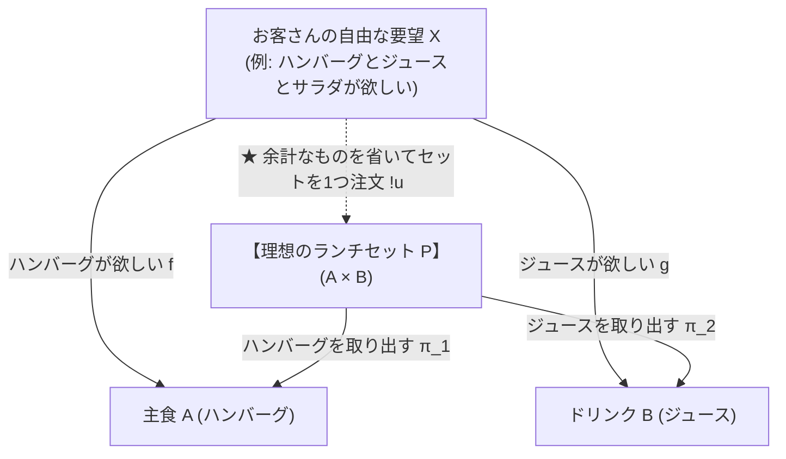
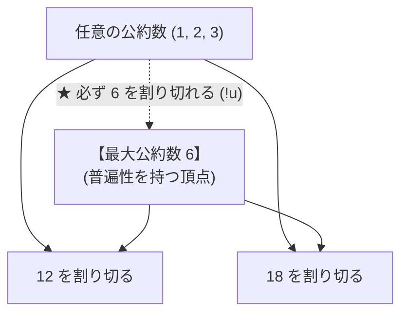
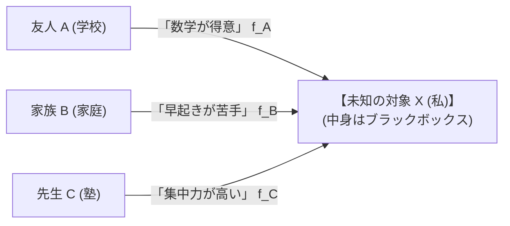

# 第2章：周辺から本質を炙り出す — 普遍性と米田の補題

> 「**中身をこじ開けて作らなくても、『外側からの注文をすべて一発で解決できるベストな仲介役』を指定するだけで、世界にたった1つの本質が確定する。**」

第1章では駅・路線図など **グラフ** で圏に入りました。本章は一歩上の抽象度へ進み、**普遍性** と **米田の補題** で「中身を見ずに本質を決める」考え方を扱います。まず **抽象度の梯子** で、全体の地図を確認してください。

---

## 1. 抽象度の梯子 — グラフから米田へ（第2章の地図）

圏論がつかみにくいのは、**同じ言葉（対象・射）で、だんだん中身の見え方が変わる** ためです。第1章〜第4章は、おおむね次の段階を順にたどります。

| 段 | 名前 | 何を扱うか | 教材の主な場所 |
|:---:|:---|:---|:---|
| **0** | 具体 | 東京駅、朝という単語、農業部門… | 各章のたとえ話 |
| **1** | グラフ | ノード・エッジ・経路（**いちばんイメージしやすい**） | 第1章、00c、半環ツール |
| **2** | 圏 | 対象・射・合成・恒等（**グラフより抽象な「枠」**） | 第1章 |
| **3** | 関手・自然変換 | 圏どうしの写像（**ノード表＋辺表**） | 第3章、第4章 §2 |
| **4** | 普遍性・米田 | **中身を見ず**、周辺の矢印だけで本質を決める | **本章 §2〜§5** |

```
段0  具体のもの（駅、単語、部門）
  ↓
段1  グラフ（頂点・辺）          ← いちばんイメージしやすい
  ↓
段2  圏（対象・射・合成・恒等）  ← 「グラフ＋ルール」；中身は何でもよい枠
  ↓
段3  関手（圏→圏の写像）         ← グラフ対応表の一般化
  ↓
段4  普遍性・米田               ← 「外側の矢印の総体＝本質」
```

> **読み方:** いま迷ったら **段1（グラフ）に戻ってよい** です。段2以降は、同じ骨組みが別の中身にも使えることを示しています。

### 段0〜1：具体とグラフ — 第1章の足場

第1章の駅・路線、00c の物流・レオンチェフ、半環ツールの路線図は、すべて **段1（グラフ）** です。

- **ノード** … 駅、拠点、部門  
- **エッジ** … 路線、搬送、投入関係  
- **データ** … 辺リスト、隣接行列  

ここまでは「グラフのノードとエッジの対応を記録する」感覚で十分です。

### 段2：圏 — グラフより広い「枠」

段2では、ノードを **対象**、エッジを **射** と呼び、**合成** と **恒等射** を定め、さらに **結合律・単位元律** の2つのルールを守ります。見た目はグラフに似ますが、**中身の種類は固定されません**。下の表のポイントは次のとおりです。**路線図のように描けなくても、次の6項目をすべて満たせば圏になる**（B・C がそれ）。

| 例 | 対象 | 射 | 路線図のように描ける？ | 圏として扱える？ |
|:---|:---|:---|:---:|:---:|
| **A. 路線図**（第1章） | 駅 | 乗り継ぎ | ✅ | ✅ |
| **B. 型**（プログラミング） | `Int`, `String` | 関数 `Int → String` | ❌ | ✅ |
| **C. 証明**（数学） | 命題 $P$, $Q$ | $P$ から $Q$ への証明 | ❌ | ✅ |

**ポイント:** 「圏＝グラフ」ではない。**グラフは圏の身近な例のひとつ**で、型や証明も同じ枠に入る。

#### 圏の定義 — 4つのパーツと2つのルール

表の「圏として ✅」は、次の **6項目すべて** を満たすことです。これは「おまけの条件」ではなく、**圏であることの定義そのもの**（第1章 §1〜§2 の要約。詳しくは <a href="#ch1">第1章</a>）。

**【構造】何があり、どう繋ぐか — 4つのパーツ**

| # | 名前 | 何を決めるか | 路線図 A | 型 B | 証明 C |
|:---:|:---|:---|:---|:---|:---|
| 1 | **対象** | 世界に何があるか | 駅 | `Int`, `String`… | 命題 $P$, $Q$… |
| 2 | **射** | 対象間の矢印 $f: A \to B$ | 東京→熱海の路線 | `Int → String` の関数 | $P$ から $Q$ への証明 |
| 3 | **合成** | つながる射を1本にまとめる $g \circ f$ | 乗り継ぎの直通 | 関数のパイプライン | 証明のつなぎ合わせ |
| 4 | **恒等射** | 各対象の「何もしない」矢印 $\mathrm{id}_A$ | 駅で0分待機 | 入力をそのまま返す関数 | 「$P$ なら $P$」の自明な証明 |

**【公理】繋ぎ方が破綻していないか — 2つのルール**

| # | 名前 | 何を保証するか | 路線図 A | 型 B | 証明 C |
|:---:|:---|:---|:---|:---|:---|
| 5 | **結合律** | 3本の矢印をどこで区切っても結果が同じ：$(h \circ g) \circ f = h \circ (g \circ f)$ | 途中駅で括弧を変えても到着は同じ | 関数合成の括弧の位置は関係ない | 証明を分割しても結論は同じ |
| 6 | **単位元律** | 恒等射を挟んでも射は変わらない：$f \circ \mathrm{id}_A = f$，$\mathrm{id}_B \circ f = f$ | 待機してから出発＝そのまま出発 | `f ∘ id = f` | 自明な証明を付けても本証明と同じ |

> **読み方:** 1〜4は「部品の説明書」、5〜6は「その部品がちゃんと動くかのテスト」。B・C は路線図に描けないが、上の6項目を満たすので **圏** と呼べる。

#### 合成（Composition）とは何か — もう少し詳しく

##### 定義の言葉で：$g \circ f$ とは何か

ここがいちばんの核心です。**$g \circ f$ は「現実に見つかる旅」でも「グラフの経路」でもなく、圏が用意する「$A \to C$ 方向の射の1個」** です。

圏 $\mathbf{C}$ を作るとき、各対象のペア $(A, C)$ に **射の集合** $\mathrm{Hom}(A, C)$ を置きます。$f \in \mathrm{Hom}(A, B)$ と $g \in \mathrm{Hom}(B, C)$ が噛み合うとき、**合成** は次のような「割り当てのルール」です。

$$\circ \;:\; \mathrm{Hom}(B, C) \times \mathrm{Hom}(A, B) \longrightarrow \mathrm{Hom}(A, C)$$

$$(g, f) \;\longmapsto\; g \circ f$$

つまり $g \circ f$ は：

1. **$\mathrm{Hom}(A, C)$ の中の1要素**（$A$ から $C$ への矢印の1本）
2. **$f$ と $g$ から、圏のルールで一意に決まる** その要素
3. **「先に $f$、次に $g$」** を表す、と **その圏が約束する** 名前

```
  Hom(A,B) に f がある
  Hom(B,C) に g がある
        ↓  合成のルール ∘ で割り当て
  Hom(A,C) に g∘f が【必ず1つ】入る
```

**例：射の集合を明示する**

| 集合 | 中身（例） |
|:---|:---|
| $\mathrm{Hom}($東京$, $熱海$)$ | $\{f\}$（新幹線） |
| $\mathrm{Hom}($熱海$, $三島$)$ | $\{g\}$ |
| $\mathrm{Hom}($東京$, $三島$)$ | $\{h_{\text{乗継}},\; k_{\text{直通}}\}$ など **複数ありうる** |

このとき圏は「$f$ のあと $g$」に対応する射を **$g \circ f$** と名付ける。$k_{\text{直通}}$（東京→三島の直通列車）が別にあってもよいが、それは **$g \circ f$ とは別の射**（同じ $\mathrm{Hom}(A,C)$ の別要素）。

**圏ごとに「中身」は違うが、形は同じ**

| 圏 | $g \circ f$ の中身（その圏での意味） |
|:---|:---|
| 集合と関数 | 関数 $x \mapsto g(f(x))$ そのもの |
| 路線の道（パス）の圏 | 「$f$ のあと $g$ を歩く」道 |
| 証明の圏 | 2つの証明をつなげた証明 |
| 大小関係（$a \le b$） | $a \le c$ という矢印（$b$ を経由するという情報は矢印に圧縮） |

現実の何かを圏に載せるときは、**「$f$ と $g$ があったら、$\mathrm{Hom}(A,C)$ のどれを $g \circ f$ と呼ぶか」** を決める作業をします。うまく決められて結合律・単位元律も満たせば、圏と呼べます。

> **しっくりこないときの鍵:** $g \circ f$ は「経路があるから自動的に存在する」ものではなく、**圏のデータの一部として、$f$ と $g$ から割り当てられる $\mathrm{Hom}(A,C)$ の1本の射** です。

6項目の **#3 合成** だけを掘り下げます。上の「割り当て」の具体例です。

**① いつ合成できるか — 「先の終点」＝「後の始点」**

$f: A \to B$ と $g: B \to C$ のときだけ、合成 $g \circ f: A \to C$ が定義されます。真ん中の対象 $B$ が **ぴったり噛み合う** 必要があります。

```
  A ──f──▶ B ──g──▶ C        ⇒    A ──g∘f──▶ C
       先に f、次に g              1本の直通射
```

- **合成できる例:** 東京→熱海 ($f$) ＋ 熱海→三島 ($g$) → 東京→三島 ($g \circ f$)
- **合成できない例:** 東京→熱海 ($f$) と 大阪→京都 ($g$) — 真ん中が噛み合わないので $g \circ f$ は存在しない

**② 記号 $g \circ f$ の読み方 — 「先に $f$、次に $g$」**

$g \circ f$ は **右から左に適用** します（関数の合成 $g(f(x))$ と同じ順序）。

| 記号 | 意味 | 路線図での例 |
|:---|:---|:---|
| $f: A \to B$ | $A$ から $B$ へ | 東京 → 熱海 |
| $g: B \to C$ | $B$ から $C$ へ | 熱海 → 三島 |
| $g \circ f: A \to C$ | **まず $f$、次に $g$** の直通 | 東京 → 三島（乗り継ぎ1本） |

**③ 3つの世界での「合成」の中身**

| 世界 | $f$ | $g$ | $g \circ f$ の中身 |
|:---|:---|:---|:---|
| **路線図 A** | 東京→熱海の列車 | 熱海→三島の列車 | 熱海で乗り換えて三島へ行く旅全体 |
| **型 B** | `parse: String → Int` | `double: Int → Int` | `double ∘ parse: String → Int`（文字列→数→2倍） |
| **証明 C** | $P$ から $Q$ への証明 | $Q$ から $R$ への証明 | $P$ から $R$ への証明（2つの証明をつなぐ） |

**④ 合成が「ただの経路」ではない理由**

- **必ず1本に決まる:** 圏では、$f$ と $g$ がつながるとき **$g \circ f$ は必ず存在し、1つに決まる**（「どの直通か迷う」状態は許されない）。
- **順番が大事:** 一般に $g \circ f \neq f \circ g$（東京→熱海→三島 と 三島→熱海→東京 は別の旅）。
- **恒等射とセット:** 合成だけでは不十分で、各駅の「0分待機」$\mathrm{id}_A$ と、結合律・単位元律がそろって「圏」になる（上の #4〜#6）。

> **段1との違い:** グラフでは「辺をなぞった経路」があればよい。圏では **射の合成という操作** が明示的に定義され、恒等射・結合律・単位元律まで含めて一つの世界を形作る。

#### 補足：#3 合成と #5 結合律 — よくある疑問

「現実には合成できないものもあるのに、なぜ結合律が必要？」「辺は複数あるのが普通では？」——ここで **#3（合成）** と **#5（結合律）** を混同しやすいので、分けて整理します。

**問い①と問い②は別問題**

| 問題 | 何を聞いているか | 圏での答え |
|:---|:---|:---|
| **問い①** | $f: A \to B$ と $g: B \to C$ があるとき、$g \circ f: A \to C$ はあるか | **#3 合成の定義** — 噛み合えば **必ず1つ** 存在する |
| **問い②** | $f, g, h$ が鎖のとき、$(h \circ g) \circ f$ と $h \circ (g \circ f)$ は同じか | **#5 結合律** — **同じ1本の射** である |

「合成できるものもある」は現実についての正しい描写ですが、圏はそれより **強い** 約束をします。**噛み合う $f$ と $g$ には、必ず $g \circ f$ がある**（#3）。結合律（#5）は、そのうえで **3本つないだとき括弧の位置で結果が変わらない** と言います。

**「辺が複数」は問題にならない**

同じ $A \to B$ に射が複数あってもよい（新幹線 $f_1$ と在来線 $f_2$ など）。結合律が言うのは「辺の本数」ではなく、**選んだ $f, g, h$ の組で、括弧を変えても $A \to D$ の結果が同じか** です。

**圏は「現実そのもの」ではない**

| 立場 | 意味 |
|:---|:---|
| 現実世界 | 合成できない例・括弧で意味が変わる例もある |
| 圏 | **合成がきちんと1本に定まり、括弧に依存しない** 部分だけを切り出して名付けた枠 |

関数の合成・証明のつなぎ・乗り継ぎの旅（区切り方を変えても同じ到着）などは圏に載せやすい。減算のように $(a-b)-c \neq a-(b-c)$ となる操作は、**そのままでは圏の合成にはしない**（別の構造として扱う）。

**一行まとめ**

- **#3:** 噛み合うなら $A \to C$ の合成射 **がある**（現実より強い約束）
- **#5:** 3本つながったなら、括弧の位置で **結果が変わらない**

6項目は「現実がそうだ」と発見した事実ではなく、**圏と呼ぶための定義** です。現実から切り離された空想ではなく、**うまく積める部分の共通言語** と捉えてください。

### 段3：関手 — グラフ対応表の一般化（第3章で詳しく）

関手は **圏ごと** 写します。データでは **対象の写像表＋射の写像表**（第3章）です。

| 具体例 | 圏C | 関手が送る先D | データの形 |
|:---|:---|:---|:---|
| グラフ→行列 | 路線図 | 隣接行列 | `nodes[]`, `edges[]`, `matrix[n][n]` |
| 半環カートリッジ | 同じ路線図 | 同形の行列（⊕⊗だけ違う） | グラフ固定＋カートリッジ設定 |
| 日英翻訳 | 日本語の単語・関係 | 英語の単語・関係 | ノード辞書＋辺辞書 |
| レオンチェフ | 部門ネットワーク | 波及する生産額ベクトル | $M$, $\boldsymbol{d}$ → ベクトル |

**段1の感覚（ノード・エッジの対応）＋合成を壊さないチェック** ＝ 段3の関手です。詳細は第3章。

### 段4：普遍性・米田 — 本章の主題（中身を見ない）

段4では、対象の **中身**（紙袋かプラ箱か、実装の詳細）より、**周りとの関係の型** で本質を決めます。

- **普遍性** … 「どんな要望からも、迷わず1通りで届く」**唯一の仲介役の位置**（§2〜§4）  
- **米田の補題** … 外から入る **すべての矢印** $\mathrm{Hom}(-, X)$ がわかれば $X$ の正体が決まる（§5）

段1〜3は「関係を **写す・計算する**」、段4は「関係だけで **同定する**」方向です。

---

## 2. 普遍性（Universal Property）とは何か？ — 「何がわかれば、何がわかるのか？」

「普遍性」という言葉は難しく聞こえますが、要するに『**一番無駄がなく、みんなの要望を完璧にまとめられる“唯一の理想的なポジション”**』のことです。

```
【普遍性が教えてくれる「何がわかれば何がわかるのか」の因果関係】

  【入力（わかっていること）】
    ・「ハンバーグ（A）」が欲しいという要望 f
    ・「ジュース（B）」が欲しいという要望 g
        ▼
  【仲介役（普遍性を持つセット P）を通すと…】
    ・ハンバーグとジュースを過不足なく両方取り出せる（π₁, π₂）
    ・どんな複雑なお客さん X からも、「このセット P を頼めば一発解決！」という
      変換ルート u が【迷いなく、ただ1通り】に決まる
        ▼
  【結論（何がわかるのか？）】
    ・中身の容器が紙袋だろうとプラスチックだろうと関係ない！
    ・この仲介役 P こそが、世界でただ1つの「積（A × B）」の本質であると確定する！
```

---

## 3. 具体例で見る「普遍性」のメカニズム

ファミレスで「**ハンバーグ $A$**」と「**ジュース $B$**」を両方欲しいお客さんの注文を考えてみましょう。



### 🔍 なぜ「余計なもの」があると普遍性を満たさないのか？

世の中にはいろんなセットメニューが作れます：
- **候補 1（不足）**: 「ハンバーグとお水」 ➔ ジュースが入っていないので却下（要望を満たせない）。
- **候補 2（過剰）**: 「ハンバーグとジュースとおもちゃとサラダ」 ➔ おもちゃやサラダという余計なものが混ざっている。
- **候補 3（理想のランチセット $P$）**: 「**ハンバーグとジュースだけ**」が入った過不足ゼロのセット！

もし候補 2（過剰セット）を基準にしてしまうと、ただハンバーグとジュースが欲しいだけのお客さん $X$ に対して、「おもちゃ付きにするか？サラダ付きにするか？」と複数の注文ルートができてしまい、迷いが生じます（$u$ が1つに定まらない）。

> 「**どんなお客さんの要望 $X$ からも、迷いなく『これを選べば完璧！』という道 $u$ が【ただ1つ（一意）】に定まる**」

この条件をクリアできるのは、余計なものが一切混ざっていない**候補 3（理想のランチセット $P$）ただ1つだけ**です！

---

## 4. 中学数学での身近な普遍性：最大公約数（GCD）

実は、中学受験や中1で習う「**最大公約数（GCD）**」も、まったく同じ普遍性でできています！

```
【例：12 と 18 の公約数を考える】
  ・12 と 18 の公約数は「1, 2, 3, 6」の 4 つがある。
  ・その中で「6（最大公約数）」は特別な性質を持っている：
    ➔ 他のすべての公約数（1, 2, 3）は、必ず「6 の約数」になっている！
```



「12 も 18 も割り切れる数（公約数）」の中で、**他のすべての公約数から割り切れる（矢印が集まる）頂点**こそが「6（最大公約数）」です。  
これも「中身を計算する前に、位置関係（普遍性）だけで 6 という数字の本質が定まる」典型例です！

---

## 5. 米田の補題（Yoneda Lemma）— 関係性の総体が実存を決める

普遍性で「ベストな位置関係」がわかったら、次は「**その位置にいる対象の正体をどうやって完全に暴くか？**」という問題に進みます。これが**米田の補題**です。

```
【何がわかれば、何がわかるのか？】
  【何がわかれば】
    ・周りのあらゆる人（友人 A、家族 B、先生 C）から、
      未知の対象 X に届く「評価・手紙・関わり方（Hom(-, X)）」の全部がわかれば…
        ▼
  【何がわかるのか】
    ・X の頭の中を解剖しなくても、X という存在の正体が 100% 完全に特定できる！
```



$$X \cong Y \iff \mathrm{Hom}(-, X) \cong \mathrm{Hom}(-, Y)$$

> 「**外側から入ってくるすべての関係性・振る舞いが一致するなら、中身がどうあれ数学的に『完全に同一人物（同型）』である！**」

### 🌍 プログラミングでの結論：カプセル化（API）の保証
プログラムの関数の中身をどれだけ書き換えても、**外から見た引数と戻り値（$\mathrm{Hom}$）が全く同じなら、システム全体は1ミリも壊れずに動き続けます**。米田の補題は、このソフトウェアの「カプセル化」の正しさを数学的に完全に証明しています。

---

## 💡 友達に話したくなる！3行まとめカード

```
┌──────────────────────────────────────────────────────────────┐
│ 🌟 第2章のまとめ                                             │
│ 0. 抽象度の梯子：グラフ(段1)→圏(段2)→関手(段3)→米田(段4)   │
│ 1. 普遍性は「余計なものが一切なく、どんな要望も迷わず一撃で  │
│    通せる理想のセットメニュー（ベストポジション）」のこと！  │
│ 2. 最大公約数（GCD）も、すべての公約数をまとめる普遍性の例！ │
│ 3. 米田の補題は「周りからの手紙の全部＝その人の正体そのもの」│
└──────────────────────────────────────────────────────────────┘
```

---

## ❓ ちょっと考えてみよう！ミニチェック

> **Q. 「ハンバーグとジュース」が欲しいお客さんに対して、「ハンバーグ＋ジュース＋高級メロン（1万円）」というセットは、なぜ積の普遍性を満たさないのでしょうか？**  
> ① ハンバーグが入っていないから  
> ② 高級メロンという余計な情報が含まれており、純粋なハンバーグとジュースの注文として迷いなく1通りに仲介できないから  
> ③ メロンはおいしいから  
> 
> *➔ 正解は **②**！余計なものが混ざっていると、無駄な注文ルートが生まれてしまい「ただ1つの仲介役」になれません。過不足ゼロの理想バランスこそが普遍性の条件です！*
