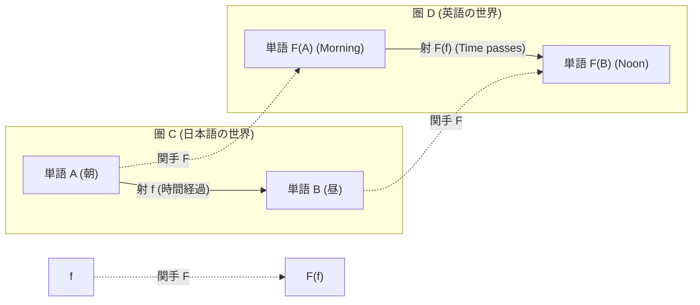
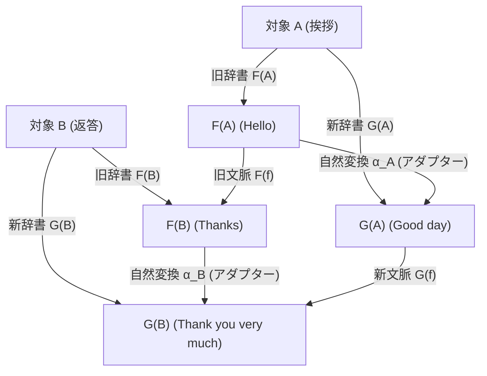

# 第3章：世界と世界を繋ぐ翻訳機 — 関手と自然変換

> 「**ある世界（圏）の構造を壊さずに別の世界へと丸ごと移転する『自動翻訳機（関手）』**」  
> 「**翻訳機と翻訳機の間をスムーズに切り替える『変換アダプター（自然変換）』**」  
> 圏論は、異なる学問やプログラム同士を自在に行き来する最強の架け橋を提供します。

第2章 §1 の **抽象度の梯子** では **段3（関手・自然変換）** を位置づけました。本章はその具体版です。グラフのノード・エッジ対応表として読むと、データの形とつながります。

---

## 1. 関手（Functor / ファンクター）：構造を保つ「世界の自動翻訳機」

一つの圏 $\mathbf{C}$ の中だけでなく、「**異なる圏 $\mathbf{C}$ から別の圏 $\mathbf{D}$ へ**」と世界そのものを丸ごと引っ越し・翻訳する装置が**関手（Functor）**です。



### 📖 図1の読み方（30秒）

第1章まで見ていたのは**圏の中の矢印（射）**だけです。図1では**世界をまたぐ矢印（関手）**が加わります。

| 線の種類 | 意味 | この図での例 |
|:---|:---|:---|
| **箱の中の実線** | その世界の**射** | 朝 $\to$ 昼、Morning $\to$ Noon |
| **箱をまたぐ点線** | **関手** $F$ による写像 | 朝 $\mapsto$ Morning、$f \mapsto F(f)$ |

**見る順番**

1. 左の箱（圏 $\mathbf{C}$）… 「朝」から「昼」へ射 $f$ がある
2. 右の箱（圏 $\mathbf{D}$）… 「Morning」から「Noon」へ射 $F(f)$ がある
3. 点線 … 左の世界を**丸ごと**右へ送る。点だけでなく、**矢印のつながり方ごと**送る

**一言で言うと** — 関手は「単語と単語を1対1に訳す」だけではなく、**「朝→昼」という関係が、英語でも Morning→Noon という関係になる**ことを保証する翻訳機です。下の表は、その保証を式で書いたものです。

### 💡 関手の理論ルールと「翻訳」の完全一致

| 関手の数学的公理 | 日常（翻訳）の具体例 | 破綻すると何が起きるか？ |
| :--- | :--- | :--- |
| **対象の対応 $A \mapsto F(A)$** | 日本語の単語 $\to$ 英単語 | 単語が辞書に載っていない（翻訳不能） |
| **射の対応 $f \mapsto F(f)$** | 日本語の文脈・変化 $\to$ 英語の文脈・変化 | 関係性の意味が変わってしまう |
| **合成を保つ<br>$F(g \circ f) = F(g) \circ F(f)$** | **「朝 $\to$ 昼 $\to$ 夜」の一連の繋がりが、英語でも「Morning $\to$ Noon $\to$ Night」と一本道で繋がる！** | 翻訳した途端に話の順番や因果関係がバラバラに崩壊する |
| **恒等射を保つ<br>$F(\mathrm{id}_A) = \mathrm{id}_{F(A)}$** | 日本語で「その場で待機する」は、英語でも「Stay（何もしない）」に対応する | 待機していただけなのに勝手に別の状態へ動いてしまう |

### 🧮 恒等射のデータ表現 — 単位行列 $I$ そのもの

第1章の恒等射 $\mathrm{id}_A$（待機・何もしない1ステップ）は、行列の世界では **単位行列 $I$** と同じ役割です。

$$I \cdot M = M,\qquad M \cdot I = M$$

| 圏論 | 行列（通常の $(+, \times)$） | トロピカル $(\min, +)$（第1章コラム） |
|:---|:---|:---|
| $\mathrm{id}_A$ … 合成の「1」 | 対角が $1$ の $I$ | 対角が $0$ の「ゼロ行列もどき」（$\min$ の単位元） |
| $f \circ \mathrm{id} = f$ | $M \cdot I = M$ | $M \odot I = M$ |

レオンチェフの $(I - M)^{-1} = I + M + M^2 + \cdots$ に出てくる **$I$** も、まず「何も波及させない1項」＝合成の単位です。

```
3駅モデル（A, B）の「1ステップ」行列イメージ:

       着A  着B
  発A [  1    1  ]   ← 対角の 1 は「Aで待機」（恒等射）に相当
  発B [  0    1  ]   ← B→B の 1 も同様
        ↑
   非対角は「移動する射」
```

> **ポイント:** 恒等射は「データがない」のではなく、**表の対角に明示的に書ける「合成の1」** です。

### 🧮 関手のデータ表現 — コンピュータでは「2つの表」

関手 $F$ をデータで書くと、**対象の写像表**と**射の写像表**のペアです。スプレッドシートや JSON で管理するイメージです。

**表1：対象の写像（ノード辞書）**

| 圏 $\mathbf{C}$（日本語） | $F$ | 圏 $\mathbf{D}$（英語） |
|:---|:---|:---|
| 朝 | $\mapsto$ | Morning |
| 昼 | $\mapsto$ | Noon |
| 夜 | $\mapsto$ | Night |

**表2：射の写像（辺辞書）**

| 圏 $\mathbf{C}$ の射 | $F$ | 圏 $\mathbf{D}$ の射 |
|:---|:---|:---|
| $\mathrm{id}_{朝}$（待機） | $\mapsto$ | $\mathrm{id}_{Morning}$（Stay） |
| $f$：朝 $\to$ 昼 | $\mapsto$ | $F(f)$：Morning $\to$ Noon |
| $g$：昼 $\to$ 夜 | $\mapsto$ | $F(g)$：Noon $\to$ Night |
| $g \circ f$：朝 $\to$ 夜 | $\mapsto$ | $F(g \circ f)$：Morning $\to$ Night |

**合成を保つチェック（データ整合性テスト）**

```
左で先に合成:     朝 ──f──▶ 昼 ──g──▶ 夜     （g ∘ f）
右で先に送ってから: Morning ──F(f)──▶ Noon ──F(g)──▶ Night  （F(g) ∘ F(f)）

➔ 表2の最下行「g∘f ↦ F(g)∘F(f)」と一致していれば、関手として合格！
```

**恒等を保つチェック**

```
表2の 1 行目:  id_朝  ↦  id_Morning
「待機」は翻訳しても「待機」のまま — 単位行列の対角が対角のまま送られる、と同型。
```

#### 🔗 教材の他の章との接続

| 具体例 | データとして何をしているか |
|:---|:---|
| **半環カートリッジ**（[`tool/index.html`](../tool/index.html)） | 路線図（グラフ）は同じ。**マスの中の数の意味（⊕⊗）だけ**差し替える関手 |
| **`map`（リスト）** | 関数 `double` を、数の世界からリストの世界へ**同じ規則で一括適用** |
| **グラフ → 行列**（序章・00c） | 駅と辺を、行列入りの表に**形を保って**写す |

トロピカル半環で「$\oplus,\otimes$ を差し替えた行列」が見えたなら、関手は **「ノード表＋辺表を、形を壊さず別世界へコピーする操作」** と同じ粒度で捉えられます。

#### 補足：何を記録するか — 「すべての圏」ではない

関手・自然変換を聞くと「宇宙のすべての圏を登録するのでは？」と感じることがありますが、**実際には次のスコープ**です。

| 持つもの | サイズのイメージ |
|:---|:---|
| 圏 $\mathbf{C}$ | **いまの問題用の世界1つ**（3駅、辞書、型の世界…） |
| 関手 $F$（や $G$） | $\mathbf{C}$ についての **ノード表＋辺表** |
| 自然変換 $\alpha$ | **$\mathbf{C}$ の対象ごとに1行**（$F$ と $G$ の言い換え） |

「構造を1回決めて、関手で中身を差し替える」パターンは、**揃えやすさ**によってコストが大きく違います。

| 例 | 構造の共有 | 中身の差し替え | 揃える手間 |
|:---|:---|:---|:---:|
| **半環カートリッジ** | 路線図は同じ | ⊕⊗（本数／時間／運賃） | 低い |
| **グラフ→行列** | 辺が $M$ の形を決める | マスの数値 | 低い |
| **日英翻訳** | 単語＋文脈の辺表 | 別言語の表現 | **高い** |

関手は揃えを不要にする魔法ではなく、**何を揃えれば一貫するかを先に教える枠**です。翻訳はコストが高い例、カートリッジは低い例、と覚えてください。

---
## 2. 自然変換（Natural Transformation）：翻訳機同士の変換アダプター

圏論の抽象度はここでさらに一段上がります。
- 「対象と対象を繋ぐ」のが **射（矢印 $\to$）**
- 「圏と圏を繋ぐ」のが **関手（太い矢印 $\Rightarrow$）**
- 「関手（翻訳機）と関手（翻訳機）を繋ぐ」のが **自然変換（二重矢印 $\Rightarrow$）** です！



### 📖 図2の読み方（30秒）

図2は **2つの関手**（旧辞書 $F$ と新辞書 $G$）と、それらをつなぐ **自然変換** $\alpha$ が同時に登場します。まず **対象 A だけ** に注目し、小さな四角形を追います。

```
  F(A) ─── F(f) ───▶ F(B)        ← 旧辞書で会話を進める
   │  α_A              │  α_B     ← 新旧表現を直すアダプター
   ▼                   ▼
  G(A) ─── G(f) ───▶ G(B)        ← 新辞書で会話を進める
```

| 矢印 | 読み方 |
|:---|:---|
| A $\to$ F(A)、A $\to$ G(A) | 同じ「挨拶」を、旧辞書・新辞書でそれぞれ訳す |
| $\alpha_A$、$\alpha_B$ | 旧訳から新訳へ直す**アダプター**（自然変換の部品） |
| F(f)、G(f) | 挨拶 A から返答 B へ**会話を1歩進める**操作（旧版・新版） |

**自然変換の条件（可換性）** — A から B へ行く経路が2通りあり、**どちらでも同じ答え**になります。

| 経路 | 操作の順 |
|:---|:---|
| **ルート1** | 先に会話を進める（$F(f)$）$\to$ あとで新表現に直す（$\alpha_B$） |
| **ルート2** | 先に新表現に直す（$\alpha_A$）$\to$ 新辞書で会話を進める（$G(f)$） |

**一言で言うと** — 自然変換は、2つの翻訳機 $F$ と $G$ の答えのズレを $\alpha$ で埋め、**辞書をいつ切り替えても意味が狂わない**ようにする橋です。下の式と「ルート1＝ルート2」は同じことを言っています。

### 🧮 数式理論「可換性」と具体例の完全一致

$$\alpha_B \circ F(f) = G(f) \circ \alpha_A$$

```
【辞書のバージョンアップで見る自然変換】
  ルート 1： 先に「旧辞書 F」で挨拶から返答へ会話を進め（F(f)）、後から新表現に直す（α_B）
  ルート 2： 先に挨拶を「新辞書 G」の表現に変換し（α_A）、新辞書の中で返答へ会話を進める（G(f)）

  ➔ どちらの順序で処理しても、最終的な会話の意味は 1 ミリも狂わず完全に一致する！
```

この「どのタイミングで変換アダプターを挟んでも、システム全体に矛盾や歪みが生じない」という性質こそが、数学における「自然な（Natural）」という言葉の真の意味です。

### 🧮 自然変換のデータ表現 — 「言い換え表」$\alpha$

自然変換 $\alpha$ は、**2つの関手 $F$（旧）と $G$（新）の答えを、対象ごとに言い換える表**です。

**表3：自然変換 $\alpha$（アダプター辞書）**

| 対象 | $F$（旧辞書の訳） | $\alpha$ | $G$（新辞書の訳） |
|:---|:---|:---|:---|
| 挨拶 A | Hello | $\mapsto$ | Good day |
| 返答 B | Thanks | $\mapsto$ | Thank you |

**表4：射の対応（会話を1歩進める操作）**

| 射 | $F$ での訳 | $G$ での訳 |
|:---|:---|:---|
| $f$：挨拶 $\to$ 返答 | Hello $\to$ Thanks | Good day $\to$ Thank you |

**可換性チェック（2ルートが同じ答えになるか）**

| ルート | データ上の操作 | 結果（返答側の表現） |
|:---|:---|:---|
| **ルート1** | 先に $F(f)$ で Hello$\to$Thanks、後から $\alpha_B$ | Thank you |
| **ルート2** | 先に $\alpha_A$ で Hello$\to$Good day、後から $G(f)$ | Thank you |

2行の「結果」列が一致すれば、**辞書の切り替えタイミングに依存しない**＝自然変換の条件を満たします。データベースのマイグレーションで「旧スキーマでも新スキーマでも同じクエリ結果が出る」イメージです。

> **スコープ:** $\alpha$ は **圏 $\mathbf{C}$ の対象ごとの表** であり、すべての圏を列挙するものではありません（上の「補足：何を記録するか」）。

---
## 3. プログラミングでの例 — 型と関数の世界

> **注意:** ここで言う「プログラミング」は、**Java と Python のような言語間翻訳** の話ではありません。**1つのプログラムの中の「型」と「関数」** を圏として見る話です。

### プログラミングの圏（おさらい）

| 圏論 | プログラミング |
|:---|:---|
| **対象** | 型（`int`, `str` …） |
| **射** | 関数（`int → str` など） |
| **合成** | 関数をつなぐ（パイプライン） |

コンパイラや型チェッカが、この骨組みをすでに持っています。日英辞書を手作りするより **揃えやすい** のが、この例の強みです。

### 例1：`map` ＝ 関手（リスト関手）

単品の関数を、リスト全体に一括適用する操作です。

```python
def double(x):
    return x * 2

nums = [1, 2, 3]
doubled = [double(x) for x in nums]   # [2, 4, 6]
# 同じこと: list(map(double, nums))
```

| 圏論 | この例での意味 |
|:---|:---|
| 関手 $F$ | 型 `int` を型 `list[int]` に送る（「リスト化」） |
| $F(\text{double})$ | リスト版の2倍関数：`[1,2,3] → [2,4,6]` |

**ポイント:** `double` だけの世界から、`list` 付きの世界へ **つながり方を壊さず持ち上げる**。これが関手です。

（Haskell などではこの仕組みに **`Functor`** という名前が付いていて、圏論の「関手」と同名です。別の言語でも `map` は同じ発想です。）

### 例2：リストと集合の行き来 ＝ 自然変換

同じデータに **2つの見方** があるとき、その差を埋めるアダプターが自然変換です。

| | 関手 $F$ | 関手 $G$ |
|:---|:---|:---|
| 見方 | `list`（順序あり・重複あり） | `set`（順序なし・重複なし） |
| 例 | `[1, 2, 2]` | `{1, 2}` |

対象（型）`T` ごとに「リスト版と集合版をこう対応させる」表が $\alpha$ です。可換性は、**変換のタイミングを変えても結果が狂わない** こと（図2のルート1＝ルート2）です。

```python
items = [1, 2, 2]
as_set = set(items)    # {1, 2}  … 重複を除いて見る
back = list(as_set)    # [1, 2]  … 順序は失われる点に注意
```

### 翻訳の例との対比

| | 日英翻訳（§1） | プログラミング（§3） |
|:---|:---|:---|
| 圏 $\mathbf{C}$ | 日本語の単語・関係 | 型と関数 |
| 表を揃える | 辞書・文脈を手作業 | **言語が型グラフを提供** |
| 関手 | 英語への翻訳 $F$ | `list` 化、`map` |
| 自然変換 | 旧辞書→新辞書の $\alpha$ | `list` ↔ `set` のアダプター |

---
## 💡 友達に話したくなる！3行まとめカード

```
┌──────────────────────────────────────────────────────────────┐
│ 🌟 第3章のまとめ                                             │
│ 1. 関手は、繋がり方のルールを保ったまま世界を移す「自動翻訳機」│
│ 2. 自然変換は、翻訳機同士を歪みなく切り替える「変換アダプター」│
│ 3. プログラミングの map や型変換も、すべて関手と自然変換！    │
└──────────────────────────────────────────────────────────────┘
```

---

## ❓ ちょっと考えてみよう！ミニチェック

> **Q. 単品の数値を2倍にする関数を、リスト `[1, 2, 3]` に一括適用して `[2, 4, 6]` に変換するプログラミングの `map` は、圏論の言葉で何に相当するでしょうか？**  
> ① 普遍性  
> ② 関手（Functor）  
> ③ 単位元律  
> 
> *➔ 正解は **② 関手（Functor）**！単品の世界の繋がりを壊さず、リストという新しい世界へとそのまま持ち上げて適用する機能（`fmap`）は、関手の最も代表的な応用例です。*
