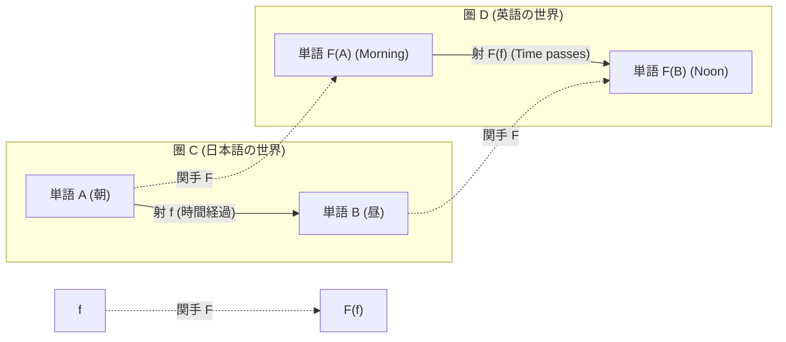
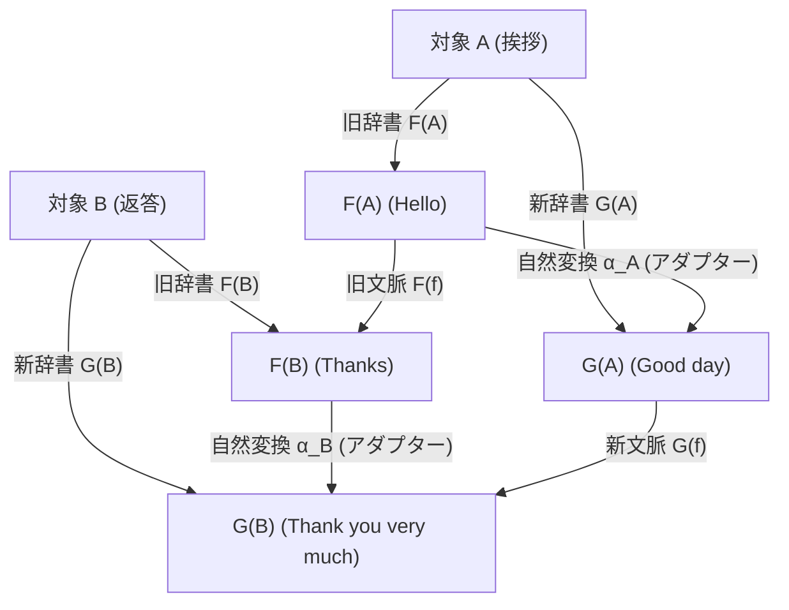

# 第3章：世界と世界を繋ぐ翻訳機 — 関手と自然変換

> 「**ある世界（圏）の構造を壊さずに別の世界へと丸ごと移転する『自動翻訳機（関手）』**」  
> 「**翻訳機と翻訳機の間をスムーズに切り替える『変換アダプター（自然変換）』**」  
> 圏論は、異なる学問やプログラム同士を自在に行き来する最強の架け橋を提供します。

---

## 1. 関手（Functor / ファンクター）：構造を保つ「世界の自動翻訳機」

一つの圏 $\mathbf{C}$ の中だけでなく、「**異なる圏 $\mathbf{C}$ から別の圏 $\mathbf{D}$ へ**」と世界そのものを丸ごと引っ越し・翻訳する装置が**関手（Functor）**です。



### 💡 関手の理論ルールと「翻訳」の完全一致

| 関手の数学的公理 | 日常（翻訳）の具体例 | 破綻すると何が起きるか？ |
| :--- | :--- | :--- |
| **対象の対応 $A \mapsto F(A)$** | 日本語の単語 $\to$ 英単語 | 単語が辞書に載っていない（翻訳不能） |
| **射の対応 $f \mapsto F(f)$** | 日本語の文脈・変化 $\to$ 英語の文脈・変化 | 関係性の意味が変わってしまう |
| **合成を保つ<br>$F(g \circ f) = F(g) \circ F(f)$** | **「朝 $\to$ 昼 $\to$ 夜」の一連の繋がりが、英語でも「Morning $\to$ Noon $\to$ Night」と一本道で繋がる！** | 翻訳した途端に話の順番や因果関係がバラバラに崩壊する |
| **恒等射を保つ<br>$F(\mathrm{id}_A) = \mathrm{id}_{F(A)}$** | 日本語で「その場で待機する」は、英語でも「Stay（何もしない）」に対応する | 待機していただけなのに勝手に別の状態へ動いてしまう |

---

## 2. 自然変換（Natural Transformation）：翻訳機同士の変換アダプター

圏論の抽象度はここでさらに一段上がります。
- 「対象と対象を繋ぐ」のが **射（矢印 $\to$）**
- 「圏と圏を繋ぐ」のが **関手（太い矢印 $\Rightarrow$）**
- 「関手（翻訳機）と関手（翻訳機）を繋ぐ」のが **自然変換（二重矢印 $\Rightarrow$）** です！



### 🧮 数式理論「可換性」と具体例の完全一致

$$\alpha_B \circ F(f) = G(f) \circ \alpha_A$$

```
【辞書のバージョンアップで見る自然変換】
  ルート 1： 先に「旧辞書 F」で挨拶から返答へ会話を進め（F(f)）、後から新表現に直す（α_B）
  ルート 2： 先に挨拶を「新辞書 G」の表現に変換し（α_A）、新辞書の中で返答へ会話を進める（G(f)）

  ➔ どちらの順序で処理しても、最終的な会話の意味は 1 ミリも狂わず完全に一致する！
```

この「どのタイミングで変換アダプターを挟んでも、システム全体に矛盾や歪みが生じない」という性質こそが、数学における「自然な（Natural）」という言葉の真の意味です。

---

## 3. プログラミングと現実世界での大活躍

1. **プログラミングの `map`（リスト関手）**:
   数値を2倍にする関数 `double` があるとき、単品の世界からリスト（配列）の世界へと持ち上げて `[1, 2, 3]` を一括で `[2, 4, 6]` に変換する機能（`fmap`）は、まさに**リスト関手**そのものです。
2. **型変換アダプター（自然変換）**:
   配列 `List<T>` を集合 `Set<T>` へと変換する操作 `toList()` や `toSet()` は、データの順序を保ったまま型を切り替える**自然変換**の典型例です。

---

## 💡 友達に話したくなる！3行まとめカード

```
┌──────────────────────────────────────────────────────────────┐
│ 🌟 第3章のまとめ                                             │
│ 1. 関手は、繋がり方のルールを保ったまま世界を移す「自動翻訳機」│
│ 2. 自然変換は、翻訳機同士を歪みなく切り替える「変換アダプター」│
│ 3. プログラミングの map や型変換も、すべて関手と自然変換！    │
└──────────────────────────────────────────────────────────────┘
```

---

## ❓ ちょっと考えてみよう！ミニチェック

> **Q. 単品の数値を2倍にする関数を、リスト `[1, 2, 3]` に一括適用して `[2, 4, 6]` に変換するプログラミングの `map` は、圏論の言葉で何に相当するでしょうか？**  
> ① 普遍性  
> ② 関手（Functor）  
> ③ 単位元律  
> 
> *➔ 正解は **② 関手（Functor）**！単品の世界の繋がりを壊さず、リストという新しい世界へとそのまま持ち上げて適用する機能（`fmap`）は、関手の最も代表的な応用例です。*
