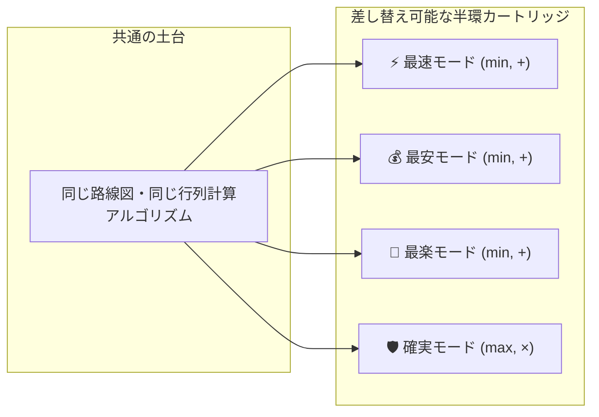
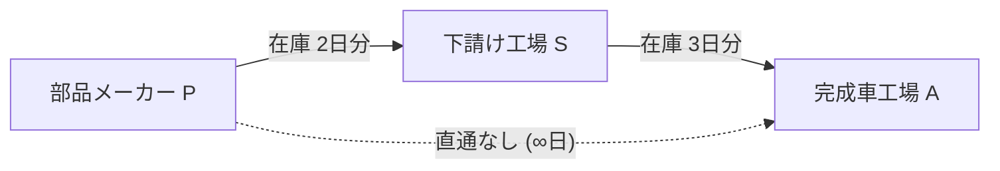
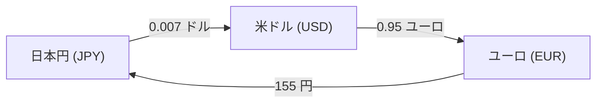
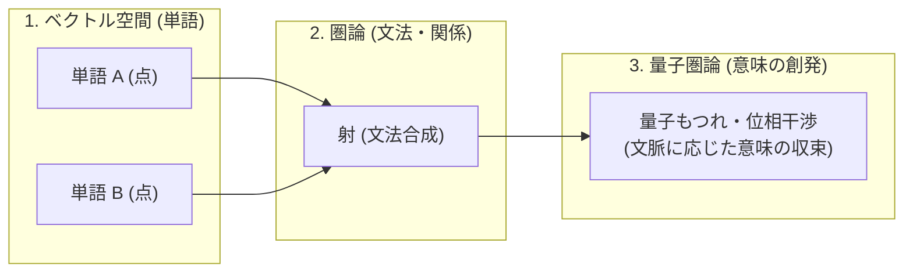

# 第4章：フロンティアと実践応用 — ツールで体感する半環カートリッジと未来の科学

> 「**圏論の思考法は、理論の美しさにとどまらず、国家の経済予測からAIの心臓部、量子コンピュータまでを動かす最強の実学である。**」

本章では、開発した実践ツールの体験を皮切りに、**マクロ経済学・サプライチェーン・金融工学における驚くべき手計算の具体例**と、最先端の**複雑ネットワーク・量子圏論・次世代AIアーキテクチャ**への接続を解説します。

---

## 1. 🧰 実践ツール：マルチ条件ルート最適化ツールで遊ぼう！

本教材のために開発された「**圏論・半環カートリッジ実験室**」を実際に触ってみましょう！

👉 **[実践ツールを開く（tool/index.html）](../tool/index.html)**



ボタンを1つカチッと切り替えるだけで、**全く同じ行列計算プログラムが瞬時に4つの異なる最適ルートを算出**します。  
「ルール盤（半環）を差し替えるだけで、世界中のあらゆる問題が解ける」という圏論の威力をぜひ手元で実感してください！

---

## 2. 💹 経済予測・サプライチェーン・金融への絶大な応用

行列のべき乗と収束（$M^\infty$）は、現代社会を動かす巨大な予測エンジンの基盤です。具体的な数字を使って手計算で追ってみましょう！

---

### ① レオンチェフの産業連関モデル — 100億円の需要が国全体をどう潤すか？

ノーベル経済学賞を受賞したワシリー・レオンチェフが考案した「産業連関モデル」は、**行列のべき乗の総和（無限等比級数）**そのものです。

#### 🚗 具体例：自動車産業（A）と鉄鋼産業（S）の 2産業モデル
自動車を作るには鉄が必要で、鉄を作るにも自動車（運搬車両）が必要です：
- 自動車を 1円 作るのに：自動車部品 0.2円、鉄 0.4円 が必要
- 鉄を 1円 作るのに：自動車（設備）0.1円、鉄（自社消費）0.3円 が必要

これをまとめたものが**投入係数行列 $M$** です：

$$M = \begin{pmatrix} 0.2 & 0.1 \\ 0.4 & 0.3 \end{pmatrix} \quad \begin{matrix} \text{(自動車 A)} \\ \text{(鉄鋼 S)} \end{matrix}$$

#### 🧮 自動車に「100億円」の新規需要が発生したときの波及手計算

```
【ステップ 1：直接効果（M¹）】
  自動車を 100億円 作るため、鉄鋼会社に鉄を注文する：
  M × [100, 0]ᵀ ＝ [20億円, 40億円]ᵀ
  ➔ 自動車自身に 20億円、鉄鋼に 40億円 の新たな生産が発生！

【ステップ 2：1次波及効果（M²）】
  発生した 20億円 と 40億円 を生産するため、さらに材料が必要になる：
  M × [20, 40]ᵀ ＝ [(0.2×20 + 0.1×40), (0.4×20 + 0.3×40)]ᵀ
                 ＝ [4 + 4, 8 + 12]ᵀ ＝ [8億円, 20億円]ᵀ

【ステップ 3：無限の波及効果の総和（レオンチェフ逆行列）】
  最初の一撃 ＋ 1次波及 ＋ 2次波及 ＋ … ＝ (I - M)⁻¹
```

高校数学の無限等比級数の公式 $1 + r + r^2 \dots = \frac{1}{1-r}$ と全く同じ原理で、行列の世界でも：

$$(I - M)^{-1} = I + M + M^2 + M^3 + \dots$$

となり、**「最終的に国全体の生産額が合計何百億円押し上げられるか（経済波及効果）」が一発の逆行列計算で完全に算出**されます！

---

### ② サプライチェーンの「供給停止ドミノ」予測（トロピカル半環 $(\min, +)$）

企業間の部品供給ネットワークを行列 $M$ にし、トロピカル半環で計算すると、工場の停止ドミノが手計算で予測できます。



$$M = \begin{pmatrix} 0 & 2 & \infty \\ \infty & 0 & 3 \\ \infty & \infty & 0 \end{pmatrix}$$

トロピカル行列積 $M^2 = M \odot M$ を計算すると：
$$\text{P から A への停止波及日数} = \min(0 + \infty, \; 2 + 3, \; \infty + 0) = \mathbf{5 \text{ 日後}}$$

「**部品メーカー P が火災で止まったら、ちょうど 5 日後に完成車工場 A のラインが部品切れで停止する**」という被害の最速波及ルートが瞬時に判明します。

---

### ③ 為替の「三角裁定取引（ノーリスク利益）」の自動検知（乗法半環 $(\max, \times)$）

3つの通貨（円・ドル・ユーロ）の為替レートを行列 $R$ で表します：



$$R = \begin{pmatrix} 1 & 0.007 & \dots \\ \dots & 1 & 0.95 \\ 155 & \dots & 1 \end{pmatrix}$$

この行列同士を「掛け算して最大値を選ぶ（$(\max, \times)$ 半環）」でべき乗計算すると：

$$\text{円} \to \text{ドル} \to \text{ユーロ} \to \text{円 のループ} = 0.007 \times 0.95 \times 155 = \mathbf{1.03075}$$

> **結論**:  
> 1 万円を「ドル $\to$ ユーロ $\to$ 円」と両替して一周させるだけで、**ノーリスクで 10,307 円（+307円の利益）に増える価格の歪み（アービトラージ）**が存在することをアルゴリズムが一撃で検知します！

---

## 3. 複雑ネットワーク科学 × 圏論（高次相互作用のモデル化）

現実の人間関係や社会問題、生体システムなど、複数の要素が複雑に絡み合う世界では、**「複雑ネットワーク科学」と「圏論」のタッグ**が最強の威力を発揮します。

```
【最強の役割分担】
  ① 圏論（Category Theory / Functor）:
     メタ言語・構造変換エンジン。異なる分野間の「共通の構造パターン（アナロジー）」を抽出・定義する。
  ② 複雑ネットワーク科学（Network Science）:
     トポロジー・計算実行エンジン。実際のグラフ構造（ハブ、コミュニティ、最短路）を高速に計算する。
```

### 📦 マクロノード化（サブグラフの折りたたみ / Super Node）
細かな因果関係の塊（例：10個の小さな業務トラブル）を、圏論の関手を使って**「1つのマクロノード（Super Node）」にスッキリ折りたたむ**ことで、巨大で複雑なシステムの本質を一目で把握できるようになります。

---

## 4. 量子圏論（DisCoCat）と意味・実存の創発

言語処理や認知科学の最先端では、「**モノイダル圏（Monoidal Category）**」を用いた**DisCoCat**というモデルが注目されています。



- **ベクトル（点）**: 単語を固定された数値として表す。
- **圏論（関係・射）**: 文法ルールに従って矢印で繋ぎ合わせる。
- **量子圏論（重ね合わせ・位相干渉）**: 言葉の多義性やニュアンスを「重ね合わせ状態」として保持し、対話や文脈によって最適な意味へと収束させる。

---

## 5. 知識・知恵・記憶の構造化（AIアーキテクチャへの応用）

圏論の思考法は、次世代AIエージェントの記憶や知識ベース（AetherDB）の設計にも直結しています。

- **知見の等価性判定**: 異なる文脈の知見同士が「同じ射の構造（可換図式）」を持つか判定し、深いアナロジーを自動検出する。
- **安全な聖域境界ゲート**: 記憶や人格の核を保護しつつ、厳密に定義された関手（翻訳射）を通じてのみ安全に知識を共有する。
- **推論プロセスの来歴（Provenance）追跡**: 結果だけでなく、「どのような矢印の合成を経てその結論に至ったか」を完全に検証可能にする。

---

## 💡 友達に話したくなる！3行まとめカード

```
┌──────────────────────────────────────────────────────────────┐
│ 🌟 第4章のまとめ                                             │
│ 1. レオンチェフ経済予測も為替裁定も、すべて行列のべき乗の応用│
│ 2. 圏論とネットワーク科学が合体し、巨大な複雑システムを解剖  │
│ 3. 量子圏論や次世代AI記憶など、現代科学の最前線を牽引する！  │
└──────────────────────────────────────────────────────────────┘
```

---

## ❓ ちょっと考えてみよう！ミニチェック

> **Q. 自動車の増産による経済波及効果を計算するとき、直接の鉄鋼需要だけでなく「鉄を作るための電力需要」「発電機を作るための金属需要…」と無限に続く波及効果の合計が、なぜ $(I - M)^{-1}$ という1つの逆行列の計算で求まるのでしょうか？**  
> ① コンピュータが無限回ループ計算を力任せに行っているから  
> ② 行列のべき乗の合計 $I + M + M^2 + M^3 \dots$ が、高校数学の無限等比級数の公式と同じように $(I - M)^{-1}$ に綺麗に収束するから  
> ③ 経済学者が適当に数値を丸めているから  
> 
> *➔ 正解は **②**！線形代数とべき乗の収束理論があるからこそ、無限に続く経済の連鎖反応を一撃で正確に予測できるのです！*
