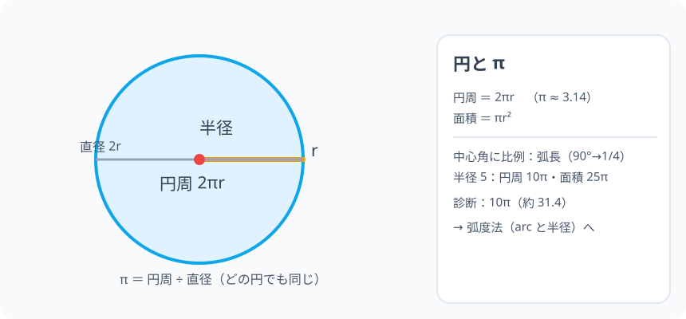

# 円周率 π と円の計量：まわりは、いつも直径のちょっと 3 倍超え

> [!abstract] このノードの核心
> どんな円でも「円周 ÷ 直径」は同じ値――それが **円周率 π = 3.14159…**。円のまわり（円周）は $2\pi r$、面積は $\pi r^2$、中心角に比例する弧長も、すべてこの π がつなぐ。小学校最後の大発見であり、以後（弧度法・円周角・オイラー）まで続く「円の言語」。

> [!success] 合格ライン
> π = 円周 ÷ 直径 を言える。半径 5 の円周 = 2π×5 = 10π（＝診断の答え）。円の面積 = πr²、中心角の比例（弧長）を説明できる。

## 記号の読み方

| 表記 | 読み方 | この教材での意味 |
|---|---|---|
| π | パイ | 円周率（3.14159…） |
| r | アール | 半径（中心からまわりまで） |
| 円周 | えんしゅう | 円のまわり（境界の長さ） |
| 中心角 | ちゅうしんかく | 中心を頂点にする角 |

> [!tip] π は「およそ 3.14」
> 円周率は 3.1415926535…と無限に続く無理数。小学校では 3.14 で計算。高校では π のまま（正確で美しい）。

## 前提ノードと入口判定

機械的な前提関係は、プロジェクト内スナップショット `../ontology/math_euler_complete_ontology.json` を参照し、転記している。外部原本は `G:/マイドライブ/Eleanor Arroway/documents/math_euler_complete_ontology.json`。`trigonometry_master_ontology.md` は人間向けの全体地図として使い、IDや依存関係が異なる場合はJSONを優先する。

| 区分 | ノード・知識 | この教材で必要な理由 | 入口での判定 |
|---|---|---|---|
| 必須ノード（JSON正本） | `ELEM-RATIO-01` 分数と比・割合 | 円周÷直径＝定数（比の値）を作る感覚 | 3:4=0.75 を言える |
| 基礎知識（C類） | 円の見た目 | 中心・半径・直径 | コンパスで円を描ける |

**入口判定の扱い:** JSON の診断「半径 5 の円周」を最初の目安にする。**円周 = 2πr** の 1 手。**π が「円周 ÷ 直径」の定数である**ことを言えれば合格ライン。

## 到達点

この教材を閉じたとき、次のことを自分の言葉で説明できる。

- π = 円周 ÷ 直径（すべての円で同じ）を説明できる。
- 円周 = 2πr・円の面積 = πr² を使える。
- 弧長が中心角に比例することを説明できる（後の弧度法の土壌）。
- 円・球・扇の世界の「輪の数え方」の感覚。

## 入口：「円のまわりを、ひもで測ってみよう」

コップのふち・ピザ・タイヤ。どの円も「まわり ÷ 直径」を計算すると **その数はいつも 3.14…** になる。古代人はこの発見に 数千年をかけたが、私たちは 1 日で使える。円を扱うすべての計算は、この 1 つの数を覚えればいい。

> [!example] 同じ例を最後まで使う
> 半径 5（直径 10）の円を主役に、円周（10π）・面積（25π）・弧（比例）をすべて通す。

## 核となる図

図：円（半径 r・直径 2r）。まわり（円周）は 直径 × π。

| 図での要素 | 名前 | 役割 |
|---|---|---|
| 半径 r | r | 中心から 1 つ |
| 直径 2r | 2r | 縦断の線 |
| 円周 | 2πr | まわりの長さ |
| 中心角 360° | 一周 | 比例の土台 |

## まずやってみる

> [!question] 式を見る前の10秒
> 直径 10 の円（半径 5）。円周を「ひもで測ったら 31cm ほど」とすると、円周 ÷ 直径 ＝ 約？ 小数で言ってみる。

答えを確認する

約 31.4 ÷ 10 = 3.14。この 「3.14…」が円周率 π。

## 円周率と円周の長さ

どんな円でも

$$
\pi = \frac{\text{円周}}{\text{直径}}\quad\Rightarrow\quad \text{円周} = \text{直径}\times\pi = 2\pi r
$$

$$
\boxed{\ \text{円周} = 2\pi r\ }\qquad\boxed{\ \text{円の面積} = \pi r^2\ }
$$

（面積の理由：円を細かい「おうぎ形」に切って互い違いに並べると、縦 r・横（πr）の長方形そっくりになる——「πr × r」＝ πr²。）

## 数値で点検する

### 診断問題

$$
2\pi\cdot 5 = 10\pi\quad\checkmark\quad(\text{約 } 31.4)
$$

### 面積・弧長（比例）

- 面積 = π×5² = 25π（約 78.5）
- 中心角 90° の弧 = 円周 × 90/360 = 2π×5×1/4 = 5π/2（後の弧度法の「弧度」へ）

### 極端な場合

- r = 1 → 円周 2π（約 6.28）・面積 π（約 3.14）。
- r = 0 → 円周 0（点に潰える）。

## 3行まとめ

1. π = 円周 ÷ 直径（全円共通の定数・約 3.14）。
2. 円周 = 2πr・面積 = πr²。
3. 弧長は中心角に比例——後の弧度法（ラジアン）・円周角の門。

## 理解度サポート：どこまで分かっているか

### まず自己評価

- [ ] **0：未学習** — 慣例の 3.14 だけ知っている
- [ ] **1：見れば分かる** — 図と式を対応づけられる
- [ ] **2：自力で使える** — 円周・面積・弧の計算ができる
- [ ] **3：説明できる** — π の定義・面積の理由・比例の感覚を説明できる

### 技能ごとの確認問題

| check_id | 確認する技能 | 問い | 答えが曖昧なときに戻る場所 |
|---|---|---|---|
| P0 | JSON指定の入口診断 | 半径 5 の円の円周の長さは？ | 「数値で点検する」 |
| C1 | π の定義 | π＝円周÷直径 を言う。 | 「円周率と円周の長さ」 |
| C2 | 計算 | 半径 3 の円周（答: 6π） | 「数値で点検する」 |
| C3 | 面積 | 半径 3 の面積（答: 9π） | 「数値で点検する」 |
| C4 | 弧の比例 | 中心角 90° の弧＝円周の 4 分の 1 を説明する。 | 「数値で点検する」 |
| C5 | 弧度法への布石 | 半径 1 の円で「半径=弧長」の角を 1 ラジアンと言ったことの意味。 | 「次のノードへの橋」 |

解答と判定基準を開く

- **P0の答え:** 10π（約 31.4）。
- **C1の答え:** 円周 ÷ 直径。
- **C2の答え:** 6π（約 18.8）。
- **C3の答え:** 9π（約 28.3）。
- **C4の答え:** 360° のうち 90° → 全体の 1/4。
- **C5の答え:** 半径 1 の円では弧長（そのまま角）が 2π（周）になる。それが弧長角度（ラジアン・HS2-TRIG-RADIAN-01）。

**判定の目安:**

- P0とC1〜C5を正答かつ理由つきで → 次のノード（中学校・高校）へ
- C3を誤る → おうぎ形の並べ替え（イメージを再現）
- C4を誤る → 比例（比のノードの感覚）

## よくある取り違え

- 円周と面積の式の混同 → **円周 2πr・面積 πr²（次元を覚える：長さ/面積）**。
- 直径でなく半径に 2π を使う → **r なら 2 が付く（直径 2r）**。
- 中心角は 360° として計算 → **比例（90°=1/4 など）。扇はこの 1/4 の適用**。
- π を「3 で良い」と使う → **とても粗い（誤差 4.5%）**。
- 円周の同節の長い表を覚えないと使えないと思う → **半径か直径かで 1 手（2πr か πd）**。

## 自力確認（teach-back）

教材を閉じて、次を声に出して答える。

1. π の定義（円周÷直径）と値（約 3.14）をいう。
2. 半径 4 の円の円周・面積（8π・16π）。
3. 中心角 60° の弧＝円周の 1/6 を計算する。
4. これが後の「ラジアン（半径=弧長の角）」の種であると言う。

## 次のノードへの橋

- **弧度法（`HS2-TRIG-RADIAN-01`）**：中心角を「弧長 ÷ 半径」で測る（2π = 360°）。このノードの比例が、角度の新しい単位を産む。
- **円周角の定理（`JH-GEO-CIRCLE-ANGLE-01`）**：弧と角の対応の根源。
- **オイラー（`EULER-CONVERGENCE-01`）**：π が指数と三角を結ぶ数（e^(iπ) = −1）へ。

## インタラクティブ化の候補（レビュー後に判定）

- **有効候補: r スライダー** — 円周・面積・弧が変化する。
- **有効候補: ひもを測って π を確認** — 円の周を開くアニメ。
- **静的で十分**なので動かすのは 1 つまで。
- 動かすことそれ自体を合格条件にはしない。
