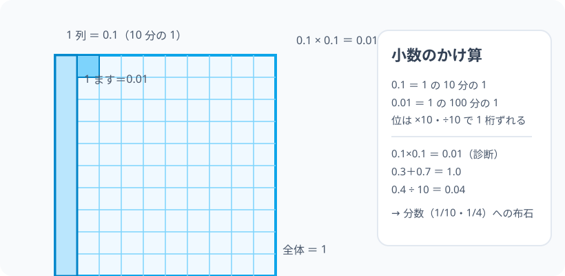

# 四則演算と小数の計算：数の遊び場の「はじめの一歩」

> [!abstract] このノードの核心
> 整数の足す・引く・掛ける・割るに加えて、**小数**を扱う。0.1 とは何か（1 を 10 等分した 1 つ分）、掛け算・割り算で位がどう動くか（0.1 × 0.1 = 0.01）を「位取りの見た目」でつかむ。これが、あとで分数・比・小数がひとつに解ける土台になる。

> [!success] 合格ライン
> 0.1（1 の 10 分の 1）の意味を言える。0.1 × 0.1 = 0.01・0.1 ÷ 10 = 0.01 を「桁のずれ」で説明できる（＝診断の答え）。小数の足し引きが位をそろえてできる。

## 記号の読み方

| 表記 | 読み方 | この教材での意味 |
|---|---|---|
| 0.1 | れい・てん・いち | 1 を 10 等分した 1 つ分 |
| 小数 | しょうすう | 小数点の下に続く数の書き方 |
| 位 | くらい | 10 倍ずつ変わる位置 |
| ×・÷ | かける・わる | 掛け算・割り算 |

> [!tip] 「0.1 は『十の位の 0』？」
> 0.1 は「**1 を 10 で分けた小さな単位のひとつ**」。十の位・一の位の隣に「十分の一の位」がある。

## 前提ノードと入口判定

このノードはオントロジーの最底辺（prerequisites: なし）。就学前の感覚のみを C 類リファレンスとして：

| 区分 | 知識 | 必要な理由 | 入口での判定 |
|---|---|---|---|
| C類 | かずを数える | 数の始まりの感覚 | りんご 5 個を指さして数えられる |
| C類 | 半分の感覚 | 1 を 10 等分する感覚 | ケーキを半分に切れる |

**入口判定の扱い:** 診断「0.1 × 0.1」を最初の目安にする。**0.01（1 の 100 分の 1）**——この「0.1 を 0.1 分だけ取った」量感を言えることが合格ライン。

## 到達点

この教材を閉じたとき、次のことを自分の言葉で説明できる。

- 0.1・0.01・0.001 の意味（1 の 10 分の 1・100 分の 1・1000 分の 1）。
- 整数の四則が小数でもそのまま働く（位をそろえる・桁がずれる）。
- 0.1 × 0.1 = 0.01・0.1 ÷ 10 = 0.01 を説明できる。
- 小数の足し引き・掛け引きの見当（およそ何分の何か）がつく。

## 入口：「半分の半分は、いくらのいくら？」

「1 を 10 等分した 1 つ分」= 0.1。では 0.1 の 0.1 分（0.1×0.1）、つまり「10 分の 1 の 10 分の 1」は？—— 10 分の 1 × 10 分の 1 = **100 分の 1 = 0.01**。紙の上でわかる、この「そろばん的な感覚」が今日の旅。

> [!example] 同じ例を最後まで使う
> ピザ 1 枚（1）を主役にする。0.1 は 1 枚を 10 等分の 1 切れ・0.01 はさらに 10 等分の 1 切れ（0.1 切れ）として、一貫して使う。

## 核となる図

図：1 枚の四角（大）を 10×10 = 100 の小さなますに分け、1 ます＝0.01、1 列＝0.1。

| 図での要素 | 名前 | 役割 |
|---|---|---|
| 大きな四角 | 1 | 全体 |
| 1 列 | 0.1 | 10 分の 1 |
| 1 ます | 0.01 | 100 分の 1 |

## まずやってみる

> [!question] 式を見る前の10秒
> 0.1 × 0.1 を、ますの絵で考える：0.1 は全体の 1 列分。その 1 列の 0.1 分（0.1 〜 0.1）ってどのくらい？ こたえの見当をつける。

答えを確認する

1 列の「10 分の 1」＝大ます全体の 100 分の 1＝**0.01**。暗算と図が一致。

## 整数の四則と、小数での同じルール

- 足し算・引き算：位をそろえて（小数点の位置をあわせて）計算。0.3 + 0.7 = 1.0
- 掛け算：整数として計算して、小数の位の数だけ右にずらす（桁のずれ）。0.1 × 0.1 → 1 × 1 = 1 を 2 桁右へ → 0.01
- 割り算：また桁が逆方向へ。0.1 ÷ 10 = 0.01

## 数値で点検する

### 診断問題

$$
0.1\times 0.1 = 0.01\quad\checkmark\qquad 1\times0.1 = 0.1\quad\text{（10分の1）}
$$

### 10 倍・100 倍の対応

0.1 → ×10 → 1 → ×10 → 10（位が一つずつ上がる）。100 分の 1 の世界から元の世界へ。

### 極端な場合

- 0.1 × 0 = 0（何も取らない）。
- 0.1 + 0.9 = 1（10 分の 1 が 9 個あると 1 に足りる）。

## 3行まとめ

1. 0.1 は 1 の 10 分の 1・0.01 は 100 分の 1（位取りの続き）。
2. 四則は整数と同じ手順で、小数点の位置だけ気にする。
3. 「10 分の 1 の 10 分の 1」＝ 100 分の 1（0.1×0.1 = 0.01）。

## 理解度サポート：どこまで分かっているか

### まず自己評価

- [ ] **0：未学習** — 小数と整数の関係が見えにくい
- [ ] **1：見れば分かる** — ますの絵で言える
- [ ] **2：自力で使える** — 計算ができる
- [ ] **3：説明できる** — 桁のずれ・位取りの理屈を言える

### 技能ごとの確認問題

| check_id | 確認する技能 | 問い | 答えが曖昧なときに戻る場所 |
|---|---|---|---|
| P0 | JSON指定の入口診断 | 0.1 × 0.1 はいくつですか？ | 「数値で点検する」 |
| C1 | 位取り | 0.01 は 1 の何分の 1？（答: 100） | 「核となる図」 |
| C2 | 計算 | 0.3 + 0.7（答: 1.0） | 「整数の四則…」 |
| C3 | 桁のずれ | 0.5 × 10（答: 5） | 「10 倍・100 倍」 |
| C4 | 割り算 | 2.4 ÷ 10（答: 0.24） | 「…割り算」 |
| C5 | 分数への布石 | 0.1・0.25 は分数でどう書く？ | 「次のノードへの橋」 |

解答と判定基準を開く

- **P0の答え:** 0.01。
- **C1の答え:** 100 分の 1。
- **C2の答え:** 1.0（＝1）。
- **C3の答え:** 5。
- **C4の答え:** 0.24（一の位を1つ下げる）。
- **C5の答え:** 0.1 = 1/10・0.25 = 1/4（→ 次ノード ELEM-RATIO-01）。

**判定の目安:**

- P0とC1〜C5を正答かつ理由つきで → 次のノードへ
- C4を誤る → 桁の向き（÷10 は 1 桁下）を数の表で
- C5を誤る → 分数を比で読む（次ノードの予告のみで OK）

## よくある取り違え

- 0.1 × 0.1 を 0.1 とする → **0.01（桁は 2 桁右へ）**。
- 0.3 + 0.7 = 1.0 を無理に 0.10 と書く → **正しいのは 1.0（＝1）**。
- 0.1 を「0 と 1 の合体」と思う → **1 を 10 等分した１つ分（位取り）**。
- 小数の足し算で桁をそろえない → **小数点の位置をそろえる（位を揃えて）**。
- 10 と 0.1 の近さを過小評価 → **×10・÷10 でちょうど 1 桁ずつ**。

## 自力確認（teach-back）

教材を閉じて、次を声に出して答える。

1. 0.1・0.01 の意味を「10 分の 1」「100 分の 1」でいう。
2. 0.1×0.1 を図と式の両方で 0.01 に。
3. 0.4 ÷ 10・0.4 × 10 の答え。
4. 0.5 を分数（1/2）と関連づける。

## 次のノードへの橋

- **分数と比・割合（`ELEM-RATIO-01`）**：小数は「位取りで 10 進を伸ばした表記」、分数は「等分を絵で持ち歩く表記」。0.25 = 1/4。
- **比・割合・三角形の相似**：割合の感覚が、すべての以降のノードに潜む（特に 相似比・弧度法）。

## インタラクティブ化の候補（レビュー後に判定）

- **有効候補: ますの絵スライダー** — 0.1 のます分割が可視化。
- **有効候補: 桁のずれシミュレーター** — ×10・÷10 で位が動く。
- **静的で十分**という結論なので、動かすのは 1 つまで。
- 動かすことそれ自体を合格条件にはしない。
