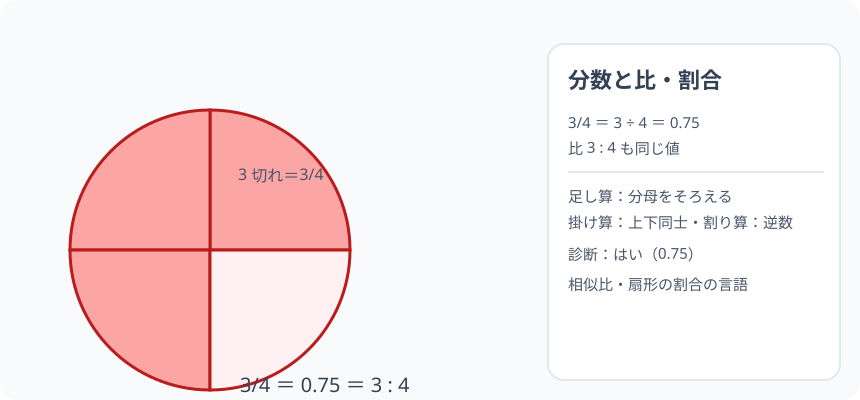

# 分数と比・割合：1 つの「3 対 4」を、3 つの言葉で言う

> [!abstract] このノードの核心
> 「全体を 4 等分して 3 切れ」は分数 $\frac{3}{4}$、「3 と 4 の比」は 3 : 4、「全体に占める 3/4 分」は割合（0.75）。**どれも「3 ÷ 4」の同じ世界**。分数と小数と比を読み替えられることが、後の相似比・弧度法・三角比の「比率の言語」の基礎になる。

> [!success] 合格ライン
> 3/4 = 3 ÷ 4 = 0.75 と読み替えられる（＝診断：はい）。分数の足し引き（分母をそろえる）と掛け算・割り算（逆数）ができる。

## 記号の読み方

| 表記 | 読み方 | この教材での意味 |
|---|---|---|
| 3/4 | さんぶんのよん（3 分の 4） | 全体を 4 等分した 3 つ分 |
| 3 : 4 | さんたいよん | 3 と 4 の比（3 ÷ 4 の値） |
| 分子・分母 | ぶんし・ぶんぼ | 上＝分子（3）・下＝分母（4） |
| 割合 | わりあい | 部分 ÷ 全体 |

> [!tip] 分母は「分けた数」
> 分数 3/4 は「4 分の 3」= 4 等分の 3 つ分。分母は「何等分したか」・分子は「いくつ取ったか」。

## 前提ノードと入口判定

機械的な前提関係は、プロジェクト内スナップショット `../ontology/math_euler_complete_ontology.json` を参照し、転記している。外部原本は `G:/マイドライブ/Eleanor Arroway/documents/math_euler_complete_ontology.json`。`trigonometry_master_ontology.md` は人間向けの全体地図として使い、IDや依存関係が異なる場合はJSONを優先する。

| 区分 | ノード・知識 | この教材で必要な理由 | 入口での判定 |
|---|---|---|---|
| 必須ノード（JSON正本） | `ELEM-NUM-01` 四則演算と小数 | 割り算・小数の基礎 | 0.1×0.1 = 0.01 を言える |
| 基礎知識（C類） | 等分の感覚 | ピザ・ケーキを分ける | 1 枚を 4 等分できる |

**入口判定の扱い:** JSON の診断問題「3/4 と 0.75 は同じ？」を最初の目安にする。**どちらも「3 ÷ 4」**——この 1 文を言えることが合格ライン。P0 で確認。

## 到達点

この教材を閉じたとき、次のことを自分の言葉で説明できる。

- 分数 ＝ 等分のいくつ分（分子・分母）という構造。
- 分数 ＝ 割り算（3/4 = 3÷4）＝ 小数（0.75）。
- 分数の足し引き（分母をそろえる）・掛け算（分子同士・分母同士）・割り算（逆数）。
- 比 3 : 4 が分数と同じ値の世界（相似比の下ごしらえ）。

## 入口：「切り分けと、のべ方が 3 通りあるよ」

ピザ 1 枚を 4 等分。3 切れは「4 分の 3」。値は 1 枚の 0.75。比でいうと 3 : 4（3 つ分と、4 等分の全体）。**同じ量を、分数・小数・比の 3 つで語る**——この読み替えが今日の旅。

> [!example] 同じ例を最後まで使う
> ピザ 1 枚・4 等分・3 切れを式の主役にし、0.75・3/4・3 : 4 の 3 語を一貫して使う。

## 核となる図

図：円（ピザ 1 枚）を 4 等分。3 切れ（＝3/4 ・ 0.75）。

| 図での要素 | 名前 | 役割 |
|---|---|---|
| 円全体 | 1（全体） | 分母の 4 |
| 4 つに分けた 1 つ分 | 1/4 | 単位 |
| 3 切れ | 3/4 | 分数・小数・比の元 |

## まずやってみる

> [!question] 式を見る前の10秒
> 3 切れ（3/4）を 割り算で書くと？ 3 ÷ 4。その答え（小数）を先に予想する。

答えを確認する

3 ÷ 4 = 0.75。**分数 = 割り算 = 小数**の 1 行つながり。

## 分数の計算

- **足し算・引き算**：分母をそろえて分子を足す/引く。1/4 + 2/4 = 3/4
- **掛け算**：分子同士・分母同士。3/4 × 2/3 = 6/12 = 1/2
- **割り算**：逆数を掛ける。3/4 ÷ 2/3 = 3/4 × 3/2 = 9/8

$$
\boxed{\ \frac{a}{b} = a \div b\ }\qquad\boxed{\ \frac{a}{b}\div\frac{c}{d} = \frac{a}{b}\times\frac{d}{c}\ }
$$

## 数値で点検する

### 診断問題

$$
\frac{3}{4} = 3 \div 4 = 0.75\quad\checkmark\quad(\text{同値・はい})
$$

### 比 3:4 も同じ

3 対 4 の「比の値」= 3/4 = 0.75（分数・小数に変換できる）。

### 極端な場合

- 分母 = 分子（4/4 = 1）→ 全体を全部取った。
- 逆数（4/3 ≈ 1.33）→ 全体より大きい（1 枚じゃ足りない）。

## 3行まとめ

1. 3/4 = 3 ÷ 4 = 0.75（分数 ＝ 割り算 ＝ 小数）。
2. 比 3 : 4 の値も 3/4（同じ世界）。
3. 足し引きは分母を・掛け算は上下同士・割り算は逆数。

## 理解度サポート：どこまで分かっているか

### まず自己評価

- [ ] **0：未学習** — 分数を「難しいコード」と見なしている
- [ ] **1：見れば分かる** — 絵と式のまとまりを追える
- [ ] **2：自力で使える** — 計算ができる
- [ ] **3：説明できる** — 3 語（分数・小数・比）の関係を説明できる

### 技能ごとの確認問題

| check_id | 確認する技能 | 問い | 答えが曖昧なときに戻る場所 |
|---|---|---|---|
| P0 | JSON指定の入口診断 | 3/4 と 0.75 は同じ値ですか？ | 「数値で点検する」 |
| C1 | 構造 | 分母・分子の意味。 | 「記号の読み方」 |
| C2 | 変換 | 1/2 = ? （小数で、答: 0.5） | 「数値で点検する」 |
| C3 | 足し算 | 1/3 + 1/6 = ?（答: 1/2） | 「分数の計算」 |
| C4 | 割り算 | 2/3 ÷ 1/3 = ?（答: 2） | 「分数の計算」 |
| C5 | 相似への布石 | 3:4 の値が 3/4 になる意味を一言。 | 「比 3:4 も同じ」 |

解答と判定基準を開く

- **P0の答え:** はい（3÷4 = 0.75）。
- **C1の答え:** 分子＝取った数・分母＝等分数。
- **C2の答え:** 0.5。
- **C3の答え:** 1/3+1/6 = 2/6+1/6 = 3/6 = 1/2。
- **C4の答え:** 2（逆数を掛けると 2/3×3 = 2）。
- **C5の答え:** 「3 対 4」は「3 ÷ 4」の値（0.75）。相似の対応する辺の比（辺の比）と同じ記法。

**判定の目安:**

- P0とC1〜C5を正答かつ理由つきで → 次のノードへ
- C3を誤る → 分母合わせ（通分）を絵で
- C4を誤る → 逆数（割り算の書き換え）を確認

## よくある取り違え

- 3/4 を「4 ぶんの 3」でなく「3 分の 4」と読む → **4 分の 3（分母を後・分子を先に読む）**。
- 足し算で分母も足す → **分母はそろえるだけ（足し算しない）**。
- 割り算でそのまま分数にする → **逆数を掛ける（÷ = ×逆）**。
- 比 3:4 を「3 + 4」と思う → **3 ÷ 4（値）**。
- 分数の値と「部分の個数」の混同 → **6/8 = 3/4（同じ値・約分）**。

## 自力確認（teach-back）

教材を閉じて、次を声に出して答える。

1. 3/4 を分数・小数・比の 3 語で表す。
2. 1/2 + 1/3 を計算する（答: 5/6）。
3. 2/3 ÷ 4/9 を逆数で解く。
4. 「全体に対する部分」の割合の言葉を例で説明する。

## 次のノードへの橋

- **J 円周率と円の計量（`ELEM-CIRCLE-01`）**：円周・中心角の「割合」が、分数・比の応用。
- **相似と比率（`JH-GEO-SIMILAR-01`）**：相似比はこの比の言語。
- **弧度法（`HS2-TRIG-RADIAN-01`）**：扇形の面積も、全体（πr²）に対する割合（θ/2π）。

## インタラクティブ化の候補（レビュー後に判定）

- **有効候補: ピザの分割スライダー** — 分け数を変えて分数・小数・比の表示が対応。
- **有効候補: 約分の図** — 6/8 = 3/4 を見せる。
- **静的で十分**なので動かすのは 1 つまで。
- 動かすことそれ自体を合格条件にはしない。
