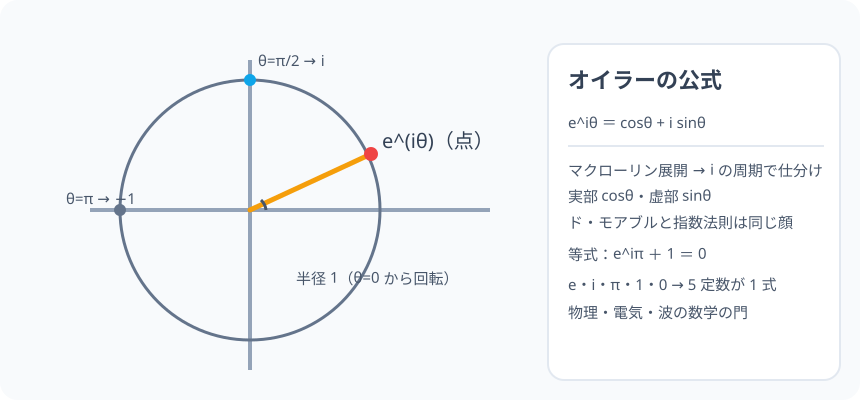

# オイラーの公式：3 つの別世界（指数・三角・複素）が実は 1 つの世界だった

> [!abstract] このノードの核心
> 指数関数の級数に $i\theta$ を差し込み、$i^2=-1$ の魔法を使うと、**実部に cos・虚部に sin がそっと現れる**。それがオイラーの公式 $e^{i\theta} = \cos\theta + i\sin\theta$。数理の大地が一つにつながる瞬間——指数が円を描き、三角が指数の影になる。この大合流を、縁（微分・級数・複素数平面）で視る。

> [!success] 合格ライン
> マクローリン展開に iθ を代入し、i の周期（i²=−1・i³=−i・i⁴=1）で実部・虚部に分けて cos・sin が現れることを説明できる（＝診断の答え）。$e^{i\pi}+1 = 0$ の「5 つの定数が 1 つの式」の誕生を喜べる。

## 記号の読み方

| 表記 | 読み方 | この教材での意味 |
|---|---|---|
| e^(iθ) | イーのアイシータ乗 | 指数関数の複素外挿 |
| 実部 | じつぶ | cosθ（級数の偶数項側） |
| 虚部 | きょぶ | isinθ（級数の奇数項側） |
| オイラーの等式 | おいらーのとうしき | e^(iπ) + 1 = 0 |

> [!tip] 数学で最も美しい等式
> 「e・i・π・1・0」——5 つの基本定数がたった 1 本の式に。

## 前提ノードと入口判定

機械的な前提関係は、プロジェクト内スナップショット `../ontology/math_euler_complete_ontology.json` を参照し、転記している。外部原本は `G:/マイドライブ/Eleanor Arroway/documents/math_euler_complete_ontology.json`。`trigonometry_master_ontology.md` は人間向けの全体地図として使い、IDや依存関係が異なる場合はJSONを優先する。

| 区分 | ノード・知識 | この教材で必要な理由 | 入口での判定 |
|---|---|---|---|
| 必須ノード（JSON正本） | `UNIV-CALC-TAYLOR-01` マクローリン展開 | e^x・sin・cos の級数 | e^x と sin x の級数を書ける |
| 必須ノード（JSON正本） | `HS3-COMPLEX-DEMOIVRE-01` ド・モアブル | 指数法則との整合（n 乗で角 n 倍） | (cosθ+isinθ)ⁿ の形を言える |
| 必須ノード（JSON正本） | `HS2-COMPLEX-NUM-01` 複素数と i | i²=−1 と 4 周期 | i³・i⁴ を計算できる |

**入口判定の扱い:** JSON（本ノードの診断）「e^(iθ) の展開を実部・虚部に分けると？」を最初の目安にする。**級数を並べて i の周期で仕分ける**操作そのもの。P0 で確認。

## 到達点

この教材を閉じたとき、次のことを自分の言葉で説明できる。

- マクローリン展開からオイラーの公式を導ける。
- 実部・虚部が cos・sin に一致する「偶然」を構造として説明できる。
- オイラーの等式（e^(iπ) + 1 = 0）の意味（5 つの基本定数）。
- ド・モアブルと指数法則が同じ式の別の顔であること。

## 入口：「指数のぜんぶ、三角のぜんぶが、一つの円に」

e^x も sin x も cos x も、別々の関数だと思われて 2000 年。だが e^x の級数に i を注ぐと、sin と cos の級数がすっと出てくる。**指数が円を描く**。この驚きが、数学における最強のつながりを生んだ。

> [!example] 同じ例を最後まで使う
> θ = π (半回転) を主役に、e^(iπ) = −1・e^(iπ/2) = i と「単位円上の点の動き」で通す。

## 核となる図

図：複素平面の単位円（半径 1）。e^(iθ) は θ を動かすと円周上を回る。e^(iπ/2) = i・e^(iπ) = −1・e^(i2π) = 1。**指数関数の進みが、円の回転そのもの。**

| 図での要素 | 名前 | 役割 |
|---|---|---|
| 円 | |z| = 1 | 三角の単位円そのもの |
| e^(iθ) | 動く点 | 指数の軌道 |
| θ=π/2・π | 通過点 | i・−1 を指で触る |
| 矢印 | 進む向き | θ の増加（回転） |

## まずやってみる

> [!question] 式を見る前の10秒
> 3 つの級数（前ノードの成果）を並べて、e^x の「奇数番目」「偶数番目」に着目する。

答えを確認する

e^x の級数 = 1 + x + x²/2! + x³/3! …。偶数番目 1+x²/2!+… は cos の顔、奇数番目 x+x³/3!+… は sin の顔。

## 導出：iθ を代入して分離する

$$
e^{i\theta} = 1 + i\theta + \frac{(i\theta)^2}{2!} + \frac{(i\theta)^3}{3!} + \frac{(i\theta)^4}{4!} + \frac{(i\theta)^5}{5!} + \cdots
$$

$i$ の周期 $i^2=-1,\ i^3=-i,\ i^4=1$ を使う：

$$
= 1 + i\theta - \frac{\theta^2}{2!} - \frac{i\theta^3}{3!} + \frac{\theta^4}{4!} + \frac{i\theta^5}{5!} - \cdots
$$

**実部と虚部に分離：**

$$
\underbrace{\left(1 - \frac{\theta^2}{2!} + \frac{\theta^4}{4!} - \cdots\right)}_{\cos\theta} \;+\; i\,\underbrace{\left(\theta - \frac{\theta^3}{3!} + \frac{\theta^5}{5!} - \cdots\right)}_{\sin\theta}
$$

$$
\boxed{\ e^{i\theta} = \cos\theta + i\sin\theta\ }
$$

**指数関数と三角関数は、複素数を通じて「同一の実体」である。**

## 数値で点検する

### 診断問題

$$
e^{i\theta} \xrightarrow{\text{展開すると}} \cos\theta \,+\, i\sin\theta
$$

### オイラーの等式（θ = π）

$$
e^{i\pi} = \cos\pi + i\sin\pi = -1 + 0\quad\Rightarrow\quad e^{i\pi} + 1 = 0
$$

### θ = π/2・2π

$$
e^{i\pi/2} = i,\qquad e^{i2\pi} = 1\quad（検証：i と 1 に戻る）
$$

正しく周期 2π（i を掛ける 90° の世界そのもの）。

## 3行まとめ

1. e^z の級数に iθ を代入し、i²=−1 で仕分ける。
2. 実部 cosθ・虚部 isinθ——**e^(iθ) = cosθ + isinθ**。
3. オイラーの等式 e^(iπ)+1 = 0（5 定数が 1 式）。数学の頂上への一本道を結んだ。

## 理解度サポート：どこまで分かっているか

### まず自己評価

- [ ] **0：未学習** — 世界が分かれていると思っている
- [ ] **1：見れば分かる** — 級数から分離が見える
- [ ] **2：自力で使える** — 定理・等式の変換ができる
- [ ] **3：説明できる** — 導出一連と大合流の意味を説明できる

### 技能ごとの確認問題

| check_id | 確認する技能 | 問い | 答えが曖昧なときに戻る場所 |
|---|---|---|---|
| P0 | JSON指定の入口診断 | e^(iθ) の展開を実部・虚部に分けると何が現れるか？ | 「導出」 |
| C1 | 級数の適用 | e^x の級数に iθ を代入する。 | 「導出」 |
| C2 | i の周期 | i²・i³・i⁴ を代入して仕分ける。 | 同節 |
| C3 | 等式 | θ=π で e^(iπ)+1 = 0 を導く。 | 「数値で点検」 |
| C4 | 整合 | e^(iθ)² = e^(i2θ) がド・モアブルと一致する理由。 | 「ド・モアブルの整合」 |
| C5 | 総決算 | このノードの示す「大合流」を自分の言葉で。 | 「次のノード」/「3行まとめ」 |

解答と判定基準を開く

- **P0の答え:** 実部 cosθ・虚部 sinθ。
- **C1の答え:** iθ を掛けた冪の挿入。
- **C2の答え:** i²=−1・i³=−i・i⁴=1 で ± に仕分け。
- **C3の答え:** cosπ + isinπ = −1 → +1 = 0。
- **C4の答え:** 指数法則 (e^(iθ))² = e^(i2θ) は、極形式の「角を足す」と同じ（加法定理/ド・モアブル）。1 つの真実の 2 面。
- **C5の答え:** 指数と三角が複素数の円で一つ。微分も級数も極座標も、同じリボンの表裏。（例：量子力学・電磁気・信号処理の当たり前の道具。）

**判定の目安:**

- P0とC1〜C5を正答かつ理由つきで → これで 46 ノード（42＋補強 4）のスタートライン
- C2を誤る → 複素数の 4 周期の復習
- C3を誤る → cosπ・sinπ の値

## よくある取り違え

- e^(iθ) を「どんな複素数と同じ」と読む → **絶対値は常に 1（単位円上）**。
- e^(iπ) = 1 と早とちり → **−1（左右 180°）**。
- 定理が「単なる記号の遊び」と思う → **量子力学・電気工学・波の数学の心臓部**。
- 複素数平面の単位円と本式の関係のごた混ぜ → **r = 1・e^(iθ) = (cosθ, sinθ) の点**。
- 一般化（e^(a+bi)）に飛ばずに混乱 → **e^(a+bi) = e^a·(cos b + isin b)。次は大学へ**。

## 自力確認（teach-back）

教材を閉じて、次を声に出して答える。

1. e^x の級数からオイラーの公式を導く一節を書く。
2. e^(iπ)+1 = 0 の成立を示す。
3. e^(iθ) が単位円を回ることを説明する。
4. ド・モアブルがこの公式のどの顔か。

## 次のノードへの橋 —— 大航海の終着駅

この 42（＋4）ノードの旅はここで一つの終着駅に着いた。e^(iθ) = cosθ + isinθ の向こうに広がるのは、物理（量子・波・場）・電気（交流）・解析（微分方程式）・統計（フーリエ）・数値計算——**あなたはその玄関に立っている**。

- フーリエ変換：周波数を e^(iθ) の言葉で。
- 量子力学：波動関数の位相。
- 電気回路：交流のオームの法則はすべて複素数。

## インタラクティブ化の候補（レビュー後に判定）

- **有効候補: θ スライダー（単位円の点）** — e^(iθ) の軌道が円を描く。この式の実体。
- **有効候補: 級数 n 項での近似** — e^(iθ) と円の重なり。
- **静的なままで十分:** 図・導出・検証はすべて静的で成立。動かすなら θ スライダーを 1 つ。
- 動かすことそれ自体を合格条件にはしない。
