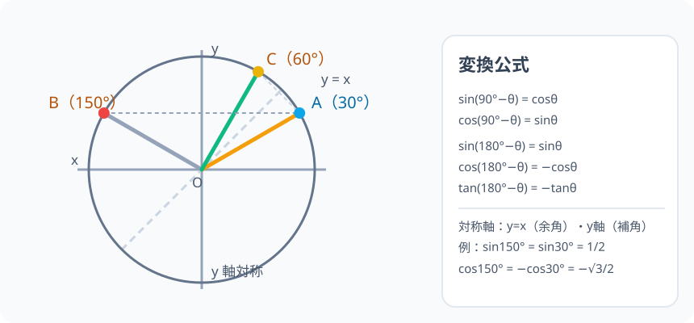

# 角の変換公式：30° と 150° は単位円で「同じ y 座標」

> [!abstract] このノードの核心
> 単位円には対称性が 2 つある——**y 軸（左右）**と**対角線 y = x**。この 2 つが、角度を「余角（90°−θ）」・「補角（180°−θ）」に変換する規則を生み出す。どちらの変換も、**覚えるのは 1 つの対称図だけ**。図さえ頭にあれば、公式は 4 行自動で出てくる。

> [!success] 合格ライン
> $\sin(180°-\theta) = \sin\theta$・$\cos(180°-\theta) = -\cos\theta$ と $\sin(90°-\theta) = \cos\theta$・$\cos(90°-\theta) = \sin\theta$ を、単位円の 2 つの対称性から説明できる。診断問題（sin(180°−30°) = sin30°）の「等しい」を、点の位置で説明できる。

## 記号の読み方

| 表記 | 読み方 | この教材での意味 |
|---|---|---|
| 余角 | よかく | 足すと 90° になる角（90°−θ） |
| 補角 | ほかく | 足すと 180° になる角（180°−θ） |
| 変換公式 | へんかんこうしき | 角を別の角にまとめ、値を読み替える式 |
| y = x | ワイ・イコール・エックス | 45° の対角線。左右の鏡映線 |

> [!tip] 音読するとき
> $\sin(180°-\theta)$ は「サイン、ヒャクハチジュウドーマイナス・シータ」。変換先は「シータ」になるので、「カッコの中を先に読む」のがお約束。

## 前提ノードと入口判定

機械的な前提関係は、プロジェクト内スナップショット `../ontology/math_euler_complete_ontology.json` を参照し、転記している。外部原本は `G:/マイドライブ/Eleanor Arroway/documents/math_euler_complete_ontology.json`。`trigonometry_master_ontology.md` は人間向けの全体地図として使い、IDや依存関係が異なる場合はJSONを優先する。

| 区分 | ノード・知識 | この教材で必要な理由 | 入口での判定 |
|---|---|---|---|
| 必須ノード（JSON正本） | `HS1-TRIG-UNITCIRCLE-01` 単位円 | 変換公式は単位円の座標（cosθ, sinθ）を読むこと | 単位円に 60°(π/3) と 120°(2π/3) の点を描き、座標の符号の違いを説明できる |
| 基礎知識（ノード外） | 鋭角の三角比 | 変換先の値が「すでに知っている値」だと気づくため | sin45°・cos45° などの値を三角形で求められる |

**入口判定の扱い:** JSON の診断問題「$\sin(180°-30°)$ は $\sin 30°$ と等しいですか？」を最初の目安にする。**絵が描ければ直観で「等しい」は分かる**。このノードで必要なのは、その直観を「点の対称性」の言葉にできること——P0 で確かめる。

## 到達点

この教材を閉じたとき、次のことを自分の言葉で説明できる。

- 補角の公式（sin・cos・tan）を、y 軸対称から導ける。
- 余角の公式（sin・cos）を、対角線 y = x 対称から導ける。
- 変換の適用範囲（余角は 0°〜90°、補角は 0°〜180°）が言える。
- 鈍角の sin・cos を、鋭角の値＋符号に読み替えた計算ができる。

## 入口：「150° の sin は、60° の sin だった気がする」

前ノード（単位円）で、120° が 60° と左右対称であることを見た。その区間を「sin にはどの角度の組が同じ値を持つのか」と性格づけておくと、図形の問題で角が 150° でも、知ってる 30° の値で済む。この「安心のために読む公式」が変換公式である。

> [!example] 同じ例を最後まで使う
> θ = 30° を基準に置き、補角の 150°・余角の 60° を同じ例のままで追う。sin30° = 1/2・cos30° = √3/2 を既知として使う。

## 核となる図

図では 3 つの点 A(30°)・B(150°)・C(60°) を置いている。**A と B は y 軸の左右に映り合い、A と C は 45° の対角線（y = x）の対称**である。

| 図での要素 | 名前 | 役割 |
|---|---|---|
| A（30°）と B（150°） | 補角の対 | sin が同じ・cos が反転 |
| A（30°）と C（60°） | 余角の対 | sin と cos が入れ替わる |
| 縦の破線 | y 軸 | 補角の対称軸 |
| 斜めの破線 | y = x | 余角の対称軸 |

## まずやってみる

> [!question] 式を見る前の10秒
> 単位円に 30° と 150° の 2 点を描く。y 座標（sin）は共通で、x 座標（cos は正/負）を表す。この点の配置から、sin・cos の式を予想する。

答えを確認する

$\sin150° = \sin30°$、$\cos150° = -\cos30°$。**y 座標は同じで、x 座標だけ符号が反転**——これが補角の公式そのもの。

## 補角の公式：y 軸（左右）の対称

単位円の点 $(x, y)$ で、$\theta$ と $180°-\theta$ の点の位置関係は「y 軸に対して左右対称」である。つまり

$$
\text{点} (\cos\theta, \sin\theta) \quad\leftrightarrow\quad \text{点} (-\cos\theta, \sin\theta)
$$

x 座標（cos）が符号反転、y 座標（sin）が不変。これを公式として書けば

$$
\boxed{\ \sin(180°-\theta) = \sin\theta\ }
\qquad
\boxed{\ \cos(180°-\theta) = -\cos\theta\ }
$$

$$
\boxed{\ \tan(180°-\theta) = -\tan\theta\ }
$$

（3 つ目は $\dfrac{\sin}{\cos}$ から。）**「180° から引いても sin はそのまま、cos だけ符号が反転する」**。

## 余角の公式：y = x（45° の対角線）の対称

単位円上で、$\theta$ と $90°-\theta$ の点は、**45° の直線 y = x で対称**である。対応する座標の入れ替わりは

$$
(\cos\theta, \sin\theta) \quad\leftrightarrow\quad (\sin\theta, \cos\theta)
$$

つまり三角比の「x 座標 ↔ y 座標」が何度でも対応する。

$$
\boxed{\ \sin(90°-\theta) = \cos\theta\ }
\qquad
\boxed{\ \cos(90°-\theta) = \sin\theta\ }
$$

直角三角形の読み方でも確かめられる：角 90°−θ の「対辺」は、もともとの角 θ の「隣辺」だった。

## 数値で点検する

### 診断問題

$$
\sin(180° - 30°) = \sin 30° = \frac{1}{2}
$$

**等しい**——それが正解。補角の公式（sin は y 座標そのまま）。

### 150°・60° の値一発変換

$$
\cos 150° = -\cos 30° = -\frac{\sqrt{3}}{2}
$$

$$
\sin 60° = \sin(90°-30°) = \cos 30° = \frac{\sqrt{3}}{2} \quad \checkmark
$$

$$
\cos 60° = \cos(90°-30°) = \sin 30° = \frac{1}{2} \quad \checkmark
$$

### 3-4-5 でも確認

θ = 鋭角.sinθ = 3/5, cosθ = 4/5 のとき：

$$
\sin(90°-\theta) = \cos\theta = \frac{4}{5},\qquad
\cos(90°-\theta) = \sin\theta = \frac{3}{5}
$$

角を寝かせた三角形ですぐに確かめられる。θ' = 90°−θ の三角形では「対辺」が 4 と 3 の位置で入れ替わっている。

### 適用範囲

- 余角 $90°-\theta$ は、0° ≦ θ ≦ 90° の範囲で使う（θ が 90° を超えると $90°-\theta$ が負角になり、この教材の範囲（0° 〜 180°）から外れるため）
- 補角 $180°-\theta$ は、0°〜180° の全体で使える。
- どちらも単位円の対称性に基づくので、この先の「一般角」（`HS2-TRIG-GENERALANGLE-01`）に進むと再び同じ図が登場する。

## 3行まとめ

1. 補角（180°−θ）は y 軸対称——sin そのまま、cos だけ符号反転。
2. 余角（90°−θ）は y = x 対称——sin と cos が入れ替わる。
3. どちらも「図を描けば出てくる」ので、暗記より対称軸の植え込みの方が確実に定着する。

## 理解度サポート：どこまで分かっているか

### まず自己評価

- [ ] **0：未学習** — 変換公式を見てまた呪文の数が増えたと思う
- [ ] **1：見れば分かる** — 図を見れば写像関係を追える
- [ ] **2：自力で解ける** — 30°・45°・60° の値を用いて 150° や 120° に移せる
- [ ] **3：説明できる** — 対称軸の 2 つと、sin・cosのどちらが入れ替わるかを説明できる

### 技能ごとの確認問題

| check_id | 確認する技能 | 問い | 答えが曖昧なときに戻る場所 |
|---|---|---|---|
| P0 | JSON指定の入口診断 | $\sin(180° - 30°)$ は $\sin 30°$ と等しいですか？ | 「診断問題」 |
| C1 | 補角の導出 | $\cos(180°-\theta) = -\cos\theta$ を、y 軸対称の座標から導く。 | 「補角の公式」 |
| C2 | 余角の導出 | $\sin(90°-\theta) = \cos\theta$ を、y=x 対称の座標から導く。 | 「余角の公式」 |
| C3 | 計算 | $\cos 120°$ を変換公式で計算せよ。（答: −1/2） | 「150°・60° の値一発変換」 |
| C4 | 適用範囲 | 余角の公式が 0°〜90°で使われる理由を、単位円と数値の範囲で説明する。 | 「適用範囲」 |
| C5 | 発展の橋 | この変換公式が、後の「正弦定理」（辺と角の対応）でどう役立つかを述べる。 | 「次のノードへの橋」 |

解答と判定基準を開く

- **P0の答え:** 等しい。補角公式より $\sin 150° = \sin 30° = 1/2$。
- **C1の答え:** y 軸対称では点 (x, y) が (−x, y) に対応する。cos は x 座標 なので符号反転。
- **C2の答え:** y = x 対称では (x, y) が (y, x) に写る。したがって $\sin(90°-\theta) = \cos\theta$。
- **C3の答え:** $\cos 120° = \cos(180°-60°) = -\cos 60° = -1/2$。
- **C4の答え:** 90°−θ も 0°以上 90°以下でないと単位円の角が収まらない。θ が 90°を超えると 90°−θ は負角となり、この段階の範囲の外にある。
- **C5の答え:** 三角形の内角の和は 180°。鈍角の角（例：∠A = 120°）を sinA = sin(180°−30°) = sin30° と読み替える過程で、この変換公式が使われる。正弦定理で辺を出すときの必須の道具。

**判定の目安:**

- P0とC1〜C5を正答かつ理由つきで → 次のノードへ
- C1を誤る → 補角の対称図（y 軸）を 1 点描いて自分の言葉で説明
- C2を誤る → y = x の対角線。sin⇔cos の入換
- C3を誤る → いったん鋭角に戻して 2 乗の符号に気をつける

## よくある取り違え

- 補角で「sin の符号も変わる」と覚える → **y 座標は不変。変わるのは cos（x 座標）だけ**。
- 余角で sin を cos のままにして投げる → **sin(90°−θ) は cosθ。cos(90°−θ) は sinθ（入れ替わり）**。
- θ・(180°−θ)・(90°−θ) が同じ数字だと混同する → **補角は 180°−θ、余角は 90°−θ。落ちが違う**。
- 暗記し酷使して 30° 6 つ全部変える → **これは図 1 枚に全角 0〜90°の三角比が広がっているだけ。対称軸で復元してから計算**。
- 符号を無視して「sin が半分」と言う → **補角は cos のみ−（反転）、tan は −。sin は正のまま**。

## 自力確認（teach-back）

教材を閉じて、次を声に出して答える。

1. 単位円に 30° と 150° を描き、y 軸対称から sin・cos の符号を説明する。
2. 単位円に 30° と 60° を描き、y = x 対角線から余角の式を導く。
3. $\sin 120°$・$\cos 150°$・$\tan 135°$ を、変換公式で計算して検算する。
4. 「なぜ余角は 0〜90° で、補角は 0〜180° まで使えるか」を説明する。

## 次のノードへの橋

この変換公式の主な働き先は 2 つ。

- **正弦定理（`HS1-TRIG-SINELAW-01`）**：三角形の内角の和 180° を使う場面の基本操作。$\sin A = \sin(180°-B)$ の読み替えをよく使う。
- **余弦定理（`HS1-TRIG-COSINELAW-01`）**：鈍角の cos が負になる仕組み（補角の符号）の説明で出番がある。

またこの「対称軸 × 単位円」は、今後の三角関数の一般角・加法定理・合成（波）にも繰り返し登場する最も重要な「見方」である。

## インタラクティブ化の候補（レビュー後に判定）

- **有効候補: θ を動かして補角・余角の組の点を見る** — θ を振ると、180°−θ の点が y 軸を映り、90°−θ が y=x 対角線を移る。変換公式の「事実の軌跡」が床に付く。
- **有効候補: 対称軸（y 軸・y=x）をトレースする** — 補角 vs 余角の対称性の区別が、スライダーの動きで即座に見る。どちらを選ぶか。
- **静的なままで十分:** 図・表は静止で成立。ただしスライダー 1 つ（θ）は上の双対を両方見るのに一石二鳥。
- 動かすことそれ自体を合格条件にはしない。
