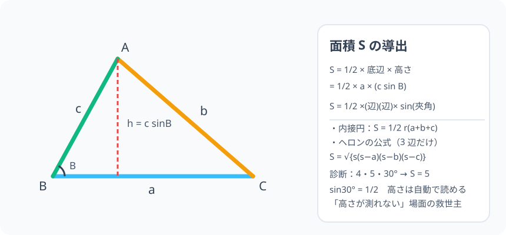

# 三角形の面積：高さが分からなくても、辺と角から測れる

> [!abstract] このノードの核心
> 「底辺 × 高さ ÷ 2」は高さが分かっているときだけ。だが**2 辺とその間の角（夾角）を三角比で処理すると、高さは自動的に手に入る**。$S = \dfrac{1}{2}bc\sin A$。さらに、内接円の半径 r を通した式 $S = \dfrac{1}{2}r(a+b+c)$ と、3 辺だけで求まるヘロンの公式も同じ S を別の言葉で言っているだけである。

> [!success] 合格ライン
> 「2 辺と夾角があれば面積が求まる」理由（高さ = 一方の辺 × 対角の sin）を説明でき、$\dfrac{1}{2}bc\sin A$・$\dfrac{1}{2}r(a+b+c)$・ヘロンの公式の使い分けができる。診断問題（4・5、30° → S = 5）の計算を式まで書ける。

## 記号の読み方

| 表記 | 読み方 | この教材での意味 |
|---|---|---|
| S | エス | 三角形の面積 |
| r | アール | 内接円の半径 |
| s | エス | 半周長（周の長さの半分） |
| ヘロンの公式 | ヘロンのこうしき | 3 辺だけで面積を出す公式 |

> [!tip] 記号の慣用
> S は面積、s は半周長（半周）。混乱しやすいが、小文字の s は周の半分の長さ。

## 前提ノードと入口判定

機械的な前提関係は、プロジェクト内スナップショット `../ontology/math_euler_complete_ontology.json` を参照し、転記している。外部原本は `G:/マイドライブ/Eleanor Arroway/documents/math_euler_complete_ontology.json`。`trigonometry_master_ontology.md` は人間向けの全体地図として使い、IDや依存関係が異なる場合はJSONを優先する。

| 区分 | ノード・知識 | この教材で必要な理由 | 入口での判定 |
|---|---|---|---|
| 必須ノード（JSON正本） | `HS1-TRIG-SINELAW-01` 正弦定理 | 辺と対角の対応・内接円の半径との関係 | $\frac{a}{\sin A} = \frac{b}{\sin B}$ が辺/角の比と素直に言える |
| 必須ノード（JSON正本） | `HS1-TRIG-COSINELAW-01` 余弦定理 | ヘロンの公式の導出の元（cos で残りの辺を出すこと） | 2 辺と夾角から残り辺を出せる |
| C類（日常・小学校層） | 高さ・底辺（`_refs/quick_references.md`） | 面積の基礎式（底辺 × 高さ ÷ 2） | 三角形の底辺と高さの関係が図で言える |
| 必須ノード（JSON正本・A類追加） | `JH-GEO-CIRCLE-INCIRCUM-01` 内接円と外接円 | S = 1/2 r (a+b+c) の幾何的な見方 | 内接円は 3 辺すべてに接する円だと理解している |

**入口判定の扱い:** JSON の診断問題「2 辺 4・5・夾角 30° の面積」を最初の目安にする。$\sin30° = \dfrac{1}{2}$ であることさえ分かれば計算できる。**この式の「なぜ、2 辺の積と角度の sin の半分なのか」を、垂線と三角比で説明できること**が合格ライン。

## 到達点

この教材を閉じたとき、次のことを自分の言葉で説明できる。

- 高さを sin A で表すと S = 1/2 bc sinA になる理由。
- 「どの辺を底辺にするか」で同じ値を出す 3 種類の式が同じ面積であること。
- 内接円を分割して S = 1/2 r (a+b+c) を得る理由。
- ヘロンの公式（3 辺から求める）を使える状態で、公式の導出の起点（余弦定理 → cos → sin）を説明できる。

## 入口：「高さは分かっていますか？」

小学校では「底辺 × 高さ ÷ 2」で出してきた。だが測量・設計の現場では、三角形の「高さ」は直接測れないことが多い（測れるのは辺の長さと角度）。たとえば、2 辺が 4・5、その間が 30° —— この三角形の高さは $5 \times \sin 30° = 2.5$ の形で求まる。

> [!example] 同じ例を最後まで使う
> 底辺が 4・他方が 5・挟む角 30° を一貫して使い、高さ・面積・内接円半径まで計算する。

## 核となる図

図のとおり、頂点 A から底辺 BC へ垂線を降ろすと、**高さ h は斜辺 c と角 B で決まる**。三角比がこの「隠れた高さ」を呼び出す。

| 図での要素 | 名前 | 役割 |
|---|---|---|
| 底辺 BC | a | 面積の底辺 |
| 垂線 AH | h | 高さ。c sinB で読む |
| 斜辺 AB | c | 高さを出すための辺 |
| 角 B | B | 上と組むため、含まれていてほしい角度 |

## まずやってみる

> [!question] 式を見る前の10秒
> 底辺 4・他辺 5・夾角 30°。この高さを、斜めの辺 5 を「斜辺」とする直角三角形で読み取る。$\sin30° = 1/2$ を使うと、高さはどうなるか。

答えを確認する

挟む角の向かいの頂点から底辺上に垂線を下ろすと、高さ h は $5\times\sin30° = 5\times\frac{1}{2} = 2.5$。面積は $4 \times 2.5 \div 2 = 5$——これが診断の答えである。

## 面積公式 S = 1/2 bc sinA

三角形 ABC において、頂点 A から底辺 BC に垂線を下ろし、その高さを h とする。BC を底辺とすると、$\triangle ABH$ の三角比より

$$
h = c\sin B
$$

（角 B は底辺の片方の角。直角三角形 ABH で、斜辺 = c、対辺 = h。）

よって

$$
S = \frac{1}{2}\cdot a\cdot h = \frac{1}{2}\cdot a\cdot c\sin B
$$

これを記号を入れ替えた言い方が

$$
\boxed{\ S = \frac{1}{2}bc\sin A = \frac{1}{2}ca\sin B = \frac{1}{2}ab\sin C\ }
$$

**一言で言えば「辺・辺・sin(挟む角)」の 2 分の 1**。3 つの書式があるのは、どの頂点を主役にしても同じ値だからである。

## 内接円の半径 r：S = 1/2 r (a+b+c)

三角形 ABC の内部に、3 辺と接する円（内接円）を置く。中心を I、半径を r とする。円の中心と 3 頂点を線分で結ぶと、三角形は 3 つの小さな三角形（IAB・IBC・ICA）に分かれる。それぞれの高さは r（半径）になり（弦から中心までの距離 = 垂線）、

$$
S = \triangle IAB + \triangle IBC + \triangle ICA
= \frac{1}{2}cr + \frac{1}{2}ar + \frac{1}{2}br
= \frac{1}{2}(a+b+c)\,r
$$

$$
\boxed{\ S = \frac{1}{2}r(a+b+c)\ }
$$

つまり s（半周長）を使うと $S = r\cdot s$。**内接円の半径を知りたいときの公式**。

## ヘロンの公式（3 辺だけあれば）

三角形を 3 辺だけで決められるので、それだけから面積も決まらないわけがない。実際には

$$
s=\frac{a+b+c}{2},\qquad
\boxed{\ S = \sqrt{s(s-a)(s-b)(s-c)}\ }
$$

が成立する（ヘロンの公式）。導出の全体は、余弦定理（このノードの前にある）で $\cos A$ を出し、$\sin$ へ変換して S = 1/2 bc sinA に入れる流れ——つまり**このノードの 2 つの道具（余弦定理・面積公式）の合成**である。導出全体は応用の問いとしておく。

> [!note] ヘロンから 3-4-5 を点検
> a=3, b=4, c=5 → s=(3+4+5)/2=6 → $S=\sqrt{6(6-3)(6-4)(6-5)}=\sqrt{36}=6$。3-4-5 の面積 6 と一致。

## 数値で点検する

### 診断問題：2 辺 4・5・夾角 30°

$$
S = \frac{1}{2}bc\sin A = \frac{1}{2}\cdot5\cdot4\cdot\sin30° = \frac{1}{2}\cdot20\cdot\frac{1}{2} = 5
$$

（どちらを b、どちらを c と呼んでも同じ値になる。）

### 内接円の半径の検証（3-4-5）

3-4-5 では S = 6、半周 s = 6。$S = rs$ より $r = 1$。内接円の半径 1 は 3-4-5 で良く知られた値である。

### 極端な場合

- A = 0°：$\sin 0° = 0$ より S = 0。三角形が線分に潰れる。
- A = 90°：$\sin 90° = 1$ より S = $\frac{1}{2}bc$。直角三角形の面積に戻る（3-4-5 なら 6）。

## 3行まとめ

1. 高さは三角比に隠れている——$h = c\sin B$ とすると、同じ値が $S = 1/2\,(辺)(辺)\sin(夾角)$ と整理できる。
2. 内接円の分割（3 つの小さな三角形）で $S = \frac{1}{2}r(a+b+c)$、s = 半周長 なら S = r·s。
3. ヘロンの公式 $S=\sqrt{s(s-a)(s-b)(s-c)}$ は 3 辺だけで求める形——余弦定理と面積公式の合成。

## 理解度サポート：どこまで分かっているか

### まず自己評価

- [ ] **0：未学習** — 面積公式の名前が出てこない
- [ ] **1：見れば分かる** — 図を見て式は再構成できる
- [ ] **2：自力で解ける** — 辺・角を代入して面積を計算できる
- [ ] **3：説明できる** — 高さの sin 変換・r 分割・ヘロン導出の起点を説明できる

### 技能ごとの確認問題

| check_id | 確認する技能 | 問い | 答えが曖昧なときに戻る場所 |
|---|---|---|---|
| P0 | JSON指定の入口診断 | 2 辺が 4 と 5 で挟む角が 30° の三角形の面積は？（答: 5） | 「数値で点検する」 |
| C1 | 高さ変換 | 底辺 a・辺 c・角 B から、h = c sinB と高さを表現する。 | 「面積公式」 |
| C2 | 3 表現 | S = 1/2 bc sinA と S = 1/2 ca sinB が同じ値になる仕組みを説明する。 | 「面積公式」 |
| C3 | 内接円 | 3-4-5 の内接円の半径を求める。（答: 1） | 「内接円の半径」 |
| C4 | ヘロン | a=5, b=12, c=13 の面積をヘロンの公式で求める。（答: 30） | 「ヘロンの公式」 |
| C5 | 使い分け | 「2 辺と夾角」と「3 辺だけ」が与えられたとき、それぞれ使うべき公式の順番を説明する。 | 「3行まとめ」 |

解答と判定基準を開く

- **P0の答え:** $S = 1/2 \cdot 4 \cdot 5 \cdot \sin30° = 1/2 \cdot 20 \cdot 1/2 = 5$。
- **C1の答え:** 直角三角形 ABH の直角対応で、高さ h = c・sinB と読む（対辺/斜辺）。
- **C2の答え:** 底辺を a、高さを h とすると S = 1/2 a c sinB。角と辺の対応を書き換えると同じ値。どちらも本質的に同じ三角形だから同じ S になる。
- **C3の答え:** S = 6, s = 6, r = 6/6 = 1。
- **C4の答え:** s = 15, $\sqrt{15\cdot10\cdot3\cdot2} = \sqrt{900} = 30$。
- **C5の答え:** 2 辺と夾角 → S = 1/2 bc sinA。3 辺だけ → ヘロンの公式。内接円半径が必要なら S = rs の変形。

**判定の目安:**

- P0とC1〜C5を正答かつ理由つきで → 次のノードへ
- C1を誤る → 高さの sin 変換（三角形の見方）を復習
- C3を誤る → 半周長 s の計算と 3 分割の図へ
- C4を誤る → s の式（全体周の半分）を見直す

## よくある取り違え

- 面積 S と半周 s を混同 → **S は面積、s は周の半分**。
- 1/2 r(a+b+c) の r を外接円の半径と勘違い → **r は内接円の半径。外接円の半径は R（正弦定理に出てくる）**。
- 公式では使う角が「挟まない角」になる → **sin の中の角は、2 辺の間に挟まれる（夾角）**。
- ヘロン公式の中の括弧 s−a を 2 乗と間違える → **s−a・s−b・s−c の積を √ の下に並べる**。
- ∠A の sin が 30° のとき分数でない → **角度に依存する。sin30° = 1/2 で、sin は角度ごとに値を持つ関数**。

## 自力確認（teach-back）

教材を閉じて、次を声に出して答える。

1. 底辺 a・高さ h と三角比から「S = 1/2 bc sinA」という形が生まれる流れを話す。
2. 内接円の半径 r の分割（3 つに分ける）から S = 1/2 r(a+b+c) を導く。
3. 3-4-5 の面積 6 を 3 通りの式（1/2 ab sinC、r・s、ヘロン）でそれぞれ計算する。
4. ヘロンの公式の導出の起点が「余弦定理で cos を出して、sin に変換」であることを説明する。

## 次のノードへの橋

面積は、後の 2 つの場所で主人公になる。

- **三角関数のグラフ（`HS2-TRIG-GRAPH-01`）**：このノードはオントロジー上、グラフの前提（前置き）として居る。「sin の値が角度で変わる最初の実地応用」を確認した。
- **加法定理（`HS2-TRIG-ADDITION-01`）**：cos(α±β) の面積 2 通り計測（余弦定理ノードの続き）でも三角形の性質が出てくる。
- **公式の貯蔵庫**：S = 1/2 bc sinA は、ベクトルの外積や物理のエネルギー計算にまで現れる基礎式である。

## インタラクティブ化の候補（レビュー後に判定）

- **有効候補: 角度のスライダー（面積の変化）** — 夾角を動かすと S が変わる（最大は 90°）。辺を固定しても角度が決め手、という体感。
- **有効候補: 底辺をスライダーでスライド** — 高さ h の視覚化と合わせて 30°→90° の推移を見る。
- **静的なままで十分:** 図・式の導出は静止で十分。スライダー（S の変化）だけは追加の説明効果がある。
- 動かすことそれ自体を合格条件にはしない。
