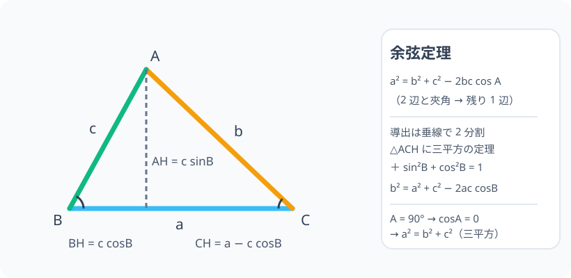

# 余弦定理：三平方の定理の「直角三角形離れ」

> [!abstract] このノードの核心
> 三平方の定理は直角三角形だけのものだった。**斜めの三角形では、残りの 1 辺が「2 辺の 2 乗和 + 修正項」で決まる**。その修正項が $-2bc\cos A$ である。$\cos A = 0$（A = 90°）のとき修正項はゼロになり、三平方の定理に完全に戻る。

> [!success] 合格ライン
> 余弦定理を「2 辺とその間の角から残りの 1 辺」を出す式として使い分けられ、A = 90° のとき三平方の定理に戻る理由を説明できる。診断問題（b=3, c=4, A=90° → a²=25）は即答できる。

## 記号の読み方

| 表記 | 読み方 | この教材での意味 |
|---|---|---|
| A・B・C | エー・ビー・シー | 三角形の 3 つの頂点、およびそれらの角 |
| a・b・c | エー・ビー・シー | 頂点の対辺。a は A の向かいの辺 |
| cos A | コサイン・エー | 角 A の三角比 |
| 夾角 | きょうかく | 2 辺に挟まれた角 |
| 2bc cos A | ニービーシー コサイン・エー | 余弦定理の修正項 |

> [!tip] 読むときの注意
> 辺 a と角 A の対応（**対辺**）が肝心。a は A の向かい側、b は B の向かい側、c は C の向かい側——この対応のダルを上で確認する。

## 前提ノードと入口判定

機械的な前提関係は、プロジェクト内スナップショット `../ontology/math_euler_complete_ontology.json` を参照し、転記している。外部原本は `G:/マイドライブ/Eleanor Arroway/documents/math_euler_complete_ontology.json`。`trigonometry_master_ontology.md` は人間向けの全体地図として使い、IDや依存関係が異なる場合はJSONを優先する。

| 区分 | ノード・知識 | この教材で必要な理由 | 入口での判定 |
|---|---|---|---|
| 必須ノード（JSON正本） | `HS1-TRIG-IDENTITY-01` 三角比の基本相互関係 | 導出の道具。sin²+cos²=1 が確認点 | sin²θ + cos²θ = 1 を三平方から導ける |
| 必須ノード（JSON正本） | `JH-GEO-PYTHAGORAS-01` 三平方の定理 | 直角三角形での 3 辺定理を、一般三角形拡張として使う | a²+b²=c² を直角三角形の辺の関係として言える |
| 必須ノード（JSON正本） | `HS1-TRIG-ANGLECONV-01` 角の変換公式（余角・補角） | 鈍角の三角形で補角の cos の符号が変わるため、成立範囲の確認 | cos(180° − θ) = −cos θ を読み方と性質で言える |
| 必須ノード（JSON正本・A類追加） | `JH-GEO-TRI-BASIC-01` 三角形の基本 | 導出で「垂線で 2 つの直角三角形に分ける」 | 任意の三角形から頂点 A に垂線を下ろせる |

**入口判定の扱い:** JSON の診断問題（b=3, c=4, A=90° のとき a²=25）を最初の目安にする。これは公式さえあれば即答できる。**この問題が「なぜ三平方の定理と辻褄が合うのか」を、余弦定理の修正項から説明できる**ことが本ノードの合格ライン。

## 到達点

この教材を閉じたとき、次のことを自分の言葉で説明できる。

- 余弦定理が「2 辺と挟まれた角で残りの辺を求める」式であること。
- 頂点 A から底辺へ垂線を下ろし、2 つの直角三角形に分けて式を導出できる。
- ∠A = 90° のとき修正項がゼロになり、三平方の定理になること。
- 辺の長さの関係を扱う際、余弦定理と三角比（sin・cos）の使い分けができる。

## 入口：直角三角形は 90° の幸運に頼りすぎだった

「3 辺だけ分かっている」とき、ごく普通の問題は「残りの辺や角を求める」。三平方の定理は直角三角形だけの道具なので、教科書はいつも「まず直角を見つける」。しかし三角形は（それを言うと普通の三角形が）直角とは限らない。

$b = 3$、$c = 4$、$A = 90°$ なら a² = 3² + 4² = 25 の今までの話。**A が 75° に変わっても残り 1 辺は決まるはず**だ。

この「斜めの三角形でも 1 辺が決まる」ための公式が、このノードから説明される。

## 核となる図

図のように頂点 A から底辺 BC（= a）へ垂線を下ろす。垂線の足 H により、三角形は ABH と ACH の 2 つの直角三角形に分かれる。**この分割が余弦定理の導出の鍵**である。

| 図での要素 | 名前 | 役割 |
|---|---|---|
| △ABH | 左の直角三角形 | ∠B の sin・cos を読み取る先 |
| △ACH | 右の直角三角形 | 斜辺 b に対して三平方の定理を使う |
| 垂線 AH | 高さ | 両方の三角形が共有する長さ |
| B の補角 | ∠B | 使うときの符号の確認 |

## まずやってみる

> [!question] 式を見る前の10秒
> b=3、c=4、A=60° のとき、a² は 9+16=25 のままか、それとも変わるか。鋭角の 60° の三角形と直角三角形を比較すると、残りの一辺はどうなると予想するか。

答えを確認する

変わる。三角形に角度を絞り込むと、辺の相対的な向きが変わり、a² = 25 − 12 = 13 のようになる（計算は下。）「直角からずれるほど修正項が効く」ことが余弦定理の感覚である。

## 余弦定理

三角形 ABC について、角 A・辺 a、角 B・辺 b、角 C・辺 c を対応させると

$$
\boxed{\ a^2 = b^2 + c^2 - 2bc\cos A\ }
$$

そして同様に（それぞれの角の対応で 3 通り）

$$
b^2 = c^2 + a^2 - 2ca\cos B,\qquad
c^2 = a^2 + b^2 - 2ab\cos C
$$

**a² の式が出ているとき、その cos は角 A とすぐに見え、角 A は a の対角である。**「2 辺とその間の角」が分かれば、残りの辺が分かる。

## 導出：垂線で 2 つの直角三角形を作る

### ステップ 1：垂線と足

図の $\triangle ABC$ の頂点 A から底辺 BC に垂線を下ろし、足を H とする。三角形は $\triangle ABH$ と $\triangle ACH$ に分割される。

- $\triangle ABH$：斜辺 c。$\angle B$ は鋭角とし、$\cos B \cdot c = BH$、$\sin B \cdot c = AH$。

### ステップ 2：それぞれ直角三角形に三平方

$\triangle ABH$ で $BH = c\cos B$、$AH = c\sin B$。

$\triangle ACH$ について、斜辺 AC = b、底辺 CH = a − BH = a − c cosB、高さ AH = c sinB。三平方の定理より

$$
b^2 = (c\sin B)^2 + (a - c\cos B)^2
$$

### ステップ 3：展開してまとめる

$$
b^2 = c^2\sin^2 B + a^2 - 2ac\cos B + c^2\cos^2 B
$$

$\sin^2 B + \cos^2 B = 1$（前ノードの第 1 式）を使って一括

$$
b^2 = a^2 + c^2 (\sin^2B + \cos^2B) - 2ac\cos B = a^2 + c^2 - 2ac\cos B
$$

これが $b^2 = c^2 + a^2 - 2ca\cos B$。**辺 b の対角が cos の側に来る**。同様に書き直すと、$a^2 = b^2 + c^2 - 2bc\cos A$ である（A の式は、代わりに C からやるか、B・C を書いて回す）。

### ステップ 4：鈍角でも成立する

角 A が鈍角の場合は、垂線の足 H が BC の延長上に落ちる。そうなると CH = a + c·|cos B| となるが、補角の公式 $\cos(180° - \theta) = -\cos\theta$（前提ノード `HS1-TRIG-ANGLECONV-01`）により、符号が負であることが正しく表現される。**結果、すべての三角形で同じ式が使える。**

## 数値で点検する

### 診断問題：b=3, c=4, A=90°

$$
a^2 = 3^2 + 4^2 - 2\cdot3\cdot4\cdot\cos90° = 9 + 16 - 0 = 25
$$

$\cos 90° = 0$ より $\cos$ の項が消え、**三平方の定理に戻る**。$a = 5$（3-4-5）。

### A = 60° のとき（予想を検証）

$$
a^2 = 9 + 16 - 2\cdot3\cdot4\cdot\frac{1}{2} = 25 - 12 = 13,\qquad a = \sqrt{13}
$$

「角度を絞ると、残りは三平方の予想より短くなった」——予想の通り、修正項が効いている。

### 極端な場合

- A = 0°：三角形が潰れ、a = |b − c|。$\cos 0° = 1$ で $a^2 = b^2 + c^2 - 2bc = (b-c)^2$ ✓
- A = 180°：a = b + c。$\cos 180° = -1$ で $a^2 = b^2 + c^2 + 2bc = (b+c)^2$ ✓
どちらも三角形が線分に潰れた場合であり、式はその直感と一致する。

## 3行まとめ

1. 余弦定理 $a^2 = b^2 + c^2 - 2bc\cos A$ は「2 辺とその間の角」から最後の 1 辺を出す。
2. 証明は垂線で 2 つの直角三角形に分割し、三平方の定理と sin²+cos²=1 を使う。
3. A = 90° で $\cos$ 項がゼロ → 三平方の定理。三角形が潰れる限界（0°・180°）でも式は正しく振る舞う。

## 理解度サポート：どこまで分かっているか

### まず自己評価

- [ ] **0：未学習** — 余弦定理の形を知らない
- [ ] **1：見れば分かる** — 図の導出を追える
- [ ] **2：自力で解ける** — 辺と角を代入して計算できる
- [ ] **3：説明できる** — 垂線分割から三平方を経て導出し、直角・限界まで辻褄を言える

### 技能ごとの確認問題

| check_id | 確認する技能 | 問い | 答えが曖昧なときに戻る場所 |
|---|---|---|---|
| P0 | JSON指定の入口診断 | $b=3,\ c=4,\ A=90°$ のとき余弦定理から $a^2$ は？（答: 25） | 「数値で点検する」 |
| C1 | 対応の言葉 | $a^2 = b^2 + c^2 - 2bc\cos A$ で、cos の角が A である理由を、対応の言葉で説明する。 | 「余弦定理」 |
| C2 | 導出 | 垂線によって 2 つに分ける手順を図と言葉で説明する。 | 「導出」ステップ 1〜2 |
| C3 | 計算 | $b=4,\ c=7,\ A=45°$ の $a^2$ を求めよ。 | 「数値で点検する」 |
| C4 | 直角接続 | $\cos 90° = 0$ であることと、この定理の「三平方に戻る」性質のつながりを説明する。 | 「数値で点検する」 |
| C5 | 消失チェック | 三角形が潰れたとき（A=0°、180°）、式の形がどうなるか。 | 「極端な場合」 |

解答と判定基準を開く

- **P0の答え:** $9 + 16 - 0 = 25$。$\cos 90° = 0$ の項が消えるから。
- **C1の答え:** a は A の対辺。余弦定理は「2 辺で挟まれた角」の対辺を求める式なので、cos にくるのは角 A。
- **C2の答え:** 頂点 A から BC へ垂線を下ろし、△ABH と △ACH を作る。△ABH で AH・BH を三角比で表す。
- **C3の答え:** $16 + 49 - 2\cdot4\cdot7\cdot\frac{\sqrt{2}}{2} = 65 - 28\sqrt{2} \approx 25.4$。
- **C4の答え:** A = 90° のとき修正項が 0 なので $a^2 = b^2 + c^2$。三平方の定理そのもの。
- **C5の答え:** A = 0° で $a^2 = (b-c)^2$、A = 180° で $a^2 = (b+c)^2$。どちらも三角形が線分に潰れたときの直論と一致。

**判定の目安:**

- P0とC1〜C5を正答かつ理由つきで → 次のノードへ
- C1を誤る → 対応の言葉（a は A の対辺）を復習
- C2を誤る → 導出ステップの図に戻って書き直す
- C4を誤る → 90° の cos の値と三平方の関係

## よくある取り違え

- 余弦定理の cos が対角ではなく「隣の角」に入る → **cos は a の対角 A。辺 a を見ずに試さない**。
- 2bc を 2 辺の掛け算と間違える → **2bc は「2 × b × c」。2 つの辺の積に 2 を掛けたもの**。
- 左下の角（B）の cos で計算する → **使い分け 3 式（a², b², c²）のどれかは、求めたい辺の対角を cos に入れる**。
- 三平方だと常に正しい脚と混同する → **三平方は余弦定理の cos=0 の呼び出しだけ。一般角では修正項が必須**。
- cos の符号は鋭角で必ず正、と考える → **鈍角が絡む三角形では、cos は負になり、項が足し算に変わる**。

## 自力確認（teach-back）

教材を閉じて、次を声に出して答える。

1. 三角形の 3 辺 a・b・c と 3 角 A・B・C の対応を、図を描かずに言える。
2. 余弦定理の導出を、垂線 → 2 つの直角三角形 → 三平方 → sin²+cos²=1 の順に話す。
3. ∠A = 90° のとき、なぜ三平方の定理になるのか、cos 90° = 0 から説明する。
4. 「2 辺 3・4 と間の角 60°」の残りの辺を求め、三平方の結果（25）との差の意味を述べる。

## 次のノードへの橋

余弦定理は 3 つの広がりを持つ。

- **三角形の面積（`HS1-TRIG-AREA-01`）**：面積は S = $\frac{1}{2}bc\sin A$——こちらは「cos ではなく sin」の使い方。混同しないよう、両方をならべる意味がある。
- **加法定理（`HS2-TRIG-ADDITION-01`）**：cos(α±β) の式は、余弦定理の流れ（単位円 2 点の距離）からダイレクトに再現される。
- **sin 側の道具として**：正弦定理（$\frac{a}{\sin A} = 2R$）が隣接。三角形の計量（残り 2 式）はそれで完成する。

## インタラクティブ化の候補（レビュー後に判定）

- **有効候補: 角 A のスライダー（コサイン項の目視）** — A を 90° からずらすと、三平方のまま固まっていた $a^2$ が動き出す。修正項 cos A の働きの実感。
- **有効候補: 三角形の 3 点ドラッグ（ドラッグで辺・角が変わる）** — 「cos の項が右辺にシフト」が視覚的に早い。けれど三角形のジオメトリが複雑だと初期構築が高い。静的なままで十分。まずは角スライダーを 1 つ。
- **静的なままで十分:** 導出の図・式は十分なので、操作は 1 つだけで。
- 動かすことそれ自体を合格条件にはしない。
