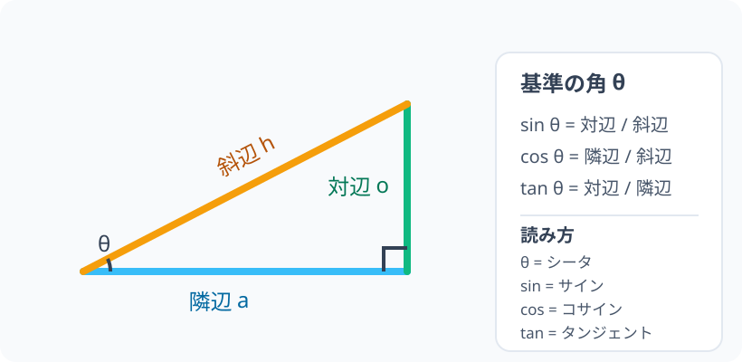

# 鋭角三角比：sin・cos・tan（サイン・コサイン・タンジェント）は何を測るのか

> [!abstract] このノードの核心
> 三角比は、三角形の大きさではなく、角 `θ` が決める形を「辺の比」で記録する言葉である。

> [!success] 合格ライン
> 図を見て3つの比を言え、相似で比が変わらない理由を説明し、`tan θ = sin θ / cos θ` を途中式つきで導ける。

## 記号の読み方

| 表記 | 読み方 | この教材での意味 |
|---|---|---|
| `θ` | シータ | 基準にする角 |
| `sin θ` | サイン・シータ | 対辺 / 斜辺 |
| `cos θ` | コサイン・シータ | 隣辺 / 斜辺 |
| `tan θ` | タンジェント・シータ | 対辺 / 隣辺 |

> [!tip] 音読するとき
> `θ` は「シータ」、`sin θ` は「サイン・シータ」、`cos θ` は「コサイン・シータ」、`tan θ` は「タンジェント・シータ」と読む。

## 前提ノードと入口判定

機械的な前提関係は、プロジェクト内スナップショット `../ontology/math_euler_complete_ontology.json` を参照する。このノードの `prerequisites` に記載された内容を転記している。外部原本は `G:/マイドライブ/Eleanor Arroway/documents/math_euler_complete_ontology.json`。`trigonometry_master_ontology.md` は人間向けの全体地図として使い、IDや依存関係が異なる場合はJSONを優先する。

| 区分 | ノード・知識 | この教材で必要な理由 | 入口での判定 |
|---|---|---|---|
| 必須ノード（JSON正本） | `JH-GEO-SIMILAR-01` 相似と比率の普遍性 | 拡大・縮小しても辺の比が変わらない理由を説明するため | 3-4-5を6-8-10に拡大しても比が変わらない理由を、相似と同じ倍率で説明できる |
| 必須ノード（JSON正本） | `JH-FUNC-LINEAR-01` 一次関数と直線の傾き | `tan` を縦 / 横の比として読むため | 傾きを「縦の変化量 / 横の変化量」と説明できる |
| 必須ノード（JSON正本・A類追加） | `JH-GEO-TRI-BASIC-01` 三角形の基本 | 対辺・隣辺・斜辺を正しく判定するため | 三角形の底辺・高さ・辺の名称を指せる |
| 基礎知識（軽い確認） | 分数の割り算 | `tan θ = sin θ / cos θ` の導出を追うため | C3で逆数を掛ける操作を説明できる |

**入口判定の扱い:** JSONの診断問題「45°の直角二等辺三角形で `sin45°`・`cos45°`・`tan45°` の値は？」を最初の目安にする。答えだけでなく、三平方・相似・縦横比のどれを使ったか説明できるかを見る。前提ノードの判定に失敗したら、三角比を暗記させず、該当ノードを先に学ぶ。入口判定は合否だけでなく、戻る場所を決めるために使う。

## 到達点

この教材を閉じたとき、次のことを自分の言葉で説明できる。

- 角 `θ` に対して、どの辺が「対辺・隣辺・斜辺」なのかを決められる。
- `sin θ`、`cos θ`、`tan θ` を3辺の比として説明できる。
- 三角形の大きさを変えても、同じ角の三角比が変わらない理由を、相似で説明できる。
- `tan θ = sin θ / cos θ` を定義から導ける。

## 前提：角度は三角形の形を決める

ここでは `0° < θ < 90°` の鋭角を扱う。直角三角形を、角 `θ` を固定したまま拡大・縮小しても、形は同じである。この「形が同じ」を数学では**相似**という。

## 入口：長さそのものではなく、形を測りたい

同じ角 `θ` の三角形を大きくすると、対辺・隣辺・斜辺の**長さそのもの**はすべて変わる。これでは角度の特徴を表せない。

例えば、3-4-5の三角形を2倍すると6-8-10になる。しかし、

$$
\frac{3}{5}=\frac{6}{10},\qquad
\frac{4}{5}=\frac{8}{10},\qquad
\frac{3}{4}=\frac{6}{8}
$$

という**比**は変わらない。そこで、サイズに左右されず形だけを記録するために、辺の比へ名前を付ける。

> [!example] 同じ例を最後まで使う
> ここで登場した3-4-5の三角形を、定義・導出・数値点検のすべてで使う。例を途中で変えないことで、「長さは変わっても比は変わらない」ことを追いやすくする。

## 核となる図

図の角 `θ` を基準にする。

| 図での位置 | 名前 | 三角比での役割 |
|---|---|---|
| `θ` の向かい側 `o` | **対辺** | `sin` と `tan` の分子 |
| `θ` に接し、斜辺ではない `a` | **隣辺** | `cos` の分子、`tan` の分母 |
| 直角の向かい側 `h` | **斜辺** | `sin` と `cos` の分母 |

同じ辺でも、基準にする角を変えると「対辺」と「隣辺」は入れ替わる。斜辺だけは直角の向かい側なので変わらない。

## まずやってみる

> [!question] 式を見る前の10秒
> 図を見て、下の式の分子・分母を答えを見る前に予想する。

> - `sin θ =` 対辺 / 隣辺 / 斜辺
> - `cos θ =` 対辺 / 隣辺 / 斜辺
> - `tan θ =` 対辺 / 隣辺 / 斜辺

答えを確認する

`sin θ = 対辺 / 斜辺`、`cos θ = 隣辺 / 斜辺`、`tan θ = 対辺 / 隣辺`。

## 三角比の定義

直角三角形の斜辺の長さを `h`、対辺を `o`、隣辺を `a` と書くと、次が定義である。

$$
\sin\theta=\frac{o}{h},\qquad
\cos\theta=\frac{a}{h},\qquad
\tan\theta=\frac{o}{a}
$$

ここで大切なのは、`sin θ` などが**辺の長さそのものではなく、辺どうしの比**だという点である。

> [!tip] 3つの比の短い記憶フック
> `sin = 対 / 斜`、`cos = 隣 / 斜`、`tan = 対 / 隣`。まず基準の角 `θ` を決め、それから「対・隣・斜」を判定する。

## なぜ角度だけで決まるのか

同じ角 `θ` をもつ2つの直角三角形を考える。

1. どちらも直角を1つもち、さらに角 `θ` を1つ共有する。
2. 三角形の内角の和は `180°` なので、残りの角も一致する。
3. よって2つの三角形は**相似**で、対応する辺の倍率はすべて同じになる。
4. したがって、例えば対辺と斜辺を同じ倍率で拡大しても、比 `対辺/斜辺` は変わらない。

つまり、三角形の大きさではなく**角 `θ` が決める形**によって、3つの比が決まる。

## `tan θ = sin θ / cos θ` の導出

これは新しい定義ではなく、上の3つの定義から出る関係である。

$$
\begin{aligned}
\frac{\sin\theta}{\cos\theta}
&=\frac{o/h}{a/h} &&\text{（sin と cos の定義を代入）}\\
&=\frac{o}{h}\times\frac{h}{a} &&\text{（分数の割り算は逆数を掛ける）}\\
&=\frac{o}{a} &&\text{（共通の }h\text{ が消える）}\\
&=\tan\theta &&\text{（tan の定義）}
\end{aligned}
$$

したがって、斜辺 `h` を使わずに

$$
\boxed{\tan\theta=\frac{\sin\theta}{\cos\theta}}
$$

が得られる。`0° < θ < 90°` では `cos θ > 0` なので、この割り算ができる。

> [!note] 定義と導出を分ける
> `sin`、`cos`、`tan` の3つの比は定義である。一方、`tan θ = sin θ / cos θ` は、その定義を分数の計算に入れて得た**導出結果**である。

## 数値で点検する：3-4-5の直角三角形

対辺 `o=3`、隣辺 `a=4`、斜辺 `h=5` の三角形を、対辺3の側にある角を `θ` として見る。

$$
\sin\theta=\frac35,\qquad
\cos\theta=\frac45,\qquad
\tan\theta=\frac34
$$

導出した関係も確認できる。

$$
\frac{\sin\theta}{\cos\theta}
=\frac{3/5}{4/5}
=\frac34
=\tan\theta
$$

三角形を2倍、3倍しても、`3/5`、`4/5`、`3/4` という比は変わらない。変わるのは辺の長さであり、角度の形ではない。

> [!summary] 3行まとめ
> 1. 三角比は、角 `θ` を基準にした辺の比である。
> 2. 相似な拡大では3辺が同じ倍率で変わるため、比は変わらない。
> 3. `tan θ = sin θ / cos θ` は、3つの定義から導ける。

## 理解度サポート：どこまで分かっているか

### まず自己評価

自己評価は手がかりであって、判定そのものではない。答えと理由を自力で言えるかを後の確認で確かめる。

- [ ] **0：未学習** — 記号や辺の名前がまだ分からない
- [ ] **1：見れば分かる** — 解説や図を見れば答えられる
- [ ] **2：自力で解ける** — 図と式を見ずに答えられる
- [ ] **3：説明できる** — なぜそうなるかを他の人に説明できる

### 技能ごとの確認問題

答えだけでなく、「なぜそうなるか」を一文で説明する。各問題の結果から、復習する場所を特定できる。

| check_id | 確認する技能 | 問い | 答えが曖昧なときに戻る場所 |
|---|---|---|---|
| P0 | JSON指定の入口診断 | 45°の直角二等辺三角形で `sin45°`・`cos45°`・`tan45°` の値は？その理由は？ | `JH-GEO-SIMILAR-01`／`JH-FUNC-LINEAR-01` |
| C1 | 辺の名前を基準角から決める | `θ` の向かい側が `o`、接する辺が `a`、直角の向かい側が `h` のとき、`sin θ`・`cos θ`・`tan θ` を書く。 | 「核となる図」／「三角比の定義」 |
| C2 | 大きさと比を区別する | 3-4-5の三角形を2倍した6-8-10で、長さは変わるのに三角比が変わらない理由を説明する。 | 「入口」／「なぜ角度だけで決まるのか」 |
| C3 | 定義から式を導出する | `sin θ / cos θ = (o/h)/(a/h)` の次の2行を書き、`tan θ` に到達する。 | 「tan θ = sin θ / cos θ の導出」 |
| C4 | 条件と例外を点検する | なぜこのノードでは `0° < θ < 90°` としたのか。`cos θ = 0` のとき、`tan θ = sin θ / cos θ` はどうなるか。 | 「前提」／「導出」の最後の一文 |

解答と判定基準を開く

- **C1の答え:** `sin θ = o/h`、`cos θ = a/h`、`tan θ = o/a`。3つとも正しく、対辺・隣辺・斜辺の理由まで言えれば理解。
- **P0の答え:** $\sin45^\circ=\cos45^\circ=\sqrt{2}/2$、$\tan45^\circ=1$。45°の2つの鋭角が等しいため対辺と隣辺が等しく、$\tan45^\circ=\text{対辺}/\text{隣辺}=1$。値だけを覚えていて理由を説明できなければ、前提ノードを復習する。
- **C2の答え:** 拡大では対応する3辺が同じ倍率で変わるため、分子と分母の倍率が消えて比が変わらない。比を計算できても相似の理由が言えなければ部分理解。
- **C3の答え:**

  $$
  \frac{o/h}{a/h}=\frac{o}{h}\times\frac{h}{a}=\frac{o}{a}=\tan\theta
  $$

  途中の「逆数を掛ける」「`h` が消える」「tanの定義」を説明できるかを見る。
- **C4の答え:** 鋭角では `cos θ > 0` なので割り算ができる。`cos θ = 0` では0で割るため、`tan θ = sin θ / cos θ` は定義できない。

**判定の目安:**

- 正答と理由が4問とも言える → 次のノードへ
- 正答はできるが理由が曖昧 → 該当する本文を読み直して、同じ問題を再回答
- C1またはC3を誤る → 定義・導出を要復習。次へ急がない
- C4だけを誤る → 条件・例外を復習してから進む

## よくある取り違え

- `sin` はいつも縦の辺、`cos` はいつも横の辺 → **基準の角 `θ` を決めてから、対辺・隣辺を判定する**。
- `tan θ = sin θ + cos θ` → **比の割り算から `tan θ = sin θ / cos θ` になる**。
- 大きい三角形ほど三角比も大きい → **三角比は長さではなく比なので、相似な拡大では変わらない**。
- 斜辺は直角に接する辺 → **斜辺は直角の向かい側の辺**。

## 自力確認（teach-back）

教材を閉じて、次を声に出して答える。

1. 「`θ` を基準にしたとき、対辺・隣辺・斜辺はどう決めるか」を説明する。
2. 「三角形を拡大しても `sin θ` が変わらない理由」を相似と比を使って説明する。
3. `sin θ=o/h`、`cos θ=a/h` から `tan θ=o/a` が出る計算を、途中の式を省略せずに書く。
4. `sin θ=3/5`、`cos θ=4/5` のとき、`tan θ` を求め、なぜその答えになるかを説明する。

## 次のノードへの橋

このノードでは、三角比を直角三角形の比として定義した。次は斜辺を半径1に固定した**単位円**へ移り、`cos θ` と `sin θ` を点の座標として扱う。すると、角度が鋭角を越えたときの符号や、`sin²θ+cos²θ=1` の理由を一つの図で追える。

## インタラクティブ化の候補（レビュー後に判定）

- 数値を動かす前に、静的な1枚図と相似の説明で定義は完結する。
- 後段で対話化するなら、三角形を拡大・縮小しても3つの比が不変であることを確認する操作が候補。
- `sin`・`cos`・`tan` の辺を動かすだけの表示は、理解上の追加効果をレビューしてから採用する。
