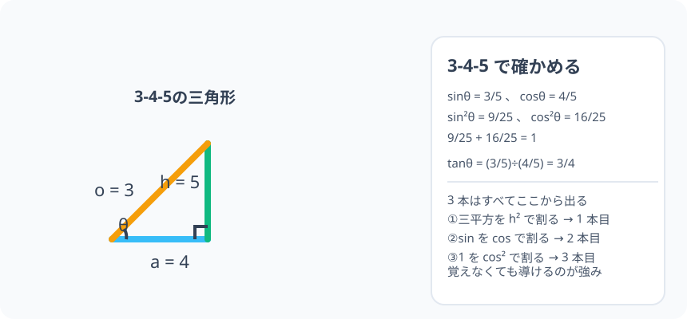

# 基本相互関係：sin・cos・tan は互いに足し算と引き算で結ばれている

> [!abstract] このノードの核心
> 三角比の 3 つは、実は独立な 3 つのものではない。**三平方の定理を通して 1 本の鎖で結ばれている**。$\sin^2\theta + \cos^2\theta = 1$ が源であり、両辺を $\cos^2\theta$ で割ると $1+\tan^2\theta = \dfrac{1}{\cos^2\theta}$ が出てくる。1 つが分かれば、残り 2 つも分かる。

> [!success] 合格ライン
> 3 つの基本相互関係を述べ、第 1 の式を三平方の定理から導ける。$\cos\theta = \dfrac{3}{5}$ のとき、$\sin^2\theta = \dfrac{16}{25}$ を計算でき、「斜辺 5 の 3-4-5 三角形の sin・cos・tan が全部 4 つの分数で出る」ことを説明できる。

## 記号の読み方

| 表記 | 読み方 | この教材での意味 |
|---|---|---|
| $\sin^2\theta$ | サイン二乗・シータ | $\sin\theta$ の 2 乗。$\sin(\theta^2)$ のことではない |
| $\cos^2\theta$ | コサイン二乗・シータ | $\cos\theta$ の 2 乗 |
| 恒等式 | こうとうしき | θ がどんな値でも成立する等式 |
| 相互関係 | そうごかんけい | 3 つの比の関係を示す等式の列 |

> [!tip] 音読するとき
> $\sin^2\theta$ は「サイン・シータ・ノ・ニジョウ」ではなく「サイン・ニジョウ・シータ」。**「sin を先に計算してから 2 乗」が約束**である。

## 前提ノードと入口判定

機械的な前提関係は、プロジェクト内スナップショット `../ontology/math_euler_complete_ontology.json` を参照し、転記している。外部原本は `G:/マイドライブ/Eleanor Arroway/documents/math_euler_complete_ontology.json`。`trigonometry_master_ontology.md` は人間向けの全体地図として使い、IDや依存関係が異なる場合はJSONを優先する。

| 区分 | ノード・知識 | この教材で必要な理由 | 入口での判定 |
|---|---|---|---|
| 必須ノード（JSON正本） | `HS1-TRIG-DEF-01` 鋭角の三角比 | この上の式の定義をそのまま使うため | 3-4-5 の三角形で sin・cos・tan を書ける |
| 必須ノード（JSON正本） | `JH-GEO-PYTHAGORAS-01` 三平方の定理 | 第 1 の関係の元。直角三角形の 3 辺の 2 乗和 | $a^2+b^2=c^2$ が直角を挟む辺と斜辺の関係だと説明できる |
| 基礎知識（ノード外） | 分数の割り算 | $1+\tan^2\theta=\dfrac{1}{\cos^2\theta}$ の導出で逆数を使う | 割り算を逆数を掛けることと理解している |
| 基礎知識（ノード外） | 相似と比率 | 関連は `JH-GEO-SIMILAR-01` を踏まえる | 角が決まれば辺の比が決まる説を説明できる |

**入口判定の扱い:** JSON の診断問題「$\cos\theta = 3/5$ のとき $\sin^2\theta$ は？」を最初の目安にする。初回に計算できなくてよいが、**学び終えた後に「なぜ 16/25 か」を三平方で説明できない場合は要復習**。

## 到達点

この教材を閉じたとき、次のことを自分の言葉で説明できる。

- $\sin^2\theta + \cos^2\theta = 1$ を三平方の定理から導出できる。
- この式を $\cos^2\theta$ で割って $1 + \tan^2\theta = \dfrac{1}{\cos^2\theta}$ を得る操作を説明できる。
- 1 つの比の値から残りの比を計算でき、値の符号選択（象限）の意味を言える。
- 3-4-5 の三角形で、3 つの関係が正しく成立することを数値で確認できる。

## 入口：三角比は「1 つ知れば全部知れる」？

前ノードまで、三角比は 3 つの測り方（縦/斜辺・横/斜辺・縦/横）だった。3 つを別々に覚える必要があるだろうか。実際には直角三角形の 3 辺は 1 つの関係（三平方の定理）で結ばれている。その 1 本を三角比の言葉に書き直すと、上の 3 つの間の「引き算の式」が現れる。

> [!example] 同じ例を最後まで使う
> 3-4-5 の直角三角形。対辺＝3、隣辺＝4、斜辺＝5 を使い、定義・5章の導出・数値検証すべてをこの三角形で行う。

## 核となる図

図の 3-4-5 では、$\sin\theta = \dfrac{3}{5}$、$\cos\theta = \dfrac{4}{5}$ である。これが $\sin^2\theta + \cos^2\theta = \dfrac{9}{25} + \dfrac{16}{25} = \dfrac{25}{25} = 1$ となることを、数値で目で確かめてほしい。

| 図での要素 | 名前 | 役割 |
|---|---|---|
| 対辺 o | 縦の辺 | sin の分子 |
| 隣辺 a | 横の辺 | cos の分子 |
| 斜辺 h | 直角の向かい | sin・cos の分母 |
| θ | 角 | 辺の比を決める |

## まずやってみる

> [!question] 式を見る前の10秒
> 3-4-5 の三角形で $\sin\theta$・$\cos\theta$・$\tan\theta$ を分数で書き、**三平方の定理の式**（$3^2+4^2=5^2$）を $\sin$・$\cos$ だけで書き直せないか試す。

答えを確認する

$\sin\theta = 3/5$、$\cos\theta = 4/5$。三平方の定理の両辺を 25 で割って

$$
\frac{3^2+4^2}{5^2} = \left(\frac{3}{5}\right)^2 + \left(\frac{4}{5}\right)^2 = 1
$$

これはそのまま $\sin^2\theta + \cos^2\theta = 1$ になっている！

## 相互関係の 3 つの式

### 1. 基本の 1 本：三平方の定理の三角比版

直角三角形の対辺を o、隣辺を a、斜辺を h とする。三平方の定理は

$$
o^2 + a^2 = h^2
$$

両辺を $h^2$ で割ると（$h \ne 0$）

$$
\left(\frac{o}{h}\right)^2 + \left(\frac{a}{h}\right)^2 = 1
$$

定義によって $\dfrac{o}{h} = \sin\theta$、$\dfrac{a}{h} = \cos\theta$ だから

$$
\boxed{\ \sin^2\theta + \cos^2\theta = 1\ }
$$

### 2. tan との接続（前ノードの復習・再発見）

前ノードで導いた

$$
\tan\theta = \frac{\sin\theta}{\cos\theta}
$$

は、基本相互関係の言葉としては「cos を sin から割って tan が作れる」ことの表れである。これは**定義そのものではなく、導出結果**（DEF-01 で確認済み）である。

### 3. tan を含む 3 本目：式 1 を cos²θ で割る

式 1 の両辺を $\cos^2\theta$ で割る（$\cos\theta \ne 0$ のとき）：

$$
\frac{\sin^2\theta}{\cos^2\theta} + 1 = \frac{1}{\cos^2\theta}
$$

第 1 項に tan の定義を代入して

$$
\boxed{\ 1 + \tan^2\theta = \frac{1}{\cos^2\theta}\ }
$$

**つまり 3 本目は 1 本目と 2 本目から生まれる**。3 本のうち暗記すべきは実質 1 本（$\,\sin^2\theta + \cos^2\theta = 1$）である。

## 数値で点検する

### 3-4-5 で全部確かめる

- $\sin^2\theta + \cos^2\theta = \dfrac{9}{25} + \dfrac{16}{25} = 1$ ✓
- $\tan\theta = \dfrac{3/5}{4/5} = \dfrac{3}{4}$ ✓（定義と同じ）
- $1 + \tan^2\theta = 1 + \dfrac{9}{16} = \dfrac{25}{16} = \dfrac{1}{\cos^2\theta}$ ✓（cos²=16/25 の逆数は 25/16）

### 診断問題：cosθ = 3/5 のとき

$$
\sin^2\theta = 1 - \cos^2\theta = 1 - \frac{9}{25} = \frac{16}{25}
$$

$\sin\theta$ 自体は $\pm\dfrac{4}{5}$ になる。**符号の選択は θ の位置（象限）による**。鋭角（第 I 象限）なら正、鈍角（第 II 象限）なら $\sin\theta = +\dfrac{4}{5}$ のまま（鈍角でも sin は正）。$\cos$ だけが負。ここは後ノード（単位円の拡張）と接続する。

極端な場合：$\theta = 0°$ では $\sin^2 0 + \cos^2 0 = 0 + 1 = 1$ ✓、$\theta = 90°$ では $1 + 0 = 1$ ✓。

## 3行まとめ

1. 三平方の定理を $h^2$ で割る → $\sin^2\theta + \cos^2\theta = 1$。
2. これを $\cos^2\theta$ で割る → $1 + \tan^2\theta = \dfrac{1}{\cos^2\theta}$。$\tan\theta = \dfrac{\sin\theta}{\cos\theta}$ と合わせて 3 本。
3. 値が 1 つ分かれば残り 2 つが計算できる（$\sin^2\theta = 1 - \cos^2\theta$ など）。

## 理解度サポート：どこまで分かっているか

### まず自己評価

- [ ] **0：未学習** — 3 つの等式をまだ見ていない
- [ ] **1：見れば分かる** — 3 本を結びつけて見られる
- [ ] **2：自力で解ける** — cos から sin、sin から tan などの計算ができる
- [ ] **3：説明できる** — 三平方から一本を導出し、そこから残りが生まれることを説明できる

### 技能ごとの確認問題

| check_id | 確認する技能 | 問い | 答えが曖昧なときに戻る場所 |
|---|---|---|---|
| P0 | JSON指定の入口診断 | $\cos\theta = 3/5$ のとき $\sin^2\theta$ の値は？（答: 16/25） | 「診断問題」 |
| C1 | 導出 | $\sin^2\theta + \cos^2\theta = 1$ を三平方の定理から導く。 | 「基本の 1 本」 |
| C2 | 導出の応用 | $1 + \tan^2\theta = \frac{1}{\cos^2\theta}$ を第 1 式から導く。 | 「3 本目」 |
| C3 | 値の計算 | $\sin\theta = 3/5$ のとき $\cos^2\theta$・$\tan^2\theta$ を求めよ。（答: 16/25・9/16） | 「診断問題」 |
| C4 | 記号の識別 | $\sin^2\theta$ と $\sin\theta^2$ の違いを説明する。 | 「記号の読み方」 |
| C5 | 三角形の見方 | 3-4-5 の三角形で、sin・cos・tan の 3 つの値が 3 つの公式を満たすことを確認する。 | 「数値で点検する」 |

解答と判定基準を開く

- **P0の答え:** $\sin^2\theta = 1 - \frac{9}{25} = \frac{16}{25}$。
- **C1の答え:** $o^2+a^2=h^2$ の両辺を $h^2$ で割り、$(o/h)^2+(a/h)^2 = \sin^2\theta+\cos^2\theta = 1$。
- **C2の答え:** 第 1 式を $\cos^2\theta$ で割ると $\sin^2\theta/\cos^2\theta + 1 = 1/\cos^2\theta$。$\sin^2/\cos^2 = \tan^2$ を代入。
- **C3の答え:** $\cos^2\theta = 1 - 9/25 = 16/25$。$\tan^2\theta = (9/25)/(16/25) = 9/16$。
- **C4の答え:** $\sin^2\theta = (\sin\theta)^2$。$\sin\theta^2$ は「θ を 2 乗して sin する」（三角比の世界にはない意味を持つ）。記法の意味が違う。
- **C5の答え:** $9/25+16/25=1$、$3/5÷4/5=3/4$、$1+9/16=25/16=1/(16/25)$。

**判定の目安:**

- P0とC1〜C5を正答かつ理由つきで → 次のノードへ
- C1を誤る → 三平方の定理からの導出を書き直す
- C3を誤る → 分数の割り算を復習。あるいは相対的に sin から cos へは「1 - sin² を平方根」
- C4を誤る → 記号の読み方の節へ

## よくある取り違え

- $\sin^2\theta + \cos^2\theta = 0$・$= \tan^2\theta$ など誤って覚える → **両辺が 1 とだけなる恒等式**である。
- $\sin^2\theta$ を $\sin(\theta^2)$ と読む → **「先に sin を計算し、その結果を 2 乗」が約束**。
- $\sin^2\theta + \cos^2\theta = 1$ から $\sin\theta + \cos\theta = 1$ と「平方根の分配」をしてしまう → **$\sqrt{a^2+b^2}$ は a+b ではない**。
- tan の関係を $\tan^2\theta + 1 = \dfrac{1}{\sin^2\theta}$ と誤る → **$1 + \tan^2\theta = \dfrac{1}{\cos^2\theta}$。分母にくるのは cos の 2 乗**。
- 「cosθ = 3/5 だから sinθ は正」と決める → **符号は象限による。sin²θ を聞かれたときだけは符号の選択肢がない**（平方値だから）。

## 自力確認（teach-back）

教材を閉じて、次を声に出して答える。

1. 三平方の定理を h² で割って、第 1 の基本相互関係を導く。
2. 第 1 式から、$1 + \tan^2\theta = \frac{1}{\cos^2\theta}$ への変形の処理を説明する。
3. $\cos\theta = 5/13$ のときの $\sin^2\theta$・$\tan^2\theta$を計算する。（参考: 5-12-13 の三角形）
4. この 3 本のうち、実質覚えるのは 1 本である理由を述べる。

## 次のノードへの橋

このノードの 3 本は、上の 2 つの後続に直接つながる。

- **単位円の拡張（`HS1-TRIG-UNITCIRCLE-01`）**：$x^2+y^2=1$ の円の方程式と、$\sin^2\theta + \cos^2\theta = 1$ は同じもの。単位円では三角比が「座標」になり、この等式は「円周上にある」条件そのものになる。
- **余弦定理（`HS1-TRIG-COSINELAW-01`）**：三角形の 3 辺・1 角の関係を、cos を使って表すとき、この 3 本が計算の検算・変換に何度も現れる。

また $1 + \tan^2\theta = \frac{1}{\cos^2\theta}$ は、tan が分かっているときの 1/cos への変換にも使う。

## インタラクティブ化の候補（レビュー後に判定）

- **有効候補: 直角三角形の角を動かす** — θ を動かすと sin・cos・tan の値と $\sin^2+\cos^2=1$ のゲージが動き、どの角でも 1 キープが確認できる（恒等式の意味を身体で掴む）。
- **有効候補: cos のスライダーから sin・tan を計算して表示** — 入口診断 P0 の体験そのもの。
- **静的なままで十分:** 導出群は図・式だけで揃う。1 つだけ選ぶならスライダー。
- 動かすことそれ自体を合格条件にはしない。
