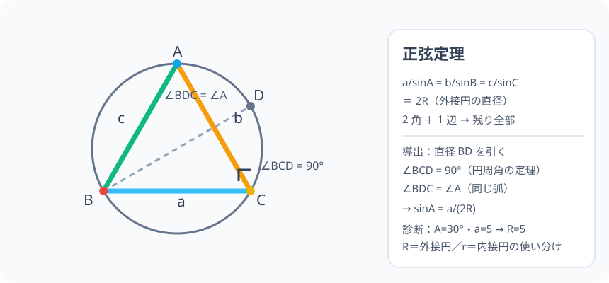

# 正弦定理：辺と角はカップルで動く

> [!abstract] このノードの核心
> 三角形の各「辺の長さ ÷ その対角の sin」は、3 つの辺どれでも**同じ定数**になる。しかもその定数は、外接円の直径 $2R$ そのものである。$\dfrac{a}{\sin A} = \dfrac{b}{\sin B} = \dfrac{c}{\sin C} = 2R$。1 辺と 2 角があれば、残りの辺も角も、この 1 公式で全部決まる。

> [!success] 合格ライン
> 正弦定理の 3 つの比が等しい理由を、外接円と直径の補助線（円周角の定理）で説明できる。A=30°・a=5 のとき R=5 となる計算ができる。2 角と 1 辺から残りの辺を求める手順が使える。

## 記号の読み方

| 表記 | 読み方 | この教材での意味 |
|---|---|---|
| R | アール（大文字） | 外接円（三角形を包む円）の半径 |
| 外接円 | がいせつえん | 3 頂点すべてを通る円 |
| 円周角の定理 | えんしゅうかくのていり | 同じ弧の円周角は等しい・直径の円周角は 90° |
| ratio | レシオ | 比（a/sinA）の値 |

> [!tip] 大文字 R と小文字 r
> **R は外接円、r は内接円**。面積ノード（`HS1-TRIG-AREA-01`）の r（内接円）と混ぜない。

## 前提ノードと入口判定

機械的な前提関係は、プロジェクト内スナップショット `../ontology/math_euler_complete_ontology.json` を参照し、転記している。外部原本は `G:/マイドライブ/Eleanor Arroway/documents/math_euler_complete_ontology.json`。`trigonometry_master_ontology.md` は人間向けの全体地図として使い、IDや依存関係が異なる場合はJSONを優先する。

| 区分            | ノード・知識                       | この教材で必要な理由                                 | 入口での判定                         |
| ------------- | ---------------------------- | ------------------------------------------ | ------------------------------ |
| 必須ノード（JSON正本） | `HS1-TRIG-UNITCIRCLE-01` 単位円 | 三角比を座標の値として読むため、ここでも「sin は 辺/斜辺」でなく 2R と対応 | 単位円上の点から sinθ・cosθ を答えられる |
| 必須ノード（JSON正本・A類追加） | `JH-GEO-CIRCLE-ANGLE-01` 円周角の定理 | 導出の核。直径を引いて 90° の円周角を作る | 直径の円周角は 90°・同じ弧の円周角は等しい、と説明できる |
| 前ノード（作成済み） | `HS1-TRIG-ANGLECONV-01` 角の変換公式 | 鈍角の角 A の sin を補角に読み替える | sin150° = sin30° を変換公式で出す |
| 必須ノード（JSON正本・B類未作成） | `JH-GEO-PARALLEL-01` 平行線・角・三角形の内角の和 | 2 角から残り 1 角を出す | ∠A = 30°・∠B = 70° のとき ∠C を出す |
| 補足（A類追加） | `JH-GEO-CIRCLE-INCIRCUM-01` 内接円と外接円 | 外接円 R の性質。この教材の R は外接円の半径 | 内心・外心の見つけ方を言える |

**入口判定の扱い:** JSON の診断問題「A=30°・a=5 のとき R は？（答: 5）」を最初の目安にする。正弦定理 $a/\sin A = 2R$ が分かれば一瞬で解けるが、**その式がどこから現れるか（直径の 90° と円周角）**を説明できることが合格ライン。後で P0 で確認。

## 到達点

この教材を閉じたとき、次のことを自分の言葉で説明できる。

- 正弦定理の比の 3 つが等しい理由（外接円と直径の関係）。
- a/sinA = 2R の R が外接円の半径であること。
- 「2 角と 1 辺」が与えられたときの残りの辺の求め方。
- 外接円の半径 R を三角形の辺と角から求める方法（診断問題の再現）。

## 入口：「辺と角は連舞で決まる」

三角形の 3 辺と 3 角のうち、**2 角があれば残りの角は決まる**（内角の和 180°）。さらに 1 辺が分かれば拡大縮小の尺度が決まり、三角形全体が決まる——つまり「2 角と 1 辺」が分かれば、残る 2 辺も必ず定まる。その「決まるための公式」が正弦定理である。

> [!example] 同じ例を最後まで使う
> 三角形 ABC を∠A = 30°・∠B = 45°・a = 5 の三角形に固めて、R の計算・残りの辺 b・c の計算まで全編で使う。

## 核となる図

図では三角形 ABC の外接円と、補助の直径 BD を描いている。**直径 BD に対する円周角 ∠BCD は 90°**、**∠BDC は ∠BAC（円周角の定理）**——この 2 つを掛け合わせれば正弦定理が見える。

| 図での要素 | 名前 | 役割 |
|---|---|---|
| 円 | 外接円（半径 R） | 3 頂点すべてを通る |
| 補助線 BD | 直径 2R | ∠BCD = 90° を作る |
| ∠BDC | ∠A の同値 | 円周角の定理 |
| 直角三角形 BCD | 対辺 a | sinA = a/BD = a/2R |

## まずやってみる

> [!question] 式を見る前の10秒
> ∠A が大きくなると（例 30° → 60°）、対辺 a は長くなる。a と sinA には、どんな「ずれない」関係がありそうか。2 つの三角形（a=1・A=30° と a=2・A=30°）を作って、a/sinA を計算してみる。

答えを確認する

a/sinA = 1/(1/2) = 2、a/sinA = 2/(1/2) = 4。**角を同じくする限り a/sinA は大きさに応じて変わる**が、一つの三角形に固定すれば、どの辺・どの角も同じ比になる。つまり b/sinB も c/sinC も同じ値。疑問を保留して、外接円の導出へ進む。

## 正弦定理の導出

### ステップ 1：外接円を描く

三角形 ABC の外接円（3 頂点を通る円、半径 R）を描く。

### ステップ 2：直径を引く

頂点 B から円の中心を通る直径 BD を引く（D は円周上の B の対点）。

- 直径 BD の長さ = 2R
- 円周角の定理：∠BCD = 90°（直径の円周角）
- ∠BDC = ∠BAC = ∠A（同じ弧 BC に対する円周角）

### ステップ 3：直角三角形 BCD で角 A を読む

直角三角形 BCD の斜辺 BD = 2R、対辺 BC = a。∠D = ∠A なので

$$
\sin A = \frac{a}{2R}
$$

両辺を整理して

$$
\frac{a}{\sin A} = 2R
$$

**で、これは「辺 a と角 A（対辺・対角）」だけで出た式**。角 B・角 C で同じ議論を回すと

$$
\boxed{\ \frac{a}{\sin A} = \frac{b}{\sin B} = \frac{c}{\sin C} = 2R\ }
$$

（円周角の定理が使えるため、角が鈍角でも同じ結果になる——単位円で正弦が正値を保つことも同じ理由。）

## 数値で点検する

### 診断問題：A=30°、a=5

$$
\frac{a}{\sin A} = \frac{5}{\frac{1}{2}} = 2R \quad\Rightarrow\quad R = 5
$$

外接円の半径は 5 である。これを「a を 5 で持つ三角形の頂点 A が、円の上を動いて 30° を見る」ことに対応する。

### 直角三角形（3-4-5）の検証

直角三角形の外接円は斜辺を直径とする：R = 斜辺/2 = 5/2 = 2.5。

$$
\frac{a}{\sin A} = \frac{\text{斜辺}}{\sin 90°} = 2R \quad\checkmark
$$

### 例：∠A=30°・∠B=45°・a=5 で b を出す

$$
\frac{a}{\sin A} = \frac{b}{\sin B}
\quad\Rightarrow\quad
b = \frac{5}{\frac{1}{2}}\times\frac{\sqrt{2}}{2} = 5\sqrt{2}
$$

R が 5 と分かっているなら $b = 2R\cdot\sin B = 10\cdot \frac{\sqrt{2}}{2} = 5\sqrt{2}$ と計算する方が早い。

### 極端な場合

- A = 90°：a = 2R（斜辺＝直径）。
- A → 0°：$\sin A \to 0$ より $2R = a/\sin A \to \infty$。三角形が失われれば外接円も失われる——半径無限大の対応。

## 3行まとめ

1. 外接円を包んで直径 BD を引くと、θ の直角三角形の中に sinA = a/(2R) ができる。
2. よって「辺 ÷ その対角の sin」はどこでも同じ = 外接円の直径（2R）。
3. この定理が「（sine 化した）2 角と 1 辺で残り全部」を解く。

## 理解度サポート：どこまで分かっているか

### まず自己評価

- [ ] **0：未学習** — この定理の名前がようやく出た
- [ ] **1：見れば分かる** — 図で導出を追える
- [ ] **2：自力で解ける** — 与えられた 2 角・1 辺で残りの辺を出す
- [ ] **3：説明できる** — 正弦定理の導出と R の意味を説明できる

### 技能ごとの確認問題

| check_id | 確認する技能 | 問い | 答えが曖昧なときに戻る場所 |
|---|---|---|---|
| P0 | JSON指定の入口診断 | A=30°, a=5 のとき外接円の半径 R は？ | 「数値で点検する」 |
| C1 | 導出 | 直径 BD を引いて sinA = a/2R を導く。 | 「導出」ステップ 2〜3 |
| C2 | R の意味 | 正弦定理の 2R が外接円の直径である理由を説明する。 | 「正弦定理の導出」 |
| C3 | 計算 | ∠A=30°・∠B=45°・a=5 のとき b を求めよ。（答: 5√2） | 「例：∠A=30°…」 |
| C4 | 直角三角形 | 3-4-5 の直角三角形で、外接円の半径はいくらか。正弦定理で確かめよ。（答: 5/2） | 「直角三角形（3-4-5）の検証」 |
| C5 | 変換の道具 | 鈍角の角（例 ∠A=150°）でも正弦定理を使える理由を説明する。 | 「導出」と角の変換ノード |

解答と判定基準を開く

- **P0の答え:** 2R = a/sinA = 5/(1/2) = 10 → R = 5。
- **C1の答え:** 直径 BD により ∠BCD = 90°。∠BDC = ∠A。直角三角形 BCD で sinA = a/(2R)。
- **C2の答え:** BD の長さは 2R であり、sinA = a/BD。BD = a/sinA、つまりこの比は直径。
- **C3の答え:** b = a × (sinB/sinA) = 5 × (√2/2)/(1/2) = 5√2。
- **C4の答え:** 斜辺 = 5 が直径 2R。R = 5/2。
- **C5の答え:** 外接円の円周角の定理は鈍角でも成立する（同じ弧の円周角は等しい）。正弦は単位円の第 II 象限でも正なので、鈍角の三角形でも正弦定理が正常に動く。

**判定の目安:**

- P0とC1〜C5を正答かつ理由つきで → 次のノードへ
- C1を誤る → 導出の図に戻って直径 BD に角 A を探す
- C3を誤る → 比の変形（a/sinA = b/sinB → b = ...）を書き直す
- C5を誤る → `HS1-TRIG-ANGLECONV-01` へ戻って補角の sin を再確認

## よくある取り違え

- a/sinA は a ÷ sinA、紛らわしいが 2R は割り算 → **a/sinA の「/」は分母が sinA**。
- R を 2R と書く場所を間違える → **正弦定理の最後の項は 2R（直径）であり、R の値を求めるときだけ 2 で割る**。
- 与えられた角が ∠B・∠C でも「∠A でないから使えない」と思う → **各辺・各角の対応を入れ替えれば b/sinB・c/sinC で同じ式が使える**。
- 正弦定理と余弦定理の使い方の混同 → **「2 角と 1 辺」= 正弦定理、「2 辺と挟まる角」= 余弦定理**。
- 弧と角の対応（円周角）を間違える → **∠BDC が ∠A に対応する。対応するのは「対辺の対角」**。

## 自力確認（teach-back）

教材を閉じて、次を声に出して答える。

1. 外接円と直径 BD を使い、sinA = a/(2R) を導く。
2. 「a/sinA = b/sinB の b を求める式」を変形して作り、a=5・A=30°・B=45° で計算する。
3. 3-4-5 の直角三角形の外接円半径を 2 通り（直角三角形の性質・正弦定理）で求める。
4. 診断問題（A=30°・a=5 → R=5）を 30 秒以内に解く手順を言葉にする。

## 次のノードへの橋

正弦定理は次のポイントで使われる。

- **三角形の面積（`HS1-TRIG-AREA-01`）**：S = 1/2 bc sinA と、外接円の関係（S = abc/(4R)）でも現れる。
- **外接円と対角の問題**：R と辺・角の関係（a = 2R sinA）そのものが「三角形の外向きの量」。
- **極限（`HS3-CALC-LIMIT-TRIG-01`）・オイラーの公式の発展**：円と三角比の関係は、この先も中心軸の 1 つである。

## インタラクティブ化の候補（レビュー後に判定）

- **有効候補: 三角形の頂点 A を外接円上で動かす** — a を固定して A を動かすと、角 A が変化し、sinA/a の比の値が一定に保たれることが体感できる。正弦定理の「決まりっぷり」の完全体験。
- **有効候補: A・B の角のスライダー** — 2 角 1 辺の構築の変化。
- **静的なままで十分:** 導出図＋式は十分成立。動かすなら最初のもので。
- 動かすことそれ自体を合格条件にはしない。
