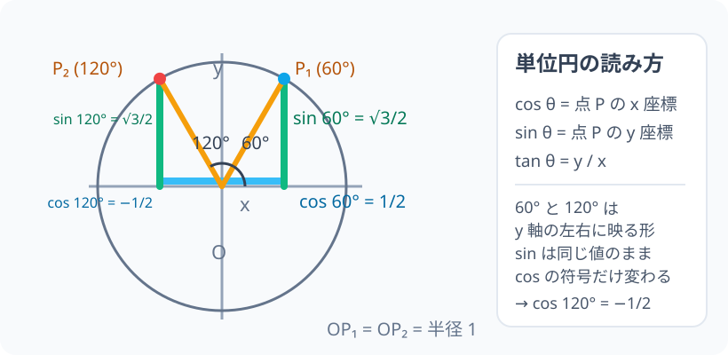

# 単位円：三角比を「長さの比」から「点の座標」へ

> [!abstract] このノードの核心
> 半径 1 の円（単位円）の周上の点 P を $(x, y) = (\cos\theta, \sin\theta)$ と読む。三角形の辺の比として斜辺に閉じていた三角比が、円周上の点の位置として $0° \le \theta \le 180°$ 全部に開かれる。この「座標で読む」切り替えこそが、鈍角で `cos θ` が負になる理由そのものである。

> [!success] 合格ライン
> 単位円上の点 P の座標を $(\cos\theta, \sin\theta)$ として読み、$\cos 120° = -\frac{1}{2}$ を点の位置（第Ⅱ象限）で説明でき、$\tan\theta = \frac{y}{x}$ の読み替えで $\tan 120° = -\sqrt{3}$ を出せる。

## 記号の読み方

| 表記 | 読み方 | この教材での意味 |
|---|---|---|
| `θ` | シータ | 始線（x軸の正の向き）から反時計回りに測る角 |
| 単位円 | たんいえん | 原点 O 中心・半径 1 の円 |
| 点 P | ピー | 円周上の点。座標 $(x, y)$ |
| `cos θ` | コサイン・シータ | 点 P の **x 座標** |
| `sin θ` | サイン・シータ | 点 P の **y 座標** |
| `tan θ` | タンジェント・シータ | $\frac{y}{x}$（点 P の座標の比） |

> [!tip] 音読するとき
> 読み方自体は前ノードと同じ。違うのは意味の読み方——このノードでは `sin θ`・`cos θ` は「辺の比」ではなく「円周上の点の座標」として読む。座標だから、負になることもある。

## 前提ノードと入口判定

機械的な前提関係は、プロジェクト内スナップショット `../ontology/math_euler_complete_ontology.json` を参照し、転記している。外部原本は `G:/マイドライブ/Eleanor Arroway/documents/math_euler_complete_ontology.json`。`trigonometry_master_ontology.md` は人間向けの全体地図として使い、IDや依存関係が異なる場合はJSONを優先する。

| 区分 | ノード・知識 | この教材で必要な理由 | 入口での判定 |
|---|---|---|---|
| 必須ノード（JSON正本） | `HS1-TRIG-IDENTITY-01` 三角比の基本相互関係 | このノードの三角比を円の図で統合するため。特に後の `sin²θ + cos²θ = 1` が単位円の半径1に対応する | $\sin^2\theta + \cos^2\theta = 1$ を三平方の定理から導ける理由を説明できる |
| 必須ノード（JSON正本） | `JH-COORD-PLANE-01` 座標平面と原点 O | 円周上の点を座標 $(x, y)$ として読むため。象限の符号を判定するため | 第Ⅱ象限の点は $x<0,\ y>0$ であることを言える |
| 必須ノード（JSON正本） | `JH-NUM-SIGN-01` 正負の数と符号の代数法則 | 「座標としての負の値」に戸惑わないため | $(-3)^2$ と $-3^2$ の違いを説明できる |
| 前ノード（このノードの直接の土台） | `HS1-TRIG-DEF-01` 鋭角三角比の定義 | 正弦・余弦・正接を辺の比で読む感覚が、単位円では座標に変わるだけであることを押さえるため | 3-4-5 の三角形で `sin θ`・`cos θ`・`tan θ` を比として書ける |
| 基礎知識（ノード外） | 60° の三角比の値 | このノードで 120° を 60° と対比するため | $\cos 60°$・$\sin 60°$ の値は正三角形の辺の比（1 : $\sqrt{3}$ : 2）から出る |

**入口判定の扱い:** JSON の診断問題「$\cos 120°$ の値は？（答: $-1/2$）」を最初の目安にする。**答える前にこのノードを学ぶのは構わない**——この診断の「理由まで説明できる」ことが、このノードの合格ラインだから。初回に答えられても理由を説明できなければ、後から復習する。

## 到達点

この教材を閉じたとき、次のことを自分の言葉で説明できる。

- 単位円の円周上の点 P の座標が $(\cos\theta, \sin\theta)$ になる理由を、半径 1 の直角三角形で説明できる。
- $\theta = 0°,\, 60°,\, 90°,\, 120°,\, 180°$ のときの点 P の位置を円周上に示せて、`cos θ`・`sin θ`・`tan θ`（定義できるものだけ）を書ける。
- 鈍角（$90° < \theta < 180°$）では `cos θ` が負になる理由を、第Ⅱ象限の座標符号で説明できる。
- $\tan\theta = \frac{\sin\theta}{\cos\theta} = \frac{y}{x}$ の読み替えができ、$\tan 90°$ が定義されない理由を言える。

## 入口：三角形から円へ移る理由

前ノードで、三角比が「角 θ が決める形の記録」であることを見た。それは直角三角形という拘束つきの形だった。ところが、実世界の角は $120°$ あり、$150°$ もある。見通しの角にしろ、針路にしろ、$90°$ を超える角は普通にある。直角三角形では測れない。

そこで、三角形を固定する代わりに、**斜辺の長さを 1 に固定する**ことにする。

$$
\text{常に斜辺の長さ } = 1
$$

こうすると、辺の比（三角比）はそのまま「点の座標」に読み替えられる。直角三角形が傾きを変えて回っても、斜辺は一定の長さのままで、対辺・隣辺の長さが P の位置として現れる。角が $90°$ を超えても、「P が円のどこにいるか」という問いは常に答えを持つ。

## 核となる図

図では、円の中心を原点 O に置いている。角 θ は x 軸の正の向き（**始線**）から反時計回りに測る。円周上の点 P から x 軸へ垂線を下ろすと、線分 OP を斜辺とする直角三角形ができ、どんな位置の P でも「斜辺 1 の直角三角形の頂点」として読める。

| 図での要素 | 名前 | 三角比での役割 |
|---|---|---|
| 円の半径 OP | 半径 1 | 常に斜辺 1 の直角三角形を作る |
| 点 P の x 座標 | `cos θ` | 斜辺が 1 のときの隣辺の長さ |
| 点 P の y 座標 | `sin θ` | 斜辺が 1 のときの対辺の長さ |
| $\frac{y}{x}$ | `tan θ` | 座標の比。つまり $\frac{\sin\theta}{\cos\theta}$ |

## まずやってみる

前のノードでは、三角比は「直角三角形の３辺のうち、どの辺をどの辺で割るか」だった。だから測れるのは鋭角だけ。ここで問うのは、その枠を出る方法。

> [!question] 式を見る前の10秒
> 半径 1 の円を描き、中心を原点 O に置く。円周上の点 P を、x 軸の正の向きから**反時計回りに 60° 進んだ位置**に取る。このとき P の座標 $(x, y)$ は長さの単位でいくらぐらいだろうか。答えの形を予想してから、次の定義に進む。

答えを確認する

P は円周上なので $\sqrt{x^2+y^2}=1$ である。さらに x 軸から 60° の位置という条件を、下の定義が正確に聞き取る。$x=\frac{1}{2}$、$y=\frac{\sqrt{3}}{2}$ となる。

## 単位円の定義

原点 O を中心とする半径 1 の円を**単位円**という。

点 P を、x 軸の正の向きとのなす角が θ となる円周上の点とする。このとき

$$
\boxed{\,P(x,\,y) = (\cos\theta,\;\sin\theta)\,}
$$

つまり、**cos θ は点 P の x 座標、sin θ は点 P の y 座標**である。

この定義は、$0° \le \theta \le 180°$ のどんな θ にも適用できる。$\theta = 0°$ なら P は原点の右端 $(1, 0)$、$\theta = 180°$ なら P は左端 $(-1, 0)$ である。三角形にはなり得ない境界の向きでも、点 P は円周の上にいる。

> [!note] 定義と導出を分ける
> 上の式はこのノードの**定義**である。次の節では、前ノードの「直角三角形の辺の比」を満たすこと（つまり新しい定義が古い定義と矛盾しないこと）を確かめる。定義は勝手に置き換わるものではなく、古い定義のもち主をそのまま引き継ぐ必要がある。

## 導出：なぜ「三角形の比」が「座標」になるのか

### 鋭角のとき：直角三角形と読んで同じになる

θ を鋭角（$0° < \theta < 90°$）とする。原点 O に角 θ の頂点、x 軸上に直角の頂点 H、円周上に点 P を取る直角三角形 OHP を描く。

この三角形では斜辺が半径 OP なので

$$
\text{対辺} = y,\qquad \text{隣辺} = x,\qquad \text{斜辺} = 1
$$

前ノードの定義どおりに書けば

$$
\sin\theta = \frac{\text{対辺}}{\text{斜辺}} = \frac{y}{1} = y,\qquad
\cos\theta = \frac{\text{隣辺}}{\text{斜辺}} = \frac{x}{1} = x
$$

**半径をわざわざ 1 にした理由**がここにある。比の計算で分母が 1 になるため、「斜辺に対する割合」がそのまま「座標の値」になる。$P(x, y) = (\cos\theta, \sin\theta)$ は、鋭角では前ノード定義と完全に同じ意味である。

### θ = 90°：三角形が消えるが、P はいる

$\theta = 90°$ になると直角三角形は形づくれないが、P は y 軸上の点 $(0, 1)$ にいる。始線からちょうど垂直に回した位置なので

$$
\cos 90° = 0,\qquad \sin 90° = 1
$$

このとき `tan θ` はどうなるか。後の `tan θ = y/x` の読み替えを待つ。まずは「点 P は動じない、定義も動じない」ことだけ確認する。

### 鈍角のとき：三角形の中から円周へ移る

θ が $90°$ を超えると、三角形として描けなくなる——$90°$ を超える内角を持つ直角三角形はない。しかし「始線から反時計回りに θ だけ進んだ点 P」は、単位円の周上にちゃんと存在する。

このとき P は第Ⅱ象限に来る。第Ⅱ象限の点は、象限の規則どおり

$$
x < 0,\qquad y > 0
$$

したがって点 P の座標の読み方から

$$
\cos\theta = x < 0,\qquad \sin\theta = y > 0
$$

**cos θ が負になるのは、点 P が x 軸の負側に進んだから**である。辺の長さとしては負の値は存在しない。だが「座標としては」負の値は現れる。この切り替えを意識できたなら、なぜ $\cos\theta$ が負になるのか説明できる。

## 数値で点検する：θ = 60° と θ = 120° の対応

ここで 60° の三角比を正三角形の半分から借りてくる。60° の位置の点 $P_1$ は

$$
P_1 = \left(\frac{1}{2},\; \frac{\sqrt{3}}{2}\right)
$$

次に 120° の位置を見る。$120°$ は $180° - 60°$ だから、原点から見ると「60° の位置を y 軸で左右に裏返した位置」になる。$60°$ の動径は y 軸の右側に、$120°$ の動径は同じ高さで y 軸の左側に映る。円周上の点 $P_2$ は、$P_1$ を y 軸で裏返した形：

$$
P_2 = \left(-\frac{1}{2}\;,\; \frac{\sqrt{3}}{2}\right)
$$

したがって

$$
\sin 120° = \frac{\sqrt{3}}{2},\qquad
\cos 120° = -\frac{1}{2}
$$

**y は両方とも正で同じ値。x だけが符号を変える。** これが $90°$ を超えたときの単純な答えである。

点検として、$\sin^2\theta + \cos^2\theta = 1$ が 120° でも保たれることを確認できる。

$$
\left(\frac{\sqrt{3}}{2}\right)^2 + \left(-\frac{1}{2}\right)^2 = \frac{3}{4} + \frac{1}{4} = 1
$$

単位円の方程式 $x^2 + y^2 = 1$ そのままである。

### 表：0°・60°・90°・120°・180°

| θ | 点 P の位置 | $(x, y)$ | `cos θ` | `sin θ` | `tan θ` |
|---|---|---|---|---|---|
| $0°$ | 始線の右端 | $(1, 0)$ | 1 | 0 | 0 |
| $60°$ | 第Ⅰ象限 | $\left(\frac{1}{2}, \frac{\sqrt{3}}{2}\right)$ | $\frac{1}{2}$ | $\frac{\sqrt{3}}{2}$ | $\sqrt{3}$ |
| $90°$ | y 軸上の最高点 | $(0, 1)$ | 0 | 1 | **定義されない** |
| $120°$ | 第Ⅱ象限 | $\left(-\frac{1}{2}, \frac{\sqrt{3}}{2}\right)$ | $-\frac{1}{2}$ | $\frac{\sqrt{3}}{2}$ | $-\sqrt{3}$ |
| $180°$ | 左端 | $(-1, 0)$ | $-1$ | 0 | 0 |

## `tan θ` の読み替えと例外

$P(x, y) = (\cos\theta, \sin\theta)$ であるから

$$
\tan\theta = \frac{\sin\theta}{\cos\theta} = \frac{y}{x}
$$

つまり、$\tan\theta$ は「y を x で割った比」になる。これは鋭角ノードでの $\text{対辺}/\text{隣辺}$ を単位円で読み替えた、同じ言葉のもう一つの顔である。この読み替えにより、$\tan 120°$ がすぐに求まる。

$$
\tan 120° = \frac{\sin 120°}{\cos 120°} = \frac{\sqrt{3}/2}{-1/2} = -\sqrt{3}
$$

同時に、例外も見える。$x = 0$ のとき、つまり $\cos\theta = 0$ のとき、$\frac{y}{x}$ は 0 で割ることになり**定義されない**。単位円で「$x = 0$」は $\theta = 90°$ の位置であり、上の表の通り、$\tan 90°$ は存在しない。

> [!warning] 定義されないと 0 は別物
> $\tan 90°$ は「±∞ でも 0 でもなく、**定義されない**」。0 で割る計算は値を返さない。

## 3行まとめ

1. 半径 1 の単位円で、点 P の座標を $(\cos\theta, \sin\theta)$ と定義すれば、鋭角では前ノードの辺の比と一致する。だから $0° \le \theta \le 180°$ に広げられる。
2. 鈍角では点 P が第Ⅱ象限にあり、x 座標が負になるため、**$\cos\theta$ だけが負**になり、$\sin\theta$ は正のまま。$\tan\theta = \frac{y}{x}$ は負になる。
3. $\cos\theta = 0$（$\theta = 90°$）では $\tan\theta$ は定義されない。

## 理解度サポート：どこまで分かっているか

### まず自己評価

自己評価は手がかりであって、判定そのものではない。後の確認で、「答えと理由」を両方言えるかを確かめる。

- [ ] **0：未学習** — 単位円の図を見ても座標を読めない
- [ ] **1：見れば分かる** — 図や表を見れば座標と三角比を対応づけられる
- [ ] **2：自力で解ける** — 図を見ずに $120°$ の位置と符号を言える
- [ ] **3：説明できる** — なぜ負になるかを、第Ⅱ象限の符号と座標の読み方で説明できる

### 技能ごとの確認問題

答えだけでなく、「なぜそうなるか」を一文で説明する。各問題の結果から、復習する場所を特定できる。

| check_id | 確認する技能 | 問い | 答えが曖昧なときに戻る場所 |
|---|---|---|---|
| P0 | JSON指定の入口診断 | 単位円を用いて $\cos 120°$ の値を求めよ。そのとき点 P は第何象限にあるか。（答: $-1/2$・第Ⅱ象限） | 「鈍角のとき」／「数値で点検する」 |
| C1 | 定義の読み替え | 半径 1 の単位円周上の点 $P(x, y)$ について、「x が cos θ、y が sin θ」と書ける理由を、直角三角形と半径 1 で説明する。 | 「導出：鋭角のとき」 |
| C2 | 象限と符号 | 第Ⅱ象限の点にはなぜ x 座標の負の値があるのか。$\sin 120° > 0$ だが $\cos 120° < 0$ である理由を、P の位置で説明する。 | 「鈍角のとき」／`JH-COORD-PLANE-01` |
| C3 | 定義域の例外 | $\tan 90°$ が定義されない理由を、座標と比で説明する。 | 「`tan θ` の読み替えと例外」 |
| C4 | 既習との整合 | $\sin^{2}\theta + \cos^{2}\theta = 1$ が $\theta = 60°$ でも $\theta = 120°$ でも成立することを、単位円と三平方の定理の両方で説明する。 | 「数値で点検する」／`HS1-TRIG-IDENTITY-01` |
| C5 | 数値の点検 | $\tan 120°$ を求めよ。また $\tan 60° = \sqrt{3}$ との符号の違いを説明する。（答: $-\sqrt{3}$） | 「`tan θ` の読み替え」 |

解答と判定基準を開く

- **P0の答え:** $\cos 120° = -\frac{1}{2}$。$120°$ の位置は第Ⅱ象限で、点 P は $60°$ の位置を y 軸で裏返した形。x 座標が負になる。
- **C1の答え:** OP が半径 1 の斜辺となり、対辺が y、隣辺が x。$\sin\theta = y/1 = y$、$\cos\theta = x/1 = x$ なので、座標が三角比そのものになる。
- **C2の答え:** 第Ⅱ象限は x 軸の負の側にあり、点 P の x 座標が負になる。y 座標（=$\sin\theta$）は正のまま。符号を混同しない。
- **C3の答え:** $x = \cos 90° = 0$ のとき、$\tan\theta = \frac{y}{x}$ の分母が 0 になるため。0 で割ることは数学では定義されない。
- **C4の答え:** P はどちらも単位円（半径1）の円周上にあり、$x^2 + y^2 = 1$ が成立する。三平方の定理でも斜辺 1 の直角三角形の OP から同じ式が出る。
- **C5の答え:** $\tan 120° = \frac{\sqrt{3}/2}{-1/2} = -\sqrt{3}$。分子は $60°$ と同値だが分母が負になるため、y/x は負の値。

**判定の目安:**

- P0とC1〜C5を正答かつ理由つきで言える → 次のノードへ
- 正答はできるが理由が曖昧 → 対応する本文の節を読み直して、同じ問題を再回答
- C1またはC2を誤る → 定義と第Ⅱ象限を要復習。次へ急がない
- C3だけを誤る → 0 で割る計算の扱いを復習

## よくある取り違え

- $\cos 120°$ を見て「$\cos$ は $120°$ では正」と思い込む → **第Ⅱ象限の x 座標は負。点 P の位置をまず描く**。
- $\sin 120°$ と $\cos 120°$ の値がどちらも $\pm$ で同じと混同する → **cos は x 座標、sin は y 座標。y は正・x は負**。
- $\tan 90° = 0$ または「∞」だと思う → **定義されない。0 で割る値を書くことはできない**。
- 半径 2 の円に描いても、その点の座標を $(\cos\theta, \sin\theta)$ と読む → **三角比は比なので、半径 2 の円では座標は $(2\cos\theta, 2\sin\theta)$ になる。$(\cos\theta, \sin\theta)$ と読めるのは半径 1 の単位円だけ**
- 度数が 120° でも「直角三角形の角」としてなんとか入れ込む → **三角形の中に入れるから混乱する。三角比は円周上の点の位置として読む**。

## 自力確認（teach-back）

教材を閉じて、次を声に出して答える。

1. 「半径 1 の円周上の点 P の座標が $(\cos\theta, \sin\theta)$ 」と定義するとき、それが前ノードの「辺の比」と同じ意味になる理由を、鋭角の直角三角形を使って説明する。
2. 単位円を描き、$\theta = 0°,\, 60°,\, 90°,\, 120°,\, 180°$ の点 P を示し、各々の `cos θ`・`sin θ`・`tan θ`（定義できるものだけ）を言う。
3. 「$120°$ で $\cos\theta$ は負になる」ことを、第Ⅱ象限と座標の符号で説明する。
4. $\tan 90°$ が定義されない理由を、$\tan\theta = \frac{\sin\theta}{\cos\theta}$ から説明する。

## 次のノードへの橋

このノードで、三角比は「直角三角形の辺の比」から「単位円周上の点の座標」に広がった。この拡張は、次の2つの展開を可能にする。

- **なじみのない角を測る:** 単位円は $0°$〜$180°$ を扱える。次は $\theta = 210°$、$320°$ など $180°$ を超える角（一般角）や、$\sin(180° - \theta)$ などの変換公式へ続く。
- **三角関数のグラフへ:** $y = \sin\theta$ のグラフは、単位円上の点 P を「y 座標」だけを抜き出して並べたものである。単位円が円という閉じた軌跡を描くのに対し、グラフでは自分の値が周期的に繰り返される。

次ノード（`HS1-TRIG-IDENTITY-01` より進めて `HS1-TRIG-ANGLECONV-01`）では、この単位円の縦横の対称性が、$\sin(180° - \theta) = \sin\theta$ などの公式を作っていることを見る。

## インタラクティブ化の候補（レビュー後に判定）

- **有効候補: θ を動かして点 P を円周上で回す** — $\sin\theta$（y座標）と $\cos\theta$（x座標）の変化をリアルタイムで見るもの。特に $0°$ から $180°$ までの範囲を回すと、$\cos\theta$ の符号が $90°$ を過ぎて変わる瞬間が目で追える。鈍角のことを感覚で掴むのに最も近いインタラクション。
- **有効候補: 単位円からグラフへの投影** — 単位円の y 座標をはじめからグラフに接続して並べる、三角関数のグラフ的理解。グラフノードとの橋として有効。
- **静的なままで十分:** 定義と表・点検の説明は、動かすことなく理解できる。ただし「$90°$ を過ぎた瞬間に符号が変わる」ことを目で確かめる価値はあるので、上の候補のどれかを 1 つ選んで導入を試す価値もありうる。
- 動かすことそれ自体を合格条件にはしない。

