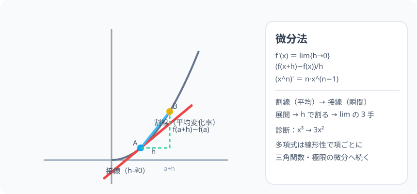

# 多項式の微分：平均の変化率から「瞬間」の変化率へ

> [!abstract] このノードの核心
> 「1 回にどれだけ変わるか」の平均（平均変化率）から、**その瞬間の変化率**を読む方法が微分。$f'(x) = \lim_{h\to0}\dfrac{f(x+h)-f(x)}{h}$ と定義し、多項式では「展開 → h で割 → lim」の 3 手で必ず $x^n \to n x^{n-1}$ に落ちる。関数のグラフの「曲がり方がどこまでも加速する」を知る道具。

> [!success] 合格ライン
> 平均変化率の式を書け、極限の記法（h→0）を説明できる。f(x)=x² を定義から微分すると 2x・x³ なら 3x²（＝診断の答え、展開から導ける）。

## 記号の読み方

| 表記 | 読み方 | この教材での意味 |
|---|---|---|
| lim | リミット | 極限（限りなく近づける） |
| h → 0 | エイチ・ゼロに | h を 0 に限りなく近づける |
| 平均変化率 | へいきんへんかりつ | 区間 [x, x+h] での y の変化 ÷ x の変化 |
| f'(x) | エフ・プライム・エックス | 導関数（瞬間変化率） |

> [!tip] h は「ほんのちょっと」
> h は 0 の代わりの小さな数。長めの区間で割ってみて、h を縮めていくと見える残骸が「瞬間の傾き」。

## 前提ノードと入口判定

機械的な前提関係は、プロジェクト内スナップショット `../ontology/math_euler_complete_ontology.json` を参照し、転記している。外部原本は `G:/マイドライブ/Eleanor Arroway/documents/math_euler_complete_ontology.json`。`trigonometry_master_ontology.md` は人間向けの全体地図として使い、IDや依存関係が異なる場合はJSONを優先する。

| 区分 | ノード・知識 | この教材で必要な理由 | 入口での判定 |
|---|---|---|---|
| 必須ノード（JSON正本） | `JH-FUNC-LINEAR-01` 一次関数と直線の傾き | 平均変化率＝直線の傾き | 傾き = 縦 ÷ 横 を言える |
| 必須ノード（JSON正本） | `JH-ALG-QUADRATIC-01` 展開 | (x+h)²・(x+h)³ の展開 | (x+h)² を展開できる |
| 基礎知識（C類） | h の大小 | 0 に近づける操作の感覚 | 1/10・1/100・…の系列 |

**入口判定の扱い:** JSON の診断問題「x³ の導関数」を最初の目安にする。**公式 (x^n)'=n x^(n−1) は覚えてもよいが**、定義から展開で導けることが合格ライン。P0 は展開・約分・lim の 3 手で確かめる。

## 到達点

この教材を閉じたとき、次のことを自分の言葉で説明できる。

- 平均変化率と極限（h→0）の式の意味。
- f(x)=x²・x³ を定義から微分する 3 手（展開・h で割る・lim）。
- (x^n)' = n x^(n−1) の一般形と、多項式の和・定数倍の線形性。
- グラフでは割線（平均）から接線（瞬間）になる。

## 入口：「駅の速度計は、どうやって 0.01 秒の速度を出す？」

車の平均速度 = 距離 ÷ 時間。しかし速度計は「前後 0.01 秒」の距離差で出る。区間を限りなく短くすると、平均速度は「瞬間の速度に近づく」——これが微分の始まり。

> [!example] 同じ例を最後まで使う
> y = x² と y = x³ を主役にする。一次関数の例（x の増加の比）から毎度同じ 3 手（公式→展開→lim）で回す。

## 核となる図

図では y = x² に点 A(a, f(a)) と B(a+h, f(a+h)) を取る。B を A に寄せながら割線を引くと、**A での接線に重なる**——接線の傾きが f'(a)。

| 図での要素 | 名前 | 役割 |
|---|---|---|
| 割線 AB | 平均変化率 | (f(a+h)−f(a))/h |
| 接線 | 瞬間変化率 | h→0 で接近した先 |
| A の座標 | (a, f(a)) | 基準点 |
| h | ほんのちょっと | 縮められる窓 |

## まずやってみる

> [!question] 式を見る前の10秒
> y = x² の点 (1,1) の近くで、区間 h = 0.1・0.01 の平均変化率を計算してみる。（1.1²−1²)/0.1 と (1.01²−1²)/0.01——ふたつとも「2 に近い」はず。

答えを確認する

(1.21−1)/0.1 = 2.1、(1.0201−1)/0.01 = 2.01。**2 に近づいていく**。この 2 が f'(1)（= 2×1）。

## 微分の定義

$$
f'(x) = \lim_{h\to0}\frac{f(x+h)-f(x)}{h}
$$

（分母の h を 0 にしてはいけない——0 で割るから。**h を限りなく 0 に「近づけて」いる。**）

## 多項式の微分：展開 3 手

### x² の例

$$
\frac{(x+h)^2-x^2}{h} = \frac{x^2+2xh+h^2-x^2}{h} = \frac{2xh+h^2}{h} = 2x + h \xrightarrow{h\to0} 2x
$$

### x³ の例（診断 P0）

$$
\frac{(x+h)^3-x^3}{h} = \frac{x^3+3x^2h+3xh^2+h^3-x^3}{h} = 3x^2 + 3xh + h^2 \xrightarrow{h\to0} 3x^2
$$

$$
\boxed{\ f(x) = x^3 \implies f'(x) = 3x^2\ }
$$

### 一般形 (x^n)'

$$
\boxed{\ (x^n)' = n\,x^{n-1}\ }\qquad\text{（n は整数・負でも成立。例：x^{-1} → −x^{-2}）}
$$

### 多項式全体（線形性）

$$
(af(x)+bg(x))' = a f'(x) + b g'(x)\quad\text{（和は和・定数倍は倍）}
$$

## 数値で点検する

### 診断問題：x³ → 3x² ✓

$$
x = 2 \text{ なら } f'(2) = 3\cdot 4 = 12\quad（y=x³ は x=2 で急に伸びている）
$$

### 例：f(x) = x² + 2x − 1

$$
f'(x) = 2x + 2\quad（線形性で項ごと）\qquad f'(-1) = 0\ \text{の点が頂点}\ \text{（}x=0\text{ では } f'(0)=2\text{）}
$$

### 極端な場合

- x⁰ = 1 → 微分 0（定数の微分=0）。
- n = 0・n = 1：定数・直線（それぞれ 0・1）。

## 3行まとめ

1. 平均変化率の区間 h を 0 に寄せると、接線（瞬間）の傾き＝導関数。
2. 展開→h で割る→lim の 3 手で多項式は落ちる（(x^n)' = n x^(n−1)）。
3. 線形性で多項式全体は項ごと微分。

## 理解度サポート：どこまで分かっているか

### まず自己評価

- [ ] **0：未学習** — lim を見て引く手がはたらかない
- [ ] **1：見れば分かる** — 図と展開を追える
- [ ] **2：自力で使える** — (x^n)' で計算できる
- [ ] **3：説明できる** — 定義・3 手・線形性を説明できる

### 技能ごとの確認問題

| check_id | 確認する技能 | 問い | 答えが曖昧なときに戻る場所 |
|---|---|---|---|
| P0 | JSON指定の入口診断 | f(x)=x³ の導関数は？ | 「x³ の例」 |
| C1 | 定義 | 平均変化率と導関数の関係。 | 「微分の定義」 |
| C2 | x² の導出 | 定義から x² → 2x を導く。 | 「x² の例」 |
| C3 | 計算 | (x³ + x²)' = ?（答: 3x²+2x） | 「多項式全体」 |
| C4 | 負の指数 | (x^(−1))' を計算する。（答: −x^(-2)） | 「一般形」 |
| C5 | 接線の意味 | f(a) と f'(a) の図の意味を述べる。 | 「核となる図」 |

解答と判定基準を開く

- **P0の答え:** 3x²。
- **C1の答え:** 平均（h を 0 に寄せる極限）が導関数。
- **C2の答え:** 展開→h で割→lim で 2x。
- **C3の答え:** 3x²+2x。
- **C4の答え:** −x^(-2)。
- **C5の答え:** f(a) は位置、f'(a) はその点の傾き。

**判定の目安:**

- P0とC1〜C5を正答かつ理由つきで → 次のノードへ
- C2を誤る → 展開（x²+h の展開の再確認）
- C3を誤る → 線形性の扱い（項別）

## よくある取り違え

- h を 0 と置いてはいけない → **0 で割るから近づけるだけ（lim）**。
- (x^n)'・n を指数 0 まで → **n=0 は定数→導関数 0**。
- 項ごとでない勝手微分 → **線形性は和と定数倍でだけ OK（積・商は後）**。
- 微分の結果を「値」と「式」でごちゃ混ぜ → **f'(2) は 12（値）、f'(x) は 3x²（式）**。
- 平均変化率と 接線の傾きの関係は無関係と思い込む → **発明の動機（速度・勾配）**。

## 自力確認（teach-back）

教材を閉じて、次を声に出して答える。

1. 微分の定義（f'(x) = lim (f(x+h)−f(x))/h）を書く。
2. x² → 2x・x³ → 3x² を 3 手で導く。
3. (3x² − 5x + 7)' = ?（答: 6x−5）
4. グラフ（割線→接線）と関数の速度の関係を言葉にする。

## 次のノードへの橋

- **三角関数の微分（`HS3-CALC-DIFF-TRIG-01`）**：sin x・cos x の微分（加法定理・極限公式の要）。
- **極限（`HS3-CALC-LIMIT-TRIG-01`）**：sinθ/θ の極限。微分との接点。
- **物理・グラフの応用**：接線の傾き・速度の思想（本ノードが引っかかる最初の一般化）。

## インタラクティブ化の候補（レビュー後に判定）

- **有効候補: h スライダー（割線→接線）** — h を縮めると割線が接線に重なる。
- **有効候補: 点 a の移動** — f'(a) が a に応じてどう動くか。
- **静的なままで十分:** 図と導出は十分。スライダー（h）が最有力。
- 動かすことそれ自体を合格条件にはしない。
