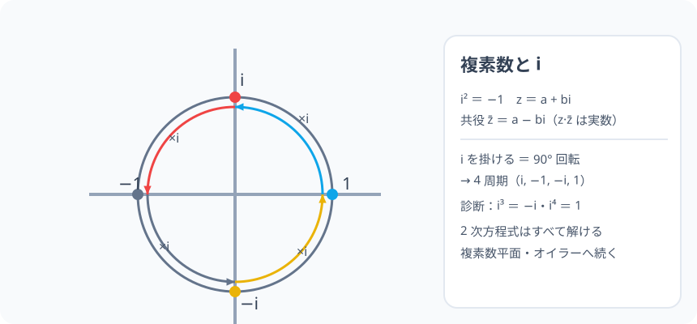

# 複素数と虚数単位 i：2 乗して −1 になる数の「港」

> [!abstract] このノードの核心
> 2 次方程式で「解なし」とされていた境地——$x^2 = -1$——に港を作ったのが $i$（$i^2 = -1$）である。数の世界は実数の 1 次元から、$z = a + bi$ の 2 次元（複素数）へ広がる。i を掛けることは 90° の回転と同義で、**四次周期**（i・−1・−i・1）がそのまま現れる。

> [!success] 合格ライン
> $i^2 = -1$ の定義と z = a + bi の構造（実部・虚部）を言える。i の冪が 4 つ周期（i³ = −i・i⁴ = 1）なことを説明できる（＝診断）。共役複素数・四則の扱いができる。

## 記号の読み方

| 表記 | 読み方 | この教材での意味 |
|---|---|---|
| $i$ | アイ（虚数単位） | $i^2 = -1$ を満たす新数 |
| 複素数 z | ゼット | z = a + bi（実部 a・虚部 b） |
| 共役複素数 | きょうやく ふくそすう | $\bar{z}=a-bi$（虚部の符号反転） |
| 実数部・虚数部 | じっすうぶ・きょすうぶ | a・b （どちらも実数） |

> [!tip] i と √ の関係
> $\sqrt{-1} = i$。$x^2 = a$（a < 0）の解は $\pm\sqrt{a}i$——平方根の定義域が i により一気に広がる。

## 前提ノードと入口判定

機械的な前提関係は、プロジェクト内スナップショット `../ontology/math_euler_complete_ontology.json` を参照し、転記している。外部原本は `G:/マイドライブ/Eleanor Arroway/documents/math_euler_complete_ontology.json`。`trigonometry_master_ontology.md` は人間向けの全体地図として使い、IDや依存関係が異なる場合はJSONを優先する。

| 区分 | ノード・知識 | この教材で必要な理由 | 入口での判定 |
|---|---|---|---|
| 必須ノード（JSON正本） | `JH-ALG-QUADRATIC-01` 2次方程式 | 解なし（D<0）がこの世界の入り口 | x²+1 = 0 の実数解がないことを言える |
| 必須ノード（JSON正本） | `JH-NUM-SIGN-01` 正負の数 | 符号の扱い（負の平方根） | (−3)² と −3² の違いを説明できる |
| 基礎知識（C類） | 分配・展開 | 複素数の掛け算 | (a+b)(c+d) を展開できる |

**入口判定の扱い:** JSON の診断問題「i³・i⁴」を最初の目安にする。**i を 1 つずつ掛けると 90° の回転**（i・−1・−i・1 → また i）の周期 4 を説明できるか＝合格ライン。P0 で確認。

## 到達点

この教材を閉じたとき、次のことを自分の言葉で説明できる。

- $i^2=-1$・z = a+bi（実部・虚部）と共役の定義。
- i の 4 周期（i, −1, −i, 1）を説明できる。
- 複素数の四則（和・積・商＝共役による有理化）。
- 2 次方程式の複素解（D<0 の場合）を解の公式で書ける。

## 入口：「解がない」は、解き方を知らないだけだった

$x^2 + 1 = 0$ は、実数の範囲では解けない。では「解けるように数を作る」…… それが数学の 3000 年の習慣。$x^2 = -1$ を満たす数 $i$ を宣言すれば、全部の 2 次方程式が解ける。

> [!example] 同じ例を最後まで使う
> x² + 1 = 0・i の周期・(1+i)(1−i) を主役にし、4 周期と共役を通す。

## 核となる図

図：実軸に 1・−1、その縦の位置に i・−i。**i を掛けると 90° ずつ円を回る**。この「i＝90° の回転」が複素数平面（次ノード）の芯。

| 図での要素 | 名前 | 役割 |
|---|---|---|
| 1・−1 | 実数 | 実軸上の値 |
| i・−i | 虚数 | 縦（i 軸）上の値 |
| 丸の矢印 | i× | 90° 回転の写像 |
| 周期 4 | 一周 | i⁴ = 1 |

## まずやってみる

> [!question] 式を見る前の10秒
> i⁰ から i⁴ まで書き出す。$i \times i = i^2 = -1$ となるパターンを予想する。

答えを確認する

i⁰=1・i¹=i・i²=−1・i³=−i・i⁴=1（戻る）。**周期 4**。i⁵=i・i⁶=−1…

## 虚数単位と複素数

$$
\boxed{\ i^2 = -1\ }\qquad z = a + bi\quad（a\,b\ は実数）
$$

- a：実部（Real part）・b：虚部（Imaginary part）
- i を含まない a だけの数（b = 0）は実数——複素数の世界は実数の世界を**包含**する。

## 四則演算

- **加法・減法**：実部同士・虚部同士。（2+3i)+(1−i) = 3 + 2i
- **乗法**：分配して i² = −1 を適用。(2+3i)(1−i) = 2 −2i +3i −3i² = 5 + i
- **除法**：共役 $\bar{z}=a-bi$ を分母分子に掛けて実数化。

$$
\frac{1}{1-i} = \frac{1+i}{(1-i)(1+i)} = \frac{1+i}{1-i^2} = \frac{1+i}{2} = \frac{1}{2}+\frac{1}{2}i
$$

$$
z\cdot\bar{z} = (a+bi)(a-bi) = a^2 - b^2 i^2 = a^2 + b^2\quad（実数！）
$$

## 共役複素数

$$
\bar{z} = a - bi\quad（虚部の符号だけ逆）
$$

性質：$z\cdot\bar{z} = a^2+b^2$（実数）、和・積は実数、$\overline{z_1+z_2}=\bar{z_1}+\bar{z_2}$。

## 数値で点検する

### 診断問題

$$
i^3 = i\cdot i^2 = -i,\qquad i^4 = (i^2)^2 = (-1)^2 = 1\quad\checkmark
$$

### x² + 1 = 0・x² − 2x + 5 = 0

x = ±i（直接）/ 解の公式で D = 4−20 = −16 → x = (2±4i)/2 = 1±2i。

### 極端な場合

- b = 0 の実数・a = 0 の純虚数。
- i の大きな冪：4 で割った余りで読む（i⁷ = i³ = −i）。

## 3行まとめ

1. i² = −1。数の世界が 2 次元（a + bi）に拡張。
2. i の冪は 4 周期。四則は実数部・虚数部を分け、i² = −1 で整理。
3. 共役（a − bi）は「実数化の道具」。2 次方程式は全部解けるようになった。

## 理解度サポート：どこまで分かっているか

### まず自己評価

- [ ] **0：未学習** — i を「ないもの」と決めつけている
- [ ] **1：見れば分かる** — 周期の絵を追える
- [ ] **2：自力で使える** — 四則・冪の計算ができる
- [ ] **3：説明できる** — 定義・展開・共役の一連を説明できる

### 技能ごとの確認問題

| check_id | 確認する技能 | 問い | 答えが曖昧なときに戻る場所 |
|---|---|---|---|
| P0 | JSON指定の入口診断 | i³ と i⁴ の値は？ | 「数値で点検する」 |
| C1 | 定義 | i²・z = a+bi の説明。 | 「虚数単位と複素数」 |
| C2 | 四則 | (2+3i)+(1−i)・(2+3i)(1−i)。 | 「四則演算」 |
| C3 | 除法 | 1/(1−i) の実数化。 | 「四則演算」 |
| C4 | 共役 | z·z̄ が実数になる理由。 | 「共役複素数」 |
| C5 | 2次方程式 | x²−2x+5 = 0 の解。 | 「数値で点検する」 |

解答と判定基準を開く

- **P0の答え:** −i ・ 1。
- **C1の答え:** i² = −1・z = a + bi（実部 a・虚部 b）。
- **C2の答え:** 3+2i・5+i。
- **C3の答え:** (1+i)/2。
- **C4の答え:** (a+bi)(a−bi) = a²+b²（i²=−1 で整理）。虚部が消えるため。
- **C5の答え:** 1±2i。

**判定の目安:**

- P0とC1〜C5を正答かつ理由つきで → 次のノードへ
- C2を誤る → i² = −1 の代入を（分配の箇所だけ）忘れないこと
- C4を誤る → 共役の符号・積の計算を丁寧に

## よくある取り違え

- 「√(−1) = i」と根号経由で覚える → **定義の基準は i² = −1（根号はその慣用記法）**。
- √(−a)（a > 0）を √a·i と読む代わりに √a·√(−1) と分けて混乱する → **√(−a) = √a·i（a > 0）と 1 手で**。
- 共役を符号そのままに → **虚部のみ逆（a − bi）**。
- 大きさ（絶対値）と虚部を混合 → **|z| = √(a²+b²)、虚部は b**。
- 実数（b = 0）の世界を特別扱いしすぎ → **包含（特殊ケース）**。

## 自力確認（teach-back）

教材を閉じて、次を声に出して答える。

1. i² = −1・z = a+bi・共役の定義をいう。
2. i の冪の 4 周期を導く（i⁰ → i⁴）。
3. (1−i)(1+i) と z·z̄ の関係（実数化の道具）。
4. x²+1 = 0 の解を ±i と書き、解の公式に 1±2i で答える。

## 次のノードへの橋

- **複素数平面・極形式（`HS3-COMPLEX-PLANE-01`）**：i = 90° 回転 → ガウス平面。回転と拡大の言葉。
- **ド・モアブル（`HS3-COMPLEX-DEMOIVRE-01`）**：冪と回転の速算へ。
- **オイラーの公式（`EULER-CONVERGENCE-01`）**：最後の大合流（指数と三角が i で接合）。

## インタラクティブ化の候補（レビュー後に判定）

- **有効候補: i の冪（乗算）をアニメーション** — 90° ずつ回る矢印。宇宙感。
- **有効候補: 実部/虚部スライダー** — 二つの数を足す様子。
- **静的なままで十分:** 定義・周期・四則は静的で十分。アニメーションは 1 つ選ぶなら i 冪。
- 動かすことそれ自体を合格条件にはしない。
