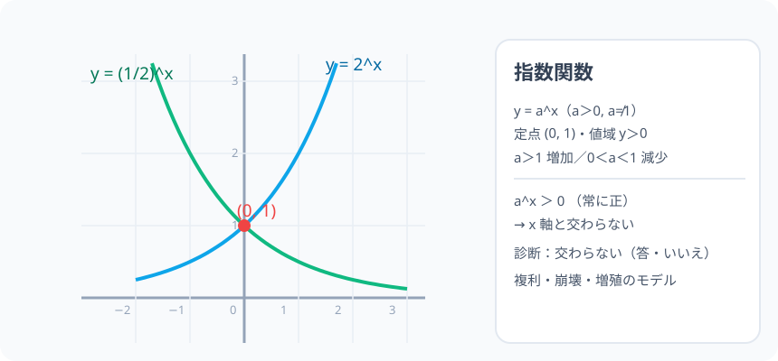

# 指数関数 y = a^x：割合が一定の乗算が、どんどん進む世界

> [!abstract] このノードの核心
> 利息・複利・放射線崩壊・バクテリア増殖——「ある割合で掛け続ける」現象は $y = a^x$（a > 0, a ≠ 1）で語られる。グラフは常に (0, 1) を通り、a > 1 なら単調増加・0 < a < 1 なら単調減少。そして **$a^x > 0$ なので x 軸とは決して交わらない**。

> [!success] 合格ライン
> a > 1 の場合のグラフの形・単調性・常に y > 0（x 軸と交わらない＝診断の答え：いいえ）を、指数法則と座標の言葉で説明できる。a^0 = 1 がグラフの決め手になることを言える。

## 記号の読み方

| 表記 | 読み方 | この教材での意味 |
|---|---|---|
| $a^x$ | エイのエックス乗 | 指数関数（底 a・変数 x） |
| 単調増加 | たんちょうぞうか | 広がっていく（左から右へ y が増える） |
| 単調減少 | たんちょうげんしょう | 縮んでいく（y が減る） |
| 漸近線 | ぜんきんせん | グラフが近づくが決して届かない線（ここでは x 軸） |

> [!tip] 底の範囲
> 定義は a > 0, a ≠ 1。a = 1 だとどんな x でも 1 で（関数として面白くない）、a < 0 は指数の定義から除外される。

## 前提ノードと入口判定

機械的な前提関係は、プロジェクト内スナップショット `../ontology/math_euler_complete_ontology.json` を参照し、転記している。外部原本は `G:/マイドライブ/Eleanor Arroway/documents/math_euler_complete_ontology.json`。`trigonometry_master_ontology.md` は人間向けの全体地図として使い、IDや依存関係が異なる場合はJSONを優先する。

| 区分 | ノード・知識 | この教材で必要な理由 | 入口での判定 |
|---|---|---|---|
| 必須ノード（JSON正本） | `HS2-EXP-LOG-01` 指数法則の拡張 | 実数指数 ∀ x が定義される土台 | 2⁻³ = 1/8 を書ける |
| 必須ノード（JSON正本） | `JH-COORD-PLANE-01` 座標平面と原点 O | グラフの点・切片を読み取る | (0,1) の座標を書ける |
| 基礎知識（C類） | 単調の感覚 | 図と表の対応 | 値が「だんだん大きくなる」の言葉 |

**入口判定の扱い:** JSON の診断問題「y = 2^x は x 軸と交わるか？」を最初の目安にする。直観的に否と答えつつ、**「なぜ交わらないと断言できるか」を a^x > 0 で説明**できることが合格ライン。P0 で確認。

## 到達点

この教材を閉じたとき、次のことを自分の言葉で説明できる。

- $y = a^x$ の定義域（実数全体）・値域（y > 0）を説明できる。
- (0, 1) を必ず通ること（a⁰ = 1）を導出できる。
- a > 1 と 0 < a < 1 の単調性の違いをグラフで示せる。
- x 軸との交点がない（漸近線）ことを a^x > 0 で説明できる。

## 入口：「倍々ゲーム」はどんなグラフになるか

給料を毎日 2 倍に増やす（1 日目 1 円・2 日目 2 円・3 日目 4 円…）。急に膨らむ。2 倍でなく 1/2 に減る割合だと穏やかに縮む。この「倍率 a が固定・掛ける回数 x」の関数こそ指数関数。

> [!example] 同じ例を最後まで使う
> 底 a = 2（倍々）と a = 1/2（半減衰）を対にして、増・減の性質をセットに使い回す。

## 核となる図

図は y = 2^x（青・単調増加）と y = (1/2)^x（緑・単調減少）を並べたもの。**2 本とも点 (0, 1) を通過**し、**x 軸（y = 0）にさわることはない**。

| 図での要素 | 名前 | 役割 |
|---|---|---|
| 点 (0, 1) | 必通過点 | a⁰ = 1 のグラフ上の顔 |
| 青い曲線 | y = 2^x | a > 1 の単調増加 |
| 緑の曲線 | y = (1/2)^x | 0 < a < 1 の単調減少 |
| x 軸 | 漸近線 | 値は正のまま、0 に接近だけする |

## まずやってみる

> [!question] 式を見る前の10秒
> y = 2^x で x = −1, 0, 1, 2 の値（表）を書き、次に x → −∞ の行き先を予想する。

答えを確認する

2⁻¹ = 1/2・2⁰ = 1・2¹ = 2・2² = 4。x → −∞ のとき 2^x → 0（正のまま近づくだけ）。**ゼロに触れない。**

## 定義と基本性質

$$
y = a^x\quad（a > 0,\ a \ne 1）
$$

- 定義域：実数全体（指数拡張ノードの完成品）
- 値域：y > 0（指数は常に正）
- 定点：(0, 1)（a⁰ = 1）
- 単調性：a > 1 で単調増加、0 < a < 1 で単調減少
- x → ∞ で a > 1 なら ∞・0 < a < 1 なら 0；x → −∞ では逆

## 数値で点検する

### 診断問題：x 軸と交わる？

$a^x > 0$（常に正）なので、y = 0 となるところがない：

$$
\text{答え}=\text{交わらない}\quad（\text{任意の } x\ \text{で}\ 2^x > 0）
$$

### 表・行き先

| x | −3 | −2 | −1 | 0 | 1 | 2 | 3 |
|---|---|---|---|---|---|---|---|
| 2^x | 1/8 | 1/4 | 1/2 | 1 | 2 | 4 | 8 |
| (1/2)^x | 8 | 4 | 2 | 1 | 1/2 | 1/4 | 1/8 |

### 極端な場合

- a = 1：y = 1（直線・関数としてはつまらないので除外）。
- a → ∞・a → 0 に限りなく近い：グラフの傾きが極端になる。
- 底が 2 と 1/2 の関係（対称）：y = 2^x と y = (1/2)^x は y 軸対称。

## 3行まとめ

1. a > 1：単調増加で右上へ・a⁰=1・常に正。
2. 点 (0, 1) を必ず通る。x 軸とは交わらない（漸近線）。
3. これは複利・崩壊・増殖のモデル。グラフから読み取れる文脈を掘るのが実用の中心。

## 理解度サポート：どこまで分かっているか

### まず自己評価

- [ ] **0：未学習** — 指数関数を見たことがない
- [ ] **1：見れば分かる** — 図を追える
- [ ] **2：自力で使える** — 表を作り、単調性を述べられる
- [ ] **3：説明できる** — 定点・値域・漸近線をセットで説明できる

### 技能ごとの確認問題

| check_id | 確認する技能 | 問い | 答えが曖昧なときに戻る場所 |
|---|---|---|---|
| P0 | JSON指定の入口診断 | y = 2^x のグラフは x 軸と交わりますか？ | 「数値で点検する」 |
| C1 | 定点 | すべての指数関数が通る 1 点は？（答: (0,1)） | 「定義と基本性質」 |
| C2 | 単調性 | a = 3 と a = 1/3 の単調性の違い。 | 「…単調性」 |
| C3 | 値域 | y = (1/2)^x が 0 に近づくのはいつか。（答: x→+∞） | 「数値で点検する」 |
| C4 | 非交点の根拠 | x 軸と交わらない根拠を a^x > 0 で。 | 「診断問題」 |
| C5 | 応用の橋 | 複利・崩壊・増殖のどれかを 1 つ、この関数でモデル化する。 | 「次のノードへの橋」 |

解答と判定基準を開く

- **P0の答え:** 交わらない（常に正）。
- **C1の答え:** (0, 1)（a⁰ = 1）。
- **C2の答え:** a = 3 は単調増加・a = 1/3 は単調減少。
- **C3の答え:** x → +∞ で 0 に近づく（y = 0 に届かない）。
- **C4の答え:** a^x > 0 が常に成立するから、y = 0 を実現する x はない。
- **C5の答え:** 例：初期量 A が 1 期間ごとに r 倍 → y = A·r^t。何回目で 2 倍かなども（この関数で計算できることは今後で拡張）。

**判定の目安:**

- P0とC1〜C5を正答かつ理由つきで → 次のノードへ
- C2を誤る → 表を増やして像を描く（2^x vs (1/2)^x）
- C4を誤る → 「正」の値という観点を思い出す

## よくある取り違え

- a^x と x^a を混同する → **違う関数（指数関数 vs べき関数）**。
- 値域を「実数全体」と書く → **y > 0 のみ（正の値域）**。
- x 軸と交わると考える → **a^x > 0（漸近線としての x 軸）**。
- 底が 1 でも関数になると思う → **a = 1 は定数 1。関数の成長量に合わない**。
- 大きい指数を素直に計算しすぎる → **対数・変換の道具を待つ（後の EXP-…）**。

## 自力確認（teach-back）

教材を閉じて、次を声に出して答える。

1. 指数関数の定義（a > 0, a ≠ 1）と定義域・値域をいう。
2. グラフの 3 特徴（定点・単調性・値域）を述べる。
3. 診断 P0 を「a^x > 0」で説明する。
4. 2^x と (1/2)^x の対称性（y 軸対称）を言う。

## 次のノードへの橋

- **対数（圏外・本オントロジー外だが、指数の拡張の隣）：** 指数方程式・グラフの逆関数（log の視点）。
- **ネイピア数 e（`HS3-CALC-E-DEF-01`）**: e^x の微分（生まれた関数が自分のまま）へ。
- **物理の応用**: 半減期（放射能）…（`HS3-CALC-E-DEF-01` の友）。

## インタラクティブ化の候補（レビュー後に判定）

- **有効候補: 底 a のスライダー** — 1 を跨ぐと単調性が反転する。濃すぎない。
- **有効候補: 時間 t のスライダー（複利）** — 成長を描く。図だけでなくデータの美しさ。
- **静的なままで十分:** 図・表・説明は成立。動かすなら底スライダー。
- 動かすことそれ自体を合格条件にはしない。
