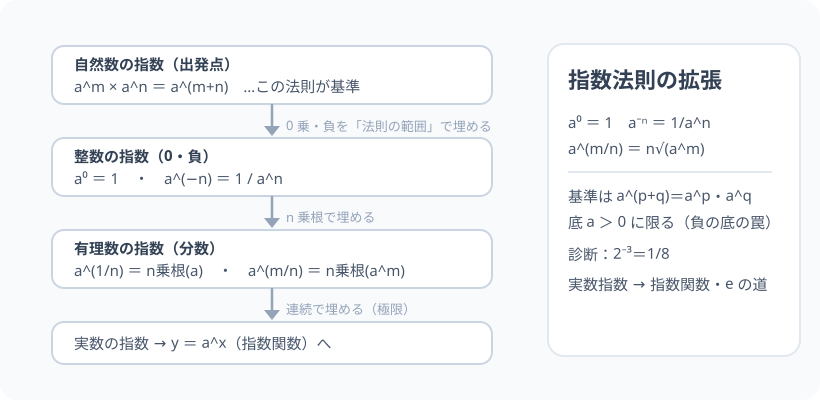

# 指数法則の拡張：掛け算の繰り返しから、実数全体の指数へ

> [!abstract] このノードの核心
> 「2³ = 2×2×2」は掛け算の繰り返しだった。しかし指数を負・分数（有理数）・実数に広げるには、「繰り返し回数」の読みでは追いつかない。**代わりに、指数法則 $a^m\times a^n = a^{m+n}$ というルールを「定義の基準」にして延長する**——$a^0 = 1$・$a^{-n}=\frac{1}{a^n}$・$a^{\frac{1}{n}}=\sqrt[n]{a}$ は、ここから自動的に決まる（決め方は 1 通り）。

> [!success] 合格ライン
> $a^m \times a^n = a^{m+n}$ を頼りに、$a^0\cdot a^{-n}\cdot a^{m/n}$ の定義流れを導ける。診断（2⁻³ = 1/8）を計算できる。底 $a>0$ の制約の理由（n 乗根の定義が実数範囲に閉じるため）を説明できる。

## 記号の読み方

| 表記 | 読み方 | この教材での意味 |
|---|---|---|
| $a^m$ | エイのエム乗 | a を m 回掛ける（指数 m・底 a） |
| 底 | てい | 指数の下の数（a） |
| 指数 | しすう | 上付きの掛け回数（m） |
| 有理数指数 | ゆうりすうしすう | m/n 型の指数 |
| 拡張 | かくちょう | 定義域を広げる |

> [!tip] 底 a の制約
> **底 a > 0** に限定する。負の底（(−2) の 1/2 乗など）は実数で定義できないため（後の複素数で解決される）。

## 前提ノードと入口判定

機械的な前提関係は、プロジェクト内スナップショット `../ontology/math_euler_complete_ontology.json` を参照し、転記している。外部原本は `G:/マイドライブ/Eleanor Arroway/documents/math_euler_complete_ontology.json`。`trigonometry_master_ontology.md` は人間向けの全体地図として使い、IDや依存関係が異なる場合はJSONを優先する。

| 区分 | ノード・知識 | この教材で必要な理由 | 入口での判定 |
|---|---|---|---|
| 必須ノード（JSON正本） | `JH-ALG-EXPR-01` 文字と式・等式変形 | 指数の整理（代入・変形） | 2(a+b) の整理ができる |
| 必須ノード（JSON正本） | `JH-NUM-SQRT-01` 平方根 | n 乗根への拡張（√ の一般化） | √2×√3 = √6 を説明できる |
| 基礎知識（C類） | 累乗の意味 | 2³ = 8 など | 2²・2³ の値を言える |

**入口判定の扱い:** JSON の診断問題「2⁻³ は？」を最初の目安にする。**「負の指数＝逆数」** がこのノードの第一歩。P0 では単に答えでなく「なぜ 1/8 か」を a⁻ⁿ の定義流れで説明できることを見る。

## 到達点

この教材を閉じたとき、次のことを自分の言葉で説明できる。

- 指数法則（積・商・累乗の累乗）の 3 本を、$a^m\times a^n = a^{m+n}$ を出発点として導ける。
- $a^0 = 1$・$a^{-n} = 1/a^n$・$a^{m/n} = \sqrt[n]{a^m}$ が「適用できるだけではなく必然」であることを説明できる。
- 診断（2⁻³ = 1/8）や 8^(1/3) = 2 の計算ができる。
- 底 a > 0 の理由（負の底の罠）を説明できる。

## 入口：「掛け算の回数」を超えるための……ルールの主権

2³は「2 を 3 回掛ける」。では 2^(−3) は「マイナス 3 回」？ そんなものはない。**繰り返しの読みを捨て、別の主役（指数法則）に替える**。この主権交代が、このノードのすべてである。

> [!example] 同じ例を最後まで使う
> 底 a = 2 を使い、2³・2⁰・2⁻³・8^(1/3) を一つの例で通す。

## 核となる図

図は「自然数 → 整数 → 有理数 → 実数」と広がる指数のステップ。どの段階でも**指数法則が保たれる**ことが「正しい定義」の基準。

| 図での要素 | 名前 | 役割 |
|---|---|---|
| 自然数 | m・n の元 | 掛け算の繰り返し |
| 0 乗 | 指数 0 | 掛けても不変（→ 1） |
| 負の指数 | a⁻ⁿ | 逆数（割り算の受け皿） |
| 有理数指数 | a^(m/n) | n 乗根（√ の一般化） |

## まずやってみる

> [!question] 式を見る前の10秒
> 2³ = 8、2² = 4、2¹ = 2、では 2⁰ = ? 上の系列から「2 を掛けるたびに次の値」を眺めて、パターンを予想する。(1 → 1/2 → 1/4 …と続く点も。)

答えを確認する

2³=8、2²=4、2¹=2、2⁰=1（掛けるたび 2 倍、遡るたび 1/2）。2⁻¹=1/2、2⁻²=1/4。**「倍るたび÷2」の延長が負の指数**。

## 指数法則の拡張

### 出発点（自然数 m・n）

$$
a^m\times a^n = a^{m+n}
$$

この 1 本を基準に、指数的「0 乗以下」を機械的に埋め尽くしても、他の文脈と壊れないようにする。

### ① a⁰ = 1

$a^m \times a^0 = a^{m+0} = a^m$。どんな m でも「掛けても変わらない」のは 1 だけ。

$$
a^0 = 1\quad（a \ne 0）
$$

### ② a⁻ⁿ = 1/aⁿ

$a^m\times a^{-n} = a^{m-n}$。とくに m = n では a⁰ = 1 なので

$$
a^n \times a^{-n} = 1\quad\Rightarrow\quad a^{-n} = \frac{1}{a^n}
$$

### ③ a^(1/n) = n乗根 ・ a^(m/n)

$a^{1/n}$ を n 乗すると

$$
\left(a^{1/n}\right)^n = a^{n\cdot(1/n)} = a^1 = a
$$

n 乗して a になる数＝a の n 乗根。つまり

$$
a^{1/n} = \sqrt[n]{a},\qquad a^{m/n} = \sqrt[n]{a^m} = \left(\sqrt[n]{a}\right)^m
$$

### 実数指数へ

有理数から実数へは「連続に広げる」操作（有理数の間を埋める）。直観のための式：$2^{\sqrt{2}}$ は 2^1.4・2^1.41・… と有理数指数の極限として定義。（厳密には 将来 `HS3-CALC-E-DEF-01` や ε-δ の視点。）

## 数値で点検する

### 診断問題：2⁻³

$$
2^{-3} = \frac{1}{2^3} = \frac{1}{8}\quad\checkmark
$$

### 8^(1/3)・9^(1/2)

$$
8^{1/3} = \sqrt[3]{8} = 2\quad\checkmark\qquad
9^{1/2} = \sqrt{9} = 3\quad\checkmark
$$

### 極端な場合

- a⁰ = 1（a ≠ 0 だが、0⁰ はここでは定義しない）。
- a^(−n) の n を大きく：1/a^n がどんどん小さくなり、0 に吸収される。
- 底 a = 1：すべての指数で 1（1 の世界は単調）。

## 3行まとめ

1. 指数法則 $a^m\times a^n = a^{m+n}$ を基準に定義を広げる。
2. $a^0=1$・$a^{-n}=1/a^n$・$a^{m/n}=\sqrt[n]{a^m}$（それぞれ派生）。
3. 底 a > 0。負の底・分数指数の罠は複素数を待つ。

## 理解度サポート：どこまで分かっているか

### まず自己評価

- [ ] **0：未学習** — 指数の拡張をまだ知らない
- [ ] **1：見れば分かる** — 表（はしご）を追える
- [ ] **2：自力で使える** — 負・分数指数の計算ができる
- [ ] **3：説明できる** — 「なぜこの定義」の主権交代を説明できる

### 技能ごとの確認問題

| check_id | 確認する技能 | 問い | 答えが曖昧なときに戻る場所 |
|---|---|---|---|
| P0 | JSON指定の入口診断 | 2^(-3) はいくつですか？ | 「数値で点検する」 |
| C1 | a⁰ の導出 | a⁰ = 1 を指数法則から導く。 | 「① a⁰ = 1」 |
| C2 | 負指数 | 3⁻² を計算する。（答: 1/9） | 「② a⁻ⁿ」 |
| C3 | 分数指数 | 16^(3/4) を計算する。（答: 8） | 「③ 分数指数」 |
| C4 | 底の制約 | (−8)^(1/2) が実数でない理由を説明する。 | 「記号の読み方」tip |
| C5 | 指数関数への橋 | この拡張が 2^x のグラフ（実数全体）への接続をどう支えるか。 | 「次のノードへの橋」 |

解答と判定基準を開く

- **P0の答え:** 1/8。
- **C1の答え:** a^m×a^0 = a^m が成り立つ「変わらない」値は 1。
- **C2の答え:** 1/9。
- **C3の答え:** (16^(1/4))³ = 2³ = 8。
- **C4の答え:** 2 乗して負になる実数は存在しない（√ の 2 乗は負値を返さない）。
- **C5の答え:** 任意の実数 x に対して値（2^x）が定義される ＝ 関数 y = a^x が実数全体で定義できる（`HS2-EXP-FUNC-01`）。

**判定の目安:**

- P0とC1〜C5を正答かつ理由つきで → 次のノードへ
- C2を誤る → 負指数＝逆数（割り算の書き換え）
- C3を誤る → n 乗根 → 累乗の順（先に根）

## よくある取り違え

- a⁰ = 0 と思う → **a⁰ = 1（掛けても不変の値）**。
- a^(-n) を −aⁿ と書く → **a^n の逆数 1/a^n。−aⁿ は「符号」であり別物**。
- 分数指数 a^(m/n) を「a^m / a^n」と分解する → **a^(m/n) = n 乗根（a^m）。（a^m ÷ a^n = a^(m−n)）**。
- √ のルートの外に分数の m を落とす → **a^(m/n) の規則で始める**。
- 底が負の冪を実数の範囲で定義する → **定義域に気をつける（このノートの底＞0）**。

## 自力確認（teach-back）

教材を閉じて、次を声に出して答える。

1. $a^m \times a^n = a^{m+n}$ から、a⁰・a⁻ⁿ・a^(m/n) を導く。
2. 2⁻³ を「2³ の逆数」の言葉で説明し、診断答えと合わせる。
3. 底 a = 3 として 3^(1/2)・3^(3/2) を計算する。
4. -2 の指数や (−8)^(1/2) の罠（実数でない場合）を説明する。

## 次のノードへの橋

- **指数関数（`HS2-EXP-FUNC-01`）**: y = a^x のグラフ（実数全体の定義域）。この拡張があってこそ。
- **指数方程式・対数（`HS2-EXP-FUNC-01` 以降・対数は本オントロジー圏外だが指数の兄弟）**: 指数法則がそのまま方程式の解き方になる。
- **ネイピア数 e・対数（`HS3-CALC-E-DEF-01`）**: e^x の素直な商（微分）扱い。

## インタラクティブ化の候補（レビュー後に判定）

- **有効候補: 指数スライダー（負〜分数）** — x を動かすと 2^x が連動し、2⁻³ などがノードとして立つ。
- **有効候補: 拡張はしご（レポート）** — 自然数→整数→有理数→実数を 1 枚で。
- **静的なままで十分:** 図・導出は静的で成立。スライダーを 1 つ選ぶなら、指数スライダー。
- 動かすことそれ自体を合格条件にはしない。
