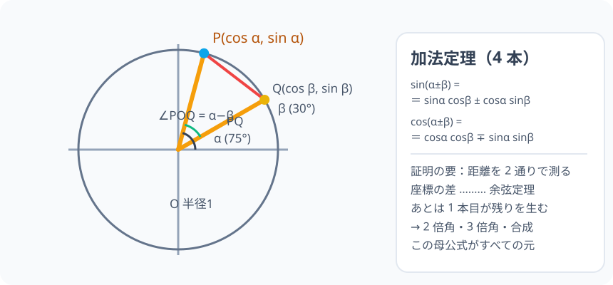

# 加法定理：角度の足し算を三角比の積に分解する「母公式」

> [!abstract] このノードの核心
> $\sin(\alpha+\beta)$ や $\cos(\alpha+\beta)$ は「角度を先に足してから三角比」ではなく、**二つの角それぞれの三角比の積で書ける**、というのが加法定理である。証明は単位円上の 2 点の距離を 2 通りで測る——それだけで 4 本の公式全部が生まれる。

> [!success] 合格ライン
> $\sin(\alpha\pm\beta)$・$\cos(\alpha\pm\beta)$ の式を、単位円上の 2 点 $P(\cos\alpha,\ \sin\alpha)$ と $Q(\cos\beta,\ \sin\beta)$ の距離を 2 通りで測る方法で導出でき、正しい符号（sin は同じ符号、cos は逆符号）を選択して値を計算できる。

## 記号の読み方

| 表記 | 読み方 | この教材での意味 |
|---|---|---|
| α | アルファ | 1 つ目の角 |
| β | ベータ | 2 つ目の角 |
| `sin α cos β` | サイン・アルファ、コサイン・ベータ | 積の順で読む |
| ∓ | マイナスプラス | 上段で −、下段で + の意（± の逆） |

> [!tip] 音読するとき
> $\sin(\alpha\pm\beta)$ は「サイン、アルファ・プラスマイナス・ベータ」。$\cos(\alpha\pm\beta)$ の右辺の記号は **∓**（マイナスプラス）であることに注意。

## 前提ノードと入口判定

機械的な前提関係は、プロジェクト内スナップショット `../ontology/math_euler_complete_ontology.json` を参照し、転記している。外部原本は `G:/マイドライブ/Eleanor Arroway/documents/math_euler_complete_ontology.json`。`trigonometry_master_ontology.md` は人間向けの全体地図として使い、IDや依存関係が異なる場合はJSONを優先する。

| 区分 | ノード・知識 | この教材で必要な理由 | 入口での判定 |
|---|---|---|---|
| 必須ノード（JSON正本） | `HS1-TRIG-COSINELAW-01` 余弦定理 | 証明の核。2 辺 1 と 1・夾角 (α−β) の三角形に余弦定理を使うため | $a^2 = b^2 + c^2 - 2bc\cos A$ を辺・角の関係で言える |
| 必須ノード（JSON正本） | `HS2-TRIG-GENERALANGLE-01` 一般角と単位円の完全拡張 | 加法定理が負角・230° など一般角にも成立するのは、座標で証明したからであるため | $\cos(-30°) = \cos 30°$ が単位円のどこで分かるか説明できる |
| 必須ノード（JSON正本） | `HS1-TRIG-IDENTITY-01` 三角比の基本相互関係 | 距離の計算で $\sin^2\alpha + \cos^2\alpha = 1$ を 2 回使うため | $\sin^2\theta + \cos^2\theta = 1$ を三平方の定理から導ける |
| 前ノード（このチェーンの土台） | `HS1-TRIG-UNITCIRCLE-01` 単位円 | 点 P の座標を (cos θ, sin θ) と読む感覚。証明の出発点 | 単位円上の点の座標で「角 θ の位置」を表せる |
| 前ノード（このチェーンの土台） | `HS2-TRIG-GRAPH-01` 三角関数のグラフ | 波の合成（加法定理の応用）に進む前段の確認 | 振幅・周期・位相を式から読み取れる |
| 必須ノード（JSON正本・A類追加） | `JH-COORD-DISTANCE-01` 座標平面上の距離 | 2 点間の距離を座標差で計算するため | (x₁−x₂)² + (y₁−y₂)² の意味を言える |

**入口判定の扱い:** JSON の診断問題「$\cos(\alpha+\beta)$ の加法定理の展開式は？」を最初の目安にする。まだ式を知らなくてよいが、**導出が終わったあと「なぜこの符号になるか」を説明できない場合は要復習**——本ノードの合格ラインそのものだから。

## 到達点

この教材を閉じたとき、次のことを自分の言葉で説明できる。

- 加法定理の 4 式（sin・cos 各 ±）を、単位円上の 2 点の距離を 2 通りで測る手順で導出できる。
- 右辺の記号の規則（sin では ± が同符号、cos では ∓ が逆符号）の理由を、β の符号によらずに言える。
- 具体的な角度（30°・45°・60° など）で $105°$ の値が加法定理から出る計算ができる。
- この定理が「母公式」と呼ばれる理由（2 倍角・半角・3 倍角・合成が全部ここから出る）を説明できる。

## 入口：角の足し算は、なぜ三角比で困るのか

$\sin 45°$ と $\sin 30°$ はすぐ分かる。では $\sin 75°$ はどうか。**「先に 75° の直角三角形を描く」しかなければ、それは一から作図する工数になる**。ところが 75° = 45° + 30° であり、45° と 30° の三角比はもう握っている。すると角の和を部分の三角比で計算できる仕組みがあれば、どんな角でも足し算割り算で開ける。

加法定理こそ、その開けるための式である。そしてこの公式は、高校の三角関数の最後に大きく花を咲かせる種——2 倍角・半角・3 倍角・三角関数の合成まで全部がここの 1 つの式から芽吹く。

## 核となる図

図では $P(\cos\alpha,\ \sin\alpha)$、$Q(\cos\beta,\ \sin\beta)$ を単位円周上に取っている。線分 PQ の長さは「座標の差を使う方法」と「余弦定理を使う方法」の 2 通りで計算できる。

| 図での要素 | 名前 | 役割 |
|---|---|---|
| 動径 OP・OQ | 半径 1 | 余弦定理の 2 辺として使う |
| 線分 PQ | 赤い弦 | 同じ長さを 2 通りで計算して等式を作る |
| 角 α−β | ∠POQ | 余弦定理の夾角 |
| 座標の差 | P と Q の座標 | 距離の 2 乗を別の形で計算する |

## まずやってみる

> [!question] 式を見る前の10秒
> $\cos(\alpha+\beta) = \cos\alpha\cos\beta \square \sin\alpha\sin\beta$ の $\square$ には + か − のどちらが入ると思うか。$\alpha = 30°$・$\beta = 45°$（つまり 75°）で、左辺 $\cos 75°$ の値（約 0.259）を超えない方の符号を選ぶ。

答えを確認する

+ を試すと $\frac{\sqrt{3}}{2}\cdot\frac{\sqrt{2}}{2} + \frac{1}{2}\cdot\frac{\sqrt{2}}{2} ≈ 1.22$ となり、1 を超えてしまう。よって $\cos(\alpha+\beta)$ は **−**。この予想の後で、どうして − になるかを導出で確かめる。

## 加法定理（4 本の公式）

$$
\boxed{\ \sin(\alpha\pm\beta) = \sin\alpha\cos\beta \pm \cos\alpha\sin\beta\ }
$$

$$
\boxed{\ \cos(\alpha\pm\beta) = \cos\alpha\cos\beta \mp \sin\alpha\sin\beta\ }
$$

$$
\boxed{\ \tan(\alpha\pm\beta) = \frac{\tan\alpha \pm \tan\beta}{1 \mp \tan\alpha\tan\beta}\ }
$$

3 番目の tan は、前の 2 本を割り算して分子分母を $\cos\alpha\cos\beta$ で割れば整理できる（下の「tan も同じ流れで」節）。

**注意すべきは記号の配置。sin では ± がそのまま（同符号）だが、cos では右辺が ∓（逆符号）である。** この理由は導出で分かる。

## 導出：距離を 2 通りで測る

### 準備：2 点と三角形

単位円周上に $P(\cos\alpha,\ \sin\alpha)$、$Q(\cos\beta,\ \sin\beta)$ を取る。OP = OQ = 1（半径）で、角 POQ = α − β である。

**方法 1（座標で測る）** 三平方の定理より

$$
|PQ|^2 = (\cos\alpha-\cos\beta)^2 + (\sin\alpha-\sin\beta)^2
$$

**方法 2（余弦定理で測る）** OP = OQ = 1、夾角 α−β として

$$
|PQ|^2 = 1^2 + 1^2 - 2\cdot1\cdot1\cdot\cos(\alpha-\beta)
$$

同じ線分 PQ の長さであるから、$|PQ|^2$ は等しい。

### 等式を整理すると cos(α−β) が出る

方法 1 の展開：

$$
(\cos\alpha-\cos\beta)^2 + (\sin\alpha-\sin\beta)^2
= \cos^2\alpha - 2\cos\alpha\cos\beta + \cos^2\beta
+ \sin^2\alpha - 2\sin\alpha\sin\beta + \sin^2\beta
$$

ここで二乗和をまとめる：

$$
= (\cos^2\alpha + \sin^2\alpha) + (\cos^2\beta + \sin^2\beta) - 2(\cos\alpha\cos\beta + \sin\alpha\sin\beta)
$$

$\sin^2\theta+\cos^2\theta=1$ を 2 回使い、方法 2 と合わせる：

$$
2 - 2(\cos\alpha\cos\beta + \sin\alpha\sin\beta)
\;=\; 2 - 2\cos(\alpha-\beta)
$$

両辺から 2 を引き、−2 で割って出す：

$$
\boxed{\ \cos(\alpha-\beta) = \cos\alpha\cos\beta + \sin\alpha\sin\beta\ }
$$

### 差の式から和の式、そして β の符号全体へ

**cos(α+β)。** 上の式の β を −β に置き換え、既知の $\cos(-\beta)=\cos\beta,\ \sin(-\beta)=-\sin\beta$（単位円の対称性）を使う：

$$
\cos(\alpha+\beta) = \cos\alpha\cos\beta - \sin\alpha\sin\beta
$$

**sin(α+β)。** 余角の公式 $\sin\theta = \cos\left(\frac{\pi}{2}-\theta\right)$ を使う：

$$
\sin(\alpha+\beta)
= \cos\left(\frac{\pi}{2}-(\alpha+\beta)\right)
= \cos\left(\left(\frac{\pi}{2}-\alpha\right)-\beta\right)
$$

（ここで cos の**差**の公式を使うため、$\frac{\pi}{2}-\alpha$ を「$M$」、β を「$N$」と見る）

$$
\cos(M-N) = \cos M\cos N + \sin M\sin N
$$

に代入：$M=\frac{\pi}{2}-\alpha$ のとき $\cos M = \sin\alpha$、$\sin M = \cos\alpha$。よって

$$
\sin(\alpha+\beta) = \sin\alpha\cos\beta + \cos\alpha\sin\beta
$$

### tan も同じ流れで

$\tan(\alpha+\beta) = \dfrac{\sin(\alpha+\beta)}{\cos(\alpha+\beta)}$ に、さっきの式を代入する：

$$
\tan(\alpha+\beta) = \frac{\sin\alpha\cos\beta + \cos\alpha\sin\beta}{\cos\alpha\cos\beta - \sin\alpha\sin\beta}
$$

分子・分母をそれぞれ $\cos\alpha\cos\beta$ で割ると（$\cos\alpha\cos\beta \ne 0$ のとき）：

$$
\tan(\alpha+\beta) = \frac{\tan\alpha + \tan\beta}{1 - \tan\alpha\tan\beta}
$$

### 差の式も同じ手順で

$$
\sin(\alpha-\beta) = \sin\alpha\cos\beta - \cos\alpha\sin\beta
$$

### 記号の規則が「なぜ逆」か

$\cos$ の方は、β → −β で右辺の第 2 項だけ符号が変わる。なぜなら $\cos(-\beta) = \cos\beta$ は不変、$\sin(-\beta) = -\sin\beta$ にだけ負が付くから。つまり sin と cos の「対称性の向き」が違うというだけで、**sin では ±、cos では ∓** という並びが定まる。

## 数値で点検する：75° = 30° + 45°

$\cos 75°$ を加法定理で計算する：

$$
\cos 75° = \cos(30°+45°)
= \cos 30° \cos 45° - \sin 30° \sin 45°
$$

$$
= \frac{\sqrt{3}}{2}\cdot\frac{\sqrt{2}}{2} - \frac{1}{2}\cdot\frac{\sqrt{2}}{2}
= \frac{\sqrt{6}-\sqrt{2}}{4} \approx 0.259
$$

$75°$ は $90°$ より少し手前の角なので $\cos 75°$ は 0 と 1 の間の小さい値になるはず。出た値 ≈ 0.259 はこの点検と一致し、符号が正しいことの確認にもなる。

$\sin 75°$ も同様：

$$
\sin 75° = \sin 30°\cos 45° + \cos 30°\sin 45°
= \frac{1}{2}\cdot\frac{\sqrt{2}}{2} + \frac{\sqrt{3}}{2}\cdot\frac{\sqrt{2}}{2}
= \frac{\sqrt{2}+\sqrt{6}}{4} \approx 0.966
$$

極端な場合でも成り立つことを確認する：β = 0 のとき

$$
\sin(\alpha+0) = \sin\alpha\cdot 1 + \cos\alpha\cdot 0 = \sin\alpha \quad\checkmark
$$

$$
\cos(\alpha+0) = \cos\alpha\cdot 1 - \sin\alpha\cdot 0 = \cos\alpha \quad\checkmark
$$

また β = α のとき（2 倍角の予告）：

$$
\sin 2\alpha = 2\sin\alpha\cos\alpha,\qquad
\cos 2\alpha = \cos^2\alpha - \sin^2\alpha
$$

これが次ノードの 2 倍角の公式そのものである。

## 3行まとめ

1. $\sin(\alpha\pm\beta)$ と $\cos(\alpha\pm\beta)$ は、単位円上の 2 点の距離を座標と余弦定理の 2 通りで測ることで得られる。それだけで 4 本が揃う。
2. sin の式は同符号、cos の式は逆符号（∓）。それは cos が偶関数・sin が奇関数という対称性が β の符号で反転するから。
3. 加法定理はテーブルの母公式である——2 倍角・半角・3 倍角・合成・和積まで、すべてここから生まれる。

## 理解度サポート：どこまで分かっているか

### まず自己評価

- [ ] **0：未学習** — 加法定理の式を見ても導出はできない
- [ ] **1：見れば分かる** — 図と対応づけてなら距離の計算を追える
- [ ] **2：自力で解ける** — 加法定理から 45°+30° などの値を計算できる
- [ ] **3：説明できる** — 単位円 2 点と余弦定理から 4 本を導出できる

### 技能ごとの確認問題

| check_id | 確認する技能 | 問い | 答えが曖昧なときに戻る場所 |
|---|---|---|---|
| P0 | JSON指定の入口診断 | $\cos(\alpha+\beta)$ の加法定理の展開式は？ 符号の理由も付けよ。 | 「導出：等式を整理すると」 |
| C1 | 2 通りで測る | 線分 PQ を「座標の差」と「余弦定理」の 2 通りで計算して、式を作る最初の手続きを書け。 | 「準備：2 点と三角形」 |
| C2 | 記号の規則 | $\sin(\alpha-\beta)$ の右辺はなぜ「−」で、$\cos(\alpha-\beta)$ はなぜ「+」になるのか、β の符号と偶奇性で説明する。 | 「記号の規則がなぜ逆か」 |
| C3 | 計算 | $\cos 105° = \cos(60°+45°)$ を加法定理で計算せよ。 | 「数値で点検する」 |
| C4 | 部分の問題 | $\tan(\alpha+\beta)$ を sin・cos の式から導けるか。（ヒント：分子分母を cosα cosβ で割る） | 「tan も同じ流れで」 |
| C5 | 応用の橋 | $\sin 2\alpha = 2\sin\alpha\cos\alpha$ が加法定理のどの変形から出るか説明する。 | 「数値で点検する」末尾 |

解答と判定基準を開く

- **P0の答え:** $\cos(\alpha+\beta) = \cos\alpha\cos\beta - \sin\alpha\sin\beta$。β→−β の置換で sin 項だけが符号を返すから。
- **C1の答え:** 座標と余弦定理は同じ PQ の長さの 2 乗を与えるので、2 つの式を等号で結ぶ。
- **C2の答え:** sin は奇関数（−）・cos は偶関数（+）なので、β→−β で sin 項だけの符号が変わる。
- **C3の答え:** $\cos 105° = \cos(60°+45°) = \cos 60°\cos 45° - \sin 60°\sin 45° = \frac{1}{2}\cdot\frac{\sqrt{2}}{2} - \frac{\sqrt{3}}{2}\cdot\frac{\sqrt{2}}{2} = \frac{\sqrt{2}-\sqrt{6}}{4} \approx -0.259$。$105°$ は第 2 象限の角なので cos は負——ここに「符号が ∓ で正しい」ことの点検も入っている。
- **C4の答え:** $\frac{\sin\alpha\cos\beta + \cos\alpha\sin\beta}{\cos\alpha\cos\beta - \sin\alpha\sin\beta}$ を $\cos\alpha\cos\beta$ で割ると $\frac{\tan\alpha+\tan\beta}{1-\tan\alpha\tan\beta}$ になる。
- **C5の答え:** β = α とすると $\sin(\alpha+\alpha)$ が $2\sin\alpha\cos\alpha$ になる。

**判定の目安:**

- P0とC1〜C5を正答かつ理由つきで言える → 次のノードへ
- C2を誤る → 「記号の規則」を重点的に復習して再回答
- C1を誤る → 図の 2 通りの測り方へ戻る。単位円の対応が要復習
- C3を誤る → 計算問題を 1 問演習してから確認に戻る

## よくある取り違え

- $\sin(\alpha+\beta) = \sin\alpha + \sin\beta$ と分解する → **加法定理の右辺は積（2 項の積の和）である。和のままでは分解できない**。
- $\cos(\alpha+\beta) = \cos\alpha\cos\beta + \sin\alpha\sin\beta$ と符号を間違う → **cos は ∓ が正しい。+ にすると 75° の場合に 1 を超えてしまう**。
- cos は「± の式」だと覚える → **sin が ±（同符号）で、cos が ∓（逆符号）。丸暗記せず、sin の奇関数性・cos の偶関数性でいつでも確かめられる**。
- 加法定理は角度が 90° を超えても使えないと思う → **単位円の座標で証明したので一般角でも成立する**。
- tan(α+β) の分母の符号も ± とそのまま書く → **分母は 1 ∓（sin は奇数系）の向き。分母が 0 になる場合（tanα tanβ = 1）に注意**。

## 自力確認（teach-back）

教材を閉じて、次を声に出して答える。

1. 単位円上の 2 点 P・Q の距離を 2 通りで測る手順を、図を見ずに描き説ける。
2. $\cos(\alpha\pm\beta)$ が ∓ になる理由を、偶奇性から説明する。
3. $\tan(\alpha+\beta)$ を、sin・cos の式から分母・分子を割って導く。
4. 加法定理が「母公式」と呼ばれる理由を、3 つの後続公式（2 倍角・3 倍角・合成）を挙げて説明する。

## 次のノードへの橋

加法定理が「母公式」と呼ばれるのは、ここから**全部が誕生するから**である。

- **2 倍角**（`HS2-TRIG-DOUBLE-01`）：β = α と置くだけで $\sin 2\alpha$・$\cos 2\alpha$ が出る。
- **半角・3 倍角**（`HS2-TRIG-HALF-01`・`HS2-TRIG-TRIPLE-01`）：2 倍角の変形と和の繰り返し。
- **三角関数の合成**（`HS2-TRIG-SYNTHESIS-01`）：$a\sin\theta + b\cos\theta$ を加法定理の逆で 1 つの波にまとめる。このとき前ノード `HS2-TRIG-GRAPH-01` の振幅・位相の読み方と直接つながる。

とりわけ合成は「波を足すとどう変わるか」を答え、振動現象（音・電気）の本質的な数理モデルへ続く。Phase 1 のコア 4 ノードは以上で閉じる。

## インタラクティブ化の候補（レビュー後に判定）

- **有効候補: α・β のスライダーで 2 点 P・Q が回る** — 距離 PQ の 2 つの計算式が同時に動き、等しいことが見える。加法定理の証明を「目で追う」操作として実は最有力。
- **有効候補: 加法定理の左右ユーザー点検** — 任意の α, β で正弦・余弦の左右の数値が一致することをスライダーで見える。検証は逆に形式的な理解を妨げない程度で。
- **静的なままで十分:** 図と距離 2 計算の導出は、回す操作なしで理解できる。ただし 1 つだけなら上を採用したい.
- 動かすことそれ自体を合格条件にはしない。
