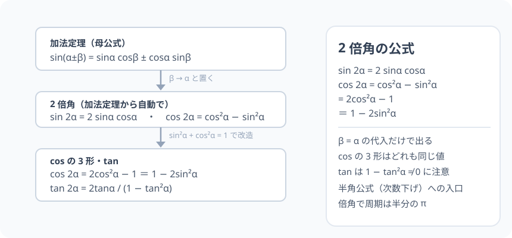

# 2 倍角の公式：母公式の「α を 2 回使う」だけ

> [!abstract] このノードの核心
> 加法定理の β を α に置き換える。それだけで sin・cos・tan の 2 倍角が全部生える。cos はさらに $\sin^2\alpha + \cos^2\alpha = 1$ を挟むと**3 つの形**になり、これが「次数下げ」という強力な変形を支える。

> [!success] 合格ライン
> 加法定理から 2 倍角をすべて導出（＝診断の答え）でき、cos の 3 つの形を「sin²+cos²=1 で相互変換」と言える。tan の分母の制約（1 − tan²α = 0 のとき）も説明できる。

## 記号の読み方

| 表記 | 読み方 | この教材での意味 |
|---|---|---|
| 2α | に・アルファ | α の倍角（α を 2 倍した角） |
| cos²α | コサイン二乗・アルファ | (cosα)² |
| 次数下げ | じすうさげ | cos²α → (1+cos2α)/2 と、2 乗を 1 乗に下げる変形 |

> [!tip] 代入するのは「角」でなく「記号」
> β を α に置き換えるのは、β の「文字」を α で書き替えること。sin(α+α) の中身は「角の足し算」なので、そのまま 2α に読む。

## 前提ノードと入口判定

機械的な前提関係は、プロジェクト内スナップショット `../ontology/math_euler_complete_ontology.json` を参照し、転記している。外部原本は `G:/マイドライブ/Eleanor Arroway/documents/math_euler_complete_ontology.json`。`trigonometry_master_ontology.md` は人間向けの全体地図として使い、IDや依存関係が異なる場合はJSONを優先する。

| 区分 | ノード・知識 | この教材で必要な理由 | 入口での判定 |
|---|---|---|---|
| 必須ノード（JSON正本） | `HS2-TRIG-ADDITION-01` 加法定理 | 2 倍角はその β=α 代入。母公式そのもの | sin(α+β) の式を書ける |
| 基礎知識（前ノード系） | `HS1-TRIG-IDENTITY-01` 基本相互関係 | cos の 3 形の変換（cos²α や sin²α を排出） | sin²α + cos²α = 1 をいつでも使える |

**入口判定の扱い:** JSON の診断問題「加法定理で β = α と置くと何が導かれるか？」を最初の目安にする。**代入すると sin 2α と cos 2α が獲得される**——この「母公式からの自動的派生」こそが本ノードの主題。後で P0 で確かめる。

## 到達点

この教材を閉じたとき、次のことを自分の言葉で説明できる。

- sin・cos・tan の 2 倍角公式を加法定理から導出できる。
- cos の 3 形（cos²−sin²・2cos²−1・1−2sin²）の変換が、基本相互関係の 1 本からできる。
- tan の分母が 0 になる α の除外が必要な理由。
- 2 倍角が「次数下げ」（半角へ）の布石であること。

## 入口：2 倍の角は、二つの同じ角の足し算だった

前ノードの帰り道。sin(α+β) の展開式に「β = α」と申し込む。すると角の足し算は 2α になり、右辺には sinα と cosα だけが残る。**新しく何かを作るのでなく、母公式がそのまま答えを出す。**

> [!example] 同じ例を最後まで使う
> α = 30°（と 45°・90°）を使い、数値での検証を通す。sin60° = √3/2 という既知の値に、`2 sin30° cos30°` が一致することを確かめる。

## 核となる図

図は「母公式 → β=α → 2 倍角 → cos3 形」の流れを線図にしたもの。覚えることは 1 つ（加法定理）、あとは代入と 1 本の恒等式。

| 図での要素 | 名前 | 役割 |
|---|---|---|
| 上段の箱 | 加法定理（母公式） | 出発点 |
| 中央の矢印 | β → α | 代入操作 |
| 中段の箱 | sin・cos の 2 倍角 | 1 次成果物 |
| 下段 | cos の 3 形・tan | 恒等式と割り算の恩恵 |

## まずやってみる

> [!question] 式を見る前の10秒
> $\sin(\alpha+\beta) = \sin\alpha\cos\beta + \cos\alpha\sin\beta$ の β を α に「置き換える」と、左辺・右辺はどうなるか書いてみる（答えは下）。

答えを確認する

左辺 sin(α+α) = sin 2α。右辺 sinα cosα + cosα sinα = 2 sinα cosα。**「sin 2α = 2 sinα cosα」が、それだけの操作で得られた。**

## 2 倍角の公式（導出つき）

### sin 2α：加法定理から

$$
\sin 2\alpha = \sin(\alpha+\alpha) = \sin\alpha\cos\alpha + \cos\alpha\sin\alpha = \boxed{2\sin\alpha\cos\alpha}
$$

### cos 2α：加法定理から

$$
\cos 2\alpha = \cos(\alpha+\alpha) = \cos\alpha\cos\alpha - \sin\alpha\sin\alpha = \boxed{\cos^2\alpha - \sin^2\alpha}
$$

### cos 2α の 3 形：恒等式 1 本で増える

$\sin^2\alpha + \cos^2\alpha = 1$（基本相互関係）を使うと

$$
\cos 2\alpha = \cos^2\alpha - \sin^2\alpha = \boxed{2\cos^2\alpha - 1\ =\ 1 - 2\sin^2\alpha}
$$

（第 2 形：sin²α = 1 − cos²α を代入。第 3 形：cos²α = 1 − sin²α を代入。）

**3 つの形は「どれも同じ値」であり、使いたい式に応じて適当な 1 つを選ぶ。**

### tan 2α

$$
\tan 2\alpha = \frac{2\tan\alpha}{1-\tan^2\alpha}
$$

（加法定理の tan 式に β=α。分母が 0（$\tan\alpha = \pm 1$、つまり α = π/4 + nπ/2 族）では成立しない——tan の定義域の「1−tan²α ≠ 0」確認が必須。）

## 数値で点検する

### α = 30°

$$
\sin 2\alpha = \sin 60° = \frac{\sqrt{3}}{2},\qquad 2\sin30°\cos30° = 2\cdot\frac{1}{2}\cdot\frac{\sqrt{3}}{2} = \frac{\sqrt{3}}{2}\quad\checkmark
$$

### α = 45°（cos の 3 形が同時に）

$$
\cos 90° = 0,\qquad \cos45°^2 - \sin45°^2 = \frac{1}{2} - \frac{1}{2} = 0,\qquad 2\cos^245° - 1 = 1 - 1 = 0\quad\checkmark
$$

### α = 90° と極端

- sin 180° = 0、2·sin90°·cos90° = 2·1·0 = 0 ✓
- α = 0：sin 0 = 0 ✓（2·0·1 = 0）
- α → 周期：sin(2(α+π)) = sin(2α + 2π) = sin 2α。**2 倍角は α の周期 π で同じ値**（倍角で周期が半分になる）。

## 3行まとめ

1. 加法定理に β = α：sin 2α = 2 sinα cosα、cos 2α = cos²α − sin²α、tan 2α = 2tanα/(1−tan²α)。
2. cos の 3 形は基本相互関係で遍く変換（2cos²α−1 ＝1−2sin²α）。次数下げに使う。
3. tan は分母 1−tan²α ≠ 0 に注意（α = π/4 + nπ/2 族除外）。

## 理解度サポート：どこまで分かっているか

### まず自己評価

- [ ] **0：未学習** — 2 倍角を覚えようとしているだけ
- [ ] **1：見れば分かる** — 加法定理からの流れを追える
- [ ] **2：自力で使える** — 3 形のうち必要な形を選んで計算できる
- [ ] **3：説明できる** — 導出・3形・tan の注意をまとめて説明できる

### 技能ごとの確認問題

| check_id | 確認する技能 | 問い | 答えが曖昧なときに戻る場所 |
|---|---|---|---|
| P0 | JSON指定の入口診断 | 加法定理で β = α と置くと何が導かれるか？ | 「まずやってみる」 |
| C1 | 導出 | sin 2α・cos 2α を加法定理から導く。 | 「sin 2α」「cos 2α」 |
| C2 | 3 形 | cos 2α = 2cos²α − 1 を基本相互関係から導く。 | 「cos 2α の 3 形」 |
| C3 | 数値 | α = 45° で cos 90° を 3 形のすべてで計算する。（答: 0） | 「数値で点検する」 |
| C4 | 注意点 | tan 2α が成立しない α を挙げ、理由を言う。（答: 1−tan²α=0） | 「tan 2α」 |
| C5 | 半角への橋 | cos 2α = 2cos²α − 1 を cos²α について解く。半角公式の姿が見えるか？ | 「次のノードへの橋」 |

解答と判定基準を開く

- **P0の答え:** sin 2α = 2 sinα cosα、cos 2α = cos²α − sin²α（と tan の式）。2 倍角の公式。
- **C1の答え:** β を α に置き換える操作の計算。
- **C2の答え:** sin²α = 1 − cos²α を cos²α−sin²α に代入 → 2cos²α − 1。
- **C3の答え:** どの形でも 0（2·(1/2)−1 = 0 等）。
- **C4の答え:** tanα = ±1（α = π/4 など）で分子分母が 0 になるため定義できない。除外する。
- **C5の答え:** cos²α = (1 + cos 2α)/2。これが半角公式の「cos² を 1 乗に落とす」形の入口。

**判定の目安:**

- P0とC1〜C5を正答かつ理由つきで → 次のノードへ
- C2を誤る → 恒等式 1 本（sin²+cos²=1）の代入を書き足す
- C4を誤る → tan の定義より分母チェックを復習

## よくある取り違え

- sin 2α = 2 sinα などと「2 倍を sin の中へ」展開する → **sin(2α) は sinα の 2 倍ではない（sin2α = 2sinαcosα）**。
- cos 2α の符号混合 → **cos²−sin² の√操作は「−1 形 2 つ」との変換が混ざる**。
- 3 形は数字が違うと思う → **どれも同じ値（同じ cos 2α）。計算で都合のよい形を選べる**。
- tan 2α の分母を確認せずに解として使う → **定義域の例外（tanα=±1）に留意**。
- 2 倍角に周期 2α が π だったことを忘れる → **入力 α の周期は π（倍角で周期が半分になる）**。

## 自力確認（teach-back）

教材を閉じて、次を声に出して答える。

1. 加法定理を書いて、β = α から sin・cos・tan の 2 倍角を導く。
2. cos 2α = 2cos²α − 1 を、基本相互関係 1 回で示す。
3. α = 15° のとき、sin30° = 1/2 を 2 sin15° cos15° で計算できることを説明する。
4. tan 2α の分母例外（1−tan²α = 0）と、その α の値のことを説明する。

## 次のノードへの橋

2 倍角は 2 つの道に分かれる。

- **半角の公式（`HS2-TRIG-HALF-01`）**：cos 2α = 2cos²α − 1 等を「cos²α・sin²α について解く」。これが「次数下げ」であり、積分・グラフの平滑化に使う。
- **3 倍角（`HS2-TRIG-TRIPLE-01`）**：sin(2α+α) をもう一度加法定理で開く——2 倍角＋加法定理の合成で得る。

また、この「2 倍すると周期が半分」と、応用は音波の倍音・機械振動にもつながる。

## インタラクティブ化の候補（レビュー後に判定）

- **有効候補: α のスライダー** — sin2α と 2 sinα cosα の 2 値をレールで照合。「必ず一致する」ことの演出。
- **有効候補: cos の 3 形を同時表示** — 3 行の式がすべて同じ高さに並ぶ（色付き）要素。
- **静的なままで十分:** 導出と数値だけでも十分成立。スライダーは 1 つ（合成波形）で。
- 動かすことそれ自体を合格条件にはしない。
