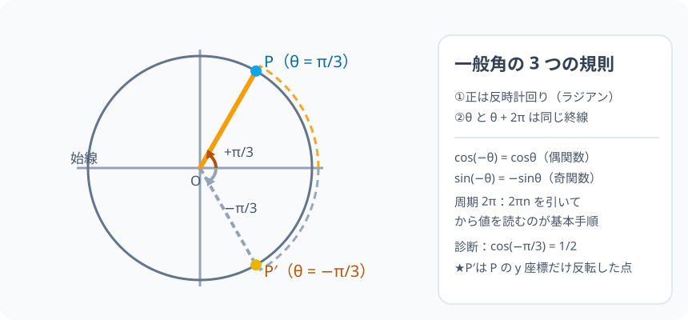

# 一般角：回転は 0°〜180° の箱を超えて、どこまでも続く

> [!abstract] このノードの核心
> 三角比の角は $0° \le \theta \le 180°$ の「前向きの角度」だけだった。だが回転が 1 周を超える・逆回りするのは日常（時計・車輪・渦）である。そこで角を**始線（x 軸正）から反時計回りに測る回転の総量**として定義し直すと、任意の実数 θ が意味を持つ。$2\pi$ 足しても（1 周しても）同じ位置、**負の角**も同じ世界の一部になり、三角比は「実数全体で定義された関数」へ生まれ変わる。

> [!success] 合格ライン
> 一般角の定義（始線・正は反時計回り・単位はラジアン）を述べ、$\theta + 2\pi$ が同じ点を指す理由を説明できる。$\cos(-\pi/3) = \cos\dfrac{\pi}{3} = \dfrac{1}{2}$ を偶関数性（cos は左右対称）で導ける。負角・360° 超の角の sin・cos を単位円で読める。

## 記号の読み方

| 表記 | 読み方 | この教材での意味 |
|---|---|---|
| 始線 | しせん | x 軸の正の向き。角の測り始めの線 |
| 終線 | しゅうせん | 回転の終わりの動径 |
| 負角 | ふかく | 時計回りの回転を表す負の角 |
| 周期 | しゅうき | 回転 1 周（2π）で元と同じ状態に戻ること |

> [!tip] 角度は「量」ではなく「回転量」
> 一般角では、角 θ は「線分がどれだけ回ったか」の総量である。1 周して戻ってきても回転量は残っている（4π も 2π も違う数）。

## 前提ノードと入口判定

機械的な前提関係は、プロジェクト内スナップショット `../ontology/math_euler_complete_ontology.json` を参照し、転記している。外部原本は `G:/マイドライブ/Eleanor Arroway/documents/math_euler_complete_ontology.json`。`trigonometry_master_ontology.md` は人間向けの全体地図として使い、IDや依存関係が異なる場合はJSONを優先する。

| 区分 | ノード・知識 | この教材で必要な理由 | 入口での判定 |
|---|---|---|---|
| 必須ノード（JSON正本） | `HS2-TRIG-RADIAN-01` 弧度法 | 一般角の目盛りはラジアンが標準。π rad = 180° を角度でなく弧長として読む | 90° をラジアンで表せる（答え: π/2） |
| 必須ノード（JSON正本） | `JH-GEO-ROTATION-01` 図形の回転移動 | 「反時計回りを正・時計回りを負」という回転の方向規則 | 点 (1,0) を 90° 反時計回りに回すと（答: (0,1)） |
| 必須ノード（JSON正本） | `HS1-TRIG-UNITCIRCLE-01` 単位円 | 点 P(cosθ, sinθ) という座標の読み方が、一般角でも通る | 単位円の点の座標で cos・sin を読める |
| 基礎知識（ノード外） | 負の数 | 負角（時計回り）の中での符号の扱い | (−3)² と −3² の違いを説明できる |

**入口判定の扱い:** JSON の診断問題「$\cos(-\pi/3)$ の値は？（答: 1/2）」を最初の目安にする。**負の角を「時計回り」に読めること**がこのノードの要なので、初回に分からなくてもよい。学び終えた後、P0 で確認する。

## 到達点

この教材を閉じたとき、次のことを自分の言葉で説明できる。

- 一般角の定義（始線・正は反時計回り・任意の実数）を述べ、負角と 360° 超の角の意味を図で示せる。
- $\theta + 2\pi n$（n は整数）がすべて同じ終線を指す理由（1 周＝同じ位置）を説明できる。
- $\cos(-\theta) = \cos\theta$・$\sin(-\theta) = -\sin\theta$ を単位円の対称性から説明し、診断問題の $\cos(-\pi/3) = 1/2$ を導ける。
- 一般角での sin・cos の値が、ラジアン表記の角から読める。

## 入口：「1 周して戻ったら『足きた』でいい？」

単位円の話は 0°〜180° で止まっていた。しかし、モーターの回転は 540 度も回るし、渦は負の回転もする。

そこで考え方の枠を変える。角 θ を「線分が回った**量**」として数える：

$$
\text{始線（x 軸の正の向き）から反時計回りに } \theta
$$

この定義なら、θ = 540°、θ = −90°、θ = 5π/4 はすべて本当の回転量として意味を持つ。そして単位円上の点 P(cosθ, sinθ) の式は**角の値が何でも**読める。見た目の「位置」が同じでも、回転量は異なる。

> [!example] 同じ例を最後まで使う
> 1 周を 2π とし、θ = π/3（60°）を基準の例に。それに 2π を加えたものを「1 周して来た同じ点」として扱い、−π/3 は「逆回り 60°」として使う。

## 核となる図

図では基準の点 P を θ = π/3（60°）の位置に置き、そこに至る回転の道すじ（+π/3・+2π＋π/3・−2π＋π/3 は同じ点、−π/3 は時計回りで別の点）を淡く描いている。

| 図での要素 | 名前 | 役割 |
|---|---|---|
| 始線 | x 軸正 | 回転の起点。ここから測る |
| 反時計の矢印 | 正の回転 | θ > 0 の回転方向 |
| 時計の矢印 | 負の回転 | θ < 0 の回転方向 |
| 点 P | 終線 | どこまで回ったかの点 |
| 円周 1 周 | 2π | 一周で同じ位置 |

## まずやってみる

> [!question] 式を見る前の10秒
> (a) θ = 2π + π/3（＝7π/3）の点は、θ = π/3 の点と同じ場所か。(b) では θ = −π/3 はどこを指すか。予想してから、定義を読む。

答えを確認する

(a) 2π は 1 周なので、2π + π/3 は 1 周した後の π/3——同じ終線。（b) −π/3 は時計回りに π/3 回り、π/3 とは y 軸（真横）を挟んで左右対称の位置。

## 一般角の定義

角 θ を始線（x 軸の正の向き）から**反時計回り**に測る。このとき

- θ > 0：反時計回りに θ 回転
- θ < 0：時計回りに |θ| 回転
- θ = θ₀ + 2πn（n：整数）で同じ終線

と定義する。**1 周の 2π を加えると、終線は必ず同じ場所**——それは「1 周したら元に戻る」ことの必然である。

## 周期性と偶奇性の導出

### cos(θ + 2π) = cosθ、sin(θ + 2π) = sinθ

回転 2π（またはそれより多く）で点は円周を一度巡り元に戻る。座標は元の点と同一なので

$$
\cos(\theta + 2\pi) = \cos\theta,\qquad
\sin(\theta + 2\pi) = \sin\theta
$$

をすべての実数 θ で成立する（周期 2π）。

### cos(−θ) = cosθ、sin(−θ) = −sinθ

負角は時計回り、正角は反時計回り。単位円の**左右対称（y 軸を挟む）**を見ると、−θ の点は θ の点の y 座標だけが反転する（x は同じ）。

$$
\cos(-\theta) = \cos\theta,\qquad \sin(-\theta) = -\sin\theta
$$

「cos が偶関数である」「sin が奇関数である」はこの形で、一般角の世界の必須の対称性である。

## 数値で点検する

### 診断問題：cos(−π/3)

偶関数の性質から

$$
\cos\left(-\frac{\pi}{3}\right) = \cos\frac{\pi}{3} = \frac{1}{2}
$$

（π/3 = 60° の値。もし、sin(−π/3) なら −√3/2 になる——これも奇関数の性質で。）

### θ = 7π/6 (210°) の場合

7π/6 = π + π/6。第 III 象限に来る（x 負・y 負）。cos 7π/6 = −√3/2、sin 7π/6 = −1/2。象限の符号を使って「どこにあるか」を確認してから値を読む。

### 13π/4 の場合

13π/4 − 2π = 5π/4（余り）。第 III 象限で cos 5π/4 = −√2/2、sin 5π/4 = −√2/2。**周期で引っ込めるのが基本手順**。

### 極端・対称の確認

- n が大きい：θ = 100π + π/6 → 100π は 50 周。引っ込めても遅れ +π/6（点は同じ）。
- θ = −π/6：cos(−π/6) = √3/2（偶）、sin(−π/6) = −1/2（奇）。

## 3行まとめ

1. 角は始線から反時計回りの回転量（単位ラジアン）。負の角は時計回り、360° 超・0° 未満もそのまま回転量として測る。
2. 2πn を足しても同じ終線（周期 2π）——奇数だけ引っ込める手順が使える。
3. cos は偶（左右対称）・sin は奇（点対称）で、負角の値もこの対称から即座に出る。

## 理解度サポート：どこまで分かっているか

### まず自己評価

- [ ] **0：未学習** — 一般角の意味を知らない
- [ ] **1：見れば分かる** — 図を見て回転を追える
- [ ] **2：自力で解ける** — 周期の引き算と象限符号で値が出せる
- [ ] **3：説明できる** — sin・cos の偶奇性と周期を単位円の対称性から説明できる

### 技能ごとの確認問題

| check_id | 確認する技能 | 問い | 答えが曖昧なときに戻る場所 |
|---|---|---|---|
| P0 | JSON指定の入口診断 | $\cos(-\pi/3)$ の値は？（答: 1/2） | 「数値で点検する」 |
| C1 | 一般角 | 負角と 360° 超の角の意味を自分の言葉で定義する。 | 「一般角の定義」 |
| C2 | 周期 | $\cos(\theta + 2\pi) = \cos\theta$ が成立する理由を、円周 1 周で説明する。 | 「周期性と偶奇性」 |
| C3 | 偶奇性 | $\sin(-\theta) = -\sin\theta$ を、単位円の対称性から描画して説明する。 | 「周期性と偶奇性」 |
| C4 | 引き算 | $\sin(9\pi/4)$ を周期を使って計算せよ。（答: √2/2） | 「数値で点検する」 |
| C5 | 前線への接続 | 単位円で一般角を扱えるようになったことで、三角関数のグラフ(y=sinθ)が「どこまで続くか」を説明する。 | 「次のノードへの橋」 |

解答と判定基準を開く

- **P0の答え:** $\cos(-\pi/3)$ は cos が偶関数のため $\cos(\pi/3) = 1/2$。
- **C1の答え:** 始線（x 軸正）からの総回転を反時計回り正のラジアンで測る。時計回りは負、2πn は同終線で扱う。
- **C2の答え:** 1 周は 2π。円周を 1 周して同じ点に戻るから、sin・cos の値は周期 2π で繰り返す。
- **C3の答え:** −θ の点は θ の点を y 軸で左右に反転した位置：x 座標は同じ、y 座標の符号が反転する。
- **C4の答え:** $9\pi/4 - 2\pi = \pi/4$。$\sin(\pi/4) = \sqrt{2}/2$。
- **C5の答え:** 実数全体で定義され周期 2π の関数になる。グラフでの波は水平方向に無限に続く。

**判定の目安:**

- P0とC1〜C5を正答かつ理由つきで → 次のノード（`HS2-TRIG-GRAPH-01`）へ
- C2を誤る → 周期の考え方を復習。一周 2π を自分の言葉で
- C3を誤る → 単位円の対称性（第 III・IV 象限への回転）に戻って描画で理解
- C4を誤る → 引っ込める方法（2π の倍数を引き算）

## よくある取り違え

- θ = 7π/3 と θ = π/3 が「違う点」を指すと思ってしまう → **2π だけの差は同じ終線**。
- 負角を「誤り・異常」と捉える → **時計回りの正の回転(−θ)。同じ世界の普通の回転**。
- cos(−θ) = −cosθ と混同する → **cos は偶関数で cos(−θ) = cosθ。負になるのは sin**。
- 周期を 4π と誤る → **単位円 1 周の長さは 2π。2 周回れば 4π**。
- 「一般角の続き」を測るのに度を併用 → **このノードはラジアン文字優先。度は θ の相対値で可、だが計算は 2π に合わせる**。

## 自力確認（teach-back）

教材を閉じて、次を声に出して答える。

1. 一般角の定義（始線・正の回転方向・ラジアン）を言う。
2. なぜ θ と θ + 2π が同じ終線を指すか、円周の長さの言葉で説明する。
3. cos(−θ) = cosθ と sin(−θ) = −sinθ を、単位円の対称性から説明する。
4. cos(11π/6) を、周期と象限の両方から計算して検算する。

## 次のノードへの橋

ここで三角比は「実数全体の関数」になった。この次の展開が 2 つある。

- **三角関数のグラフ（`HS2-TRIG-GRAPH-01`）**：y = sinθ のグラフは、単位円の点 P の y 座標を無限に並べたもので、周期 2π の波になる。
- **加法定理（`HS2-TRIG-ADDITION-01`）**とその派生（**2 倍角・半角**）も、`HS2-TRIG-GENERALANGLE-01` の上に立つ——一般角でしか成立しない式たちを扱うから。

## インタラクティブ化の候補（レビュー後に判定）

- **有効候補: θ のスライダー（回転の続きとして）** — 0 → 2π を出し、2π を過ぎると点が再び同じ位置に戻る様子。周期の意味の体感型。
- **有効候補: 負の向きにスライダー** — −π から正へと動かし、偶関数・奇関数の折り返しを見る。
- **静的なままで十分:** 対称性の説明は静的な単位円図＋式で閉じる。スライダーを 1 つ選ぶなら、最初のθスライダー。
- 動かすことそれ自体を合格条件にはしない。
