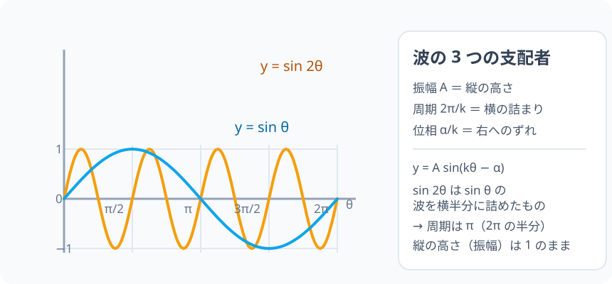

# 三角関数のグラフ：波を 3 つのパラメータで読む

> [!abstract] このノードの核心
> 単位円の点 P の y 座標（＝ sin θ）を、横軸 θ に並べて描くのが $y=\sin\theta$ のグラフである。波には 3 つの責任がある——**振幅 A**・**周期 $\dfrac{2\pi}{k}$**・**位相 $\dfrac{\alpha}{k}$**——と、$y=A\sin(k\theta-\alpha)$ にまとまる。

> [!success] 合格ライン
> $y = A\sin(k\theta-\alpha)$ について、振幅・周期・位相を 3 つのパラメータから読み取れ、$\sin k\theta$ の周期が $\dfrac{2\pi}{k}$ になる理由を sin の基本周期と k の挟み込みで説明できる。診断問題の $\sin 2\theta$ の周期が π になる理由も説明できる。

## 記号の読み方

| 表記 | 読み方 | この教材での意味 |
|---|---|---|
| θ | シータ | 横軸の角。ラジアンで測る |
| A | エー | 振幅。波の最大の高さ |
| k | ケー | 横の引き締め係数（θ との掛け算） |
| α | アルファ | 位相。波の始まりを左右へずらす角 |
| 周期 | しゅうき | 波が同じ形に戻る最短の間隔 |
| 振幅 | しんぷく | 波の最も高い点の、基準線からの距離 |

> [!tip] 音読するとき
> `sin θ` は前ノードと同じ「サイン・シータ」。ここでは θ が「円周上の角」から「横軸の値」に役割を変える。言葉は同じで、横軸がラジアン目盛りになることに注意。

## 前提ノードと入口判定

機械的な前提関係は、プロジェクト内スナップショット `../ontology/math_euler_complete_ontology.json` を参照し、転記している。外部原本は `G:/マイドライブ/Eleanor Arroway/documents/math_euler_complete_ontology.json`。`trigonometry_master_ontology.md` は人間向けの全体地図として使い、IDや依存関係が異なる場合はJSONを優先する。

| 区分 | ノード・知識 | この教材で必要な理由 | 入口での判定 |
|---|---|---|---|
| 必須ノード（JSON正本） | `HS2-TRIG-GENERALANGLE-01` 一般角と単位円の完全拡張 | グラフの横軸は負の角・360° を超える角も含むため。θ が任意の実数で波が続くこと | 角 $-30°$ と $330°$ の点 P の位置が同じだと説明できる |
| 必須ノード（JSON正本） | `HS1-TRIG-AREA-01` 三角形の面積・内接円・ヘロンの公式 | オントロジーの正本は前提に記載している。実質の役割は、S = 1/2・bc・sinA で sin の値が角度 A によって変わる実地を一度通していること | 2 辺 4・5・夾角 30° の三角形の面積が 5 になる計算の経緯を説明できる |
| 前ノード（このチェーンの土台） | `HS1-TRIG-UNITCIRCLE-01` 単位円 | 点 P の y 座標 = sin θ が、グラフの縦座標になるため | 単位円上の $60°$ と $120°$ の点の sin の値が等しい理由を説明できる |
| 必須ノード（JSON正本） | `HS2-TRIG-RADIAN-01` 弧度法 | グラフの横軸がラジアン目盛りであり、周期が $2\pi$ と表されるため | $180° = \pi$ と $360° = 2\pi$ を換算できる |
| 基礎知識（ノード外） | 一次関数 y = ax + b のグラフ | 「係数 a で倍率が変わる」「b で平行移動する」の感覚が、振幅・位相にそのまま引き継がれるため | $y = 2(x-1)$ のグラフを $y = x$ との比較で説明できる |

**入口判定の扱い:** JSON の診断問題「$y = \sin 2\theta$ の周期はいくつですか？（答: π）」を最初の目安にする。**答える前に学ぶのは構わない**が、後で「なぜ $2\pi$ でなく π か」を説明できなければ要復習——この説明能力が本ノードの合格ラインそのものなので、一度目で答えられなくても、学び終わってから戻ってしまうと説明しない。

## 到達点

この教材を閉じたとき、次のことを自分の言葉で説明できる。

- $y = A\sin(k\theta-\alpha)$ のグラフを描く手順を、単位円の点 P の動きとの対応で示せる。
- どのパラメータを変えると波がどう変わるかを、縦・横・ずれに分けて説明できる。
- $\sin k\theta$ の周期が $\dfrac{2\pi}{k}$ になる理由を途中式つきで導出できる。
- 位相のずれが α そのものではなく $\dfrac{\alpha}{k}$ である理由を、カッコをくくる変形で説明できる。

## 入口：円は一周で閉じてしまうが、波は続く

単位円では、点 P は円周を回るだけだった。θ をどんどん増やしても、P は同じ位置を行き来する——広がらない。一方、現象の時間的な繰り返し（音、振り子、波）を相手にするには「同じ値が繰り返されるもの」として生きた軌跡が必要である。

その方法は、単位円の点 P の y 座標だけを横軸 θ に対して並べることだ。θ が 1 周すると、波は 1 段だけ次の周期へ進む。円で丸く閉じていたものが、横に無限に続く波に変わる。

これが**三角関数**（三角比のグラフ化）の出発点である。ここでの三角比になぜ動きの繰り返しを読めるのかを、順に組み立てる。

## 核となる図

図では横軸が θ のラジアン目盛り、縦軸が sin θ の値（±1）である。

| 図での要素 | 名前 | 役割 |
|---|---|---|
| 青い波 | $y = \sin\theta$ | 基準の波。横軸の値を 1 個並べた周期 $2\pi$ の波 |
| オレンジの波 | $y = \sin 2\theta$ | 同角を 2 倍で進める波。周期 $\pi$ で同じ波が 2 回現れる |
| 横幅の `π`・`2π` | 周期の目盛り | 波が 1 回転するための θ の間隔 |
| 縦の ±1 | 振幅 | 波の高さが 1 を超えない基準 |

## まずやってみる

> [!question] 式を見る前の10秒
> 単位円の点 P(cos θ, sin θ) の y 座標だけを θ の値ごとに並べることを考える。まず θ = 0, π/2, π, 3π/2 のときに y = sin θ はいくらになるか、四方を回して答えを見ずに予想する。次に、$\sin 2\theta$ は $\theta = \pi/2$ のときにどこまで進んでいるか——「θ が π/2 進んだ時点で sin の引数はいくらか」を考え、2 の扱いを予想する。

答えを確認する

$\sin 0 = 0$、$\sin\frac{\pi}{2} = 1$、$\sin \pi = 0$、$\sin\frac{3\pi}{2} = -1$。

$\sin 2\theta$ について、$\theta = \frac{\pi}{2}$ のとき引数は $2\theta = \pi$。つまり y = sin θ のグラフで「$\theta = \frac{\pi}{2}$」の位置が、y = sin 2θ では「$\frac{\pi}{2}$」ではなく「$\theta = \frac{\pi}{4}$」でも起きる。2 は θ を 2 倍の速さで進ませる——波の幅が詰まる。

## 基本のグラフ：$y = \sin\theta$

単位円の点 P を θ の増加とともに回す。点 P の y 座標が $\sin\theta$ である（前ノードの定義）。この y 座標を、横軸 θ の上に絵として落とす：

| θ | 0 | $\frac{\pi}{2}$ | π | $\frac{3\pi}{2}$ | $2\pi$ |
|---|---|---|---|---|---|
| y 座標 = sin θ | 0 | 1 | 0 | −1 | 0 |

頂点の列はこの通り。$\theta$ が 1 周すると y は 0→1→0→−1→0 を 1 回通り、その後の $\theta$ に対してはコピーされる（点 P は同じ円周を一周しているのだから）。この「同じ形が繰り返される」性質が**周期**とよばれるものであり、基準の波 $y = \sin\theta$ の周期は $2\pi$ である。

この波の縦の範囲は −1 から 1 まで。振幅の定義は、波の基準線（y = 0）から最も高い点までの距離で、基準波では 1 である。

## 導出：3 つのパラメータの効果

### A は縦に引き延ばす（振幅）

$y = A\sin\theta$ を考える。sin の値 −1 から 1 のそれぞれが A 倍されるので、縦の範囲は −A から A になる。基準線からの距離は A になり、これを**振幅**と言う。横軸の位置（波形の形・周期）は変わらない。

$$
\boxed{\ \text{振幅} = A\ }
$$

### k は横に詰める（周期）

$y = \sin k\theta$ を考える。θ が $\frac{2\pi}{k}$ 進むと、引数は

$$
k\theta\ \text{が}\ k \times \frac{2\pi}{k} = 2\pi
$$

に達する。sin の引数が $2\pi$ 進めば値は 1 周期分戻るから、$\sin k\theta$ はその間隔で同じ形に戻る。したがって

$$
\boxed{\ \text{周期} = \frac{2\pi}{k}\ }
$$

k が 1 倍なら $2\pi$、2 倍なら π（半分）、3 倍なら $\frac{2\pi}{3}$（3 分の 1）。k は「どのくらいの幅に 1 周期を詰めるか」を決める係数である。

> [!warning] k が大きいほど詰まる
> 周期は $\dfrac{2\pi}{k}$ なので、k が大きくなると周期は**縮まる**。長くなると思い込まない。

### α はずらす（位相）

$y = \sin(k\theta - \alpha)$ を考える。カッコでくくると

$$
k\theta - \alpha = k\left(\theta - \frac{\alpha}{k}\right)
$$

つまり波の「開始点」を描くには、$\theta$ から常に $\dfrac{\alpha}{k}$ を引いた位置に引数を計算している。グラフとしては、波全体が右へ $\dfrac{\alpha}{k}$ だけ移動する。

$$
\boxed{\ \text{グラフのずれ（右向きに正）} = \frac{\alpha}{k}\ }
$$

**ずれるのは α そのものではなく、$\dfrac{\alpha}{k}$** である点に注意。位相の角 α を、k で割ってからグラフのずれに対応させる。

## 数値で点検する：$y = 3\sin(2\theta - \pi/2)$

実例として

$$
y = 3\sin\left(2\theta - \frac{\pi}{2}\right)
$$

を読む。

- **振幅:** A = 3。波は −3 と 3 の間を行き来する。
- **周期:** k = 2 ゆえ $T = \frac{2\pi}{2} = \pi$。
- **位相:** $\alpha = \frac{\pi}{2}$ ゆえ、ずれは $\frac{\alpha}{k} = \frac{\pi/2}{2} = \frac{\pi}{4}$ 右。

点検として $\theta = \frac{\pi}{4}$ のときの値を計算する。このとき引数は

$$
k\theta - \alpha = 2\cdot\frac{\pi}{4} - \frac{\pi}{2} = 0,\qquad
y = 3\sin 0 = 0
$$

波の山である $y = 3$ は引数が $\frac{\pi}{2}$ のとき、つまり $2\theta - \frac{\pi}{2} = \frac{\pi}{2}$，$\theta = \frac{\pi}{2}$ で来る。$\frac{\pi}{2}$ の位置に山が見えることを確認できる。

最後に極端な場合：A = 0 なら波は y = 0 の直線に潰れ、k → ∞ は周期 → 0（波が動きすぎて見えなくなる）、α = 0 ならずれる分だけ波形が基準の位置に戻る。設定なしのとき（A = 1, k = 1, α = 0）は基準波 $y = \sin\theta$ そのものに戻る。

## 3行まとめ

1. 単位円の点 P の y 座標を横軸 θ に並べて描くと、$y = \sin\theta$ の波になる。この波は $2\pi$ ごとに同じ形を繰り返す（周期 $2\pi$）。
2. 振幅 A → 縦に A 倍。周期 $\frac{2\pi}{k}$ → 横を k 等分に詰める。位相 $\frac{\alpha}{k}$ → 波全体を右へ $\frac{\alpha}{k}$ 移動する。
3. 3 つをまとめた $y = A\sin(k\theta - \alpha)$ が、単純な波を記述する基本形である。

## 理解度サポート：どこまで分かっているか

### まず自己評価

自己評価は手がかりであって、判定そのものではない。後の確認で、「答えと理由」を両方言えるかを確かめる。

- [ ] **0：未学習** — 周期・振幅・位相の言葉に馴染みがない
- [ ] **1：見れば分かる** — 図を見れば波形の関係をたどれる
- [ ] **2：自力で解ける** — 3 つのパラメータを式から読み取れる
- [ ] **3：説明できる** — 周期が $2\pi/k$ になる理由を、引数の進み方から説明できる

### 技能ごとの確認問題

答えだけでなく、「なぜそうなるか」を一文で説明する。各問題の結果から、復習する場所を特定できる。

| check_id | 確認する技能 | 問い | 答えが曖昧なときに戻る場所 |
|---|---|---|---|
| P0 | JSON指定の入口診断 | $y = \sin 2\theta$ の周期は？（答: π） | 「k は横に詰める」 |
| C1 | 読み取り | $y = 3\sin(2\theta - \pi/2)$ の振幅・周期・位相をそれぞれ求めよ。 | 「数値で点検する」 |
| C2 | 周期の導出 | $y = \sin k\theta$ の周期が $\frac{2\pi}{k}$ になることを、sin の基本周期と引数の変形で説明する。 | 「k は横に詰める」 |
| C3 | 振幅の意味 | $y = A\sin\theta$ のグラフを縦に引き延ばすとき、山の位置（位相）が変わらないのはなぜか。 | 「A は縦に引き延ばす」 |
| C4 | 位相の符号 | $y = \sin(\theta - \pi/4)$ と $y = \sin(\theta + \pi/4)$ のどちらが右へずれるか、理由を付けよ。（答: θ−π/4） | 「α はずらす」 |
| C5 | 拡張としての復習 | 前ノードの単位円で $\sin 120° = \sin 60°$ だったことと、$y = \sin\theta$ グラフでの对称が同じ現象であることを説明する。 | 前ノード `HS1-TRIG-UNITCIRCLE-01` |

解答と判定基準を開く

- **P0の答え:** 周期 = π。引数が $2\theta$ で、$\theta$ が π 進むと引数が $2\pi$ 進んで 1 周期分戻るため。
- **C1の答え:** 振幅 3、周期 π、位相 $\pi/4$（右へ）。それぞれ定義どおり A、$\frac{2\pi}{k}$、$\frac{\alpha}{k}$。
- **C2の答え:** $k\theta$ の引数が $2\pi$ 進むのに要する θ の量は $\frac{2\pi}{k}$。だから sin はその距離で同じ値に戻る。
- **C3の答え:** A は縦の値にのみ掛かるため。sin θ の角のタイミング（ピークやゼロ）は θ 側であり、縦に描くだけでは動かない。
- **C4の答え:** 引数をゼロにしたとき $\theta = \pi/4$ を出すのは $\sin(\theta-\pi/4)$ であり、波の特徴点（ゼロ点や山）が右に $\pi/4$ ずれる。
- **C5の答え:** $\sin(180°-\theta)=\sin\theta$ の对称性が、単位円では 2 つの位置が同じ y 座標になることに対応し、グラフでは y 軸对称…… 実際には θ = 60° と θ = 120° は同じ sin 値になる。グラフの山の 2 つの $\theta$（$\pi/3$ と $2\pi/3$）が同じ高さの意味である。

**判定の目安:**

- P0とC1〜C5を正答かつ理由つきで言える → 次のノードへ
- C1・C3を誤る → 「3 つのパラメータ」の節を読み直して再回答
- C2を誤る → 周期の導出が不完全。引数の進み方から再構築する
- 正答はできるが理由が曖昧 → 対応する本文を読み直して、同じ問題を再回答

## よくある取り違え

- 周期は $2\pi k$（k 倍に長くなる）→ **周期は $\frac{2\pi}{k}$。k は引数を速く進めるので、波は詰まる**。
- 位相は α だけずれる → **カッコをくくると $\frac{\alpha}{k}$。α を k で割った分だけ右へずれる**。
- 振幅 A のことを「周期に影響する」→ **A は縦方向にのみ関わる。周期は k だけが決める**。
- $y = \sin 2\theta$ の波を sin θ のグラフを「半分に下げた」と思う → **縦はそのまま。横を半分に詰めた波。周期だけが π になる**。
- 横軸を度数で読みたくなる → **高校の三角関数のグラフはラジアンが標準である。縦の値を読むには度数であってよいが、周期の計算では $2\pi$ を使う**。

## 自力確認（teach-back）

教材を閉じて、次を声に出して答える。

1. 単位円の点 P の y 座標が $y = \sin\theta$ のグラフになることを、横軸 θ の意味から説明する。
2. $f(\theta) = \sin(2\theta - \pi)$ について、振幅・周期・位相をそれぞれ求め、その結果がグラフにどう現れるかを説明する。
3. $y = A\sin(k\theta - \alpha)$ の周期が $\frac{2\pi}{k}$ であることを、途中式を省略せずに説明する。
4. $\cos\theta = \sin\left(\theta + \frac{\pi}{2}\right)$ であることを、単位円と位相の 2 つの見方で説明する。

## 次のノードへの橋

このノードまでで、三角比は「波を 3 つのパラメータで記述する三角関数」になった。この波の言葉は次に 2 つの展開を迎える。

- **足し算する:** 波を足すと何が起きるか、それが加法定理（$\sin(\alpha\pm\beta)$ の公式）である。山の重なり（同相・逆相）の考え方もここから生まれる。
- **合成する:** $a\sin\theta + b\cos\theta$ は加法定理の逆利用で 1 つの波 $R\sin(\theta+\phi)$ になる。これが「波の合体」で、本ノードの 3 パラメータがそのまま読める。

次のノード（`HS2-TRIG-ADDITION-01`）では、まず加法定理そのものを構築し、波形の足し算を付け行く。

## インタラクティブ化の候補（レビュー後に判定）

- **有効候補: θ を動かすとグラフ上で波が描かれる** — 単位円の点 P を回すのに同期して $y = \sin\theta$ のグラフ（1 周期分）がなぞられるもの。平らに読むと理解に正確さが加わる。
- **有効候補: A・k・α のスライダー** — 波が縦に伸び縮み・横に詰まる・ずれるのを一画面で比較できる。3 つの役割の区別が最も視覚的。
- **静的なままで十分:** 3 つの表・導出は静的に成立する。上のどちらか 1 つを選ぶなら、スライダー方が学習への効果が高い。
- 動かすことそれ自体を合格条件にはしない。
