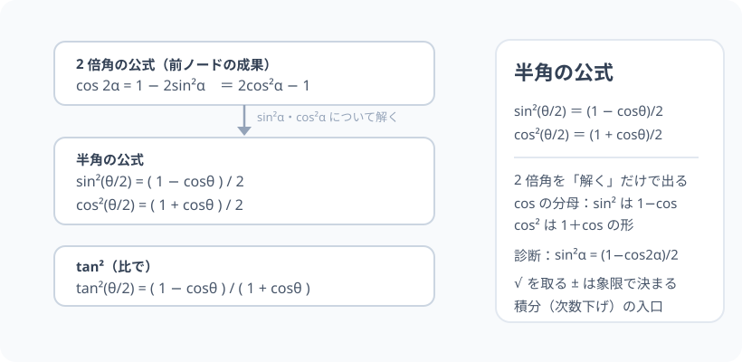

# 半角の公式：2 倍角を「逆再生」して次数を下げる

> [!abstract] このノードの核心
> 2 倍角の公式は「cos 2α を sin²α・cos²α で表した」もの。これを**逆向きに解くと、sin²(θ/2)・cos²(θ/2) が θ の一次式（1±cosθ)/2 になる**。sin² や cos² が「一次」に落ちる**次数下げ**——三角関数の積分・グラフ解析の強力な道具。

> [!success] 合格ライン
> cos 2α = 1 − 2sin²α から sin²α = (1−cos2α)/2 を導ける（＝診断の答え）。同様に cos²α も導け、θ/2 読み替えで半角公式の形になる。tan² は比として導出できる。

## 記号の読み方

| 表記 | 読み方 | この教材での意味 |
|---|---|---|
| θ/2 | シータ・ハーフ | θ の半分の角（半角） |
| 次数下げ | じすうさげ | 2 乗を 1 乗に落とす変形（積分で必須） |
| 分母 | ぶんぼ | 分数の下側（合成の中で最重要） |

> [!tip] 読みの囲い
> sin²(θ/2) は「サイン2乗・シータハーフ」。カッコの中が θ/2 である点に注意（sin(θ/2) を 2 乗した値）。

## 前提ノードと入口判定

機械的な前提関係は、プロジェクト内スナップショット `../ontology/math_euler_complete_ontology.json` を参照し、転記している。外部原本は `G:/マイドライブ/Eleanor Arroway/documents/math_euler_complete_ontology.json`。`trigonometry_master_ontology.md` は人間向けの全体地図として使い、IDや依存関係が異なる場合はJSONを優先する。

| 区分 | ノード・知識 | この教材で必要な理由 | 入口での判定 |
|---|---|---|---|
| 必須ノード（JSON正本） | `HS2-TRIG-DOUBLE-01` 2 倍角の公式 | 半角は 2 倍角の逆再生 | cos 2α = 1 − 2sin²α を書ける |
| 基礎知識（前ノード系） | 等式の変形（方程式を解く） | 求める値について「解く」操作 | x² = a から x = ±√a を出せる |

**入口判定の扱い:** JSON の診断問題「cos 2α = 1 − 2sin²α から sin²α = ?」を最初の目安にする。この式を sin²α について解く問題は、半角の第 1 歩そのもの。あれが解ければ合格ラインの視界に入った。

## 到達点

この教材を閉じたとき、次のことを自分の言葉で説明できる。

- 2 倍角公式を「知りたいものについて解く」→ sin²・cos² を 1 次に落とす手順。
- θ/2 読み替えで 2 つの半角公式（sin²・cos²）を導く。
- tan² 半角を sin²/cos² から導く。
- 使途（積分・高調波表示）と平方根を取る際の符号判定を説明できる。

## 入口：「2 倍角をまるごと裏返す」

前ノードで、cos 2α = 1 − 2sin²α を得た。ここで sin²α を「求めるもの」として 式を整理すると

$$
\sin^2\alpha = \frac{1 - \cos 2\alpha}{2}
$$

**2 倍角がそのまま何 1 つ、2 乗を 1 乗に落とす形になった。** ここに α → θ/2 を代入すれば、半角の公式。

> [!example] 同じ例を最後まで使う
> θ = 60°（と 90°・0°）を使い、半角値を一致/不一致で検証して通す。

## 核となる図

図は 2 倍角 → 解く → 半角、の流れ。覚えるべきは「2 倍角（前ノード）」だけで、半角はその**代数的な逆再生**である。

| 図での要素 | 名前 | 役割 |
|---|---|---|
| 上段の式 | 2 倍角 | 出発点（前ノードの成果） |
| 真ん中の矢印 | 「解く」 | 等式変形（sin²α・cos²α を片側へ） |
| 下段の式 | 半角 | 分母 2・分子 1∓cosθ |

## まずやってみる

> [!question] 式を見る前の10秒
> cos 2α = 1 − 2sin²α を、sin²α の値（左辺）に直す式変形だけしてみる。あとは「α を θ/2 と読み替えたら」終わり、と予告する。

答えを確認する

2sin²α = 1 − cos 2α → sin²α = (1 − cos 2α)/2。α = θ/2 と置けば sin²(θ/2) = (1 − cosθ)/2。

## 半角の公式（導出つき）

### sin²：(1 − cosθ)/2

$$
\cos 2\alpha = 1 - 2\sin^2\alpha
\quad\xrightarrow{\text{解く}}\quad
\sin^2\alpha = \frac{1 - \cos 2\alpha}{2}
$$

$\alpha = \dfrac{\theta}{2}$ と置いて

$$
\boxed{\ \sin^2\frac{\theta}{2} = \frac{1 - \cos\theta}{2}\ }
$$

### cos²：(1 + cosθ)/2

$$
\cos 2\alpha = 2\cos^2\alpha - 1
\quad\xrightarrow{\text{解く}}\quad
\cos^2\alpha = \frac{1 + \cos 2\alpha}{2}
$$

$$
\boxed{\ \cos^2\frac{\theta}{2} = \frac{1 + \cos\theta}{2}\ }
$$

（2 倍角の第 2 形 2cos²−1 を使った。第 3 形 1−2sin² を使うと上の sin² 版。**2 つを 2 倍角の 2 形で対応付ける**。）

### tan²：比で

$$
\tan^2\frac{\theta}{2} = \frac{\sin^2(\theta/2)}{\cos^2(\theta/2)} = \frac{1 - \cos\theta}{1 + \cos\theta}
$$

## 数値で点検する

### θ = 60°

$$
\sin^2 30° = \frac{1-\cos 60°}{2} = \frac{1 - 1/2}{2} = \frac{1}{4}\quad\checkmark
$$

$$
\cos^2 30° = \frac{1+\cos 60°}{2} = \frac{3/2}{2} = \frac{3}{4}\quad\checkmark
$$

### θ = 90°・0°

- cos²45° = (1+0)/2 = 1/2 ✓、sin²45° = (1−0)/2 = 1/2 ✓
- 0°：sin²0 = 0/[1] = 0 ✓、cos²0 = (1+1)/2 = 1 ✓

## 3行まとめ

1. cos 2α = 1 − 2sin²α（又は 2cos²α − 1）を「解く」だけで sin²α・cos²α の 1 次化が証明される。
2. α = θ/2 と読めば、sin²(θ/2) = (1−cosθ)/2・cos²(θ/2) = (1+cosθ)/2。
3. tan² は比（(1−cosθ)/(1+cosθ)）。**平方根を取るときの ± 選びは象限で決まる**。

## 理解度サポート：どこまで分かっているか

### まず自己評価

- [ ] **0：未学習** — 半角公式の見方がまだ分からない
- [ ] **1：見れば分かる** — 2 倍角の変形を追える
- [ ] **2：自力で使える** — 与えられた θ の三角比から半角を計算できる
- [ ] **3：説明できる** — 2 倍角の逆再生・3 つの導出・±や分母の注意が言える

### 技能ごとの確認問題

| check_id | 確認する技能 | 問い | 答えが曖昧なときに戻る場所 |
|---|---|---|---|
| P0 | JSON指定の入口診断 | cos 2α = 1 − 2sin²α から sin²α = ? を導く。（答: (1−cos2α)/2） | 「sin² の導出」 |
| C1 | 導出 sin² | sin²(θ/2) を cos 2α = 1−2sin²α から導く。 | 「sin² の導出」 |
| C2 | 導出 cos² | cos²(θ/2) を cos 2α = 2cos²α − 1 から導く。 | 「cos² の導出」 |
| C3 | 数値 | θ = 60° のとき sin²30°・cos²30° を両公式で出し、sin30°=1/2・cos30°=√3/2 と照合する。 | 「数値で点検する」 |
| C4 | 符号の注意 | sin(θ/2) を求めるとき、平方根の ± は何で決まるか説明する。 | 「3行まとめ」3 |
| C5 | 積分の予告 | この「次数下げ」がどこで役立つか（例を 1 つ）述べる。 | 「次のノードへの橋」 |

解答と判定基準を開く

- **P0の答え:** sin²α = (1 − cos 2α)/2。
- **C1の答え:** 2sin²α = 1 − cos 2α → ÷2 → 読替え。
- **C2の答え:** 2cos²α = 1 + cos 2α → ÷2 → 読替え。
- **C3の答え:** sin² = 1/4・cos² = 3/4。既知値（1/2 と √3/2 の 2 乗）と一致。
- **C4の答え:** θ/2 の終線が第何象限か（sin は第 I・II で正など）。象限の符号規則。
- **C5の答え:** ∫sin²θ dθ が 2 倍角・たとえば 半角で次数下げして簡単に積分できる。グラフでは 高調波（2 倍の周波数成分）表示。

**判定の目安:**

- P0とC1〜C5を正答かつ理由つきで → 次のノードへ
- C2を誤る → cos の第 2 形（2cos²−1）を復習
- C4を誤る → 象限の符号（単位円・一般角）を再確認

## よくある取り違え

- 半角公式を「2 倍角の 2 つ覚え」と感じる → **2 倍角は 2 つ（sin・cos）、半角は同じ式の逆（分子が 1∓cosθ）**。
- sin²(θ/2) の「±」を忘れて √ の ± を落とした答えにする → **三角比の値は角の象限で符号を決める**。
- cos の分母の符号（1−cosθ vs 1+cosθ） → **sin² 側 = 1−cos、cos² 側 = 1+cos（分母に 2）**。
- tan² を単独で取り出す時、比の分母 1 + cosθ = 0 は考えない → **θ = π で分母 0。定義域注意**。
- 半角で 2 倍角の「3 形どれでも」とは違う 2 形を使い分ける → **sin² を出したいときは「1−2sin²」形、cos² は「2cos²−1」形**。

## 自力確認（teach-back）

教材を閉じて、次を声に出して答える。

1. cos 2α の公式 2 形から半角 2 公式を導く流れを、変形を飛ばさずに書く。
2. tan²(θ/2) = (1−cosθ)/(1+cosθ) が成立することを示す。
3. θ = 120° のとき、半角公式で sin²60° = 3/4 を導き、√3/2 の 2 乗と照合する。
4. 積分・高調波のどちらかで「次数下げ」の使い道を 1 例述べる。

## 次のノードへの橋

半角の公式はここから 2 方向に進む。

- **積分（微積分の前段）**：sin²θ・cos²θ を 1 次に落とせば、∫sin²θ dθ などは多項式積分に帰着する。
- **3 倍角・和積（`HS2-TRIG-TRIPLE-01`・`PRODSUM`）**：cos の現行（高調波）に直接つながる。sin²θ = (1−cos2θ)/2 は「2 倍周波の成分」そのものの表示である。

## インタラクティブ化の候補（レビュー後に判定）

- **有効候補: θ のスライダーで sin²(θ/2) と (1−cosθ)/2 を重ね描き** — 複製が常に同意することを表示。
- **有効候補: 2 倍角→半角の式変換を段階表示** — ステップを押すと変形が 1 行ずつ。
- **静的なままで十分:** 変形は等号の列。動かすならスライダーを 1 つ。
- 動かすことそれ自体を合格条件にはしない。
