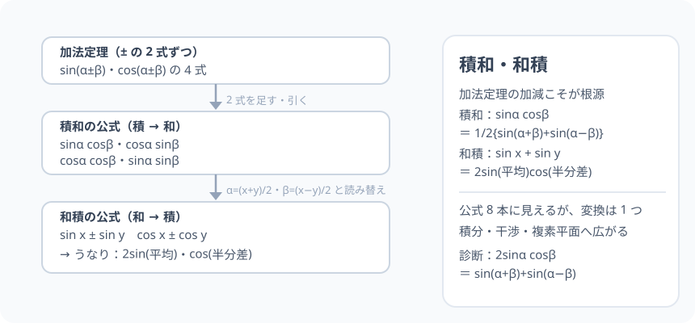

# 積和・和積：掛け算と足し算が、加法定理で「互い違い」になる

> [!abstract] このノードの核心
> 加法定理の ± の 2 式を**足す・引く**だけで、積の形（sinα cosβ など）が和の形（sin(α+β) ± sin(α−β)）に変わる。同じ変換を逆に使えば和→積（和積）。**公式 8 本に見えるが、ごく根底は加法定理の加減という 1 つの操作**。波の干渉・うなりの数理はこの変換の帰結である。

> [!success] 合格ライン
> sin(α+β) と sin(α−β) の和・差から、2sinα cosβ・2cosα sinβ を導ける（＝診断の答え）。α=(x+y)/2・β=(x−y)/2 の読み替えで和積公式（sin x ± sin y）に言い換えられる。

## 記号の読み方

| 表記 | 読み方 | この教材での意味 |
|---|---|---|
| 積和 | せきわ | 積（掛け算）から和（足し算）へ |
| 和積 | わせき | 和から積へ（逆変換） |
| うなり | うなり | 近い周波数の 2 波の和が、振幅の緩やかなゆらぎになって聞こえる現象 |

> [!tip] 変換語彙
> 「積を和に」「和を積に」。変換する向きをセットで呼ぶ。

## 前提ノードと入口判定

機械的な前提関係は、プロジェクト内スナップショット `../ontology/math_euler_complete_ontology.json` を参照し、転記している。外部原本は `G:/マイドライブ/Eleanor Arroway/documents/math_euler_complete_ontology.json`。`trigonometry_master_ontology.md` は人間向けの全体地図として使い、IDや依存関係が異なる場合はJSONを優先する。

| 区分 | ノード・知識 | この教材で必要な理由 | 入口での判定 |
|---|---|---|---|
| 必須ノード（JSON正本） | `HS2-TRIG-ADDITION-01` 加法定理 | ± の 2 式（sinα±β・cosα±β）を加減する | sin(α±β) の 2 式を書ける |
| 必須ノード（JSON正本） | `HS2-TRIG-HALF-01` 半角 | 積→和の変数変換（和積）で θ/2 型の読み替えと同一手順 | sin²θ = (1−cos2θ)/2 を導ける |

**入口判定の扱い:** JSON の診断問題「2 sinα cosβ はどう表されるか」を最初の目安にする。**加法定理の 2 式を足すこと**そのものなので、苦労する要素はない。P0 で操作を確認する。

## 到達点

この教材を閉じたとき、次のことを自分の言葉で説明できる。

- 積和の 4 式を加法定理（± 2 式の加減）で導出できる。
- 和積の 4 式を逆変換（α・β の読み替え）で導出できる。
- うなりの説明（sin x + sin y → 2 sin{(x+y)/2} cos{(x−y)/2}）ができる。
- 積が和になると計算が進む場面（積分など）を 1 例挙げられる。

## 入口：「うなりは数学で書ける」

ギターの 2 弦がほんのわずかずれて鳴るとき、聞こえるふわふわと揺れる音。これは 2 つの近い sin 波の和が、**平均の速さの波 × ゆっくり変わる振幅（cos）**に分解できる、という単純な数学の仕掛けである。

> [!example] 同じ例を最後まで使う
> 加法定理の 4 式（sinα±β・cosα±β）を足し引きし、α=60°・β=30° で検算し、**sin90° + sin30° = 3/2** の和 1 本で通す。

## 核となる図

図は「加法定理 ± 2 式 → 足す/引く → 積和 4 式 → 読み替え → 和積 4 式」の流れ。**変換は一方向の 2 回だけ**である。

| 図での要素 | 名前 | 役割 |
|---|---|---|
| 上段 | 加法定理 ± 4 式 | 出発点 |
| 中段 | 積和（sinα cosβ など） | 和の形に変換 |
| 下段 | 和積（sin x ± sin y など） | 逆変換（α・β の読み替え） |

## まずやってみる

> [!question] 式を見る前の10秒
> sin(α+β) と sin(α−β) を 2 つの式で書き、**2 式を足し合わせて**みる。sin の項が 2 度出て cosα sinβ が消える、と 予想する。

答えを確認する

$$
\sin(\alpha+\beta) + \sin(\alpha-\beta) = 2\sin\alpha\cos\beta
$$

sinα cosβ が sin の和 1 本に変わった（cosα sinβ は相殺）。これが診断の答え。

## 積和の公式（加法定理の加減）

### sinα cosβ・cosα sinβ：sin の ± 2 式を足し引き

$$
\sin(\alpha+\beta) = \sin\alpha\cos\beta + \cos\alpha\sin\beta
$$

$$
\sin(\alpha-\beta) = \sin\alpha\cos\beta - \cos\alpha\sin\beta
$$

**足す** → $\sin(\alpha+\beta)+\sin(\alpha-\beta) = 2\sin\alpha\cos\beta$

$$
\boxed{\ \sin\alpha\cos\beta = \frac{1}{2}\big\{\sin(\alpha+\beta) + \sin(\alpha-\beta)\big\}\ }
$$

**引く** → $\sin(\alpha+\beta)-\sin(\alpha-\beta) = 2\cos\alpha\sin\beta$

$$
\boxed{\ \cos\alpha\sin\beta = \frac{1}{2}\big\{\sin(\alpha+\beta) - \sin(\alpha-\beta)\big\}\ }
$$

### cosα cosβ・sinα sinβ：cos の ± 2 式を足し引き

$$
\cos(\alpha+\beta) = \cos\alpha\cos\beta - \sin\alpha\sin\beta,\qquad
\cos(\alpha-\beta) = \cos\alpha\cos\beta + \sin\alpha\sin\beta
$$

$$
\boxed{\ \cos\alpha\cos\beta = \frac{1}{2}\big\{\cos(\alpha+\beta) + \cos(\alpha-\beta)\big\}\ }
$$

$$
\boxed{\ \sin\alpha\sin\beta = \frac{1}{2}\big\{\cos(\alpha-\beta) - \cos(\alpha+\beta)\big\}\ }
$$

（2 式目の符号に注意 一一 差で出るのは「大きい方から小さい方」の順。）

## 和積の公式（逆変換）

積和の式で $\alpha = \dfrac{x+y}{2}$・$\beta = \dfrac{x-y}{2}$ を代入すると（例：sinα cosβ → sin x + sin y）

$$
\boxed{\ \sin x + \sin y = 2\sin\frac{x+y}{2}\cos\frac{x-y}{2}\ }
$$

$$
\boxed{\ \sin x - \sin y = 2\cos\frac{x+y}{2}\sin\frac{x-y}{2}\ }
$$

$$
\boxed{\ \cos x + \cos y = 2\cos\frac{x+y}{2}\cos\frac{x-y}{2}\ }
$$

$$
\boxed{\ \cos x - \cos y = -2\sin\frac{x+y}{2}\sin\frac{x-y}{2}\ }
$$

## 数値で点検する

### 診断問題：2 sinα cosβ

$$
2\sin60°\cos30° = 2\cdot\frac{\sqrt{3}}{2}\cdot\frac{\sqrt{3}}{2} = \frac{3}{2},\qquad
\sin90° + \sin30° = 1 + \frac{1}{2} = \frac{3}{2}\quad\checkmark
$$

### sin 20° cos 40° タイプの考察

積のままでは扱いにくい値も、和の形にすれば「角の差」が可視化される。20° と 40° の和・差（60°・−20°）で読み替えられる。

### うなりへ：sin x + sin y (x≒y)

例：角周波数がほぼ等しい 2 つの信号 $\sin(\omega_1 t)$ と $\sin(\omega_2 t)$ を足すと、$\omega_1,\,\omega_2$ の平均の速さの波が、$(\omega_1-\omega_2)/2$ の遅さで振幅をゆっくり動かす：

$$
\sin\omega_1 t + \sin\omega_2 t = 2\underbrace{\sin\!\left(\frac{\omega_1+\omega_2}{2}t\right)}_{\text{平均の波}}\underbrace{\cos\!\left(\frac{\omega_1-\omega_2}{2}t\right)}_{\text{ゆっくり変わる振幅}}
$$

**「ゆっくり動く cos」がうなりの正体。**（これは C5 のための布石。）

## 3行まとめ

1. 加法定理の ± 2 式を足す・引くと、積→和（積和の 4 式）。
2. 変数を（x+y)/2・(x−y)/2 に読み替えたのが和積の 4 式。
3. 音の干渉・積分（∫sinαcosβ）など、向きを選べる自由がこの変換の強さ。

## 理解度サポート：どこまで分かっているか

### まず自己評価

- [ ] **0：未学習** — 積和・和積を「公式 8 個」と暗記しようとしている
- [ ] **1：見れば分かる** — 加減から出る流れを追える
- [ ] **2：自力で使える** — 必要な向き（積→和など）に変換できる
- [ ] **3：説明できる** — 2 式の加減・読み替え・うなりの構造を説明できる

### 技能ごとの確認問題

| check_id | 確認する技能 | 問い | 答えが曖昧なときに戻る場所 |
|---|---|---|---|
| P0 | JSON指定の入口診断 | 2 sinα cosβ は加法定理の和でどう表されるか？ | 「まずやってみる」 |
| C1 | sin 系の加減 | sin(α+β) ± sin(α−β) の 2 式から積和公式を作る。 | 「sinα cosβ…」 |
| C2 | cos 系の加減 | cosα cosβ・sinα sinβ の積和式を作る。 | 「cosα cosβ…」 |
| C3 | 読み替え | 積和から sin x + sin y の和積式を導出する。 | 「和積の公式」 |
| C4 | 数値 | 2 sin60° cos30° を両側で計算する（答: 3/2）。 | 「数値で点検する」 |
| C5 | うなり | sin x + sin y（x≒y）が 2sin(平均)cos(半分差) になる意義を説明する。 | 「うなりへ」 |

解答と判定基準を開く

- **P0の答え:** sin(α+β) + sin(α−β)。
- **C1の答え:** 2 式を±で加減し 1/2 を掛ける（上式）。
- **C2の答え:** cos(α+β) ± cos(α−β) の加減。
- **C3の答え:** sin（x) + sin(y) の積和公式に α=(x+y)/2・β=(x−y)/2 を入れて整理。
- **C4の答え:** 左辺 3/2・右辺 1+1/2 = 3/2。
- **C5の答え:** 平均の波（速い振動）と半分差の cos（遅い振幅変化）に分解した。音としては「うなり」（フェイディングの繰り返し）として聞こえる。

**判定の目安:**

- P0とC1〜C5を正答かつ理由つきで → 次のノードへ
- C2を誤る → cos の ± 2 式の符号を読み直す（和差の注意）
- C3を誤る → 読み替え（αが（x+y)/2 となる理由）

## よくある取り違え

- 積和・和積を別々の公式 8 個と暗記する → **1 変換の行き帰り。加法定理の加減 1 本から全部出る**。
- sinα sinβ の符号を + にする → **cos(α−β) − cos(α+β)（差の順を間違えない）**。
- 和積で sin x + sin y の y の変数変換を x/ y 平均の引数を誤る → **(x+y)/2・(x−y)/2 を必ずつける**。
- 積分で積→和の向きを選べない → **「積を分解する」= 積和型が定番（sin の積を和で）。**
- うなりの説明を「波 2 本の干渉・結びつきの力」と誤って語る → **半分差の cos が振幅を緩やかに動かしているだけ。波自体は加算されたまま**。

## 自力確認（teach-back）

教材を閉じて、次を声に出して答える。

1. 加法定理 4 式から積和 4 式を導く（加減の手続きを言語化）。
2. 和積 4 式が、読み替え 1 手で出ることを言う。
3. 2 sinα cosβ を両側から計算し、一致を確認する（α=60°, β=30°）。
4. うなりを「2 sin(平均) cos(半分差)」の言葉で説明する。

## 次のノードへの橋

- **ド・モアブル（`HS3-COMPLEX-DEMOIVRE-01`）**：積を和に・和を積にの切替は、オイラー・複素数平面の射影（回転核の積分解）と同型。
- **三角関数の積分**：∫sinα cosβ などは積和で多項式積分に落ちる。物理では音響（コンプライアンス）や光の干渉の基礎。

## インタラクティブ化の候補（レビュー後に判定）

- **有効候補: 2 波（近い周波数）の重ね描き** — うなりの「ゆっくり変わる振幅」を動画で。
- **有効候補: 積和⇄和積のスライダー** — α・β・x・y の値を変えながら両側の値が一致する、その様子を 交互 確認。
- **静的なままで十分:** 検算・導出は十分成立。動かすならうなり（2 波）。
- 動かすことそれ自体を合格条件にはしない。
