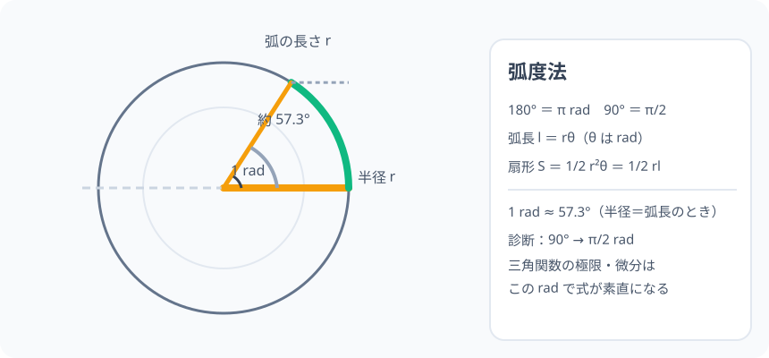

# 弧度法：角度を「弧の長さ」で測る新しいものさし

> [!abstract] このノードの核心
> 度数法（90°・180°）は分かりやすいが数学の計算には「単位で引っかかる」。**ラジアン（rad）は「半径 1 の円なら、角の大きさがそのまま弧の長さ」**という測り方。すると角度に π が入るが、弧長・扇形の面積が $l = r\theta$・$S = \frac{1}{2}r^2\theta$ と極めて素直になる。三角関数の微分をラジアンが支える。

> [!success] 合格ライン
> 180° = π rad を、円周 = 2πr と中心角の比例から導ける。90° → π/2 を換算でき、$l = r\theta$・$S = \frac{1}{2}r^2\theta$ の理由を「全円の分割」で説明できる。診断 P0 を計算付きで答える。

## 記号の読み方

| 表記 | 読み方 | この教材での意味 |
|---|---|---|
| rad | ラジアン | 角度の単位。省略することも多い |
| π | パイ | 円周率（3.14159…） |
| l | エル | 弧の長さ |
| 扇形 | おうぎがた | 円の弧と 2 本の半径で囲まれる形 |

> [!tip] rad は省略してよい
> 特に数学Ⅱ以降では「π/4」とだけ書くのが普通。関数の引数やπ は rad の意味で読む。

## 前提ノードと入口判定

機械的な前提関係は、プロジェクト内スナップショット `../ontology/math_euler_complete_ontology.json` を参照し、転記している。外部原本は `G:/マイドライブ/Eleanor Arroway/documents/math_euler_complete_ontology.json`。`trigonometry_master_ontology.md` は人間向けの全体地図として使い、IDや依存関係が異なる場合はJSONを優先する。

| 区分 | ノード・知識 | この教材で必要な理由 | 入口での判定 |
|---|---|---|---|
| 必須ノード（JSON正本） | `ELEM-CIRCLE-01` 円周率 π と円の計量 | 円周 2πr・面積 πr²・中心角と弧長の比例 | 半径 5 の円の円周（=10π）と面積（=25π）を言える |
| 必須ノード（JSON正本） | `HS1-TRIG-UNITCIRCLE-01` 単位円 | 半径 1 の円の世界がラジアンで弧度法と直結 | 単位円の定義（半径 1）を言える |
| 基礎知識（C類） | 比例の感覚 | 弧長・扇形の面積が中心角に比例 | 中心角が 2 倍になれば弧も 2 倍（比例）と分かっている |

**入口判定の扱い:** JSON の診断問題「90° をラジアンで表すと？」を最初の目安にする。この 1 問で「180° = π」の換算は試される。**なぜ 180° が π と一致するか**を説明できることが合格ラインで、P0 で確認する。

## 到達点

この教材を閉じたとき、次のことを自分の言葉で説明できる。

- 度数法の不都合（計算で角度が残る）とラジアンの嬉しさ（弧長＝半径×角）。
- 180° = π rad の成り立ち（円周 = 2πr を半径 r で割る）。
- 扇形の弧長・面積の式（l = rθ、S = 1/2 r²θ = 1/2 rl）。
- 度数とラジアンの主要換算（90°=π/2、60°=π/3、45°=π/4、30°=π/6）。

## 入口：「度数法は人間のため、ラジアンは計算のため」

地球上の『度』は太陽と月ひと回転（360 日→360°）ほどの人間の時の単位。数学的な便利さは「円周をどう使うか」に宿る。角度を「半径 1 の円の弧の長さで測る」——それを**弧度法（rad）**と言う。

> [!example] 同じ例を最後まで使う
> 半径 3 の円（中心角 π/3）で、弧長・扇形の面積を 1 例で通す。

## 核となる図

図の円の半径（オレンジ）と、その半径と同じ長さだけ進んだ弧（緑）の間の角が 1 rad である。**「半径＝弧長」になるところまで進むと、それが角度 1 rad**。

| 図での要素 | 名前 | 役割 |
|---|---|---|
| 半径 r | 長さ r | 弧長測のものさし |
| 弧（緑） | 長さ r | 1 rad 分の弧 |
| 角 | 1 rad | 半径 1 の円においた時の角 |
| 斜線の扇 | π/2 の扇 | 90° = π/2 の対応の目印 |

## まずやってみる

> [!question] 式を見る前の10秒
> 円の半径を r とする。中心角が「1 rad」のとき、弧長はいくらか。また中心角が 2π（1 周）のときの弧長を使い、円周の公式と一致するか確かめる。

答えを確認する

1 rad の弧長は「半径と等しい長さ」＝ r。2π rad（1 周）なら弧長 2πr——円周公式とぴったり。

## 弧度法の定義

長さ r の半径を持つ円で、**半径に等しい長さの弧に対する中心角を 1 ラジアン（1 rad）**とする。

$$
\text{半径} = \text{弧長} \Longrightarrow \text{角} = 1\ \mathrm{rad}
$$

比例関係より、中心角 θ（rad）の弧長は

$$
l = r\theta
$$

### 180° = π rad がどこから出るか

1 周（弧長 = 円周 = 2πr）は $\theta = \dfrac{2\pi r}{r} = 2\pi\ \mathrm{rad}$。半周は

$$
180° = \pi\ \mathrm{rad}
$$

完全換算表：

| 度数 | ラジアン |
|---|---|
| 360° | 2π |
| 180° | π |
| 90° | π/2 |
| 60° | π/3 |
| 45° | π/4 |
| 30° | π/6 |
| 1 rad | ≈ 57.3° |

## 扇形の計量

### 弧長

$$
l = r\theta \qquad （θ は rad）
$$

### 面積

扇形は「円全体（πr²）を角度 2π で割った θ 分」:

$$
S = \frac{\theta}{2\pi}\times \pi r^2 = \frac{1}{2} r^2 \theta
$$

また $l = r\theta$ を使うと

$$
S = \frac{1}{2} r l \quad（三角形の面積の形 \times r の見た目）
$$

## 数値で点検する

### 診断問題

$$
90° = \frac{180°}{2} = \frac{\pi}{2}\ \mathrm{rad}
$$

### 半径 3・中心角 π/3 の扇形（例で通す）

$$
l = 3\cdot\frac{\pi}{3} = \pi,\qquad
S = \frac{1}{2}\cdot 9 \cdot \frac{\pi}{3} = \frac{3\pi}{2}
$$

### 極端な場合

- 全円 θ = 2π → S = πr² ✓（円の面積公式）
- θ = 0 → l = 0・S = 0
- r = 1（単位円）の 2π rad の弧長 = 2π（円周そのもの）✓

## 3行まとめ

1. ラジアンは「半径に等しい長さの弧に対する角」として定義される。円そのものの長さ（半径）で角を測る。
2. 180° = π rad。°との換算はπ/180 倍。
3. 弧長 l = rθ、扇形 S = 1/2 r²θ = 1/2 rl。これで角度が式の中に自然に残り、微分（三角関数）や極限の準備が整う。

## 理解度サポート：どこまで分かっているか

### まず自己評価

- [ ] **0：未学習** — rad を理解できていない
- [ ] **1：見れば分かる** — 図を見てラジアンの意味を追える
- [ ] **2：自力で解ける** — 度数→ラジアン、弧長の計算ができる
- [ ] **3：説明できる** — 180°=π の根拠を、円周と半径の円滑を説明できる

### 技能ごとの確認問題

| check_id | 確認する技能 | 問い | 答えが曖昧なときに戻る場所 |
|---|---|---|---|
| P0 | JSON指定の入口診断 | 90° をラジアンで表すと？（答: π/2） | 「数値で点検する」 |
| C1 | 定義 | 1 rad を「半径に等しい弧」の意味で説明する。 | 「弧度法の定義」 |
| C2 | 換算 | 60°・45°・30° をラジアンで表す。（答: π/3・π/4・π/6） | 「180° = π の由来」 |
| C3 | 弧長 | 半径 4・中心角 π/4 の弧長。（答: π） | 「扇形の計量」 |
| C4 | 面積 | 半径 4・中心角 π/4 の扇形の面積。（答: 2π） | 「扇形の計量」 |
| C5 | 全域の感覚 | 全円・半円・90° の扇形の面積をラジアン式で出し、円の公式と併合する。 | 「数値で点検する」極端 |

解答と判定基準を開く

- **P0の答え:** 90° = π/2。
- **C1の答え:** 弧長が半径の長さと等しいときの中心角が 1 rad。半径 r での弧 r が 1 ラジアン。
- **C2の答え:** π/3・π/4・π/6。
- **C3の答え:** l = 4・π/4 = π。
- **C4の答え:** S = 1/2・16・π/4 = 2π。
- **C5の答え:** θ=2π → S = πr²（円）、θ=π → S = πr²/2（半円）、θ=π/2 → S = πr²/4（90°扇）。円の 1/2・1/4 分割と一致。

**判定の目安:**

- P0とC1〜C5を正答かつ理由つきで → 次のノードへ
- C2を誤る → 換算表を暗記でなく π/180 の掛け算から
- C3・C4を誤る → rθ と 1/2 r²θ の導出を復習

## よくある取り違え

- ラジアンを「π を単位にした変な度数」と思う → **弧長基準の自然な角度。度数との目的が違う**。
- 弧長 l = rθ で θ を度数で代入 → **θ が rad でないと比例が破れる**。° を代入しないこと。
- 扇形の面積 1/2 rl vs 1/2 r²θ の混同 → **どちらも同じ。l = rθ で相互変換**。
- π/2 を「90° とは別物」と誤解 → **90° と π/2 は別々の単位で同じ角**。
- rad 表記の省略に混乱 → **数学II では π/2・π/3 書けば rad と読み、度数には° を書く**。

## 自力確認（teach-back）

教材を閉じて、次を声に出して答える。

1. 「半径と等しい弧の角」から 1 rad の定義を話し、半径 r の一般化を導く。
2. 円周公式（2πr）を使って 180° = π を導く。
3. 半径 5・中心角 π/3 の扇形の弧長・面積を計算する。
4. なぜ三角関数の微分・極限でラジアンが不可避になるかを、言葉で述べる。

## 次のノードへの橋

- **一般角（`HS2-TRIG-GENERALANGLE-01`）**: 一般角の定義はラジアン前提。
- **三角関数の極限（`HS3-CALC-LIMIT-TRIG-01`）**: lim sinθ/θ = 1 は θ が rad のときにだけ成立する。度数だと 180/π の係数が出てしまう。
- **デモワーブの…** 少し先の複素数平面（極形式 z = r(cosθ + i sinθ)）の θ も rad が標準。

## インタラクティブ化の候補（レビュー後に判定）

- **有効候補: 角度⇄ラジアンのスライダー** — 弧の長さと半径の比が常に等しくなる様を見る。
- **有効候補: 扇形を動かして 1 rad を発見** — 弧=半径になる瞬間にラベルが光る仕掛け。
- **静的なままで十分:** 図と換算表は十分成立。スライダーを 1 つだけ付けるなら弧=半径ハイライト。
- 動かすことそれ自体を合格条件にはしない。
