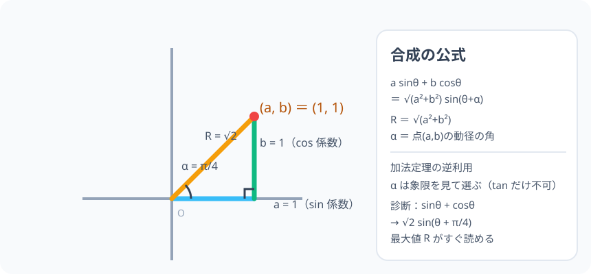

# 三角関数の合成：2 つの波は、1 つの波に合体できる

> [!abstract] このノードの核心
> $\sin\theta$ と $\cos\theta$ の一次結合 $a\sin\theta + b\cos\theta$ は、**加法定理の逆操作**でたった 1 つの波 $R\sin(\theta + \alpha)$ にまとまる。$R = \sqrt{a^2+b^2}$（三平方）で、$\alpha$ は点 $(a,b)$ の動径の角。ここが「**波の合体**」の形の完成形である。

> [!success] 合格ライン
> 加法定理を逆に見る手順（R cosα = a・R sinα = b）で合成の式を導ける。sinθ + cosθ = √2 sin(θ + π/4) を計算でき、なぜ α = π/4 なのかを (a,b) = (1,1) の動径として説明できる。

## 記号の読み方

| 表記 | 読み方 | この教材での意味 |
|---|---|---|
| 合成 | ごうせい | 2 つの波（sin・cos の項）を 1 つの波にまとめる |
| R | アール | 合成波の振幅。√(a²+b²) |
| α | アルファ | 合成後の位相ずれ。点 (a,b) の動径の角 |

> [!tip] 合成前後の読み方
> a sinθ + b cosθ（合成前）→ R sin(θ+α)（合成後）。**合成後はグラフノードの「振幅・位相」がそのまま読める**。

## 前提ノードと入口判定

機械的な前提関係は、プロジェクト内スナップショット `../ontology/math_euler_complete_ontology.json` を参照し、転記している。外部原本は `G:/マイドライブ/Eleanor Arroway/documents/math_euler_complete_ontology.json`。`trigonometry_master_ontology.md` は人間向けの全体地図として使い、IDや依存関係が異なる場合はJSONを優先する。

| 区分 | ノード・知識 | この教材で必要な理由 | 入口での判定 |
|---|---|---|---|
| 必須ノード（JSON正本） | `HS2-TRIG-ADDITION-01` 加法定理 | 合成はその「逆利用」 | sin(α+β) = sinα cosβ + cosα sinβ を書ける |
| 必須ノード（JSON正本） | `JH-GEO-PYTHAGORAS-01` 三平方の定理 | 振幅 R = √(a²+b²) の根拠 | a²+b²=c² を直角三角形で使える |
| 必須ノード（JSON正本） | `HS2-TRIG-GRAPH-01` グラフ（振幅・周期・位相） | 合成後の「1 つの波」の読み方 | 振幅 A・位相 α/k を式から読める |

**入口判定の扱い:** JSON の診断問題「sinθ + cosθ の合成」を最初の目安にする。直観的に「√2 になるんじゃないか」は浮かぶかもしれないが、**α = π/4 がどこから来るか**（(1,1) の動径の角）を説明できることが合格ライン。P0 で確認。

## 到達点

この教材を閉じたとき、次のことを自分の言葉で説明できる。

- 合成の公式 a sinθ + b cosθ = R sin(θ+α) を、加法定理の逆操作から導ける。
- R = √(a²+b²)・α は (a,b) の動径の角、という意味。
- tanα = b/a だけでは α が一意でない理由（象限）を説明できる。
- sinθ + cosθ = √2 sin(θ+π/4)・sinθ + √3cosθ = 2sin(θ+π/3) を計算できる。

## 入口：「位相がずれた波を足したら、どんな波が出る？」

音声が 2 つ（sinθ と cosθ）、位相が少しずれているとき、足すとこもごもではなく、**また 1 つのきれいな波**になる。その振幅と位相は足した 2 つの波を「片割れ」として組み直せば出る——その組み直しの公式が合成である。

> [!example] 同じ例を最後まで使う
> sinθ + cosθ を 1 本の主役として使い、(1, 1) の動径 → √2・π/4 → の合成処理を一貫して通す。

## 核となる図

図は点 (a, b) の位置と動径。**a と b は直角三角形の 2 辺、斜辺 が R（振幅）**、x 軸と動径の間の角が α である。

| 図での要素 | 名前 | 役割 |
|---|---|---|
| 点 (1, 1) | 係数の組 | sinθ の係数 a・cosθ の係数 b |
| 動径 R | 振幅 | 長さ √2 |
| 角 α | 位相ずれ | 動径の角（45°=π/4） |
| 直角三角形 | a・b・R | 三平方で R |

## まずやってみる

> [!question] 式を見る前の10秒
> sinθ + cosθ の最大値は？ もしこれが 1 波にまとまるなら、振幅はどれだけになるか。2 つの波（sin: 最大 1、cos: 最大 1）の「同時に最大」はできないので、max は 1+1=2 ではない、という予想をする。

答えを確認する

R = √(1²+1²) = √2 ≈ 1.41。sinθ と cosθ のピークは位相がずれているので同時に 2 にならず、√2 が真の最大値。これが合体して 1 つの波になる正体。

## 合成の公式（導出）

### 逆操作の見通し

加法定理：

$$
R\sin(\theta+\alpha) = R\sin\theta\cos\alpha + R\cos\theta\sin\alpha = (R\cos\alpha)\sin\theta + (R\sin\alpha)\cos\theta
$$

この右辺が $a\sin\theta + b\cos\theta$ と一致する様にしたい。

### 未知数 2 つの中身

$$
a = R\cos\alpha,\qquad b = R\sin\alpha
$$

2 式を扱う。まず 2 乗して足す：

$$
a^2 + b^2 = R^2(\cos^2\alpha + \sin^2\alpha) = R^2
$$

即ち

$$
R = \sqrt{a^2 + b^2}
$$

そして、α は「点 (a, b) の動径の角」。$\cos\alpha = a/R$、$\sin\alpha = b/R$ となる角を選ぶ（**tanα = b/a だけだと象限が 2 通りあるので、三角比の符号で決める**）。

$$
\boxed{\ a\sin\theta + b\cos\theta = R\sin(\theta+\alpha),\qquad R = \sqrt{a^2+b^2},\qquad \cos\alpha=\frac{a}{R},\ \sin\alpha=\frac{b}{R}\ }
$$

## 数値で点検する

### 診断問題：sinθ + cosθ

$$
R = \sqrt{1^2+1^2} = \sqrt{2},\qquad
\cos\alpha = \frac{1}{\sqrt{2}},\ \sin\alpha = \frac{1}{\sqrt{2}} \quad\Rightarrow\quad \alpha = \frac{\pi}{4}
$$

$$
\boxed{\ \sin\theta + \cos\theta = \sqrt{2}\sin\!\left(\theta + \frac{\pi}{4}\right)\ }
$$

点検：θ = 0 で左辺 = 1、右辺 = √2·√2/2 = 1 ✓。θ = π/4 で左辺 = √2、右辺 = √2 ✓（最大値）。

### sinθ + √3 cosθ

$$
R = \sqrt{1+3} = 2,\qquad \cos\alpha=\frac{1}{2},\sin\alpha=\frac{\sqrt{3}}{2}\Rightarrow \alpha=\frac{\pi}{3},\qquad 2\sin\!\left(\theta+\frac{\pi}{3}\right)
$$

### 符号が違う例：sinθ − cosθ

$$
R = \sqrt{2},\qquad \cos\alpha=\frac{1}{\sqrt{2}},\ \sin\alpha=-\frac{1}{\sqrt{2}}\ \Rightarrow\ \alpha=-\frac{\pi}{4},\qquad \sqrt{2}\sin\!\left(\theta-\frac{\pi}{4}\right)
$$

（(1, −1) は第 IV 象限の動径——**α の選択に象限が効く例**。）

## 3行まとめ

1. 加法定理を逆読み：R sin(θ+α) を展開すると a sinθ + b cosθ。
2. R = √(a²+b²)・α は (a,b) の動径の角（象限は符号で特定）。
3. 合成すると「振幅・位相がすぐ読める波 1 本」になる。sinθ+cosθ = √2 sin(θ+π/4)。

## 理解度サポート：どこまで分かっているか

### まず自己評価

- [ ] **0：未学習** — 合成の見方（逆利用）を知らない
- [ ] **1：見れば分かる** — 図を見て R・α を追える
- [ ] **2：自力で使える** — 与えられた a・b から合成計算ができる
- [ ] **3：説明できる** — 逆操作・R の導出・象限による α の選び方を説明できる

### 技能ごとの確認問題

| check_id | 確認する技能 | 問い | 答えが曖昧なときに戻る場所 |
|---|---|---|---|
| P0 | JSON指定の入口診断 | sinθ + cosθ を r sin(θ+α) の形に合成する。（答: √2 sin(θ+π/4)） | 「数値で点検する」 |
| C1 | 逆操作の見て | R sin(θ+α) の展開から a・b の対応を取り出す。 | 「逆操作の見通し」 |
| C2 | R の導出 | R = √(a²+b²) を sin²+cos²=1 で導く。 | 「未知数 2 つの中身」 |
| C3 | 計算 | sinθ + √3cosθ を合成せよ。（答: 2sin(θ+π/3)） | 「数値で点検する」 |
| C4 | 象限 | sinθ − cosθ の α が −π/4 になる理由を説明する。 | 「符号が違う例」 |
| C5 | 応用の橋 | 合成が「グラフで周期波のピーク」を見つけるうえでどう効くか述べる。 | 「次のノードへの橋」 |

解答と判定基準を開く

- **P0の答え:** √2 sin(θ + π/4)。R=√2・α=π/4。
- **C1の答え:** R sinθcosα + R cosθsinα の係数比較で a = Rcosα・b = Rsinα。
- **C2の答え:** a²+b² = R²(cos²+sin²) = R² → R = √(a²+b²)。
- **C3の答え:** 上の通り 2sin(θ+π/3)。
- **C4の答え:** (1, −1) が第 IV 象限。cosα = 1/√2 > 0・sinα = −1/√2 < 0 を満たすのは α = −π/4。
- **C5の答え:** 最大値 R・最小値 −R が一発で出る。三角関数の最大最小問題の定石。

**判定の目安:**

- P0とC1〜C5を正答かつ理由つきで → 次のノードへ
- C2を誤る → 2 乗和の導出（R² にまとめる）
- C4を誤る → 動径の象限（点の位置）を描いて符号を見る

## よくある取り違え

- R を a+b とする → **三平方で √(a²+b²)。a,b は「係数」であって、そのまま足さない**。
- α を tanα = b/a で一意に決める → **tan は 2 象限やる。必ず (a,b) の位置で決定**。
- sin・cos の係数の扱いを逆にする（cosθ が b）→ **a = sinθ 係数、b = cosθ 係数**。
- 「1 波になる」のは a、b が定数のとき → **θ の依存が sin/cos のみの一次結合に限る**。
- 合成には「−」「+」の違いを別公式と感じる → **すべて同じ（R sin(θ+α) vs R sin(θ−α) が図的に出る）**。

## 自力確認（teach-back）

教材を閉じて、次を声に出して答える。

1. 加法定理の逆利用から、a・b ↔ R・α の対応を作る。
2. R = √(a²+b²) を導出する。
3. sinθ + cosθ → √2 sin(θ + π/4) の計算を、間を飛ばさず行う。
4. sinθ − cosθ と α = −π/4 の理由を象限を描いて説明する。

## 次のノードへの橋

- **波形図の利用**：合成後は y = R sin(θ+α) のグラフ。前ノード `HS2-TRIG-GRAPH-01` の「振幅・周期・位相」が一般の最小最大問題に効く。
- **複素数平面（`HS3-COMPLEX-PLANE-01`）**：a + bi の極形式 r(cosθ+isinθ) —— 合成は実数世界での「極形式との対話」。
- **和積・積和（`HS2-TRIG-PRODSUM-01`）**：波の線形結合と「干渉」の原理。

## インタラクティブ化の候補（レビュー後に判定）

- **有効候補: (a,b) をドラッグ** — 動径 R と 角 α が動き、合成後波形が変化する。合成そのものの観察。
- **有効候補: 2 波と合成波の重ね描き** — sinθ・cosθ（薄色）と合成波（太線）の同時描画。位相のずれが 1 波に収まる。
- **静的なままで十分:** 図と数値検証は完全に成立。動かすならドラッグ。
- 動かすことそれ自体を合格条件にはしない。
