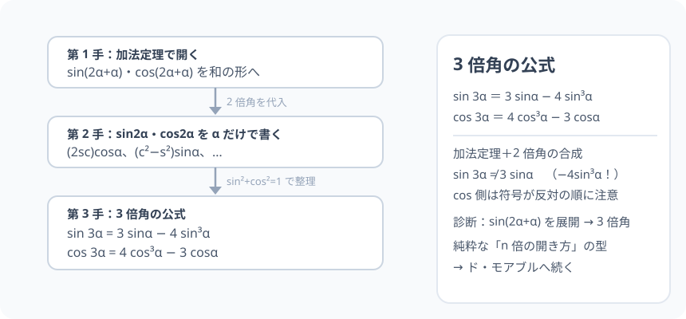

# 3 倍角の公式：2 倍角と加法定理の「合成」

> [!abstract] このノードの核心
> 3 倍角は「もう一度だけ生まれ直す」。$\sin(3\alpha)$ を $\sin(2\alpha+\alpha)$ と見て、加法定理 → 2 倍角を代入 → 整理すると、$\sin 3\alpha = 3\sin\alpha - 4\sin^3\alpha$ の 1 行になる。**公式そのものより、この「合成して解く」手順の方が、先のすべて（n 倍角・ド・モアブル）に効く。**

> [!success] 合格ライン
> $\sin(2\alpha+\alpha)$ の加法定理展開 → 2 倍角代入 → sin²+cos²=1 で整理、の 3 手順で sin 3α・cos 3α を導出できる（＝診断の答え）。α=30° で sin90°=1 と一致することを検算できる。

## 記号の読み方

| 表記 | 読み方 | この教材での意味 |
|---|---|---|
| 3α | さん・アルファ | α を 3 倍した角 |
| sin³α | サイン三乗・アルファ | (sinα)³ |
| 整理 | せいり | 同類項の計算・恒等式の代入で一まとめにする |

> [!tip] sin³α の読み
> sin 3α と sin³α は**別もの**。sin 3α は「3 倍の角の sin」、sin³α は「sinα の 3 乗」。書き分ける。

## 前提ノードと入口判定

機械的な前提関係は、プロジェクト内スナップショット `../ontology/math_euler_complete_ontology.json` を参照し、転記している。外部原本は `G:/マイドライブ/Eleanor Arroway/documents/math_euler_complete_ontology.json`。`trigonometry_master_ontology.md` は人間向けの全体地図として使い、IDや依存関係が異なる場合はJSONを優先する。

| 区分 | ノード・知識 | この教材で必要な理由 | 入口での判定 |
|---|---|---|---|
| 必須ノード（JSON正本） | `HS2-TRIG-DOUBLE-01` 2 倍角の公式 | 3 倍角の展開に 2 倍角が入る | sin 2α = 2 sinα cosα を書ける |
| 必須ノード（JSON正本） | `HS2-TRIG-ADDITION-01` 加法定理 | sin(2α+α)・cos(2α+α) を開く第一手 | sin(α+β)・cos(α+β) の展開式を書ける |

**入口判定の扱い:** JSON の診断問題「sin(2α+α) を展開して 3 倍角」を最初の目安にする。**展開の列を正確に書くことが最重要**。展開の各段（加法定理 → 2 倍角 → 恒等式）は P0 と C 問題で確かめる。

## 到達点

この教材を閉じたとき、次のことを自分の言葉で説明できる。

- sin・cos の 3 倍角公式を、加法定理と 2 倍角から導出できる。
- tan の 3 倍角を sin/cos の比から導く。
- α = 30°，45° で既知の値に一致することを検算できる。
- 「合成して解く」手順が n 倍角（ド・モアブル）への布石になっていることを説明できる。

## 入口：もう 1 回だけ「足し算で分解」

2 倍角で「sin(2α) を sin(α+α) と見る」ことを覚えた。3 倍角も同じ：$\sin(3\alpha) = \sin(2\alpha + \alpha)$。加法定理の「2 つ目の角」に 2 倍角を置き、そのまま 2 倍角公式を代入。**何も新しく覚えることはない。**

> [!example] 同じ例を最後まで使う
> α = 30°・45°・90° を使う。sin90°=1・cos135°=−√2/2・sin270°=−1 を既知値として検証に使う。

## 核となる図

図は「sin(2α+α)／cos(2α+α)」を加法定理で開き、2 倍角導入、1 つの式に整理する 3 段。**本文の展開の道しるべ**である。

| 図での要素 | 名前 | 役割 |
|---|---|---|
| 段 1 | 加法定理 | sin(2α+α) = sin2α cosα + cos2α sinα に開く |
| 段 2 | 2 倍角を代入 | sin2α・cos2α を α だけの式に |
| 段 3 | 整理 | 基本相互関係で sin³α・cos³α のみに |

## まずやってみる

> [!question] 式を見る前の10秒
> sin(2α + α) に加法定理を使うと「sin2α cosα + cos2α sinα」。この式の sin2α・cos2α を 2 倍角の式に置き換えたら、α だけの式になることを先回りして確認し、待ち構える。

答えを確認する

置き換えると (2 sinα cosα) cosα + (cos²α − sin²α) sinα = 2 sinα cos²α + cos²α sinα − sin³α。sin²+cos²=1 で cos²α = 1 − sin²α を入れると 3sinα − 4sin³α に落ち着く。

## sin 3α の導出

$$
\sin 3\alpha = \sin(2\alpha + \alpha)
$$

$$
= \sin 2\alpha\cos\alpha + \cos 2\alpha\sin\alpha\quad\text{（加法定理）}
$$

$$
= (2\sin\alpha\cos\alpha)\cos\alpha + (\cos^2\alpha - \sin^2\alpha)\sin\alpha\quad\text{（2倍角を代入）}
$$

$$
= 2\sin\alpha\cos^2\alpha + \cos^2\alpha\sin\alpha - \sin^3\alpha
= 3\sin\alpha\cos^2\alpha - \sin^3\alpha
$$

$\cos^2\alpha = 1 - \sin^2\alpha$ を代入して：

$$
\boxed{\ \sin 3\alpha = 3\sin\alpha - 4\sin^3\alpha\ }
$$

## cos 3α の導出

$$
\cos 3\alpha = \cos(2\alpha + \alpha)
$$

$$
= \cos 2\alpha\cos\alpha - \sin 2\alpha\sin\alpha
$$

$$
= (\cos^2\alpha - \sin^2\alpha)\cos\alpha - (2\sin\alpha\cos\alpha)\sin\alpha
$$

$$
= \cos^3\alpha - \sin^2\alpha\cos\alpha - 2\sin^2\alpha\cos\alpha
= \cos^3\alpha - 3\sin^2\alpha\cos\alpha
$$

$\sin^2\alpha = 1 - \cos^2\alpha$ を代入して：

$$
\boxed{\ \cos 3\alpha = 4\cos^3\alpha - 3\cos\alpha\ }
$$

## tan 3α

$$
\tan 3\alpha = \frac{3\tan\alpha - \tan^3\alpha}{1 - 3\tan^2\alpha}
$$

（sin/cos から導くか、加法定理の tan 式に 2 倍角を代入。分母 1 − 3tan²α = 0 の α は定義域外。）

## 数値で点検する

### α = 30°

$$
\sin 90° = 3\cdot\frac{1}{2} - 4\cdot\frac{1}{8} = \frac{3}{2} - \frac{1}{2} = 1\quad\checkmark
$$

### α = 45°

$$
\cos 135° = 4\left(\frac{\sqrt{2}}{2}\right)^3 - 3\cdot\frac{\sqrt{2}}{2} = 4\cdot\frac{2\sqrt{2}}{8} - \frac{3\sqrt{2}}{2} = \sqrt{2} - \frac{3\sqrt{2}}{2} = -\frac{\sqrt{2}}{2}\quad\checkmark
$$

### α = 90°

$\sin 270° = -1$。公式側：3(1) − 4(1) = −1 ✓（sin³90° = 1）。

## 3行まとめ

1. 3 倍角は「sin(2α+α)・cos(2α+α)」と見て、加法定理 → 2 倍角代入 → 恒等式で整理、の 3 段。
2. sin 3α = 3s − 4s³、cos 3α = 4c³ − 3c。**符号と係数に注意（sin 側は −4s³、cos 側は +4c³ の順）**。
3. tan は分母の注意（1 − 3tan²α ≠ 0）。この「合成して解く」手順が n 倍角・ド・モアブルへ続く。

## 理解度サポート：どこまで分かっているか

### まず自己評価

- [ ] **0：未学習** — 3 倍角を暗記しようとしている
- [ ] **1：見れば分かる** — 導出フローを追える
- [ ] **2：自力で使える** — 与えられた α から 3 倍角を計算できる
- [ ] **3：説明できる** — 展開 3 段を理由つきで再現できる

### 技能ごとの確認問題

| check_id | 確認する技能 | 問い | 答えが曖昧なときに戻る場所 |
|---|---|---|---|
| P0 | JSON指定の入口診断 | sin(2α + α) を展開して 3 倍角の公式を作る。 | 「sin 3α の導出」 |
| C1 | 導出 sin | sin 3α の 3 段の展開列を書く。 | 「sin 3α の導出」 |
| C2 | 導出 cos | cos 3α の 3 段の展開列を書く。 | 「cos 3α の導出」 |
| C3 | 数値 | α = 15° のとき sin45° を公式で確認する（答: √2/2）。 | 「数値で点検する」 |
| C4 | 記号 | sin 3α と sin³α の違いを言う。 | 「記号の読み方」 |
| C5 | 発展の橋 | この「合成して解く」がどう n 倍角（ド・モアブル）へ続くか述べる。 | 「次のノードへの橋」 |

解答と判定基準を開く

- **P0の答え:** sin(2α+α) = sin2α cosα + cos2α sinα = ... = 3 sinα − 4 sin³α。
- **C1の答え:** 上述の 3 行（加法定理・代入・恒等式）を追記する。
- **C2の答え:** 上述の 3 行（cos 側）。
- **C3の答え:** 3·sin15° − 4·sin³15° が √2/2 になる（sin15° が (√6−√2)/4 経由）。
- **C4の答え:** sin 3α は角を 3 倍、sin³α は値を 3 乗。
- **C5の答え:** (cosα + i sinα)³ を展開し、複素数の実部・虚部に分けると 3 倍角そのもの（ド・モアブル）。倍角の「回の合成」が n 倍へ一般化する。

**判定の目安:**

- P0とC1〜C5を正答かつ理由つきで → 次のノードへ
- C1・C2を誤る → 展開の列を一行ずつなぞる（飛ばさない）
- C3を誤る → 30°・45°・90° 系をまず復習

## よくある取り違え

- sin 3α = 3 sinα と思い込む → **sin 3α = 3s − 4s³。−4s³ の項がある**。
- sin(3α) と sin³α の混同 → **角 3 倍 vs 値 3 乗。文脈注意**。
- cos 側の符号を sin と同じ「−4c³」とする → **cos は 4c³ − 3c（+ が先・−3c が後）**。
- 2 倍角の変形を黙って使う → **2 倍角を書いてから代入、の手順を省かない**。
- 分母ゼロ（tan 3α で 1−3tan²α = 0）を無視 → **tan の値で定義されない α を除外**。

## 自力確認（teach-back）

教材を閉じて、次を声に出して答える。

1. sin 3α の導出を、加法定理から始めて 3 段で再現する。
2. cos 3α の導出も同様に。
3. α = 30°・45° で 3 倍角を計算し、既知値（sin90°・cos135°）と検算する。
4. sin 3α と sin³α の違い、そしてこの手法が「n 倍角」へどう続くかを話す。

## 次のノードへの橋

- **合成（`HS2-TRIG-SYNTHESIS-01`）**：sin(3α) を多項式に直すと波の倍音成分（3 倍高調波）が出る。
- **ド・モアブルの定理（`HS3-COMPLEX-DEMOIVRE-01`）**：(cosα + isinα)³ = cos3α + isin3α。この等式の展開から 3 倍角が再発見できる——複素数の世界で三角公式を読む入り口。

## インタラクティブ化の候補（レビュー後に判定）

- **有効候補: α のスライダー** — sin3α と 3s−4s³ の重ね書き。公式の正しさを追いかける。
- **有効候補: 0..360° の両 3 倍角のグラフ** — 三角波流に、3 倍角は 3 倍速い波になることを示す。
- **静的なままで十分:** 導出列・数値とも静的なまま筋が通る。
- 動かすことそれ自体を合格条件にはしない。
