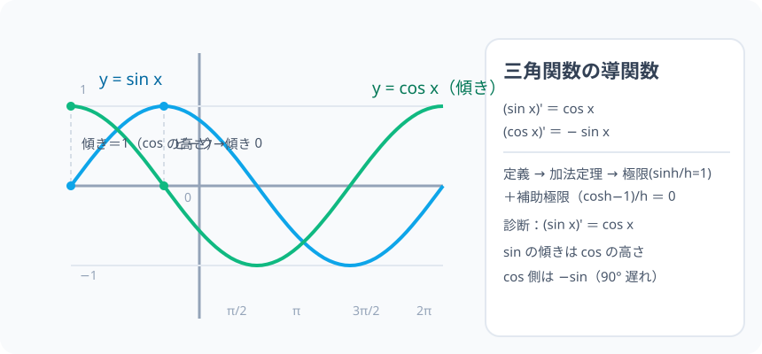

# 三角関数の微分：sin の傾きは、じつは cos だった

> [!abstract] このノードの核心
> 導関数の定義に**加法定理**で sin(x+h) を開き、昨日の極限（$\dfrac{\sin h}{h}\to1$・$\dfrac{\cos h-1}{h}\to0$）を差し込むと、$(\sin x)' = \cos x$ が 3 行で出る。cos は同様に $(\cos x)' = -\sin x$。**三角関数の微分は「波の傾きが波になる」**——音・振動の数の世界の最も美しい出発点。

> [!success] 合格ライン
> 導関数の定義から (sin x)' = cos x を導出（加法定理→極限を代入）できる（＝診断の答え）。(cos x)' = −sin x も導ける。lim (cos h − 1)/h = 0 の流れも言える。

## 記号の読み方

| 表記 | 読み方 | この教材での意味 |
|---|---|---|
| (sin x)' | サイン・エックス プライム | sin x の導関数 |
| cos' | コサイン プライム | cos の導関数 |
| h | エイチ | 区間の長さ（0 に近づける） |
| −sin x | マイナスサイン | cos の微分の結果（符号注意） |

> [!tip] 波の言葉
> 「sin の傾きは cos の高さ」—— x = 0 で sin は立り上がり（傾き 1 = cos0）、x = π/2 でピーク（傾き 0 = cos π/2）。

## 前提ノードと入口判定

機械的な前提関係は、プロジェクト内スナップショット `../ontology/math_euler_complete_ontology.json` を参照し、転記している。外部原本は `G:/マイドライブ/Eleanor Arroway/documents/math_euler_complete_ontology.json`。`trigonometry_master_ontology.md` は人間向けの全体地図として使い、IDや依存関係が異なる場合はJSONを優先する。

| 区分 | ノード・知識 | この教材で必要な理由 | 入口での判定 |
|---|---|---|---|
| 必須ノード（JSON正本） | `HS3-CALC-LIMIT-TRIG-01` 三角関数の極限 | (sin x)' の導出の核心道具 | lim sinθ/θ = 1 を導ける |
| 必須ノード（JSON正本） | `HS2-TRIG-ADDITION-01` 加法定理 | sin(x+h) を開く | sin(α+β)・cos(α+β) を書ける |
| 必須ノード（JSON正本） | `HS2-CALC-DIFF-POLY-01` 多項式の微分 | 導関数の定義・操作方法 | 導関数の定義式を書ける |

**入口判定の扱い:** JSON の診断問題「sin x の微分」を最初の目安にする。**答え cos x は知ってるはず**だが、3 行の導出（加法定理＋極限）を説明できるかが合格ライン。P0 で確かめる。

## 到達点

この教材を閉じたとき、次のことを自分の言葉で説明できる。

- 導関数の定義から (sin x)' を加法定理で開く手順。
- 極限 lim sin h/h = 1・lim (cos h − 1)/h = 0 を使う理由と意味。
- (cos x)' = −sin x と符号の理由。
- 波の直観（傾きと波の位相が π/2 ずれる対応）。

## 入口：「sin の山の傾きは、どこで 0 になる？」

y = sin x のグラフは、x = π/2 でピーク（傾き 0）・x = 0 で立り上がり最大（傾き 1）。その「傾きの値」を各 x で並べたらどうなるか——それが cos のグラフにどんぴしゃに重なる。では計算で確かめる。

> [!example] 同じ例を最後まで使う
> y = sin x を主役に、x = 0・π/2・π の 3 点の傾きを 3 カウントで通す（傾き 1・0・−1 → cos の値）。

## 核となる図

図は 0〜2π の sin（青）と cos（緑）の重ね描き。**sin の傾き（起伏）が、cos の値（高さ）に一致する**。

| 図での要素 | 名前 | 役割 |
|---|---|---|
| 青い波 | y = sin x | 微分される側 |
| 緑の波 | y = cos x | 導関数側（+1 のまま） |
| x = π/2 | ピーク | sin の傾き 0 = cos π/2 |
| x = 0 | 立り上がり | 傾き 1 = cos 0 |

## まずやってみる

> [!question] 式を見る前の10秒
> y = sin x のグラフで、x = 0・π/2・π の各点の「傾き」の値（大きい/0/小さい… 符号つき）を言う。

答えを確認する

x = 0：傾き最大 +1 / x = π/2：傾き 0 / x = π：傾き −1。→ cos の値（1, 0, −1）と完全一致。

## (sin x)' = cos x の導出

$$
(\sin x)' = \lim_{h\to0}\frac{\sin(x+h)-\sin x}{h}
$$

加法定理で開く：

$$
= \lim_{h\to0}\frac{\sin x\cos h + \cos x\sin h - \sin x}{h}
= \lim_{h\to0}\left[\sin x\cdot\frac{\cos h-1}{h} + \cos x\cdot\frac{\sin h}{h}\right]
$$

昨日の 2 つの極限：

$$
\lim_{h\to0}\frac{\sin h}{h} = 1,\qquad
\lim_{h\to0}\frac{\cos h-1}{h} = 0\ \left(=\lim\frac{-\sin^2h}{h(\cos h+1)}\right)
$$

代入して：

$$
\boxed{\ (\sin x)' = \cos x\ }
$$

## (cos x)' = −sin x の導出

$$
(\cos x)' = \lim_{h\to0}\frac{\cos(x+h)-\cos x}{h}
= \lim\left[\cos x\frac{\cos h-1}{h} - \sin x\frac{\sin h}{h}\right]
= 0 - \sin x
$$

$$
\boxed{\ (\cos x)' = -\sin x\ }
$$

## 数値で点検する

### 診断問題

$$
(\sin x)' = \cos x\quad\checkmark\quad(\sin x\Big|_{x=0})' = \cos 0 = 1\quad(\text{立り上がり})
$$

### x = π/2 の検証

$\sin$ のピーク：$(\sin x)'$ が π/2 で 0（= cos π/2 = 0）✓

### 波の対応（位相 π/2）

$(\sin x)' = \cos x$ は「sin を π/2 だけずらした波」。$( \cos x)' = -\sin x$ は「さらに π/2 遅れる（−sin）」。

## 3行まとめ

1. 定義＋加法定理で sin(x+h) を開く。
2. 極限 sin h/h → 1・（cos h −1)/h → 0 で整理。
3. sin→cos・cos→−sin（符号は「波が 90° 遅れる」）。

## 理解度サポート：どこまで分かっているか

### まず自己評価

- [ ] **0：未学習** — 三角関数の微分を初めて見る
- [ ] **1：見れば分かる** — 導出の列が追える
- [ ] **2：自力で使える** — sin・cos・（tan の応用）を微分できる
- [ ] **3：説明できる** — 定義からの導出と波の対応を説明できる

### 技能ごとの確認問題

| check_id | 確認する技能 | 問い | 答えが曖昧なときに戻る場所 |
|---|---|---|---|
| P0 | JSON指定の入口診断 | sin x を微分すると？（答: cos x） | 「(sin x)' の導出」 |
| C1 | 導出 sin | 加法定理で開く→極限の 2 つを代入する手順。 | 「(sin x)' の導出」 |
| C2 | 補助極限 | lim (cosh−1)/h = 0 の流れ。 | 同節 |
| C3 | cos 側 | (cos x)' = −sin x を導く。 | 「(cos x)' の導出」 |
| C4 | 数値 | (sin x)' の x = π における値。（答: −1） | 「数値で点検する」 |
| C5 | 応用の橋 | (sin2x)' を合成関数の微分で出す（答: 2cos2x の見立て）。 | 「次のノードへの橋」 |

解答と判定基準を開く

- **P0の答え:** cos x。
- **C1の答え:** 定義 → 加法定理（2 つの和）→ 極限 2 つで整理（sinx·0 + cosx·1）。
- **C2の答え:** (cosh−1)/h = −sin²h/(h(cosh+1)) と変形し、(sinh/h)·(sinh/(cosh+1)) → 1·0/2 = 0。
- **C3の答え:** 同手順（0 − sinx）。
- **C4の答え:** −1。
- **C5の答え:** まず sin を 2x の関数と見て 2 倍・外 → 2cos2x（f(g(x)) 型）。

**判定の目安:**

- P0とC1〜C5を正答かつ理由つきで → 次のノードへ
- C1を誤る → 導出の列を極限まで書く
- C3を誤る → 符号（−sin）の出どころ

## よくある取り違え

- sin x' = cos x を「複雑な解で 2 桁違う」→ **ただの cos・符号は −sin**。
- cos' = +sin とする → **cos' = −sin（下り坂）（90° 遅れ）**。
- 度で微分 → **rad でないと極限が崩れ、(sinx)' に π/180 が絡む**。
- 導出をすっ飛ばして覚える → **極限 2 つが頼り（lim sinθ/θ ノード）**。
- 独立変数と合成を混ぜる → **(sin2x)' ≠ cos2x（×2 が付く）**。

## 自力確認（teach-back）

教材を閉じて、次を声に出して答える。

1. (sin x)' の導出を 3 行（定義→加法定理→極限）で。
2. (cos x)' = −sin x を導く。
3. x = 0・π/2 での値（1 と 0）を検証。
4. 「rad じゃないと…」の理由を 1 行。

## 次のノードへの橋

- **高階導関数（`HS3-CALC-HIGHER-DIFF-01`）**：sin を 4 回微分すると sin に戻る（周期 4 の美しさ）。
- **ネイピア数 e（`HS3-CALC-E-DEF-01`）**：e^x の微分＝自分自身。三角との差が e の登場の一つの動機。
- **波の応用**：振動・電気・音波の数式（sin/cos の微分は 90° ずらすと言語化できる）。

## インタラクティブ化の候補（レビュー後に判定）

- **有効候補: x スライダー（sin の接線）** — 接線の傾きが cos の値と一致することを動かして。
- **有効候補: 2 グラフの重ね描き（sin 緑・cos 青）** — 傾きと高さの対応確認。
- **静的なままで十分:** 導出・検証は静的で十分。スライダー 1 個（x）。
- 動かすことそれ自体を合格条件にはしない。
