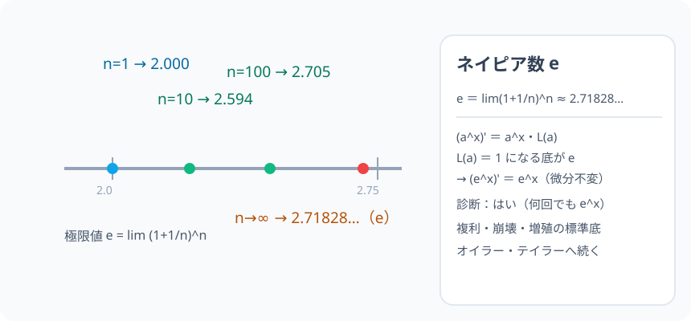

# ネイピア数 e：「微分したら自分自身」になる幸せな底

> [!abstract] このノードの核心
> 複利計算の極限から現れる数 $\left(1+\frac{1}{n}\right)^n$ が、$2.71828\ldots$ に限りなく近づく。これが **ネイピア数 e**。そして「底 a のうち、$a^x$ の傾きそのものが $a^x$ になる底」は e しかいない——つまり $(e^x)' = e^x$。微分しても形が変わらない、まさに「自然の底」。

> [!success] 合格ライン
> $e = \lim(1+1/n)^n$ を定義の言葉で言える。（e^x)' = e^x を「極限が 1 に落ちる底」として説明できる（＝診断：はい）。

## 記号の読み方

| 表記 | 読み方 | この教材での意味 |
|---|---|---|
| e | え（ネイピア数） | 約 2.71828… の無理数 |
| lim(1+1/n)^n | リミット | e の定義式（n→∞） |
| 底 | てい | 指数関数の下の数（a） |
| 指数関数 | しすうかんすう | y = a^x |

> [!tip] e の語源（ネイピア/オイラー）
> 数学者は交流を、なにか「自然」に（計算で）現れるから。極限の形・微積分の形で顔を出す。

## 前提ノードと入口判定

機械的な前提関係は、プロジェクト内スナップショット `../ontology/math_euler_complete_ontology.json` を参照し、転記している。外部原本は `G:/マイドライブ/Eleanor Arroway/documents/math_euler_complete_ontology.json`。`trigonometry_master_ontology.md` は人間向けの全体地図として使い、IDや依存関係が異なる場合はJSONを優先する。

| 区分 | ノード・知識 | この教材で必要な理由 | 入口での判定 |
|---|---|---|---|
| 必須ノード（JSON正本） | `HS2-EXP-FUNC-01` 指数関数 y=a^x | 底の選び方の文脈 | y=2^x のグラフ・単調性を言える |
| 必須ノード（JSON正本） | `HS2-CALC-DIFF-POLY-01` 多項式の微分 | 微分の定義の操作 | 導関数の定義式を書ける |

**入口判定の扱い:** JSON の診断問題「e^x は何回微分しても e^x?」を最初の目安にする。**定義（(e^x)' = e^x）を覚えるのではなく、極限が 1 になる底として導く**ことが合格ライン。P0 で確認。

## 到達点

この教材を閉じたとき、次のことを自分の言葉で説明できる。

- e の定義（lim(1+1/n)^n ≈ 2.718…）。
- (a^x)' = a^x·lim(a^h−1)/h の導出と、lim が 1 になる a こそ e。
- (e^x)' = e^x（微分不変）と「何回でも」の意味。
- 複利・増殖・放射性物質（減衰も e^-kt）の応用と出会える。

## 入口：「複利を細かくすると、何に着地する？」

年 100% の金利で 1 年 1 回「1 倍」 → 2.00。しかし半年 2 回なら (1+0.5)² = 2.25・3 か月 4 回なら 2.44…と次第に増えるが、**際限なく増えない**。限界（極限）が 2.718…——それが e。自然そのもののような数。

> [!example] 同じ例を最後まで使う
> n = 1・10・100・10⁴ の (1+1/n)^n を主役にし、収束値 2.718… への道程を一貫して使う。

## 核となる図

図：n を 1 → 10⁴ と増やしたときの値（2.00 → … → 2.718）を 数直線にプロット。**増えていくが、2.718…が天井**。

| 図での要素 | 名前 | 役割 |
|---|---|---|
| n=1 の点 | 2.00 | 出発 |
| n=10・100 の点 | 2.5937・2.7048 | 盛り上がり |
| 収束値 | e ≈ 2.718 | fin（極限） |

## まずやってみる

> [!question] 式を見る前の10秒
> (1+1/n)^n を n = 1・2・10・100 で計算してみる。

答えを確認する

2・2.25・2.5937・2.7048… **2.71828 に近づく**（1 回で 1 ではなく、少しずつ上の方へ）。

## ネイピア数 e の定義

$$
\boxed{\ e = \lim_{n\to\infty}\left(1+\frac{1}{n}\right)^n \approx 2.718281828\ldots\ }
$$

#### 収束の実際

| n | (1+1/n)^n |
|---|---|
| 1 | 2 |
| 10 | 2.59374… |
| 100 | 2.70481… |
| 10⁴ | 2.71692… |
| 10⁶ | 2.71828… |

## e^x の微分（なぜ「自分のまま」か）

### 定義による

$$
(a^x)' = \lim_{h\to0}\frac{a^{x+h}-a^x}{h} = a^x\cdot\lim_{h\to0}\frac{a^h-1}{h}
$$

$a^x$ は前に出る。**残りの極限 L(a) = lim(a^h−1)/h を 1 にする a** は何か？

$$
a^h \approx 1 + L\,h\quad(\text{小さい }h)\quad\Rightarrow\quad a \approx \left(1+Lh\right)^{1/h}\xrightarrow{h\to0} e^L
$$

L(a) = 1 となるのは a = e のとき。つまり

$$
\boxed{\ (e^x)' = e^x\ }\qquad\text{（また } (e^{kx})' = ke^{kx}\text{、一般に}\ (a^x)' = a^x\ln a\text{（ln は圏外の話））}
$$

**e は「微分して自分自身」であるための特殊な底。他の底でも 2^x のような形は少しずつ崩れる。**

## 数値で点検する

### 診断問題（P0）

e^x の導関数 e^x。そしてまた微分しても e^x。

$$
(e^x)' = e^x,\qquad (e^x)'' = e^x,\qquad (e^x)^{(n)} = e^x\quad\text{→ 何回でも e^x・回答は「はい」}
$$

### e の値の世界

- e^(0) = 1
- e^1 ≈ 2.71828…
- 対数（ln と日常的に読む・本オントロジー圏外の直感）…「e の底の対数を自然対数（ln）」。

### 極端な場合

- h → 0 の近くで (e^h − 1)/h が 1 になる：電卓だと 0.001 等で確認可能。
- a = 2 のときの L(a) ≈ 0.693…（ln2 — 微分の係数が 0.693 崩れる）→ この e を使えば キレイになる。

## 3行まとめ

1. e = lim(1+1/n)^n ≈ 2.71828…（複利の極限）。
2. (a^x)' = a^x·L(a) の L(a)=1 が e。e^x は微分不変。
3. 複利・放射性崩壊・指数増加のモデルの数値のほとんどが e の底。

## 理解度サポート：どこまで分かっているか

### まず自己評価

- [ ] **0：未学習** — e の顔を初めて見る
- [ ] **1：見れば分かる** — 定義の数列を追える
- [ ] **2：自力で使える** — e^x の微分・値の計算ができる
- [ ] **3：説明できる** — 定義 → 極限 L(a) → なぜ自分自身か、の一連を説明できる

### 技能ごとの確認問題

| check_id | 確認する技能 | 問い | 答えが曖昧なときに戻る場所 |
|---|---|---|---|
| P0 | JSON指定の入口診断 | e^x を何回微分しても e^x のままですか？ | 「数値で点検する」 |
| C1 | 定義 | e = lim(1+1/n)^n を言う。 | 「ネイピア数 e の定義」 |
| C2 | 導出 | (a^x)' = a^x·L(a) を出す。 | 「e^x の微分」 |
| C3 | L(a) | L(a)=1 になる a が e である理由。 | 同節 |
| C4 | 計算 | (e^(2x))' = ?（答: 2e^(2x)） | 「e^x の微分」 |
| C5 | 応用 | 放射性崩壊 N = N₀e^(−kt) の何が指数関数か。 | 「次のノードへの橋」 |

解答と判定基準を開く

- **P0の答え:** はい（毎回微分しても e^x）。
- **C1の答え:** 定義式（lim n→∞(1+1/n)^n）。
- **C2の答え:** 指数関数の微分定義・a^x を外へ出す。
- **C3の答え:** L(a) = lim(a^h−1)/h → a ≈ e^L。L=1 とは a = e。
- **C4の答え:** 2e^(2x)（合成関数の微分・=e^(2x)×2）。
- **C5の答え:** 増殖・崩壊の割合が一定（比例）→ 指数関数 N₀e^(−kt)。「e + 指数関数」は自然現象の標準言語。

**判定の目安:**

- P0とC1〜C5を正答かつ理由つきで → 次のノードへ
- C2を誤る → 微分の定義式に戻ること（a^(x+h) を分解）
- C4を誤る → 合成関数（2x の出前）に注意

## よくある取り違え

- e を「3 くらいの便利な数」と覚えるだけ → **定義（極限）と微分不変がセット**。
- (e^x)' = x e^(x−1) と幂関数の公式を適用する → **指数関数は別ルール（自分のまま）**。
- L(a) を全て e だと思い込む → **e のときだけ 1。2^x は 0.693 個崩れる**。
- 複利の n をある値と混同 → **n→∞ の極限であり、途中は近づくだけ**。
- e^x の微分で合成関数の係数を忘れる → **(e^(kx))' には k が付く（2e^(2x) の例の通り）**。

## 自力確認（teach-back）

教材を閉じて、次を声に出して答える。

1. e の定義を式・値（≈2.718）と共にいう。
2. (a^x)' = a^x·L(a)・L(a)=1 ⇔ a = e を説明する。
3. e^(3x) の微分（= 3e^(3x)）と、e^x の「何回でも」を言う。
4. 複利・崩壊のどちらか 1 つ、e が出てくる場面を話す。

## 次のノードへの橋

- **複素数平面・極形式（`HS3-COMPLEX-PLANE-01`）**：r(cosθ + isinθ) と e^(iθ) の符号……（オイラー）。
- **テイラー展開（`UNIV-CALC-TAYLOR-01`）**：e^x の級数展開（次数無限・多項式の化身）。
- **オイラーの公式（`EULER-CONVERGENCE-01`）**：三角と指数の大合流——e がその橋である。

## インタラクティブ化の候補（レビュー後に判定）

- **有効候補: n スライダー** — (1+1/n)^n の点が e に近づくアニメーション。
- **有効候補: a のスライダー（e を発見）** — a を動かすと L(a) が 1 を飛ぶ瞬間を見る。
- **静的なままで十分:** 定義の数列は静的でも成立。動かすなら a のスライダー（e を発見）。
- 動かすことそれ自体を合格条件にはしない。
