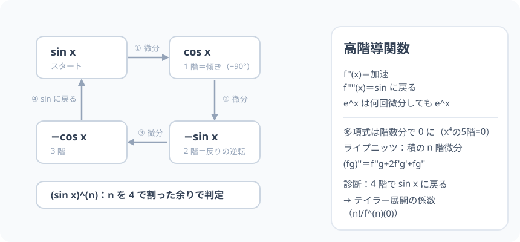

# 高階導関数：微分を繰り返すと、波は一周して帰ってくる

> [!abstract] このノードの核心
> 導関数の導関数——**高階導関数**。記号は $(f'(x))' = f''(x)$・$a^3$(x) と書く。関数によっては 4 回微分すると元通り（sin → cos → −sin → −cos → **sin**）。この「4 周期」と e^x（何回でも自分自身）が、高階微分の世界の主役。積の微分の高階版は**ライプニッツの公式**（二項定理の双子）である。

> [!success] 合格ライン
> 2 階・3 階・n 階の記号と意味を言える。sin x の 4 階微分が sin x に戻ることを（4 ステップで）説明できる（＝診断の答え）。

## 記号の読み方

| 表記 | 読み方 | この教材での意味 |
|---|---|---|
| f''(x) | エフ・ダッシュダッシュ | 2 階導関数 |
| f'''(x) | エフ・ダッシュ3乗 | 3 階 |
| f^(n)(x) | エフ・エヌじょう | n 階一般 |
| 変曲点 | へんきょくてん | f'' = 0 になる場所（グラフの反りが変わる） |

> [!tip] 記号の読み分け
> f^(n) は「n 階微分」の意。カッコ内は「指数」でなく「階数」。

## 前提ノードと入口判定

機械的な前提関係は、プロジェクト内スナップショット `../ontology/math_euler_complete_ontology.json` を参照し、転記している。外部原本は `G:/マイドライブ/Eleanor Arroway/documents/math_euler_complete_ontology.json`。`trigonometry_master_ontology.md` は人間向けの全体地図として使い、IDや依存関係が異なる場合はJSONを優先する。

| 区分 | ノード・知識 | この教材で必要な理由 | 入口での判定 |
|---|---|---|---|
| 必須ノード（JSON正本） | `HS3-CALC-DIFF-TRIG-01` 三角関数の導関数 | sin・cos の微分（周期の元） | (sin x)' = cos x を導ける |
| 必須ノード（JSON正本） | `HS3-CALC-E-DEF-01` e の定義 | e^x の微分不変（もう一つの主役） | (e^x)' = e^x を言える |
| 基礎知識（C類） | 二項定理 | ライプニッツの公式の構造（組み合わせ） | (a+b)²・(a+b)³ の係数 |

**入口判定の扱い:** JSON の診断問題「sin x の 4 階微分」を最初の目安にする。**4 つのステップを列挙するだけ**。合格ラインは、その周期性（4 回で一周）とコスト（規則性・ライプニッツ）を説明できること。P0 で確認。

## 到達点

この教材を閉じたとき、次のことを自分の言葉で説明できる。

- f''(x) の意味（加速・変曲）を言える。
- sin・cos・e^x・xⁿ の高階微分を列挙できる。
- ライプニッツの公式（積の n 階微分）の n=2 の場合を書ける。
- 周期 4（sin の系）の意味を説明できる。

## 入口：「加速の加速、波の形の動き」

1 階微分＝速度・2 階＝加速度・3 階＝加速度の変化（ブレ）。波 y = sin x の足元から見ると、1 階微分 cos・2 階 −sin・3 階 −cos・4 階 sin——**波は 4 回で元に戻る**。

> [!example] 同じ例を最後まで使う
> sin x を主役にし、f・f'・f''・f'''・f'''' の 5 段の名曲を通す。

## 核となる図

図は 4 つの関数の周期ループ（sin → cos → −sin → −cos → sin）。**左上から反時計に 90° ずつ**——ド・モアブル側の回転と家族なみに似ているが、こちらは微分サイクル。

| 図での要素 | 名前 | 役割 |
|---|---|---|
| sin | スタート | 波そのもの |
| cos | 1 階 | 傾き（位相 +90°） |
| −sin・−cos | 2 階・3 階 | 反りの話 |
| sin に戻る | 4 階 | 周期 4 |

## まずやってみる

> [!question] 式を見る前の10秒
> sin x を 1 回・2 回・3 回・4 回微分して並べる。（速習ペース。）

答えを確認する

cos x → −sin x → −cos x → **sin x**。4 回で一周 ✓。

## 高階導関数の基本

$$
f'(x)\quad f''(x)\quad f'''(x)\quad \cdots\quad f^{(n)}(x)
$$

例：

- (sin x)^(n)：n を 4 で割った余りで言える（余 0: sin・1: cos・2: −sin・3: −cos）
- (e^x)^(n) = e^x（何回でも自分）
- (x^m)^(n)：m ≥ n なら m!/(m−n)!·x^(m−n)、m < n なら 0（ついに 0 に）

## ライプニッツの公式（積の高階微分）

$$
(fg)'' = f''g + 2f'g' + fg''
$$

$$
(fg)^{(n)} = \sum_{k=0}^{n}\binom{n}{k}f^{(k)}g^{(n-k)}\quad\text{（二項定理と同じ形！）}
$$

（二項係数が現れる理由：微分演算の分配が二項展開と同型であるから。）

## 数値で点検する

### 診断問題：sin x の 4 階

$$
\sin x \xrightarrow{1次} \cos x \xrightarrow{2次} -\sin x \xrightarrow{3次} -\cos x \xrightarrow{4次} \boxed{\ \sin x\ }
$$

### f(x) = x³ の 4 階（0 になるまで）

$3x² \to 6x \to 6 \to 0$——**4 回目で 0**（多項式は階数分で息絶える）。

### e^x を 5 回

e^x（どうしても動かない）。

## 3行まとめ

1. 高階微分は加速・反り・ブレの言葉（sin なら 4 周期）。
2. 多項式は有限回で 0 に、指数 e^x は永遠に自分。
3. 積の n 階はライプニッツ（二項定理の双子）。

## 理解度サポート：どこまで分かっているか

### まず自己評価

- [ ] **0：未学習** — 高階の記号が他人事だった
- [ ] **1：見れば分かる** — 周期図を見て言える
- [ ] **2：自力で使える** — 3 種類（sin・e^x・多項式）の高階が言える
- [ ] **3：説明できる** — 周期 4・n!・ライプニッツをセットで

### 技能ごとの確認問題

| check_id | 確認する技能 | 問い | 答えが曖昧なときに戻る場所 |
|---|---|---|---|
| P0 | JSON指定の入口診断 | sin x の 4 階微分は？ | 「数値で点検する」 |
| C1 | 2 階の意味 | f''(x) > 0 は曲線の何を表すか。（答: 下に凸） | 「高階導関数の基本」 |
| C2 | 計算 | (x⁵)''' （x の 5 乗を 3 回微分） | 「例」 |
| C3 | e^x | (e^x)^(7) | 「例」 |
| C4 | ライプニッツ n=2 | (x·sin x)'' をライプニッツで。 | 「ライプニッツの公式」 |
| C5 | テイラーの予感 | 高階微分がテイラー展開の何になるか述べる。 | 「次のノードへの橋」 |

解答と判定基準を開く

- **P0の答え:** sin x（4 階で一周）。
- **C1の答え:** 下に凸（上で凹む曲線のスピードの加速）。
- **C2の答え:** 5·4·3x² = 60x²。
- **C3の答え:** e^x。
- **C4の答え:** (x sinx)'' = 2cosx − x sinx … 項別に書く（f=x・g=sinx で f''g+2f'g'+fg''）。
- **C5の答え:** f^(n)(0)/n! が級数展開の係数（テイラー・マクローリン展開）。

**判定の目安:**

- P0とC1〜C5を正答かつ理由つきで → 次のノードへ
- C4を誤る → 二項係数の対応（f''g + 2f'g' + fg''）を書く
- C2を誤る → 指数の下げる回数を数える

## よくある取り違え

- f^(n)(x) を f(x)ⁿ（積）と 読む → **括弧付きは階数**。
- 多項式の高階が無限に続くと思う → **階数分で 0 に落ちる**。
- sin の周期を 2 と覚える → **4 階（sin → cos → −sin → −cos → sin）まで**。
- 2 階微分の符号と凸（上/下）の混同 → **f''>0：下に凸・f''<0：上に凸**。
- ライプニッツを「二項定理の模倣」とだけ思う → **構造（分配による係数）そのもの**。

## 自力確認（teach-back）

教材を閉じて、次を声に出して答える。

1. f''・f'''・f^(n) の記法と意味（加速・変曲）。
2. sin の 4 階の循環を 4 行書く。
3. x⁴ の 5 階 = 0 を説明する。
4. ライプニッツ n=2 の形を「二項定理の応用」の言い方で。

## 次のノードへの橋

- **テイラー展開（`UNIV-CALC-TAYLOR-01`）**：高階微分が係数（f^(n)(0)/n!）として現れる。多項式の無限化身。
- **オイラーの公式（`EULER-CONVERGENCE-01`）**：sin と cos の 4 周期は、指数 e^(iθ) の回転の一つの現れ。

## インタラクティブ化の候補（レビュー後に判定）

- **有効候補: n 階表示** — スラッシュスライダーで sin の n 階を 4 段階で。
- **有効候補: 波 4 枚並べ** — 位相の図。
- **静的なままで十分:** 周期図・表・数値は静的で十分。スライダーは 1 つ。
- 動かすことそれ自体を合格条件にはしない。
