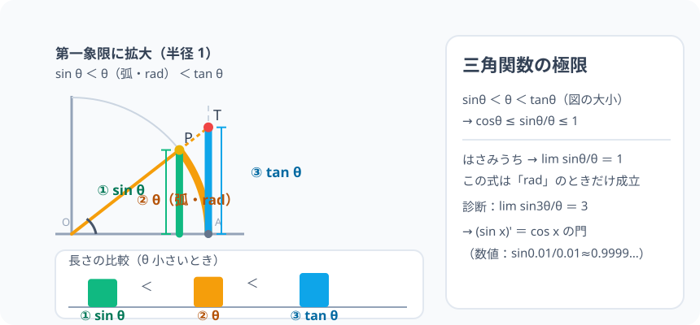

# 三角関数の極限：sinθ と θ は、0 の近くで「同じ速さ」

> [!abstract] このノードの核心
> $\sin\theta$ と $\theta$（rad）は 0 のごく近くで、ほとんど同じ大きさになる。正確に言えば **$\lim_{\theta\to0}\dfrac{\sin\theta}{\theta} = 1$**。単位円の図で $\sin\theta$（縦）と $\theta$（弧）、$\tan\theta$（接線の縦）を比べるとはさみうちの原理で証明できる。**この式は θ が rad のときだけ成立**——三角関数の微分の唯一の入り口である。

> [!success] 合格ライン
> 単位円の図（sinθ < θ < tanθ）からはさみうちで極限 1 を導ける。診断（lim sin3θ/θ = 3）を式変形で出せる。**θ が rad であることの必要性**を説明できる。

## 記号の読み方

| 表記 | 読み方 | この教材での意味 |
|---|---|---|
| lim | リミット | θ を 0 に限りなく近づける |
| θ→0 | シータ・ゼロ・に | 変数 θ を 0 に近づける |
| はさみうち | はさみうち | 上下から挟まれて一定値に迫られる原理 |
| rad | ラジアン | **命綱**——この式が成立する単位 |

> [!tip] rad でなければ成立しない
> 度数法（°）なら $\sin\theta/\theta$ は 180/π がかかり、式は崩れる。**数III のこの式は常に rad。**

## 前提ノードと入口判定

機械的な前提関係は、プロジェクト内スナップショット `../ontology/math_euler_complete_ontology.json` を参照し、転記している。外部原本は `G:/マイドライブ/Eleanor Arroway/documents/math_euler_complete_ontology.json`。`trigonometry_master_ontology.md` は人間向けの全体地図として使い、IDや依存関係が異なる場合はJSONを優先する。

| 区分 | ノード・知識 | この教材で必要な理由 | 入口での判定 |
|---|---|---|---|
| 必須ノード（JSON正本） | `HS2-TRIG-RADIAN-01` 弧度法 | θ が半径 1 の円の弧長と一致するため | 90°=π/2・1 rad≈57.3° を言える |
| 必須ノード（JSON正本） | `HS2-TRIG-GENERALANGLE-01` 一般角 | θ → 0 の両側（正負）の扱い | cos(−θ)=cosθ（偶関数）を言える |
| 基礎知識（C類） | はさみうちの原理 | 証明の骨組み | 「下→へ 1」のイメージ |

**入口判定の扱い:** JSON の診断問題「lim sin3θ/θ」を最初の目安にする。**sin 3θ を θ として 3 倍の数をこしらえる**（sin3θ/(3θ) × 3）。この変形 + 極限 1 を使うことが合格ライン。P0 で確認。

## 到達点

この教材を閉じたとき、次のことを自分の言葉で説明できる。

- 単位円の図で sinθ < θ < tanθ を導ける。
- その区間の比をはさみうちに持ち込み、極限 1 を導ける。
- lim sin(kθ)/θ = k を式変形で出す。
- rad でなければ成立しない理由を説明できる。

## 入口：「sin の微分の前の、わずかな休憩」

多項式は (x+h)³ を展開して微分できた。しかし sin(x+h) は sinθ の加法定理（sinθ まわり）でしか開けない。そして sin を微分すると lim sinθ/θ が出てくる——**つまりこの極限が三角関数の微分の門**。門を開くまえの正しい手形（証明）が、この 4 章。

> [!example] 同じ例を最後まで使う
> 単位円の θ（小・弧＝長さ θ の間）で sinθ・θ・tanθ を結ぶ図。θ = 0.1 などを試す。

## 核となる図



図は半径 1 の単位円。P から x 軸に下ろした縦（sinθ）、x 軸から弧の長さ θ（rad）、接線の上の端点までの縦（tanθ）。**sinθ < θ < tanθ** が図から読み取れる。

| 図での要素 | 名前 | 役割 |
|---|---|---|
| 弧 OP | θ（rad） | 長さは θ |
| 縦線（P から） | sinθ | 三角形の高さ |
| 縦線（接線上） | tanθ | 三角形の高さ（大） |
| O を頂点とする角 | 比を取るときの本尊 | θ→0 のハンマー |

## まずやってみる

> [!question] 式を見る前の10秒
> θ = 0.1 [rad] のとき、sin0.1 = 0.0998…。sinθ/θ を小数点で計算して 1 どれだけ近いか確かめる（次に θ = 0.01）。

<details>
<summary>答えを確認する</summary>

sin(0.1)/0.1 ≈ 0.9998・sin(0.01)/0.01 ≈ 0.99999…。**1 に近い**（この瞬間が定理）。

</details>

## 極限の導出（はさみうち）

### ステップ 1：図の大小関係

単位円（半径 1）で、θ を 0 より大きい小さな角とする。

- 三角形の面積 S₁ = $ \frac{1}{2}\sin\theta $（底辺 1・高さ sinθ）
- 扇形の面積 S₂ = $ \frac{1}{2}\theta $（半径 1・弧長 θ）
- 大きい三角形の面積 S₃ = $ \frac{1}{2}\tan\theta $（底辺 1・高さ tanθ）

```
S₁ ≤ S₂ ≤ S₃（三角形・扇形・三角形の包含関係 ― 図で見える）
→ 1/2 sinθ ≤ 1/2 θ ≤ 1/2 tanθ
```

### ステップ 2：比を作る

全部 ÷(1/2) して sinθ > 0 のうち：

$$
\sin\theta \le \theta \le \tan\theta \quad\Rightarrow\quad 1 \le \frac{\theta}{\sin\theta} \le \frac{1}{\cos\theta}
$$

（tanθ = sinθ/cosθ を掛けて整理。逆数を取って）

$$
\boxed{\ \cos\theta \le \frac{\sin\theta}{\theta} \le 1\ }
$$

### ステップ 3：はさみうち

$$
\theta \to 0\ \text{で}\ \cos\theta \to 1
$$

（cos は 0 で 1 に連続。）したがって両側から同じ定数で挟まれ：

$$
\boxed{\ \lim_{\theta\to0}\frac{\sin\theta}{\theta} = 1\ }
$$

（θ が負のときも偶/奇関数の関係から同じ結論。）

## 数値で点検する

### 診断問題：lim sin3θ/θ

$$
\frac{\sin 3\theta}{\theta} = \frac{\sin 3\theta}{3\theta}\cdot 3 \xrightarrow{\theta\to0} 1\cdot 3 = 3\quad\checkmark
$$

### 変種：lim tanθ/θ・lim sinθ/θ の検算

- tanθ/θ = (sinθ/θ)(1/cosθ) → 1·1 = 1
- sinθ/θ を θ = 0.001 で数値：≈ 0.9999998

### 極端な場合

- θ→0 の近くでは sinθ は θ と同速で進む。グラフ y = sinθ は原点付近で y = θ とほぼ重なる。
- θ を度で測ると：sin(0.1°) など極端に小さい → 式は 180/π の係数をもつ（成立しない）。

## 3行まとめ

1. 単位円の包含 sinθ ≤ θ ≤ tanθ（面積比較）から cosθ ≤ sinθ/θ ≤ 1。
2. はさみうちの原理 → 極限 1（θ は rad のみ）。
3. lim sin(kθ)/θ = k。三角関数の微分（数III）への門（続く）。

## 理解度サポート：どこまで分かっているか

### まず自己評価

- [ ] **0：未学習** — この門の意味が分からない
- [ ] **1：見れば分かる** — 図と不等式を追える
- [ ] **2：自力で使える** — k 倍の変形で計算できる
- [ ] **3：説明できる** — 図・不等式・はさみうち・rad の注意をセットで

### 技能ごとの確認問題

| check_id | 確認する技能 | 問い | 答えが曖昧なときに戻る場所 |
|---|---|---|---|
| P0 | JSON指定の入口診断 | lim{θ→0} sin3θ/θ は？（答: 3） | 「数値で点検する」 |
| C1 | 図の大小 | sinθ < θ < tanθ が図でどう見えるか。 | 「核となる図」 |
| C2 | 不等式変形 | 3 つの面積から cosθ ≤ sinθ/θ ≤ 1 を導く。 | 「ステップ 2」 |
| C3 | はさみうち | 極限 1 をはさみうちで押す。 | 「ステップ 3」 |
| C4 | 応用 | lim tanθ/θ（答: 1） | 「数値で点検する」 |
| C5 | 発展の橋 | この極限が sin x の微分のどこに出てくるか。 | 「次のノードへの橋」 |

<details>
<summary>解答と判定基準を開く</summary>

- **P0の答え:** 3。
- **C1の答え:** 弧＝θ が sinθ（縦）より大きく・tanθ（接線上の縦）より小さい。
- **C2の答え:** 面積比 … ≒ 逆数を取って比較（上述）。
- **C3の答え:** cosθ→1 と定数 1 に挟まれ極限がそこへ。
- **C4の答え:** 1。
- **C5の答え:** (sinx)' の分子 sin(x+h)−sinx に加法定理を適用すると、lim sinθ/θ と lim (cosθ−1)/θ が現れる。この極限 1 と cos 側（=0）で (sinx)' = cosx が導かれる。

**判定の目安:**

- P0とC1〜C5を正答かつ理由つきで → 次のノードへ
- C2を誤る → 図の面積比較を丁寧に（1/2 の両立）
- C4を誤る → tan = sin/cos の分解

</details>

## よくある取り違え

- θ を度のまま → **rad でないと公式そのものが壊れる**。
- sinθ を θ で「近似を超えて」同じものと扱う → **極限の中では近い、それだけ（sinθ は sinθ のまま）**。
- 正確な不等号（< <）を逆に使う → **sin ≤ θ ≤ tan（値の大小の向きに注意）**。
- 端を除かずに cosθ→1 を等号で → **不等号の両端（cosθ と 1）**。
- lim の中を勝手に分割しない（割り算の分割は OK） → **sin(kθ)/θ は 3 でつないで積に**。

## 自力確認（teach-back）

教材を閉じて、次を声に出して答える。

1. 図で sinθ・θ・tanθ の大小を説明する。
2. 面積比較→不等式→はさみうち→1 の流れを説明する。
3. sin3θ/θ = 3 を式変形（sin3θ/3θ ×3）で示す。
4. rad でなく度のときどうなるかを予想して言う。

## 次のノードへの橋

- **三角関数の導関数（`HS3-CALC-DIFF-TRIG-01`）**：(sinx)' = cosx の証明はこの極限が要。
- **ネイピア数 e（`HS3-CALC-E-DEF-01`）**：e の導入も極限という手順を使う。
- 微積分の世界（物理では運動の加速度、信号では波の勾配）へ。

## インタラクティブ化の候補（レビュー後に判定）

- **有効候補: θ スライダー（これまでの単位円）** — θ を 0 へ寄せると 3 つの量が重なる。
- **有効候補: 数値テーブル** — sinθ/θ の値（0.1・0.01・0.001）。
- **静的なままで十分:** 図と導出は十分。動かすならθ スライダーの図。
- 動かすことそれ自体を合格条件にはしない。
