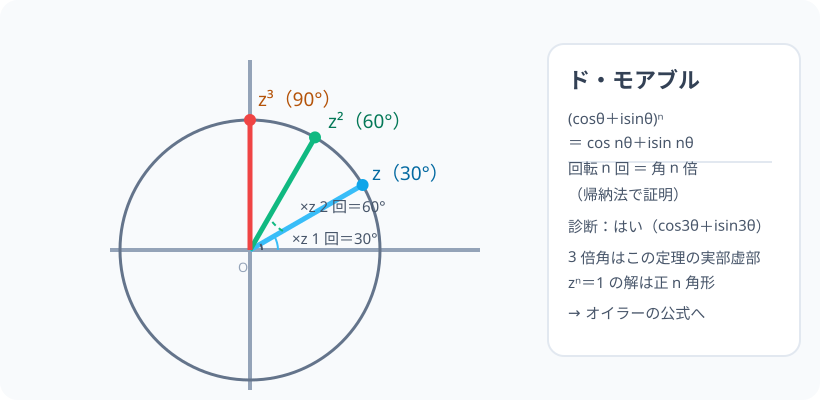

# ド・モアブルの定理：回転の n 回が、角の n 倍

> [!abstract] このノードの核心
> 前ノードの「積＝角の足し算」を n 回繰り返す——それがド・モアブル：$(\cos\theta+i\sin\theta)^n = \cos n\theta + i\sin n\theta$。**回転の 3 回は角度 3 倍**。この一言で、n 倍角の公式・z⁴=1 の解・三角関数の次数下げまで、全部 1 つの回路に乗る。

> [!success] 合格ライン
> 複素数平面の積の規則（角を足す）から n 回の帰納で定理を導ける（＝診断：はい）。z³=1 の解（1・ω・ω²）を正三角形の頂点として言える。

## 記号の読み方

| 表記 | 読み方 | この教材での意味 |
|---|---|---|
| (cosθ+isinθ)ⁿ | エヌのじょう | 定式の n 乗 |
| cos nθ | エヌシータ | 角が n 倍された cos |
| 帰納法 | きのうほう | n が全てで成り立つことを示す証明法 |
| ω | オメガ | $z^3=1$ の虚数解 $\omega = \dfrac{-1+\sqrt{3}\,i}{2}$ |

> [!tip] ω は e^(2πi/3)
> 3 乗して 1 になる数（1 の立方根）。ω² も同様。三つ（1, ω, ω²）は正三角形を描く。

## 前提ノードと入口判定

機械的な前提関係は、プロジェクト内スナップショット `../ontology/math_euler_complete_ontology.json` を参照し、転記している。外部原本は `G:/マイドライブ/Eleanor Arroway/documents/math_euler_complete_ontology.json`。`trigonometry_master_ontology.md` は人間向けの全体地図として使い、IDや依存関係が異なる場合はJSONを優先する。

| 区分 | ノード・知識 | この教材で必要な理由 | 入口での判定 |
|---|---|---|---|
| 必須ノード（JSON正本） | `HS3-COMPLEX-PLANE-01` 複素数平面 | 積＝角の足し算・極形式 | |z₁z₂|・arg(z₁z₂) を言える |
| 必須ノード（JSON正本） | `HS2-TRIG-TRIPLE-01` 3 倍角 | n=3 の場合は 再発見を整える | sin 3α・cos 3α を導ける |
| 必須ノード（JSON正本） | `HS2-TRIG-PRODSUM-01` 積和・和積 | n の任意性の意味（次数下げ） | 積和の 1 例を導ける |

**入口判定の扱い:** JSON の診断問題「(cosθ+isinθ)³ の展開」を最初の目安にする。**「角の足し算 3 回」**の復唱で yes。その理由が n で通用することを導入で示す。P0 は n=3 と帰納法の 2 本。

## 到達点

この教材を閉じたとき、次のことを自分の言葉で説明できる。

- ド・モアブルの定理の記述と帰納法の証明の骨格。
- (cosθ+isinθ)³ の展開が 3 倍角の公式を生む（診断の YES）。
- z^n = 1 の解が正 n 角形の頂点であること。
- n 倍角の公式を「角 n 倍」として読めること。

## 入口：「1 回の回転は角度 1 ぶん、n 回なら？」

前ノードの積は「角度を足す」だった。3 回掛けると角度 3θ・距離 1。だから (cosθ+isinθ)³ = cos3θ+isin3θ。**「3 倍角の公式をまた覚える必要はない」**——この定理がそれの集合体である。

> [!example] 同じ例を最後まで使う
> θ = 30°（z を 1 つの点に）を主役にし、z・z²・z³（30°・60°・90°）の 3 点を閉じ込めて使う。

## 核となる図

図は z = cos30°+isin30° を単位円に置き、z²(60°)・z³(90°) と 0° 周りの回転の足し算を見せている。

| 図での要素 | 名前 | 役割 |
|---|---|---|
| z・z²・z³ | 点 | 30°・60°・90° |
| 動径 | r = 1 | 単位円・距離不変 |
| 弧 | 角の和 | 回転 3 回＝90° |

## まずやってみる

> [!question] 式を見る前の10秒
> (cos30°+isin30°)² を計算し、極形式の「角 60°」になることを言葉で述べる。（次に 3 乗。）

答えを確認する

z² は角 60°・r=1。z³ は角 90°（= i そのもの）。**「3 乗したら i」この瞬間に定理が身になる。**

## ド・モアブルの定理（帰納法）

$$
(\cos\theta + i\sin\theta)^n = \cos n\theta + i\sin n\theta\qquad(n\text{ は整数})
$$

**証明（骨格）**：n=1 は明らか。n=k の成立を仮定すると

$$
(\cos\theta+i\sin\theta)^{k+1} = (\cos k\theta+i\sin k\theta)(\cos\theta+i\sin\theta)
$$

加法定理（複素数平面の積）で

$$
= \cos(k\theta+\theta) + i\sin(k\theta+\theta) = \cos(k+1)\theta + i\sin(k+1)\theta
$$

で n = k+1 も成立。**帰納法により整数 n 全て**。負の n は逆数（角の向き逆）から。

## 数値で点検する

### 診断問題：n = 3

$$
(\cos\theta+i\sin\theta)^3 = \cos 3\theta + i\sin 3\theta\quad\text{→ はい}\quad\checkmark
$$

## 用途：3 倍角と 1 の 3 乗根

真実を（虚数展開の太さから）実数部・虚数部に分けると：

$$
(\cos\theta+i\sin\theta)^3 = \cos^3\theta - 3\cos\theta\sin^2\theta + i(3\cos^2\theta\sin\theta - \sin^3\theta)
$$

**実部 = cos3θ・虚部 = sin3θ**——見た目は 3 倍角の公式そのもの。

### z³ = 1

$$
z = \cos\frac{2\pi k}{3} + i\sin\frac{2\pi k}{3}\quad(k = 0, 1, 2)
$$

つまり 1 と ω（−1+√3i）/2 と ω²——**正三角形の頂点**。

## 3行まとめ

1. (cosθ+isinθ)ⁿ = cos nθ + i sin nθ（積＝角足し算の n 回）。
2. 帰納法で証明。n 倍角の公式を「覚えずに」生成できる。
3. zⁿ=1 の解は正 n 角形。ド・モアブルは三角関数の世界の統括。

## 理解度サポート：どこまで分かっているか

### まず自己評価

- [ ] **0：未学習** — 定理を見たことがない
- [ ] **1：見れば分かる** — 図を見て追える
- [ ] **2：自力で使える** — n 倍角・立方根の計算ができる
- [ ] **3：説明できる** — 帰納法・n 倍角・正 n 角形の三点セット

### 技能ごとの確認問題

| check_id | 確認する技能 | 問い | 答えが曖昧なときに戻る場所 |
|---|---|---|---|
| P0 | JSON指定の入口診断 | (cosθ + i sinθ)³ の展開は cos3θ + isin3θ ？ | 「数値で点検する」 |
| C1 | 証明 | 帰納法の骨格（k → k+1）。 | 「ド・モアブルの定理」 |
| C2 | 計算 | z³=1 の解（3 個）。 | 「用途」 |
| C3 | n 倍角 | cos 2θ・cos 3θ を定理から出す。 | 「用途」 |
| C4 | 図 | 回転 3 回＝90°・60° の位置。 | 「核となる図」 |
| C5 | オイラーの予感 | この定理が e^(iθ) とどう結びつくか予想する。 | 「次のノードへの橋」 |

解答と判定基準を開く

- **P0の答え:** はい（n=3 のド・モアブル）。
- **C1の答え:** k→k+1 の 1 手（kθ+θ）。
- **C2の答え:** 1, (−1+√3i)/2, (−1−√3i)/2（ω, ω²）。
- **C3の答え:** 実部・虚部の取り出し。
- **C4の答え:** z²=60°・z³=90°（r=1）。
- **C5の答え:** e^(iθ) = cosθ + isinθ の定義（オイラー）を仮定すると定理は「指数の加法則」そのもの。

**判定の目安:**

- P0とC1〜C5を正答かつ理由つきで → 次のノードへ
- C2を誤る → 正三角形の頂点の位置を描いてみる
- C3を誤る → 二項展開の整理（実部・虚部）

## よくある取り違え

- (cosθ+isinθ)ⁿ を cos nθ + isin nθ の下でも加法定理を回す → **そのまま。深い意味はない**。
- n を 0 とすると cos0 + isin0 = 1（成り立つ）。
- 大きさが 1 でないときに r を忘れる → **r(cosθ+isinθ) なら rⁿ 倍**。
- 負の n は「角が逆回り」＝cos(−nθ)+isin(−nθ) を正しく。
- 1 の根を書き漏らす → **n 個（正多角形の全頂点）**。

## 自力確認（teach-back）

教材を閉じて、次を声に出して答える。

1. 帰納法の流れ（ベース → k → k+1）を話す。
2. (cos30°+isin30°)³ を２通りの方法（図・定理）で。
3. z⁴ = 1 の解 4 個と正四角形の関係。
4. cos 3θ と sin 3θ を、この定理の実部・虚部から導く。

## 次のノードへの橋

- **オイラーの公式（`EULER-CONVERGENCE-01`）**：極形式の r=1 が e^(iθ) そのもの。ド・モアブルは指数法則 (e^(iθ))ⁿ = e^(inθ) の形に昇華する。
- **テイラー展開（`UNIV-CALC-TAYLOR-01`）**：sin・cos・e^x の級数（マクローリン）が、この定理の世界を数式で「描ける」縁を整える。
- 三角関数の和・積（PRODSUM）の意味を複素平面で再発見する。

## インタラクティブ化の候補（レビュー後に判定）

- **有効候補: θ のスライダーと n の切替** — 点が n 角形の周を回る。ド・モアブルの立体視。
- **有効候補: zⁿ=1 の解の表示** — 解の個数が n になる図。
- **静的なままで十分:** 図・検証は静的で成立。動かすなら θ スライダー。
- 動かすことそれ自体を合格条件にはしない。
