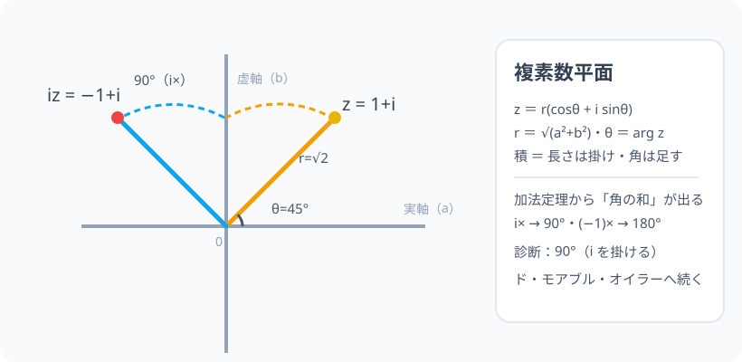

# 複素数平面と極形式：数を「位置」で、掛け算を「回転」で読む

> [!abstract] このノードの核心
> 複素数 $z = a+bi$ を点 $(a, b)$ として平面に描くのが**複素数平面**（ガウス平面）。すると極形式 $z = r(\cos\theta + i\sin\theta)$（$r$＝動径・$\theta$＝偏角）が生まれ、**掛け算は「長さをかけて、角度を足す」**ことになる。$i$ を掛ける＝90° 回転——これは定義から直接導かれる最も美しい日常事実。

> [!success] 合格ライン
> 複素数平面の座標（実部・虚部）と極形式（r・θ）を対応づけられる。z₁z₂ が「r 同士を掛け・θ 同士を足す」ことを加法定理で説明できる（＝診断：i を掛けると 90°）。

## 記号の読み方

| 表記 | 読み方 | この教材での意味 |
|---|---|---|
| 複素数平面 | ふくそすうへいめん | 実軸（x）・虚軸（y）の平面に z を点で描く |
| z = a+bi | ゼット | 点 (a, b) |
| r | アール | |z| = √(a²+b²)（原点からの距離） |
| θ | シータ | 偏角（実軸正から反時計回りの角） |
| 極形式 | きょくけいしき | z = r(cosθ + isinθ) |

> [!tip] |z| と arg z
> 距離 $|z| = r$・偏角 $\arg z = \theta$。「極形式」は距離と方向の言葉。

## 前提ノードと入口判定

機械的な前提関係は、プロジェクト内スナップショット `../ontology/math_euler_complete_ontology.json` を参照し、転記している。外部原本は `G:/マイドライブ/Eleanor Arroway/documents/math_euler_complete_ontology.json`。`trigonometry_master_ontology.md` は人間向けの全体地図として使い、IDや依存関係が異なる場合はJSONを優先する。

| 区分 | ノード・知識 | この教材で必要な理由 | 入口での判定 |
|---|---|---|---|
| 必須ノード（JSON正本） | `HS2-COMPLEX-NUM-01` 複素数と i | i²=-1・四則の扱い | i の 4 周期を言える |
| 必須ノード（JSON正本） | `HS2-TRIG-GENERALANGLE-01` 一般角 | θ が任意の実数（回転量） | 90°・−90° の位置を言える |
| 必須ノード（JSON正本） | `HS2-TRIG-ADDITION-01` 加法定理 | 積の角度が足し算になる根拠 | sin(α+β)・cos(α+β) を書ける |
| 必須ノード（JSON正本） | `HS2-TRIG-SYNTHESIS-01` 合成 | 極形式の構造（r と θ）の倒錯しない読み | a sinθ + b cosθ = R sin(θ+α) を言える |

**入口判定の扱い:** JSON の診断問題「i を掛けると何度回転する？」を最初の目安にする。**極形式で考えると θ が +90° される**——これを説明できれば合格。P0 で確認。

## 到達点

この教材を閉じたとき、次のことを自分の言葉で説明できる。

- 複素数平面の点（a, b）と極形式 r(cosθ+isinθ) の対応。
- |z|・arg z の計算。
- 極形式の積 = 長さの積・角度の和（加法定理）。
- i を掛ける＝90° 回転、−１ を掛ける＝180°（i² サイクル）を言える。

## 入口：「数を地図に書く」

座標平面に描くように、z = a + bi を (a, b) に描く。縦が虚部（i が付く）。この地図だと、**距離と方向**（極座標）の読み方が現れる。そしてその読み方の最強のご褒美が「掛け算＝回転」。

> [!example] 同じ例を最後まで使う
> z = 1 + i を主役にし、極形式（√2・θ=45°）→ i を掛けた iz の座標（−1, 1）までを通す。

## 核となる図

図：実軸（x）・虚軸（y）上に z = 1 + i と iz = −1 + i。**i を掛けると点が 90° 反時計まわりに回る**。

| 図での要素 | 名前 | 役割 |
|---|---|---|
| r = √2 | |z| | 原点からの距離（動径） |
| θ = 45° | arg z | 実軸からの角 |
| iz | | 90° 回った点 | (−1, 1) |
| 弧の矢印 | 回転 | 掛け算の視覚化 |

## まずやってみる

> [!question] 式を見る前の10秒
> z = 1+i を複素数平面の点として描き、i を掛けたもの（i(1+i) = i−1）の位置を予想する。

答えを確認する

i(1+i) = i + i² = −1 + i → (−1, 1)。z が 90° 回った左上。**i 乗算＝90° 回転**の図的確認。

## 極形式

$$
z = a + bi = r(\cos\theta + i\sin\theta),\qquad r = \sqrt{a^2+b^2},\qquad \cos\theta=\frac{a}{r},\ \sin\theta=\frac{b}{r}
$$

（a > 0 なら tanθ = b/a でも決まるが、動径の象限で確認する——合成ノードと同じ注意。）

## 掛け算＝「長さを掛けて、角を足す」

$$
z_1 = r_1(\cos\theta_1+i\sin\theta_1),\qquad z_2 = r_2(\cos\theta_2+i\sin\theta_2)
$$

展開して加法定理：

$$
z_1z_2 = r_1r_2\Big\{(\cos\theta_1\cos\theta_2-\sin\theta_1\sin\theta_2) + i(\sin\theta_1\cos\theta_2+\cos\theta_1\sin\theta_2)\Big\}
$$

$$
= r_1r_2\big\{\cos(\theta_1+\theta_2) + i\sin(\theta_1+\theta_2)\big\}
$$

$$
\boxed{\ |z_1z_2| = |z_1||z_2|,\qquad \arg(z_1z_2) = \arg z_1 + \arg z_2\ }
$$

**「積：長さを掛け・角は足す」**。

## 数値で点検する

### 診断問題：i を掛けると？

i = 1·(cos90° + isin90°)。したがって

$$
\arg(iz) = \arg i + \arg z = 90° + \arg z\quad\Rightarrow\quad \boxed{90°\ \text{回転}}
$$

(−1 を掛けると 180°、i² = −1 のサイクルもこれで読める。)

### z = 1+i の検証

$$
|z| = \sqrt{2},\ \theta = 45°\quad\Rightarrow\quad iz = \sqrt{2}(\cos135° + i\sin135°) = −1 + i\quad\checkmark
$$

### 極端な場合

- z = 0：動径 0・角度は不定（原点）。
- r₂ = 0 の積：1 点に潰れる。

## 3行まとめ

1. z = r(cosθ+isinθ)（極形式）：r = |z|・θ = arg z。
2. 積は「長さの積・角度の和」（加法定理より）。
3. i を掛ける＝90° 回転（i²＝−1 のサイクルの正体）。

## 理解度サポート：どこまで分かっているか

### まず自己評価

- [ ] **0：未学習** — 複素数平面上を描いたことがない
- [ ] **1：見れば分かる** — 図を追える
- [ ] **2：自力で使える** — 極形式の計算・回転の予想ができる
- [ ] **3：説明できる** — 加法定理からの「角の和」の導出を説明できる

### 技能ごとの確認問題

| check_id | 確認する技能 | 問い | 答えが曖昧なときに戻る場所 |
|---|---|---|---|
| P0 | JSON指定の入口診断 | 複素数 z に i を掛けると何度回転するか？ | 「数値で点検する」 |
| C1 | 極形式 | z = 1+i の極形式。（答: √2(cos45°+isin45°)） | 「極形式」 |
| C2 | 積の公式 | |z₁z₂| と arg(z₁z₂)。 | 「掛け算＝…」 |
| C3 | 計算 | z·(−1) の角は？（答: 180° 回転） | 「数値で点検する」 |
| C4 | 象限 | 極形式で (a,b) = (−1, 1) の θ。 | 「まずやってみる」 |
| C5 | ド・モアブルへ | この「角の足し算」が n 乗でどうなるか。 | 「次のノードへの橋」 |

解答と判定基準を開く

- **P0の答え:** 90°（反時計まわり）。
- **C1の答え:** √2(cos45° + i sin45°)。
- **C2の答え:** r₁r₂・θ₁+θ₂。
- **C3の答え:** 180°。
- **C4の答え:** 135°（第 II 象限）。
- **C5の答え:** n 乗すると rⁿ・角 nθ。（cosθ+isinθ)ⁿ = cos nθ + i sin nθ——ド・モアブル。

**判定の目安:**

- P0とC1〜C5を正答かつ理由つきで → 次のノードへ
- C2を誤る → 加法定理の展開（合成・加法）
- C4を誤る → 象限の確認（合成ノードの注意点）

## よくある取り違え

- 実軸・虚軸の入れ違い → **実部が横（実軸）・虚部が縦（虚軸）**。
- tanθ だけで θ を決める → **象限を見る（cosθ・sinθ の符号）**。
- 積の「角度を足す」を「角を掛ける」とする → **r はかけ、θ は足す**。
- 距離 √(a²+b²) を abs(実部) と誤る → **|z| は動径（三辺関係）**。
- 複素数平面の点の読みで z が 2 つの続きに — → **a+bi の 1 つの点**。

## 自力確認（teach-back）

教材を閉じて、次を声に出して答える。

1. z = a+bi の極形式（r と θ）を定義する。
2. 加法定理で z₁z₂ の角が θ₁+θ₂ になるのを示す。
3. i を掛ける 90°・−1 を掛ける 180° を、極形式で説明する。
4. (1+i) の極形式 → (1+i)² の極形式 → 座標の対応を確認する。

## 次のノードへの橋

- **ド・モアブルの定理（`HS3-COMPLEX-DEMOIVRE-01`）**：(cosθ+isinθ)ⁿ = cos nθ + i sin nθ（n 乗＝角 n 倍）。
- **オイラーの公式（`EULER-CONVERGENCE-01`）**：極形式の r=1 が e^(iθ) と同型（指数と三角の大合流）。
- 電磁気・波動：複素数平面は「位相」の標準読法。

## インタラクティブ化の候補（レビュー後に判定）

- **有効候補: 点 z をドラッグ（極形式表示）** — 動径・角・ |z|、arg z がライブ更新。
- **有効候補: 掛け算のデモ（z₁×z₂ が回転拡大）** — 2 つのベクトルの合成が追える。
- **静的なままで十分:** 図・極形式・検証は静的で十分。ドラッグを 1 つ。
- 動かすことそれ自体を合格条件にはしない。
