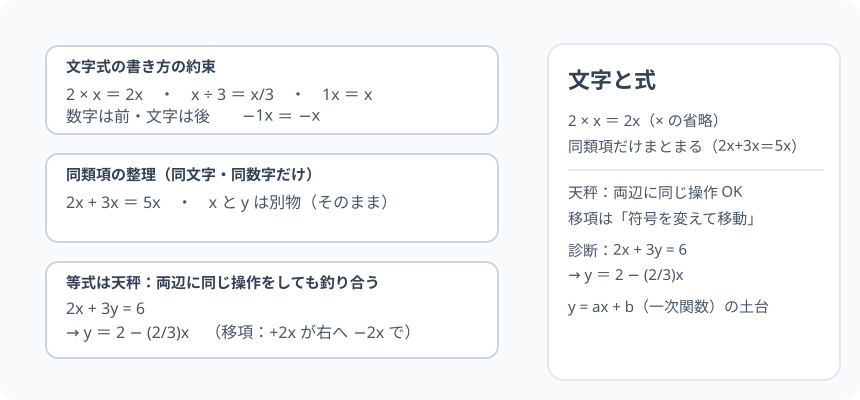

# 文字と式：数に「名前」を付ける文法

> [!abstract] このノードの核心
> 「まだ知らない数」を $x$ などで書いて、数のまま四則演算を進める——これが文字式。掛け算の記号の省略（$2\times x = 2x$）、同類項の整理（$2x+3x=5x$）、そして**等式の両辺に同じ操作をしても釣り合いが保たれる**（天秤の原理 → 移項）。ものづくりの「文脈のキャッチオール」である。

> [!success] 合格ライン
> 文字式の書き方の約束（積の省略・分数表現）を守り、$2x+3y=6$ を $y$ について解ける（＝診断の答え）。等式の両辺操作（移項）の天秤の意味を説明できる。

## 記号の読み方

| 表記 | 読み方 | この教材での意味 |
|---|---|---|
| $x$・$y$ | エックス・ワイ | 未知の数・変わる数を表す文字 |
| 係数 | けいすう | 文字に掛かっている数（2x の 2） |
| 定数項 | ていすうこう | 文字の付かない数（+3 の 3） |
| 移項 | いこう | 等式の片辺から他辺に項を移す（符号を変える） |
| 天秤 | てんびん | 等式の重さのモデル。両辺の総重量が等しい |

> [!tip] 「x と y」の音
> 読み方は英語読み（エックス・ワイ）。代数レッスンでは、文字を「数を隠す袋」と思うと手が付く。

## 前提ノードと入口判定

機械的な前提関係は、プロジェクト内スナップショット `../ontology/math_euler_complete_ontology.json` を参照し、転記している。外部原本は `G:/マイドライブ/Eleanor Arroway/documents/math_euler_complete_ontology.json`。`trigonometry_master_ontology.md` は人間向けの全体地図として使い、IDや依存関係が異なる場合はJSONを優先する。

| 区分 | ノード・知識 | この教材で必要な理由 | 入口での判定 |
|---|---|---|---|
| 必須ノード（JSON正本） | `JH-NUM-SIGN-01` 正負の数と符号 | 負のシフト（移項）・負の係数の扱いに効く | (−3)² と −3² の違いを説明できる |
| 基礎知識（C類） | 四則の感覚 | 文字を使っても計算規則は同じ | 5 × 3 と 5 + 3 の違いを言える |

**入口判定の扱い:** JSON の診断問題「$2x+3y=6$ を $y$ について解く」を最初の目安にする。これは「移項して y = にする」操作。**天秤のイメージで両辺に何をしても等しいことが理解できるか**が合格ラインで、P0 で確かめる。

## 到達点

この教材を閉じたとき、次のことを自分の言葉で説明できる。

- 文字式の書き方（省略・順序・分数）の規則。
- 同類項の整理（2x + 3x = 5x・定数項同士）ができる。
- 等式の両辺に同じ操作をしても保たれる（天秤）。
- 移項（符号を変えて他辺へ）の意味と操作ができる。

## 入口：「数がまだ決まっていないとき」どう話すか

たこ焼きが x 個あった。3 個食べた。残りは？…… x − 3。x はまだ決まってないけど、このまま「文字のまま」計算してよい。数学は「決まっていない数を文字で書いて、数字と同じルールで扱う」——その文法を身につけるのがこのノードである。

> [!example] 同じ例を最後まで使う
> 「x 個のたこ焼きを、3 個食べて、2 粒ずつ箱に詰める」から $2(x-3)$ を作り、分配・代入・等式まで使い回す。

## 核となる図

図の左：文字式の書き方（掛け算の省略・文字の語順）。図の右：等式を天秤に置き換えた絵（両辺に同じ重さのものを乗せても釣り合いが崩れない）。

| 図での要素 | 名前 | 役割 |
|---|---|---|
| 2 × x | 掛け算の省略 | 2x と書く |
| 天秤 | 等式のモデル | 左右おなじ重さならおなじ操作で安定 |
| 移項 | 符号を変えて移す | 項全体を反対側に動かす |

## まずやってみる

> [!question] 式を見る前の10秒
> 「たこ焼き x 個、あとで 3 個ずつ箱に詰めた」を掛け算の式で書くと？ どちらを先に書く？ また $3\times x$ を $3x$ と書く約束があったとき、この状況は何と書ける？

答えを確認する

（箱の数）×3 … 式で $3\times x$ → 約束により $3x$。あるいは $x$ 個を 3 個ずつ → 箱の数は $x/3$ など、文脈次第。

## 文字式の書き方の約束

1. **掛け算の記号 × は省略**：$2\times x = 2x$、$x\times y = xy$
2. **数字は文字の前に書く**：$2x$（x2 と書かない）
3. **割り算は分数**：$a\div 2 = \dfrac{a}{2}$
4. **1 と −1 を省く**：$1x$ と書かず $x$、$-1x$ は $−x$
5. 単位・量が付くときは数字に続ける：文章題の式では元の量で書く

## 同類項の整理（加減）

文字が同じ部分同士・数字同士は足し引きできる：

$$
2x + 3x = 5x,\qquad 7y - 4y = 3y,\qquad 2x + 5 = 5 + 2x\ (\text{交換})
$$

$$
- x + 3x = 2x\ \text{（符号を意識して）}
$$

**違う文字（x と y）同士はこれ以上まとまらない**——それが文字式の独立性。ここが「x を先に求める」ルートの元になる。

## 等式の性質と移項

### 天秤の原理

等式「$A = B$」は天秤の左右の総重量が釣り合っていると同じ。「両辺に同じ操作」を続ければ釣り合いが保たれる：

- 両辺に同じ数を足す
- 両辺から同じ数を引く
- 両辺に同じ数を掛ける（0 以外）
- 両辺を同じ数で割る（0 以外）

### 移項（その見た目）

$A + b = C$ は「両辺から b を引く」と（天秤どおり）$A = C - b$。あるいは“移すと符号が変わる”。

$$
\boxed{\ \text{移項するときは } + \to - \ \text{・} - \to + \ \text{（掛けの場合  × → ÷ ・ ÷ → ×）}\ }
$$

### 診断・例：2x + 3y = 6 を y について解く

$$
2x + 3y = 6 \quad(x\ \text{を横に}) \quad 3y = 6 - 2x
$$

$$
y = \frac{6 - 2x}{3} = 2 - \frac{2}{3}x
$$

**「y = の形」にするときは、x は文字のまま扱ってよい**（y について解いた結果の右辺に x が残るのは正しい）。

## 数値で点検する

- x = 4 を $2x+3y=6$ に代入：$8 + 3y = 6$ → $3y = -2$ → $y = -2/3$。解いた結果と一致する ✓
- $2(x-3)$（たこ焼きの例）を x = 5 で：$2(5-3) = 4$。分配則 $2x - 6$ と $10-6=4$ ✓
- 極端な場合：$x = 0$ → $y = 2$。

## 3行まとめ

1. 文字式は「数を隠す袋」を言葉どおり使う文法。省略・順序・分数に約束がある。
2. 同類項（同一文字・定数同士）だけ整理できる。文字が違えばまま残る。
3. 等式は天秤。両辺に同じ操作をすれば釣り合い、その見た目が移項。y について解くときは x を残してよい。

## 理解度サポート：どこまで分かっているか

### まず自己評価

- [ ] **0：未学習** — 文字式を見ると引く手を見失う
- [ ] **1：見れば分かる** — 約束を見れば式をなぞれる
- [ ] **2：自力で使える** — 代入・同類項・移項の計算ができる
- [ ] **3：説明できる** — 文字式の規則・天秤の意味・y について解く理由を説明できる

### 技能ごとの確認問題

| check_id | 確認する技能 | 問い | 答えが曖昧なときに戻る場所 |
|---|---|---|---|
| P0 | JSON指定の入口診断 | $2x + 3y = 6$ を $y$ について解くと？ | 「診断・例」 |
| C1 | 省略の規則 | $2 \times x$・$x \div 3$・$1x$ を簡潔に書く（答: 2x・x/3・x） | 「文字式の書き方の約束」 |
| C2 | 同類項 | $5x + 3x - 2x$ を整理せよ。（答: 6x） | 「同類項の整理」 |
| C3 | 天秤の説明 | 等式の両辺から「同じ数」を引いても等しい理由を天秤で説明する。 | 「等式の性質と移項」 |
| C4 | 移項 | $3x - 5 = 10$ を解く。（答: x = 5） | 「移項（その見た目）」 |
| C5 | 評価 | 次の橋（一次関数の切片と傾き）への y = ax + b の形と、このノードの移項の関係を説明する。 | 「次のノードへの橋」 |

解答と判定基準を開く

- **P0の答え:** $3y = 6 - 2x$ → $y = (6-2x)/3 = 2 - \frac{2}{3}x$。
- **C1の答え:** 2x・x/3・x。
- **C2の答え:** 6x。
- **C3の答え:** 天秤の両側から同量を取っても釣り合いに影響しない。等式でも同じ。
- **C4の答え:** 3x = 15 → x = 5（移項）。代入で 10 になるのを確認。
- **C5の答え:** y = ax + b は「y について解いた形」。x の係数 a・定数 b が見えやすく、傾き・切片の読み取りはこの形から自然。

**判定の目安:**

- P0とC1〜C5を正答かつ理由つきで → 次のノードへ
- C2を誤る → 同類項の整理（文字一致でまとめる）
- C4を誤る → 移項の符号（±で + と − の入れ替え）

## よくある取り違え

- $2x + 3y$ をまとめて $5xy$ とする → **文字が 異 なれば上のまま（しない）**。
- $x$ は「1 を忘れやすい」 → **x は 1x。x = 1x と −x = −1x**。
- 移項時に「必ず負にする」と覚える → **符号は「逆」に変わる（＋→−、−→＋）**。
- 掛け算の移項（×→÷）を忘れる → **2x = 8 → x = 8 ÷ 2 = 4**。
- 「x だけ 1 つを残す」ことを忘れて係数をめんどうにしないで残す → **1x = x になるまで変形**。

## 自力確認（teach-back）

教材を閉じて、次を声に出して答える。

1. 文字式の 5 つの約束（省略・順序・分数・1・単位）を言う。
2. 2x + 3y = 6 を y について解く手順を、移項の操作を省略せずに話す。
3. 天秤の原理で移項を説明する。
4. y = ax + b が出たとき、a と b が表すもの（傾き・切片）を述べる。

## 次のノードへの橋

- **一次関数（`JH-FUNC-LINEAR-01`）**：y = ax + b の形は、この「y について解く」問題の定番。
- **平方根（`JH-NUM-SQRT-01`）**：式は文字のまま、それをさらに解く計算の道具。
- 文字式のルールが後の「等式変形の文法」全部の土台になる。

## インタラクティブ化の候補（レビュー後に判定）

- **有効候補: 天秤シミュレーション** — 左右に重さの問題を乗せ、移項の操作に応じて解が変化。
- **有効候補: 文字式の省略→簡潔式の変換ドリル** — スライダー等は不要、セルフテスト 形式。
- **静的なままで十分:** 図と生成天秤で成立。動かすなら天秤。
- 動かすことそれ自体を合格条件にはしない。
