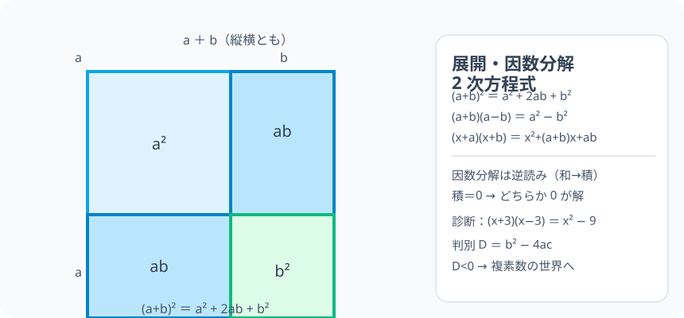

# 展開・因数分解・2 次方程式：式を「組み替える」三つ組み

> [!abstract] このノードの核心
> 展開（積を和に）と因数分解（和を積に）は、分配法則の「表目と裏目」。$\square^2$ と $\square^2-\triangle^2$ の成立は 4 分割の正方形で確かめる。そして「積 = 0」という 2 次方程式の解の絞り方、解の公式（$x=\frac{-b\pm\sqrt{b^2-4ac}}{2a}$）はこの組み替えの実演である。

> [!success] 合格ライン
> 分配法則から $(a+b)^2 = a^2+2ab+b^2$・$(a+b)(a-b) = a^2 - b^2$ を導ける（＝診断（x+3)(x−3) = x²−9 の答え）。（x−2)(x−3) = 0 から x = 2, 3 を出す理由（積=0）を言える。

## 記号の読み方

| 表記 | 読み方 | この教材での意味 |
|---|---|---|
| 展開 | てんかい | 積を和の形（分配法則を外す）に書き直す |
| 因数分解 | いんすうぶんかい | 和（式）を積（因数）に分ける |
| 2 次方程式 | にじほうていしき | ax²+bx+c = 0 の形 |
| 解の公式 | かいのこうしき | 因数分解できないときの最後の手 |

> [!tip] 展開と分解は「行きと帰り」
> (x+a)(x+b) ⇒ x²+(a+b)x+ab（展開）／x²+(a+b)x+ab ⇒ (x+a)(x+b)（因数分解）。**同じ事実を二方向から見る**。

## 前提ノードと入口判定

機械的な前提関係は、プロジェクト内スナップショット `../ontology/math_euler_complete_ontology.json` を参照し、転記している。外部原本は `G:/マイドライブ/Eleanor Arroway/documents/math_euler_complete_ontology.json`。`trigonometry_master_ontology.md` は人間向けの全体地図として使い、IDや依存関係が異なる場合はJSONを優先する。

| 区分 | ノード・知識 | この教材で必要な理由 | 入口での判定 |
|---|---|---|---|
| 必須ノード（JSON正本） | `JH-ALG-EXPR-01` 文字と式・等式変形 | 分配法則・同類項整理の基礎 | 2(x+3) = 2x+6 を書ける |
| 必須ノード（JSON正本） | `JH-NUM-SQRT-01` 平方根 | 解の公式の ±√(b²−4ac)・x² = a の解法 | √2×√3 = √6 を説明できる |

**入口判定の扱い:** JSON の診断問題「(x+3)(x−3) を展開」を最初の目安にする。**分配を丁寧にやれば必ず出る**（x²−9）。それを「平方差の公式」として見ると因数分解・2 次方程式へ次が繋がる——P0 で確認。

## 到達点

この教材を閉じたとき、次のことを自分の言葉で説明できる。

- 3 つの展開公式を分配法則（または 4 分割の面積図）から導ける。
- 因数分解は逆方向であり、（積）= 0 の 2 次方程式の解法に直結する。
- 解の公式を（演算の列とともに）使い、b²−4ac の役割（判別式）を言える。
- 診断計算（x²−9 など）と、因数分解による 2 次方程式の実例がセットでできる。

## 入口：「組み替える」ことで、解ける形にする

式は「事実の表現」である。同じ事実を「積の形」「和の形」で持ち替えると、見える景色が変わる。x²−9 = 0 は、因数分解すると（x+3)(x−3)=0 の積の形——**積が 0 なら、どちらか一方が 0**。これが 2 次方程式の第一解法。

> [!example] 同じ例を最後まで使う
> 主役は「3 と −3 の対」：x²−9 → (x+3)(x−3) の展開・分解・方程式の 3 役で通す。

## 核となる図

図は一辺 (a+b) の正方形を 4 分割（a²・ab・ab・b²）したもの。**展開公式 (a+b)² = a²+2ab+b² は面積の等式として、間違えようもなく読める**。

| 図での要素 | 名前 | 役割 |
|---|---|---|
| 左上の正方形 | a² | a×a の面積 |
| 右上・左下の長方形 | ab が 2 つ | 2ab |
| 右下の正方形 | b² | b×b の面積 |
| 全体 | (a+b)² | 合計の面積 |

## まずやってみる

> [!question] 式を見る前の10秒
> (x+3)(x−3) を分配法則（1 個ずつ掛けて外す）で展開する。x×x・x×(−3)・3×x・3×(−3) の 4 項に分けて書き出し、同類項を整理する。

答えを確認する

x² − 3x + 3x − 9 = x² − 9。**中央の ±3x が消える** ＝ 平方差の形。

## 展開公式（分配から）

$$
\text{基本は分配}：\quad (x+a)(x+b) = x^2 + (a+b)x + ab
$$

特に覚える 3 つ：

$$
\boxed{\ (a+b)^2 = a^2 + 2ab + b^2\ }\qquad
\boxed{\ (a-b)^2 = a^2 - 2ab + b^2\ }
$$

$$
\boxed{\ (a+b)(a-b) = a^2 - b^2\ }
$$

（平方差の形は 3 つ目の「あれ、消える」で記憶。）

### 4 分割の面積図による確かめ (a+b)²

図の通り、a²・ab・ab・b² の 4 分割の面積を足すと a²+2ab+b²。**計算公式と図がズレない**。

## 因数分解（逆方向）

展開の逆読み：

$$
a^2 - b^2 = (a+b)(a-b),\qquad a^2+2ab+b^2 = (a+b)^2
$$

**“x² − 9” は「平方差」（3² を引く形）**。特に「2 乗引く 2 乗」は因数分解の定番。

## 2 次方程式の解法

### 積 = 0 の原理

$$
(x-a)(x-b) = 0 \quad\Leftrightarrow\quad x = a\ \text{または}\ x=b
$$

（実数の掛け算で積が 0 なら、少なくとも一方が 0。)

### 例：x² − 5x + 6 = 0

$$
x² - 5x + 6 = (x-2)(x-3) = 0\quad\Rightarrow\quad x = 2,\ 3
$$

注意：**因数分解できると手取り早い**が、いつもできるとは限らない。そういうときが下の「解の公式」。

### 解の公式

$$
ax^2 + bx + c = 0\quad\text{の解}\quad\boxed{\ x = \frac{-b\pm\sqrt{b^2-4ac}}{2a}\ }
$$

- 判別式 $D = b^2 - 4ac$：D>0 は 2 解、D=0 は重解、D<0 は実数解なし（後で複素数で再会）。

## 数値で点検する

### 診断問題：(x + 3)(x − 3)

$$
x^2 - 9\quad\checkmark\quad(\text{平方差})
$$

### 展開公式の検証（a = 2・b = 1 で）

$$
(2+1)^2 = 9,\qquad 2^2 + 2\cdot2\cdot1 + 1^2 = 9\quad\checkmark
$$

### 判別式の検証：x² + 2x + 5 の場合

D = 4 − 20 = −16 < 0 → 実数解なし。**（解の公式の √ の中が負。これが複素数の導入になる。）**

## 3行まとめ

1. 展開は分配・因数分解は逆読み。3 つの公式（特に平方差）は図で語れば覚える必要なし。
2. 積=0 → どちらか 0。これが 2 次方程式の定番解法。
3. 解の公式は万能（√ の中 D の符号が次への分かれ目）。

## 理解度サポート：どこまで分かっているか

### まず自己評価

- [ ] **0：未学習** — 展開の記法がまだ
- [ ] **1：見れば分かる** — 分配と 4 分割を追える
- [ ] **2：自力で使える** — 展開・分解・方程式の解を出せる
- [ ] **3：説明できる** — 展開＝分解・図・積=0・判別式の全セットを説明できる

### 技能ごとの確認問題

| check_id | 確認する技能 | 問い | 答えが曖昧なときに戻る場所 |
|---|---|---|---|
| P0 | JSON指定の入口診断 | (x + 3)(x − 3) を展開すると？ | 「まずやってみる」 |
| C1 | 展開 | (2x+1)² を展開せよ。（答: 4x²+4x+1） | 「展開公式」 |
| C2 | 因数分解 | x²−16 を因数分解せよ。（答: (x+4)(x−4)） | 「因数分解」 |
| C3 | 積=0 | (x−2)(x−3)=0 の解と理由。 | 「積 = 0 の原理」 |
| C4 | 解の公式 | x²+2x−3 = 0 を公式で解く。（答: 1, −3） | 「解の公式」 |
| C5 | 橋 | 判別式 D<0 のとき、何がどうなるか（後続ノードへの布石）を話す。 | 「数値で点検する」 |

解答と判定基準を開く

- **P0の答え:** x² − 9。
- **C1の答え:** 4x²+4x+1（2x を a と見る）。
- **C2の答え:** (x+4)(x−4)。
- **C3の答え:** x = 2 または 3。積 = 0 → 一方 0。
- **C4の答え:** 解の公式より x = 1, −3（検算：1+2−3=0・9−6−3=0）。
- **C5の答え:** 実数解なし。√ の中が負。虚数（複素数）の導入へ続く話（`HS2-COMPLEX-NUM-01` 前段）。

**判定の目安:**

- P0とC1〜C5を正答かつ理由つきで → 次のノードへ
- C2を誤る → 平方差の公式をもう一度図で見る
- C4を誤る → 公式の ± と分母 2a を確認

## よくある取り違え

- (a+b)² を a²+b² と展開する → **a²+2ab+b²（中央 2ab を忘れない）**。
- (a+b)(a−b) の 3 つ目で符号を間違える → **中間項は消える（±ab が相殺）→ a²−b²**。
- 因数分解は「展開の逆」だが見つける技が要る → **共通因数・平方差の形を見つける**。
- 解の公式の b²−4ac を b² − 2ac と打ち間違える → **b² − 4ac**。
- 積=0 の原理を「掛け算の 0 の意味」でない一般に適用する → **実数に限る**（0 を掛けると 0 だけ）。

## 自力確認（teach-back）

教材を閉じて、次を声に出して答える。

1. (a+b)² を 4 分割の面積図で説明する。
2. x² − 9 = 0 を 3 ステップ（因数分解・積0・解）で解く。
3. 解の公式を書く。b²−4ac の意味（判別）を言う。
4. (2x+1)²・平方差（a²−b²）と、そこから繋がる因数分解の話をする。

## 次のノードへの橋

- **2 次関数・判別（`HS?` 圏外だが 2 次関数のグラフで再会）**：D = 0 は x 軸と一点で交わる（重解）。
- **複素数（`HS2-COMPLEX-NUM-01`）**：D < 0 の代入（i² = −1）で再会。x の式（解の公式）に独立なルートが拡張される。
- 平方差は三角関数の恒等式（1−cos²θ＝sin²θ など）にも同じ形で潜む。

## インタラクティブ化の候補（レビュー後に判定）

- **有効候補: (a+b)² の 4 分割の可変図** — a・b スライダーで 4 分割がずれ、合計 (a+b)² が追える。
- **有効候補: 因数分解→解の座標** — 解の値が 2 本の x 切片として動く。
- **静的なままで十分:** 公式・図・方程式とも静的で十分。
- 動かすことそれ自体を合格条件にはしない。
