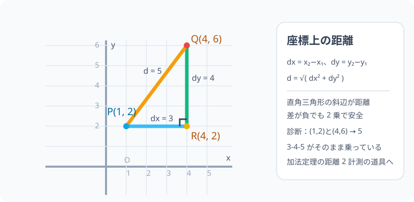

# 座標平面上の距離：番地から定規なしで長さを測る

> [!abstract] このノードの核心
> 2 点の座標が分かれば、**横の差 dx と縦の差 dy に「三平方の定理」を当てれば距離が出る**。$d = \sqrt{(x_2-x_1)^2 + (y_2-y_1)^2}$。3-4-5 の直角三角形が座標平面上にそのまま乗っているだけである。

> [!success] 合格ライン
> 2 点の座標から dx・dy を求め、直角三角形を描いて距離の式を導出できる。診断問題（(1,2) と (4,6) → 5）を計算し、なぜ 3-4-5 になるか説明できる。

## 記号の読み方

| 表記 | 読み方 | この教材での意味 |
|---|---|---|
| dx | デルタエックス | x 座標の差（横の移動量） |
| dy | デルタワイ | y 座標の差（縦の移動量） |
| √ | ルート | 平方根（2 乗してその数になる値） |
| 距離 | きょり | 2 点間の最短直線の長さ |

> [!tip] Δ（デルタ）の読み
> Δx・Δy は「x の変化量・y の変化量」の記号。一次関数の傾き（縦 ÷ 横）と同じ Δ である。

## 前提ノードと入口判定

機械的な前提関係は、プロジェクト内スナップショット `../ontology/math_euler_complete_ontology.json` を参照し、転記している。外部原本は `G:/マイドライブ/Eleanor Arroway/documents/math_euler_complete_ontology.json`。`trigonometry_master_ontology.md` は人間向けの全体地図として使い、IDや依存関係が異なる場合はJSONを優先する。

| 区分 | ノード・知識 | この教材で必要な理由 | 入口での判定 |
|---|---|---|---|
| 必須ノード（JSON正本） | `JH-GEO-PYTHAGORAS-01` 三平方の定理 | 距離の式の本体。直角三角形で a²+b²=c² | 3-4-5 の三角形で斜辺が 5 になることを言える |
| 必須ノード（JSON正本） | `JH-COORD-PLANE-01` 座標平面と原点 O | 座標（x, y）を読み、差を計算するため | (4,6) を座標平面に描ける |
| 基礎知識（C類） | 平方根・√ | 距離の式の最終形（√ で立体感を出す） | √25 = 5・√(a²) = |a| の計算ができる |

**入口判定の扱い:** JSON の診断問題「(1,2) と (4,6) の距離は？」を最初の目安にする。計算自体はすぐでるが、**その計算が「座標平面に 3-4-5 の直角三角形がある」ことの確認**であると説明できることが合格ライン。P0 で確認。

## 到達点

この教材を閉じたとき、次のことを自分の言葉で説明できる。

- 2 点の座標から dx・dy を求める手順。
- 距離公式が三平方の定理の応用である理由（斜辺＝距離）。
- dx・dy が負になっても式が成立する理由（2 乗）。
- 3-4-5 が座標平面に現れている（1,2）−（4,6）を暗算・検証する。

## 入口：「マップの 2 つの点」を、ものさしの代わりに計算で

座標平面を地図にする。A 地点（1, 2）、B 地点（4, 6）。歩いた距離はキロ数ではなく、座標の「差」から計算できる。それには直線距離を斜辺とする直角三角形を下に描けばよい。

> [!example] 同じ例を最後まで使う
> P(1, 2)・Q(4, 6) を使い、dx・dy の抽出、直角三角形、距離公式検証（= 5）、極端な場合まで 1 セットで通す。

## 核となる図

図は P(1,2) と Q(4,6) から、横に 3（dx）、縦に 4（dy）進む直角三角形を作った図。斜辺（PQ）の長さが求める距離で、**3-4-5 の三角形そのもの**である。

| 図での要素 | 名前 | 役割 |
|---|---|---|
| P(1, 2) | 出発点 | 座標 1 つ目 |
| Q(4, 6) | 到達点 | 座標 2 つ目 |
| dx（青） | 横の差 | 4 − 1 = 3 |
| dy（緑） | 縦の差 | 6 − 2 = 4 |
| PQ（橙） | 距離 d | 求める長さ = 5 |

## まずやってみる

> [!question] 式を見る前の10秒
> P(1,2) と Q(4,6) を結ぶ。まず「P から Q まで行くのに横にいくら・縦にいくら進むか」だけ書いてみる。その 2 つの数を 2 辺にもつ直角三角形の斜辺は？ 3-4-5 の知恵を使うと…？

答えを確認する

横 3・縦 4。その直角三角形の斜辺が距離で、3-4-5 の知恵から 5。計算すれば $\sqrt{3^2+4^2} = \sqrt{25} = 5$。

## 距離の公式

座標平面上の 2 点 $P(x_1, y_1)$・$Q(x_2, y_2)$ の距離 d は

$$
\boxed{\ d = \sqrt{(x_2-x_1)^2 + (y_2-y_1)^2}\ }
$$

### 導出：直角三角形を作る

P から横に、Q から縦に引いてできる補助点 R を考える。P から Q への移動は「横 dx・縦 dy」に分解できる。

$$
dx = x_2 - x_1,\qquad dy = y_2 - y_1
$$

このとき PR・RQ・PQ から直角三角形ができ、斜辺が PQ：

$$
d^2 = dx^2 + dy^2
$$

三平方の定理の斜辺を解いて

$$
d = \sqrt{dx^2 + dy^2}
$$

**dx・dy が負**（P から左・下に行く場合）でも、2 乗すれば符号は消えるので公式は常に成立。

## 数値で点検する

### 診断問題：(1,2) と (4,6)

$$
dx = 4 - 1 = 3,\qquad dy = 6 - 2 = 4,\qquad d = \sqrt{3^2 + 4^2} = \sqrt{25} = 5
$$

3-4-5 の三角形がそのまま乗っている（R = (4,2) を補助点にすると PR = 3、RQ = 4、PQ = 5）。

### 極端な場合

- 縦一直線（x 座標が同じ）：dx = 0 → d = |dy|（たとえば (2,4) と (2,9) → 5）。
- 横一直線（y 座標が同じ）：dy = 0 → d = |dx|。
- 2 点が同じ位置：d = 0（点自体）。
- 差が負になるケース：P(0,0), Q(−3, −4) → dx = −3, dy = −4 → 2 乗で 25 → 5。

## 3行まとめ

1. 座標平面の 2 点の距離は「横差 dx・縦差 dy で直角三角形を描く」→ 三平方の定理。
2. 式：$d = \sqrt{(x_2-x_1)^2 + (y_2-y_1)^2}$。負の差も 2 乗で安全。
3. （1,2）と（4,6）は 3-4-5 の実例。距離 5。

## 理解度サポート：どこまで分かっているか

### まず自己評価

- [ ] **0：未学習** — 距離を式化しようとしない
- [ ] **1：見れば分かる** — 図を見て 3-4-5 を確認できる
- [ ] **2：自力で解ける** — 2 点から dx・dy・距離を計算できる
- [ ] **3：説明できる** — 三平方の定理の応用として、負の差と縦横ずれも含めて説明できる

### 技能ごとの確認問題

| check_id | 確認する技能 | 問い | 答えが曖昧なときに戻る場所 |
|---|---|---|---|
| P0 | JSON指定の入口診断 | 2 点 (1,2) と (4,6) の距離は？（答: 5） | 「数値で点検する」 |
| C1 | 差の抽出 | P(2,5)・Q(7,13) の dx・dy を求めよ。（答: 5・8） | 「導出」 |
| C2 | 公式の適用 | P(0,0)・Q(6,8) の距離は？（答: 10） | 「数値で点検する」 |
| C3 | 負の差 | P(−1,2)・Q(3,−4) の距離を計算し、途中に負が現れる理由を説明する。 | 「導出」（2 乗） |
| C4 | 三角形一本 | (1,2)・(4,6) を斜辺として、3-4-5 に現れる 3・4 がどこに対応するか説明する。 | 「核となる図」 |
| C5 | 先の橋 | この距離の考え方が、三角比・単位円の距離（加法定理の証明）でどう使われるかを述べる。 | 「次のノードへの橋」 |

解答と判定基準を開く

- **P0の答え:** dx = 3・dy = 4 → d = √(9+16) = √25 = 5。
- **C1の答え:** dx = 7−2 = 5、dy = 13−5 = 8。
- **C2の答え:** √(36+64) = √100 = 10（6-8-10。3-4-5 の 2 倍）。
- **C3の答え:** dx = 4・dy = −6 → d = √(16+36) = √52 = 2√13。負の数は 2 乗で消えるから式は安全。
- **C4の答え:** dx＝3 が底辺（4−1）、dy＝4 が高さ（6−2）。斜辺 5 が距離。
- **C5の答え:** 単位円上の 2 点 (cosα, sinα)・(cosβ, sinβ) の距離を、座標差で計算するのが加法定理の証明の始まり。ここで（x₂−x₁）²＋（y₂−y₁）² の距離公式が使われる。

**判定の目安:**

- P0とC1〜C5を正答かつ理由つきで → 次のノードへ
- C3を誤る → 負の差と 2 乗の扱いを復習
- C4を誤る → 図を描いて dx・dy を指す
- C5を誤る → 単位円で 2 点を取り、距離を書いてみる

## よくある取り違え

- dx・dy と距離 d を混同 → **dx・dy は差（移動量）、d は距離（線分長）**。
- (x₂−x₁)²+(y₂−y₁)² の外側の√を忘れる → **√ を外して「√(dx²+dy²)」の形**。
- dx・dy の順序を変えて違う値… → **符号は 2 乗で消えるので、順序はどちらでも（x₂−x₁ でも x₁−x₂ でも同じ）**。
- 三次元や斜めの線と一般化 → **この式は 2 次元（平面）限定。3 次元は z の項が増える**。
- 長さを dx+dy と単純加算する → **斜めの線は diag（√）で、直角 2 辺の和では等しくない**。

## 自力確認（teach-back）

教材を閉じて、次を声に出して答える。

1. 2 点を結ぶ直角三角形を作る流れを、図を描かずに説明する。
2. 距離公式を三平方の定理から導く。
3. (2,9) と (5,5) の距離を計算する（答: 5）。
4. 加法定理の証明でこの距離公式がどう出てくるか、言葉にする。

## 次のノードへの橋

座標の距離は、この後の 2 回の大仕事につながる。

- **単位円（`HS1-TRIG-UNITCIRCLE-01`）**：円の方程式 x²+y²=1 は原点からの距離 1 を表している。
- **加法定理（`HS2-TRIG-ADDITION-01`）**：単位円上の 2 点 P(cosα, sinα)・Q(cosβ, sinβ) の距離をこの公式で測り、余弦定理の測り方と比べる——その一致が cos(α−β) の公式を生む。

## インタラクティブ化の候補（レビュー後に判定）

- **有効候補: P と Q をドラッグ** — 2 点を動かすと dx・dy・距離がリアルタイムで更新。裏の 3-4-5 の発見モードも。
- **有効候補: 座標グリッドの目盛り** — 2 点の座標表示。診断 P0 を式でフロー。
- **静的なままで十分:** 図・式・導出が単純なので大きくは不要。ドラッグ 1 つで 5 分。
- 動かすことそれ自体を合格条件にはしない。
