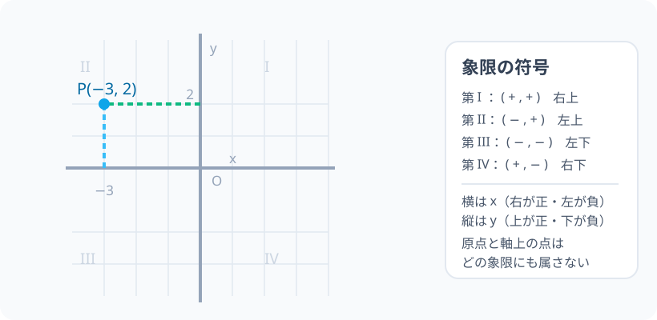

# 座標平面：2 つの数で「どこにいるか」を言う

> [!abstract] このノードの核心
> 平面の上で「どこにいるか」を言うには、2 本の直交する目盛り（x 軸・y 軸）で測る。点の位置は**座標** $(x, y)$ という順序の決まった 2 つの数で書け、x 座標の正負は左右、y 座標の正負は上下を表す。4 つの象限の符号はここから自動的に決まる。

> [!success] 合格ライン
> 点 (3, −2) を平面上にまで描けて、逆に描かれた点の座標を読める。$(-3, 2)$ の象限を x 座標・y 座標の符号から判断でき、原点 (0, 0) や点 (2, 0) のような軸上の点はどの象限にも属さないことを説明できる。

## 記号の読み方

| 表記 | 読み方 | この教材での意味 |
|---|---|---|
| x 軸 | エックスじく | 横（左右）の目盛りの直線 |
| y 軸 | ワイじく | 縦（上下）の目盛りの直線 |
| 原点 O | げんてん・オー | x 軸と y 軸の交わる点。座標 (0, 0) |
| 座標 (x, y) | ざひょう | 点の位置を表す 2 つの数の組 |
| 象限 | しょうげん | 軸で分けられた 4 つの領域（第 I〜IV） |

> [!tip] 音読するとき
> $(3, -2)$ は「さん、マイナスに、の点」など。**順序が決まっている**ので「x 座標は 3、y 座標は −2」と言えるようにする。

## 前提ノードと入口判定

機械的な前提関係は、プロジェクト内スナップショット `../ontology/math_euler_complete_ontology.json` を参照し、転記している。外部原本は `G:/マイドライブ/Eleanor Arroway/documents/math_euler_complete_ontology.json`。`trigonometry_master_ontology.md` は人間向けの全体地図として使い、IDや依存関係が異なる場合はJSONを優先する。

| 区分 | ノード・知識 | この教材で必要な理由 | 入口での判定 |
|---|---|---|---|
| 必須ノード（JSON正本） | `JH-NUM-SIGN-01` 正負の数と符号 | 座標を負の数で読むため。特に (−, −) の場所 | (-3)² と −3² の違いを説明できる・−3 の位置が 0 の左 |
| 基礎知識（ノード外） | 座席表（2 列目の 3 番目の席） | 「2 つの情報で位置を指定する」既存の感覚 | 「2 列目の 3 番目の席」だけで場所を言える |

**入口判定の扱い:** JSON の診断問題「第 2 象限の点の符号は？」を最初の目安にする。はじめから答えられても理由が説明できない場合は要復習。後の P0 で確認する。

## 到達点

この教材を閉じたとき、次のことを自分の言葉で説明できる。

- 平面上の点の位置が 2 つの数（x 座標・y 座標）で完全に定まり、順序が変わる別の点になることを説明できる。
- どの象限にあるかを、座標の符号から判定できる。
- 原点・軸上の点がどの象限にも属さない理由を言える。
- 直線 $x = 2$・$y = -3$ をそれぞれ描ける。

## 入口：「2 列目の 3 番目」

映画館の座席は「番号と番号」で指定できる。この試しを平面全体にやるのが座標である。

> [!example] 同じ例を最後まで使う
> 「x 座標 = 横の位置、y 座標 = 縦の位置」を、席の体感そのままに使う。横に 2 進む・縦に 3 進む、という歩き方として点を描く。

## 核となる図

図では点 P が「x 軸から左へ 3、y 軸から上へ 2」の位置にある。破線がその読み取りの手がかりを表す。

| 図での要素 | 名前 | 役割 |
|---|---|---|
| 横線 | x 軸 | 左右の目盛り。左が負・右が正 |
| 縦線 | y 軸 | 上下の目盛り。下が負・上が正 |
| 交差する点 O | 原点 | 分かれ目。座標 (0, 0) |
| 破線 | 補助線 | x 座標・y 座標の読み取りを視覚化 |
| 4 つの領域 | 第 I〜IV 象限 | 符号の組合せごとの場所 |

## まずやってみる

> [!question] 式を見る前の10秒
> (a) 点 $(3, -2)$ は、原点からどの方向へそれぞれいくつ進む位置か。(b) $(-1, 1)$ と $(1, -1)$ は同じ点か。番号の順序を意識して予想する。

答えを確認する

(a) 原点から**右へ 3・下へ 2**。(b) **別の点**。$(-1, 1)$ は左上、$(1, -1)$ は右下。順序を入れ替えると目の前の位置が変わる。

## 座標の約束：横を先に書く

座標 $(x, y)$ は「x 座標（横）、y 座標（縦）」の順序で書く。これが「順序付きの組」である。

$$
P(x,\ y)\quad\text{で「x 座標が }x,\ y\text{ 座標が }y\text{ の点」}
$$

書き方の約束は次の 3 つ。

1. カッコでまとめ、x 座標を先に書く。
2. 座標と座標の間はカンマで区切る。
3. 点の名前（P など）を添えると、図でも混ざらずに読める。

## 象限の符号：左右・上下の切れ目

軸で平面は 4 つに分かれる。右で正、左で負（x 軸）。上で正、下で負（y 軸）。

| 象限 | x 座標 | y 座標 | 場所の例 |
|---|---|---|---|
| 第 I 象限 | + | + | 右上 |
| 第 II 象限 | − | + | 左上 |
| 第 III 象限 | − | − | 左下 |
| 第 IV 象限 | + | − | 右下 |

この表は「左なら x 負・下なら y 負」だけから出る。**覚えずに導ける**のが座標の良さ。

### 軸上の点は吟味の対象

原点 (0, 0) は「右上でも左上でもない」。同様に点 (2, 0) は x 軸上にあり、象限に属さない。軸は領域の仕切りであり、仕切りの線そのものに立つ点はどの領域の内部にも入らない。

$$
\text{軸上}：x = 0 \text{ の点 }(= y \text{ 軸上}) \quad\text{または}\quad y = 0 \text{ の点 }(= x \text{ 軸上})
$$

## グラフを描く・読む：座標の往復

点 (2, −3) を描く：原点から右へ 2 歩・下へ 3 歩。

逆に、点 Q を図から読む：Q から y 軸と平行な線を降ろすと道のりの分の目盛りが x 座標（x 軸との交点）、Q から x 軸と平行な線を延ばすと y 軸との交点が y 座標。

この「行き来」ができるようになることが、このノードの実用上の到達点である。

## 数値で点検する

- 点 $(-2, 4)$：左へ 2・上へ 4 → 第 II 象限（−, +）。
- 点 $(0, -1)$：y 軸上の点 → 第 III 象限に**属さない**（象限判定で確かめる）。
- 極端な場合として原点 (0, 0)：左右・上下の基準点そのもの。無限の組み合わせを産むが、自身は原点。

## 3行まとめ

1. 平面は x 軸（横）と y 軸（縦）の 2 本の目盛りで、点の位置を 2 つの数（順序付き）で測る。
2. 象限の符号は「右正・左負・上正・下負」から導出する。
3. 軸上の点と原点はどの象限にも属さない。

## 理解度サポート：どこまで分かっているか

### まず自己評価

- [ ] **0：未学習** — 座標の 2 つの数が何をさすか分からない
- [ ] **1：見れば分かる** — 図を見れば座標と位置を関係づけられる
- [ ] **2：自力で書ける** — 座標を書けて、読める
- [ ] **3：説明できる** — 象限の符号・軸上の例外・順序の意味を説明できる

### 技能ごとの確認問題

| check_id | 確認する技能 | 問い | 答えが曖昧なときに戻る場所 |
|---|---|---|---|
| P0 | JSON指定の入口診断 | 第 2 象限にある点の x 座標と y 座標の符号は？（答: x<0, y>0） | 「象限の符号」 |
| C1 | 読み書き | 点 $P(-3, 2)$ を図に描き、Q を図から (4, −1) として読む。 | 「グラフを描く・読む」 |
| C2 | 順序の意味 | $(2, 3)$ と $(3, 2)$ が異なる点であることを、方向の言葉で説明する。 | 「まずやってみる」 |
| C3 | 象限の導出 | 第 III 象限にある点の座標の符号を、左右・上下の規則から導く。（答: x<0, y<0） | 「象限の符号」 |
| C4 | 軸上の例外 | 点 $(0, -1)$ はどの象限に属するか。理由を付けよ。 | 「軸上の点は」 |
| C5 | 逆行の橋 | 直線 $x = 2$ はどのような点の集まりか。直線 $y = -3$ はどうか。 | 「次のノードへの橋」 |

解答と判定基準を開く

- **P0の答え:** x < 0, y > 0。左上の領域である。
- **C1の答え:** 原点から左へ 3・上へ 2 で描ける。Q は右へ 4・下へ 1 の場所。
- **C2の答え:** (2, 3) は右上、(3, 2) はさらに右に進んだ別の右上の位置。歩く順序が違うので着地点が違う。
- **C3の答え:** 左（x 負）・下（y 負）の組合せなので x < 0, y < 0。
- **C4の答え:** どれにも属さない。y 軸上の点なので x = 0 であり、領域の内部ではない。
- **C5の答え:** x = 2 は「x 座標が 2」の点の集まり、つまり x 軸に垂直な縦の直線。y = −3 は y 座標が −3 の点の集まり（横の直線）。2 つの直線は点 (2, −3) で交わる。

**判定の目安:**

- P0とC1〜C5を正答かつ理由つきで → 次のノードへ
- C3を誤る → 象限の表を自分の言葉で書き直す
- C4を誤る → 軸上は領域の外、という例外感覚を復習
- 正答でも理由が曖昧 → 該当節を読み直して再回答

## よくある取り違え

- 「座標 (x, y)」と「距離」を混同 → **座標は位置の「番地」であり、距離を意味しない**。
- 「x 座標は縦」と上下を取り違える → **横が x（左右）・縦が y（上下）。初歩の混ぜ違え第 1**。
- 原点を「空」と思う → **(0, 0) は基準点であり、重要。数多くの計算の中心になる**。
- (2, 3) と (3, 2) を同じと見なす → **順序は大事。番地を逆にしたら着く場所が違う**。
- 軸上の点を I〜IV のどれかを割り当てる → **軸上はどの象限にも属さない**。

## 自力確認（teach-back）

教材を閉じて、次を声に出して答える。

1. 平面に点 P(−3, 2) を描く手順を、原点からの「歩き方」として説明する。
2. 第 IV 象限の点の符号の組を導きつつ、表を見ずに言う。
3. 点 (0, 5) がどの象限にも属さない理由を説明する。
4. 平面上の点の位置は 2 つの数で完全に決まる理由を説明する。

## 次のノードへの橋

このノードで、平面を数の言葉で扱えるようになった。この後は 2 つの先がある。

- **一次関数のグラフ（`JH-FUNC-LINEAR-01`）**：点の集まり（直線）を「傾きと切片」の式で語る。
- **図形の回転（`JH-GEO-ROTATION-01`）**：原点を中心に回す回転移動 —— 後に単位円（`HS1-TRIG-UNITCIRCLE-01`）の座標の読み方へ直接つながる。

## インタラクティブ化の候補（レビュー後に判定）

- **有効候補: 点をドラッグして移動し座標を表示** — 座標と視覚位置が同期し、「左右・上下 = 正負」が体験で入る。象限の境を越える瞬間も見える。
- **有効候補: 原点を中心に点を回転** — このノードの中心〜次ノードの準備。回転移動の見える化が、後の単位円を支える。
- **静的なままで十分:** 表の導出と「歩き方」は操作なしで成立。1 つだけ選ぶなら、最初のドラッグが最適。
- 動かすことそれ自体を合格条件にはしない。
