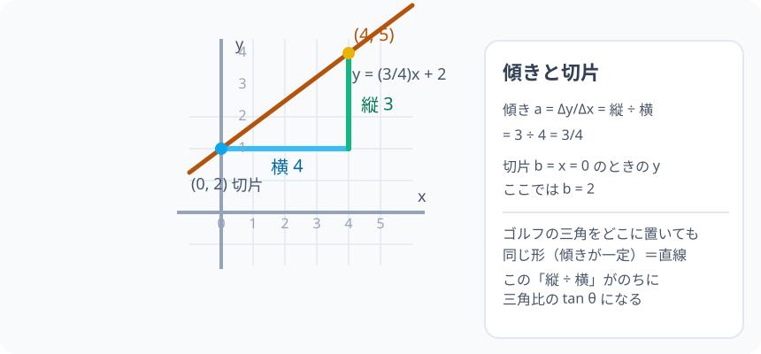

# 一次関数：直線は「変化の割合」を語る

> [!abstract] このノードの核心
> $y = ax + b$ のグラフは直線になる。**傾き a** は「x が 1 増えると y がどれだけ増えるか」= $\dfrac{\text{縦の変化量}}{\text{横の変化量}}$、**切片 b** は「x = 0 のときの y」。この 2 つで直線は完全に決まる。

> [!success] 合格ライン
> 座標平面上の直線から傾きと切片を読み取り、$y = ax + b$ で表せる。原点と点(4,3)を結ぶ直線の傾きが $\dfrac{3}{4}$ になる理由を「縦の増加量 ÷ 横の増加量」で説明できる。

## 記号の読み方

| 表記 | 読み方 | この教材での意味 |
|---|---|---|
| a | エー | 傾き。x が 1 増えるときの y の増え方 |
| b | ビー | 切片。x = 0 のときの y の値 |
| Δx・Δy | デルタエックス・デルタワイ | x・y の（増加量） |
| 変化の割合 | へんかのわりあい | $\dfrac{\Delta y}{\Delta x}$ = 傾きと同じ |

> [!tip] 音読するとき
> $\Delta$（デルタ）は「変化量」の記号。$\Delta x$ は「横にいくら動かしたか」、$\Delta y$ は「縦にいくら動いたか」と読む。

## 前提ノードと入口判定

機械的な前提関係は、プロジェクト内スナップショット `../ontology/math_euler_complete_ontology.json` を参照し、転記している。外部原本は `G:/マイドライブ/Eleanor Arroway/documents/math_euler_complete_ontology.json`。`trigonometry_master_ontology.md` は人間向けの全体地図として使い、IDや依存関係が異なる場合はJSONを優先する。

| 区分 | ノード・知識 | この教材で必要な理由 | 入口での判定 |
|---|---|---|---|
| 必須ノード（JSON正本） | `JH-ALG-EXPR-01` 文字と式・等式変形 | y = ax + b を式として扱うため。移項・代入の計算 | y = 3x + 2 で x = 4 のときの y を代入で求められる |
| 必須ノード（JSON正本） | `JH-COORD-PLANE-01` 座標平面と原点 O | グラフを描いて直線の性質を見るため。点の座標の読み書き | (4, 3) を図に示せる・第 2 象限の符号が言える |
| 基礎知識（ノード外） | 比例の感覚 | y = ax が原点を通る直線であることの、小学校からの持ち越し | 「x が 2 倍 → y も 2 倍」の声がでる |

**入口判定の扱い:** JSON の診断問題「原点と点(4,3)を結ぶ直線の傾きは？（答: 3/4）」を最初の目安にする。この式が $\dfrac{3}{4}$ になる理由は本ノードの核心なので、初回に数字を出せなくてもよいが、**学び終えた後に理由を説明できない場合は要復習**。

## 到達点

この教材を閉じたとき、次のことを自分の言葉で説明できる。

- 直線の傾きが「縦の増加量 ÷ 横の増加量」である理由と、それがどこでも一定であること。
- $b$ が「x = 0 のときの y」の意味であることを図で示せる。
- 2 点から直線の式を求めることができる。
- グラフを描いたり、式から直線の形（傾き・切片）を読み取ったりできる。

## 入口：比例からの「ずれ」

$y = 3x$ は原点を通る。この式は、もともと文字通り「x の 3 倍が y」という**比例**だった。ところが現実は「初回料金 200 円 + 1 分あたり 30 円」のような「**始まり方**」を持つものが多い。元の $y = 3x$ の縦位置を b だけ動かしたものが一次関数：

$$
y = ax + b
$$

であり、グラフは**直線**になる。この直線の「傾きぐあい」の係数が a。まず比例のとき（b = 0）の話から始めよう。

## 核となる図

図は「横に 4、縦に 3 の直角三角形」を描いて、傾き $\dfrac{3}{4}$ を見えるようにしている。この三角形はどこに置いても同じ形になる——それが直線の特徴。

| 図での要素 | 名前 | 役割 |
|---|---|---|
| 直線 | $y = ax + b$ | 傾き一定の線 |
| 直角三角形 | 縦 Δy・横 Δx | 傾き = Δy/Δx の読み取り |
| (0, 2) | 切片 | y 軸との交点 |
| (4, 5) | 点 | (0,2) から横 4・縦 3 の移動先 |

## まずやってみる

> [!question] 式を見る前の10秒
> (a) 点 (4, 3) は原点から「横にいくつ・縦にいくつ」進んだ位置か。(b) このとき、もし「横 4・縦 3」がそのまま倍の 8・6 になっても、割合（縦/横）はどうなるか。答えを見ずに計算する。

答えを確認する

(a) 横 4・縦 3。(b) $\dfrac{3}{4} = \dfrac{6}{8}$。**割合は変わらない**。この「どの区間を取っても濃さが同じ」ことが、直線の傾きの正体だ。

## 傾きとは何か：動かして当たる

直線 $y = 3x$ 上の 2 点 $(1, 3)$ と $(3, 9)$ をみる。x が 1 → 3（増加量 2）で、y が 3 → 9（増加量 6）。

$$
\text{傾き } = \frac{\text{y の増加量}}{\text{x の増加量}} = \frac{6}{2} = 3
$$

これを教科書的な式で書くと

$$
a = \frac{\Delta y}{\Delta x},\qquad
\text{例： } \frac{9 - 3}{3 - 1} = \frac{6}{2} = 3
$$

**x が 1 増えると y が a 増える**、という文の通り。ここで a は「勾配・傾き」。

## 切片 y = ax + b の b

$y = 3x + 2$ を考える。$x = 0$ とすると $y = 2$。だから点 (0, 2) を通る。この「(0, b)」のことを、直線が y 軸を切る場所という意味で**切片**という。

- $b > 0$：基準の直線より上にずれる
- $b < 0$：下にずれる
- $b = 0$：原点を通る比例（a と b の続き全部）

直線式の読み方のまとめ：$y = ax + b$ は「基準の直線 $y = ax$ を縦に b だけずらした」もの。

## 2 点から式を求める

任意の 2 点から、傾きと切片を逆算できる。

- 傾き：$a = \dfrac{y_2 - y_1}{x_2 - x_1}$
- 切片：式に代入して b を出す

**例**：点 (1, 3) と (3, 9) を通る直線。

$$
a = \frac{9 - 3}{3 - 1} = 3
$$

次に (1, 3) を $y = 3x + b$ に入れる：$3 = 3\cdot1 + b$ → $b = 0$。よって $y = 3x$。

## 数値で点検する：原点と (4, 3) の直線

診断問題を攻略する。原点 (0, 0) と (4, 3) を通る直線：

$$
a = \frac{3 - 0}{4 - 0} = \frac{3}{4},\qquad
y = \frac{3}{4}x
$$

点検：$x = 4$ のとき $y = \frac{3}{4}\cdot4 = 3$ なので、点 (4, 3) を通過する。$x = 0$ のとき $y = 0$ なので、原点 (0, 0) も通過する。

極端な場合：$a = 0$ のとき $y = b$ の水平線(傾き 0)。$b = 0$ のとき原点を通る直線（比例）。

## 3行まとめ

1. 直線の傾き a は $\dfrac{\text{縦の増加量}}{\text{横の増加量}}$。どこを取っても一定。
2. 切片 b は x = 0 のときの y。
3. $y = ax + b$ は「傾き a・切れ目 b」で直線が 1 本に決まる。

## 理解度サポート：どこまで分かっているか

### まず自己評価

- [ ] **0：未学習** — 式の読み方が分からない
- [ ] **1：見れば分かる** — グラフを見れば 傾きを判断できる
- [ ] **2：自力で解ける** — 式の計算はできる
- [ ] **3：説明できる** — 2 点から a と b を求める流れを説明できる

### 技能ごとの確認問題

| check_id | 確認する技能 | 問い | 答えが曖昧なときに戻る場所 |
|---|---|---|---|
| P0 | JSON指定の入口診断 | 原点と点(4,3)を結ぶ直線の傾きは？ | 「数値で点検する」 |
| C1 | 傾きの定義 | $(1, 3)$ と $(5, 11)$ の直線の傾きを求めよ。（答: 2） | 「傾きとは何か」 |
| C2 | 切片の意味 | $y = 3x - 2$ の切片は何を表すか、図と式で説明する。 | 「切片 y = ax + b」 |
| C3 | 式⇔上下 | 傾き $-1$・切片 3 の直線の式を書け。 | 「2 点から式を求める」（逆の過程） |
| C4 | 読み取り転換 | 与えられた直線図（(0,2) と (4,5) を通る）から式を作れる。 | 「2 点から式を求める」 |
| C5 | 変化の橋 | 水道料金が「基本料金 800 円 + 使用 1m³ あたり 120 円」のモデルを y = ax + b で書き、a と b が何か説明する。 | 「切片 y = ax + b」 |

解答と判定基準を開く

- **P0の答え:** $\dfrac{3 - 0}{4 - 0} = \dfrac{3}{4}$。原点を通るので $y = \frac{3}{4}x$。
- **C1の答え:** $\dfrac{11 - 3}{5 - 1} = \dfrac{8}{4} = 2$。
- **C2の答え:** x = 0 のとき y = −2。切片は「計算の出発点」であり、基準の直線を下側へ 2 ずらしたことの跡。
- **C3の答え:** $y = -x + 3$。
- **C4の答え:** 傾き $\dfrac{5-2}{4-0} = \dfrac{3}{4}$、切片 2 → $y = \frac{3}{4}x + 2$。
- **C5の答え:** 使用量を x とすると料金 y = 120x + 800。a = 120（1m³ あたりの増分）、b = 800（基本料金）。

**判定の目安:**

- P0とC1〜C5を正答かつ理由つきで → 次のノードへ
- C1を誤る → 傾きの定義（Δy/Δx）からもう一度
- C4を誤る → 2 点から式への手順を反復
- 正答でも理由が曖昧 → 該当節を読み直して再回答

## よくある取り違え

- 傾きを「横/縦」と逆に覚える → **縦の増加量 ÷ 横の増加量**。
- 切片を y 軸座標でなく x = 0 と誤って代入する → **切片は x = 0 のときの y**。
- 傾きと比例定数を混同する → **比例は b = 0 の特殊な一次関数。傾き a は同じもの**。
- 直線の式から「a が大きいほど急」を逆に思う → **|a| が大きいほど急（正なら右上がりの急勾配）**。
- 2 点の順序を覚えて一つだけする → **どちらから引いても差の符号は同じになる（逆順でも a は同じ）**。

## 自力確認（teach-back）

教材を閉じて、次を声に出して答える。

1. 傾き a が「どこを取っても同じ」理由を、図の直角三角形で説明する。
2. 点 (2, 2) と (6, 8) を通る直線の式を、途中の計算を見せずに組む。
3. y = (3/4)x + 2 のグラフの概形を、傾きと切片を使って言葉で描ける。
4. 切片が (0, b) と書ける理由を x = 0 の代入から説明する。

## 次のノードへの橋

このノードの「縦 ÷ 横」の感覚は、次に 2 つの場所で再利用される。

- **相似と比率（`JH-GEO-SIMILAR-01`）**：直線上のどの直角三角形も相似であること。
- **三角比の定義（`HS1-TRIG-DEF-01`）**：$\tan\theta$ はまさに $\dfrac{\text{対辺}}{\text{隣辺}} = \dfrac{\text{縦}}{\text{横}}$ であり、このノードの傾きの読み方そのものが三角比に接続する。

## インタラクティブ化の候補（レビュー後に判定）

- **有効候補: 直線の傾き・切片のスライダー** — a をスライダーで動かすと直線が回転し、b を動かすと上下する。a と b の役割分離が最もわかりやすい教材操作。
- **有効候補: 2 点のドラッグ** — 点を動かすと 2 点間の Δx・Δy が更新され、傾きが同じであることが見える。
- **静的なままで十分:** 式の読み方・導出は静かに成立。ただし a・b のスライダーは上位が強くおすすめ。
- 動かすことそれ自体を合格条件にはしない。
