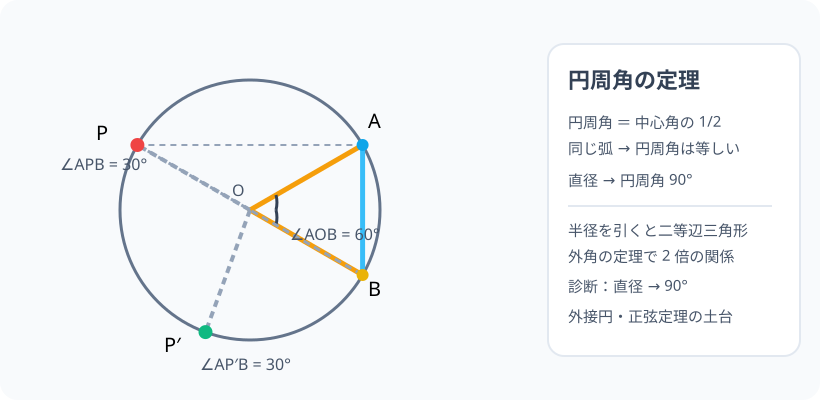

# 円周角の定理：弧を「どの位置から」見たら、何度になるか

> [!abstract] このノードの核心
> 円周上の弧の端を 2 点固定すると、円周のどこから見てもその角は**中心角の半分**になる。円周角は位置に依らず一定で、直径（中心角 180°）を見ればちょうど 90°になる。この「弧に固定された角」の感覚が、後に正弦定理（外接円）の土台になる。

> [!success] 合格ライン
> 「円周角＝中心角の半分」「同じ弧に対して円周角は等しい」を、2 本の半径がなす二等辺三角形と外角の性質で導ける。直径に対する円周角が 90° になる理由を説明できる。診断問題（直径 → 90°）に三角の証拠をつける。

## 記号の読み方

| 表記 | 読み方 | この教材での意味 |
|---|---|---|
| 弧 AB | こ・エービー | 円周の一部。端を A・B とする |
| 中心角 | ちゅうしんかく | 円の中心を頂点とする角。弧に対応 |
| 円周角 | えんしゅうかく | 円周上の点を頂点とする角。同じ弧を見る |
| 内接四角形 | ないせつしかくけい | 4 頂点がすべて円周上にある四角形 |

> [!tip] 読むときの注意
> 「弧 AB に対する円周角」は、端点 A・B を共有する複数の角のことを言う。角の向き（どの側に頂点があるか）を図で確かめる。

## 前提ノードと入口判定

機械的な前提関係は、プロジェクト内スナップショット `../ontology/math_euler_complete_ontology.json` を参照し、転記している。外部原本は `G:/マイドライブ/Eleanor Arroway/documents/math_euler_complete_ontology.json`。`trigonometry_master_ontology.md` は人間向けの全体地図として使い、IDや依存関係が異なる場合はJSONを優先する。

| 区分 | ノード・知識 | この教材で必要な理由 | 入口での判定 |
|---|---|---|---|
| 必須ノード（JSON正本） | `ELEM-CIRCLE-01` 円周率 π と円の計量 | 弧・中心角・円周の分割の感覚 | 中心角 360° の円周の 1/6 が 60° の弧であることを言える |
| 必須ノード（JSON正本） | `JH-GEO-PARALLEL-01` 平行線・角・三角形の内角の和 | 導出の核（外角の定理・内角の和 180°） | 三角形の外角が内対角の和に等しいことを説明できる |
| 基礎知識（C類） | 二等辺三角形の底角 | 半径を 2 本書くと二等辺三角形ができる | 等しい 2 辺の底角が等しい（感覚でよい） |

**入口判定の扱い:** JSON の診断問題「直径に対する円周角は何度？」を最初の目安にする。直観で 90° は浮かぶだろうが、**その「半分」がどこから来るか（中心角 180° の半分）**を説明できることが合格ライン。後の P0 で確認。

## 到達点

この教材を閉じたとき、次のことを自分の言葉で説明できる。

- 円周角・中心角・弧の定義と対応関係（同じ弧を見る）。
- 円周角＝中心角の半分の定理（とそれが「位置によらない」こと）。
- 直径に対する円周角＝90°の意味と、その逆の使い方（「90° が見えるなら斜辺が直径」）。
- 正弦定理（外接円）で使うための、この定理の図のイメージ。

## 入口：「どの位置から見ても同じ角度？」

サッカーのゴール（両端 A・B）を、円弧上に立っている選手 P から見たとする。P がどこへ動いてもゴールの見切れ角度（∠APB）は同じになる——ただし P は同じ円周上にとどまる場合に限る。この「弧を見る角」の現象が、今日の定理である。

> [!example] 同じ例を最後まで使う
> 円・中心 O・弧 AB・ゴール A・B・見る者 P（360° の円中、円周上を動き、90° から 30° の例で生きる）を一貫して使う。

## 核となる図

図では、弧 AB に対する中心角が 60° の円。左側の 2 地点 P・P′で見ると、円周角はどちらも 30°。**同じ弧なら「見る場所が違っても、同じ角度」**である。

| 図での要素 | 名前 | 役割 |
|---|---|---|
| 弧 AB | 同じ弧 | 円周角の対象 |
| ∠AOB | 中心角 60° | 円周角の 2 倍 |
| ∠APB | 円周角 30° | P から見た角度 |
| ∠AP′B | 円周角 30° | P′から見た角度（等しい！） |

## まずやってみる

> [!question] 式を見る前の10秒
> 円を書き、中心 O・点 A・B を 60° の中心角で取る。A と B の「反対側の弧」上に点 P を置き、∠APB を予想する。次に P を少し動かしても同じ角度かどうか、見た目で確かめる。

答えを確認する

∠APB = 30°（中心角 60° の半分）。P を動かしても、P が同じ弧上にいる限り 30° のまま。**動いても一定の 30°** こそが定理の象徴である。

## 円周角の定理

同じ弧 AB に対して

$$
\boxed{\ 円周角 = \frac{1}{2}\times 中心角\ }
$$

$$
\boxed{\ \text{同じ弧に対する円周角はすべて等しい}\ }
$$

特に、弧が半円（中心角 180°）なら

$$
\boxed{\ \text{直径に対する円周角は}\ 90°\ }
$$

## 導出：二等辺三角形と外角の定理

### 準備：半径を引く

円周上の点 P を頂点とし、弧 AB を見る角 ∠APB を考える。中心 O から A・B・P へ半径を引くと、OA = OB = OP（すべて半径）。

### まず「辺が中心を通る場合」を確かめる

PA が中心 O を通るとき（PA は直径）の △AOP は、OA = OP の二等辺三角形。底角を α とすると

$$
\angle OAP = \angle OPA = \alpha
$$

三角形の外角の定理（△AOP の外角 ∠AOB は、これと接する 2 つの内角の和）から

$$
\angle AOB = \angle OAP + \angle OPA = 2\alpha = 2\angle APB
$$

**円周角 = 中心角の 2 分の 1** が、この特別な場合で成立した。

### 一般の場合：直径で分解する

P が特別な場合でないとき、O を通る直径（P の反対側の点 Q までの線）を引く。すると ∠APB は

- P と O が同じ側のとき：$\angle APB = \angle APQ + \angle QPB$
- P と O が反対側のとき：$\angle APB = \angle APQ - \angle QPB$（またはその入れ替え）

のように、2 つの角に分解できる。それぞれのパーツに「特別な場合」の 2 倍の関係を使えば、中心角も同じ分解になり

$$
\angle AOB = 2\angle APB
$$

が位置（加算・減算）によらず成立する。（図ではこの位置の場合を描いている。**加算の形は位置の代表ケースと見てよい**。）

### したがって

$$
\text{円周角} = \frac{1}{2}\times\text{中心角} \quad\checkmark
$$

直径について：弧が半円のとき中心角は 180°。その半分が 90°。逆に「∠APB = 90°」が観測されたときは、弧 AB が半円＝**AB が直径**（中心 O が AB の中点）。

## 数値で点検する

- 中心角 60°（図）：円周角 30°。
- 中心角 90°：円周角 45°。
- 中心角 180°（直径）：円周角 90°。
- 極端：中心角 0°（A・B が重なる）→ 円周角 0°「同じ点を見る」。

## 3行まとめ

1. 同じ弧に対する円周角は、中心角のちょうど半分。
2. 円周上ならどの位置も同じ値（これが「位置によらない」定理の価値）。
3. 直径に結ぶと 90°——この性質が、三角形の外接円・正弦定理の根幹になる。

## 理解度サポート：どこまで分かっているか

### まず自己評価

- [ ] **0：未学習** — 円周角・中心角の言葉がまだ
- [ ] **1：見れば分かる** — 図を見て角度の対応を追える
- [ ] **2：自力で解ける** — 与えられた図から角を求める
- [ ] **3：説明できる** — 二等辺三角形＋外角の定理から導出を説明できる

### 技能ごとの確認問題

| check_id | 確認する技能 | 問い | 答えが曖昧なときに戻る場所 |
|---|---|---|---|
| P0 | JSON指定の入口診断 | 直径に対する円周角は何度ですか？ | 「数値で点検する」 |
| C1 | 用語 | 弧 AB に対する中心角と円周角を図から読み取る。 | 「記号の読み方」 |
| C2 | 定理 | 中心角 40° の弧を 円周上から見た角は？（答: 20°） | 「数値で点検する」 |
| C3 | 導出 | 円周角＝中心角半分を、二等辺三角形と外角の定理で導く。 | 「導出」 |
| C4 | 逆の使い方 | ∠APB = 90° が観測されたとき、AB は円の直径と分かる理由を説明する。 | 「導出」末尾 |
| C5 | 先の橋 | この定理が正弦定理（a/sinA = 2R）のどこに使われるかを予想して述べる。 | 「次のノードへの橋」 |

解答と判定基準を開く

- **P0の答え:** 90°。直径に対応する中心角は 180° で、円周角はその半分。
- **C1の答え:** 中心角は O を頂点、円周角は円周上の点が頂点。同じ弧を共有する。
- **C2の答え:** 20°。
- **C3の答え:** OP = OA = OB より二等辺三角形が 3 つ。底角の等しさと外角の定理を合わせて、中心角 = 円周角 × 2。
- **C4の答え:** 円周角 90° は中心角 180°、つまり弧が半円。弦 AB が直径。中心は AB の中点。
- **C5の答え:** 三角形の外接円では、各頂点の角 A は「対辺の弧」の円周角で、同弧の円周角が等しいことを経由して a/sinA が定数 2R になる。

**判定の目安:**

- P0とC1〜C5を正答かつ理由つきで → 次のノードへ
- C3を誤る → 図を描いて二等辺三角形を書き、外角の定理を適用
- C4を誤る → 逆の読み取り（90°→直径）を一度だけ再確認

## よくある取り違え

- 円周角を中心角と同値に（そのまま）読む → **円周角は中心角の半分**。
- 位置が違えば角度も変わると思う → **同じ弧なら同じ**。位置で変わりようがないのが今回の強み。
- 直径の円周角を 45° と覚える → **直径は 90°（半円）**。
- 弧の同じ側にない点 P・P′ で混同 → **頂点は A・B から見て同じ側にいなくてもよい。大切なのは「同じ弧を見ているか」**。
- 内接四角形や 2 つの弧の誤読 → **弧の端点と方向をきちんと示す**。

## 自力確認（teach-back）

教材を閉じて、次を声に出して答える。

1. 円周角・中心角の定義を、弧の言葉で説明する。
2. 中心角 40° の弧を、2 つの異なる位置の円周角の点から測り、同じ角度になることを示す。
3. 円周角＝中心角半分を、二等辺三角形と外角の定理でのみ導く。
4. 「直径に結ぶ円周角は 90°」の逆の使い方（三角形の外接円・正弦定理への布石）を話す。

## 次のノードへの橋

円周角の定理は、主に「円に要素を入れた図」を扱う「円の性質」のカテゴリの中心で、この先：

- **内接円と外接円（`JH-GEO-CIRCLE-INCIRCUM-01`）**：三角形の外心は「円周角 90° の観測 → 直径」の思考の延長。
- **正弦定理（`HS1-TRIG-SINELAW-01`）**：外接円 R の中に三角形を置いたとき、∠A の円周角の対応から a/sinA = 2R が出る。
- **内接四角形**：対角の和 180° もこの定理から出る（`JH-GEO-CIRCLE-ANGLE-01` の続き）。

## インタラクティブ化の候補（レビュー後に判定）

- **有効候補: 円周上の点 P をドラッグ** — P が同じ弧上を動く限り円周角 30°が不変に表示され、異なる弧に移ると従って 30°以外に変わる。定理の核心が操作で証明できる。
- **有効候補: 弧 AB の中心角スライダー** — 円周角が常に半分であることを一覧的に見せる。
- **静的なままで十分:** 図・表・導出で成立。動かすなら最初のドラッグ（P）。
- 動かすことそれ自体を合格条件にはしない。
