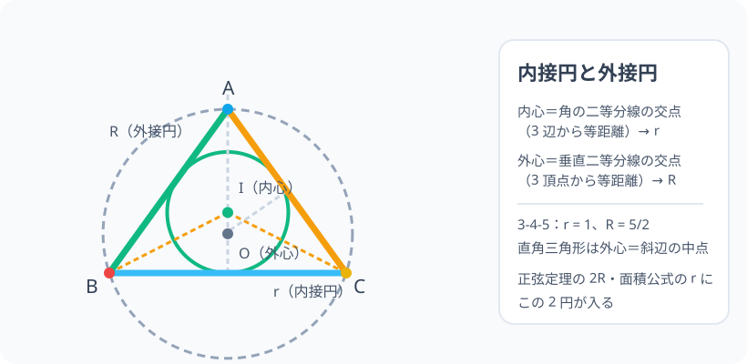

# 内接円と外接円：三角形の「中の円」と「外の円」

> [!abstract] このノードの核心
> どんな三角形にも「3 辺にぴったり触れる円」と「3 頂点を必ず通る円」が 1 つずつある。中の円の中心（**内心**）は角の二等分線の交点、外の円の中心（**外心**）は垂直二等分線の交点。この 2 つの円の半径 r・R が、三角形の計量（面積・正弦定理）と深く結びつく。

> [!success] 合格ライン
> 内心＝角の 2 等分線の交点・外心＝垂直二等分線の交点である理由を、等距離の性質から説明できる。3-4-5 の直角三角形で r = 1・R = 5/2 を計算できる。診断問題（角の二等分線の交点→内心）に答えられる。

## 記号の読み方

| 表記 | 読み方 | この教材での意味 |
|---|---|---|
| 内接円 | ないせつえん | 三角形の 3 辺すべてに接する円（名前の通り「内側に接する」） |
| 外接円 | がいせつえん | 3 頂点すべてを通る円 |
| 内心 | ないしん | 内接円の中心 |
| 外心 | がいしん | 外接円の中心 |
| r / R | アール | r = 内接円の半径、R = 外接円の半径（小文字＝内・大文字＝外） |

> [!tip] 大文字 R と小文字 r
> **R（外接円）は大文字、r（内接円）は小文字**が慣例。正弦定理（a/sinA = 2R）の R も同じ外接円の半径。

## 前提ノードと入口判定

機械的な前提関係は、プロジェクト内スナップショット `../ontology/math_euler_complete_ontology.json` を参照し、転記している。外部原本は `G:/マイドライブ/Eleanor Arroway/documents/math_euler_complete_ontology.json`。`trigonometry_master_ontology.md` は人間向けの全体地図として使い、IDや依存関係が異なる場合はJSONを優先する。

| 区分 | ノード・知識 | この教材で必要な理由 | 入口での判定 |
|---|---|---|---|
| 必須ノード（JSON正本） | `JH-GEO-CIRCLE-ANGLE-01` 円周角の定理 | 外心・外接円の性質（直径と 90°） | 直径に対する円周角の定理を説明できる |
| 必須ノード（JSON正本） | `JH-GEO-TRI-BASIC-01` 三角形の基本 | 辺・角・対辺・対角の語彙（内心・外心の議論の道具） | 三角形の構成（頂点・辺・角）を指せる |
| 基礎知識（C類） | 角の二等分線・垂直二等分線 | 内心・外心の定義そのもの | 角の二等分線が角を半分に分けることを言える |

**入口判定の扱い:** JSON の診断問題「角の二等分線の交点はどこか？」を最初の目安にする。図でなら答えられるはず。**「なぜ 3 本が 1 点で交わる」かの説明**が合格ラインであり、P0 で確認する。

## 到達点

この教材を閉じたとき、次のことを自分の言葉で説明できる。

- 内心と外心の定義（角の二等分線交点・垂直二等分線交点）と等距離の性質。
- 3 本の二等分線 / 垂直二等分線が 1 点で交わる理由（2 本の交点から等距離の合成）。
- 3-4-5 の直角三角形で r・R が求まることを、性質から説明する。
- 正弦定理 2R・面積 S = 1/2 r (a+b+c) の「幾何的設定」としての役割。

## 入口：三角形を「包む円」と「包まれる円」の 1 枚画

折り紙の三角形を持ってみる。**内側にぴったり円（内接円）**を書きたい。同じ三角形を**ぴったり包む円（外接円）**も書きたい。この 2 円の中心を見つける仕組みが、この章の 2 つの定理（内心の定理・外心の定理）である。

> [!example] 同じ例を最後まで使う
> 3-4-5 の直角三角形を基準にし、r：内接円・R：外接円 がそれぞれどう見つかるかを最後まで使い回す。

## 核となる図

図では左の三角形に 3 辺と接する内接円（実線・中心 I）、外接円（破線・中心 O）を重ねた。破線の 2 種類（角の二等分線・垂直二等分線）が、それぞれ I・O で交わる。

| 図での要素 | 名前 | 役割 |
|---|---|---|
| 実線の小円 | 内接円（r） | 3 辺に接する。中心 I |
| 破線の大円 | 外接円（R） | 3 頂点を通る。中心 O |
| 角の二等分線 | I での交差 | 内接円の中心の条件 |
| 垂直二等分線 | O での交差 | 外接円の中心の条件 |

## まずやってみる

> [!question] 式を見る前の10秒
> 三角形を 1 つ描き、角 B と 角 C の 2 等分線をひく。2 本は交わるところが 1 点ある。その交差点から 3 辺までまっすぐ下ろすと、3 本とも同じ長さになると思うか——予想を立てる（ケーキの中心から、ふちまでの距離どれも同じ）。

答えを確認する

同じ長さになる。角の二等分線の性質（2 辺から等距離）を 2 本組み合わせれば、3 辺すべてから等距離の点になる。それが内接円の中心（内心）であり、内接円の半径 r になる。

## 内心の定理：角の二等分線の交点

**角の二等分線の性質**：角の 2 等分線は「その角の 2 辺から等距離にある点の集まり」である。

三角形の角 B・C の 2 等分線の交点を I とする。

- I は角 B の 2 等分線上 → 辺 BA と辺 BC から等距離
- I は角 C の 2 等分線上 → 辺 CB と辺 CA から等距離

第 1・第 2 を合わせると、I は **AB・BC・CA の 3 辺すべてから等距離**。つまり角 A の 2 等分線の上にもあり、3 本の 2 等分線は 1 点で交わる。その距離 r を半径とすれば、3 辺に触れる円（**内接円**）が描ける。この交点が**内心**である。

$$
\text{内心 I} = \text{3 つの角の二等分線の交点} = \text{3 辺から等距離の点} \Rightarrow \text{内接円}
$$

## 外心の定理：垂直二等分線の交点

**垂直二等分線の性質**：線分の垂直二等分線は「2 つの端点から等距離にある点の集まり」である。

三角形の辺 BC・CA の垂直二等分線の交点を O とする。

- O は BC の垂直二等分線上 → OB = OC
- O は CA の垂直二等分線上 → OC = OA

この 2 つから OA = OB = OC。つまり O は 3 頂点すべてから等距離で、**AB の垂直二等分線上にもある**（1 点で交わる）。この距離 R を半径とすれば、3 頂点をすべて通る円（**外接円**）が描ける。交点が**外心**である。

$$
\text{外心 O} = \text{3 辺の垂直二等分線の交点} = \text{3 頂点から等距離の点} \Rightarrow \text{外接円}
$$

**直角三角形のとき**：外心は斜辺の中点（円周角の定理から、直径の円周角 90°）。この観察は正弦定理・円周角のノードとセットで覚えておくと喜ぶ。

## 数値で点検する：3-4-5 の直角三角形

### 内接円 r

前ノードで見た $S = \dfrac{1}{2}r(a+b+c)$、または直角三角形の性質から r = 1。

- 3-4-5 の面積 S = 6、半周 s = 6 → r = S/s = 1。

### 外接円 R

直角三角形の外接円は直径が斜辺 5 → R = 5/2 = 2.5。

- 正弦定理の 2R とも一致（a/sinA = 5/sin90° = 5、よって R = 2.5）。

### 極端な場合

- 正三角形：内心＝外心（中心が完全に一致）。
- 二等辺三角形：内心・外心は対称軸の上に並ぶ。
- 非常に偏った三角形：外心は三角形の外に出る（鈍角三角形）。

## 3行まとめ

1. 内心＝角の二等分線の交点（3 辺から等距離）。内接円の中心、半径は r。
2. 外心＝垂直二等分線の交点（3 頂点から等距離）。外接円の中心、半径は R。
3. 直角三角形では外心が斜辺の中点。2 円の半径 r・R は面積・正弦定理の式の主役である。

## 理解度サポート：どこまで分かっているか

### まず自己評価

- [ ] **0：未学習** — 内心・外心の言葉がない
- [ ] **1：見れば分かる** — 図から心の位置を言える
- [ ] **2：自力で解ける** — 3-4-5 で r・R を計算できる
- [ ] **3：説明できる** — 2 本の線の 1 点交差・等距離の根拠を説明できる

### 技能ごとの確認問題

| check_id | 確認する技能 | 問い | 答えが曖昧なときに戻る場所 |
|---|---|---|---|
| P0 | JSON指定の入口診断 | 三角形の 3 つの角の二等分線はどこで交わるか？（答: 内心） | 「内心の定理」 |
| C1 | 並べ替え | 内接円と外接円を、中心の名前・半径・通る対象で整理する。 | 「記号の読み方」 |
| C2 | 等距離の根拠 | 角の二等分線が「2 辺から等距離」である理由を説明する。 | 「内心の定理」 |
| C3 | 直角三角形 | 3-4-5 で r と R を求める。（答: 1・5/2） | 「数値で点検する」 |
| C4 | 外心の根拠 | 3 つの辺の垂直二等分線が 1 点で交わることを説明する。 | 「外心の定理」 |
| C5 | 先の橋 | 正弦定理（a/sinA = 2R）と面積（S = 1/2 r(a+b+c)）に、どちらの円（R・r）が使われるか述べる。 | 「次のノードへの橋」 |

解答と判定基準を開く

- **P0の答え:** 内接円の中心（内心）。3 辺から等距離。
- **C1の答え:** 内接円＝中心 内心・半径 r・3 辺に接する。外接円＝中心 外心・半径 R・3 頂点を通る。
- **C2の答え:** 角の二等分線は、角の 2 辺を対称にする線。対称な 2 点（辺の上）までの距離は等しくなるため、等距離の点の集まりになる。
- **C3の答え:** r = 1（S = 6・s = 6）、R = 5/2（斜辺 = 直径）。
- **C4の答え:** BC と CA の垂直二等分線の交点は B・C から等距離でかつ C・A から等距離。3 頂点すべてから等距離なので AB の垂直二等分線上にもある。よって 1 点。
- **C5の答え:** 正弦定理の 2R（外接円）、面積公式の r（内接円）。両方ともこの 2 つの円が主役。

**判定の目安:**

- P0とC1〜C5を正答かつ理由つきで → 次のノードへ
- C2を誤る → 角の二等分線の性質を再確認（等距離の集まり）
- C3を誤る → 3-4-5 の性質（直角三角形・3 辺）を確認
- C4を誤る → 外心の等距離の合成を書き直す

## よくある取り違え

- 内心と外心を混同する → **内接円には内心（内）、外接円には外心（外）**。
- 角の二等分線を中心に垂直二等分線を書く → **内=角の二等分線／外=垂直二等分線**。
- r を 2R と 1 個にする計算をいっしょにする → **r は内接円（単数）・R は外接円（半径 2 倍 2R として使い道に応じて 取り扱う）**。
- 直角三角形で外心を忘れる・三角形の外だと驚く → **鈍角三角形の外心は外。直角では斜辺の中点**。
- 内接円か外接円のどちらか一方だけだと思う → **どちらも任意の三角形に必ず 1 つある**。

## 自力確認（teach-back）

教材を閉じて、次を声に出して答える。

1. 任意三角形に内接円 1 つ・外接円 1 つが描けることを、中心の決め方と共に説明する。
2. 内心＝3 辺から等距離、外心＝3 頂点から等距離を、二等分線・垂直二等分線の性質から導く。
3. 3-4-5 で r・R を計算し、それぞれが 何を p と対応するか言う。
4. 正弦定理・面積の式で、R と r のどちらが主役になるか名付ける。

## 次のノードへの橋

この 2 つの円は、三角形の計量の主役になる。

- **正弦定理（`HS1-TRIG-SINELAW-01`）**：a/sinA = 2R。外接円の半径 R が入る。
- **三角形の面積（`HS1-TRIG-AREA-01`）**：S = 1/2 r (a+b+c)。内接円の半径 r が入る。
- 外心と内心の 2 つの定理は、そのまま「三角形に内在する幾何」の最上層である。

## インタラクティブ化の候補（レビュー後に判定）

- **有効候補: 頂点をドラッグして 2 円の動きを見る** — 三角形を変形すると内接円・外接円が常に 1 つずつ追従する。外心が外に行く瞬間も見える。
- **有効候補: 3-4-5 の r・R の確認** — スライダーで辺の長さを 3-4-5 に合わせて半径の数値表示。
- **静的なままで十分:** 図・定理・3-4-5 の検証で成立。動かすなら頂点ドラッグ。
- 動かすことそれ自体を合格条件にはしない。
