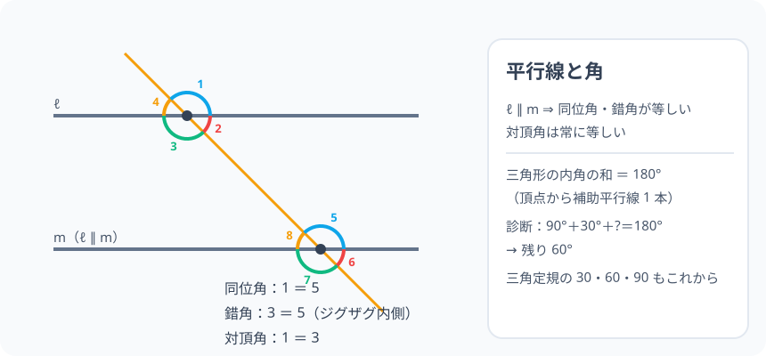

# 平行線・角・内角の和：三角定規の秘密を隠す 1 本の平行線

> [!abstract] このノードの核心
> 平行な 2 直線を 1 本の直線が横切ると、**同位角**は等しく・**錯角**は等しい。この 1 つの性質から、三角形の内角の和 180° が「頂点を通る補助の平行線 1 本 + 錯角の寄せ集め」で証明できる。三角定規（30/60/90°）の角度も、正方形の折り目も、すべてこの 1 行が根っこ。

> [!success] 合格ライン
> 平行線の同位角・錯角の相等を図で指し示し、三角形の内角の和 180° を平行線 1 本で導出できる。診断（30° の直角三角形の残りは 60°）を内角の和 180° で説明できる。

## 記号の読み方

| 表記 | 読み方 | この教材での意味 |
|---|---|---|
| 平行 ℓ ∥ m | へいこう | どこまでも交わらない 2 直線（l と m） |
| 同位角 | どういかく | 同じ位置にある対応する角（例：∠1 と ∠5） |
| 錯角 | さくかく | 串刺しの逆側・斜め向かいの角（例：∠3 と ∠5） |
| 対頂角 | たいちょうかく | 交差の角同士（向かい合う角・常に等しい） |
| 内角 | ないかく | 多角形の内側の角 |

> [!tip] 錯誤の錯。**錯角＝「ジグザグの内側のペア」**と覚えると見つけやすい。

## 前提ノードと入口判定

機械的な前提関係は、プロジェクト内スナップショット `../ontology/math_euler_complete_ontology.json` を参照し、転記している。外部原本は `G:/マイドライブ/Eleanor Arroway/documents/math_euler_complete_ontology.json`。`trigonometry_master_ontology.md` は人間向けの全体地図として使い、IDや依存関係が異なる場合はJSONを優先する。

| 区分 | ノード・知識 | この教材で必要な理由 | 入口での判定 |
|---|---|---|---|
| 必須ノード（JSON正本） | `JH-ALG-EXPR-01` 文字と式・等式変形 | その後の式（X+Y+Z=180）の問題の下 | 2x = 180 − 40 を解ける |
| 基礎知識（前ノード系） | 三角形の語彙（TRI-BASIC） | 内角・頂点などの言葉 | 三角形の内角 3 つを指せる |

**入口判定の扱い:** JSON の診断問題（30° の直角三角形の残り）を最初の目安にする。90°+30°+? = 180° の引き算は簡単。**「なぜ 180° か」を平行線で説明できること**が合格ラインで、P0 で確認する。

## 到達点

この教材を閉じたとき、次のことを自分の言葉で説明できる。

- 平行線の性質（同位角・錯角が等しい）を図で指せる。
- 対頂角の相等（平行線なしでも成立）を使用できる。
- 三角形の内角の和 180° を、頂点を通る補助平行線から導ける。
- 「180°−（他の 2 角）」で残りの角を求める定番操作ができる。

## 入口：「線路の枕木と、三角定規の切れ角」

平行な 2 本の線路を電車に見える 1 本の横線が刺激すると……同じ場所の角（同位角）と、網掛けペア（錯角）がいつも同じ。その発見が「三角形の角」に 当てはまる。この 1 つの発見から、内角の和 180° が出る。

> [!example] 同じ例を最後まで使う
> 三角定規の 30°・60°・90° を主役に持ち、内角の和・錯角導出・測量の視点まで使い込む。

## 核となる図



図の左：平行 2 直線 ℓ・m を横線 n が切る。同位角（同じ位置）・錯角（斜め向かい）・対頂角（交差の角）を色分け。図の右：三角形 ABC の頂点 C を通り AB に平行な補助線、錯角によって ∠A・∠B が C に移動し、1 直線（180°）にそろう。

| 図での要素 | 名前 | 役割 |
|---|---|---|
| 左の色ペア | 同位角・錯角 | 平行線の性質 |
| 直線 n | 横断線 | 交点を作る |
| 右の補助線（C を通る平行線） | 導出の 1 本 | ∠A・∠B を C へ寄せる |

## まずやってみる

> [!question] 式を見る前の10秒
> 直角三角形の 2 つの鋭角を足すと？ まず 30°・60°・90° の三角形で手を動かす。残り 1 角は、他の 2 角が分かれば出る——それはなぜだろう。

<details>
<summary>答えを確認する</summary>

2 つの鋭角は 90° を合計する。内角の和 180° − 90°（直角）＝ 90°。だから残りが 60°。

</details>

## 平行線と角の性質

### 定義

2 直線 ℓ・m が「どこまで延ばしても交わらない」とき平行という（ℓ ∥ m）。1 本の直線 n がこれを横切ると：

$$
\text{同位角は等しい}\quad\quad\text{錯角は等しい}
$$

（逆も成立：同位角か錯角が等しければ、2 直線は平行 —— 判定条件。）

### 対頂角

2 直線が交わるとき、向かい合う角（対頂角）は常に等しい。平行でなくても等しい（この性質は独立）。

```
n が交差する箇所：∠1 ∠2 | ∠3 ∠4 …（図）
対頂角：∠1 = ∠3、∠2 = ∠4
```

## 三角形の内角の和 180° の導出

△ABC の頂点 C を通り、AB に平行な直線 ℓ を引く。

- 錯角で $\angle A = \angle A'$（CA を横線と見る）
- 錯角で $\angle B = \angle B'$（CB を横線と見る）
- C の周りは、直線 $\ell$ 上の角なので **180°**（∠A'・∠C・∠B' の 3 つが並ぶ）

$$
\boxed{\ \angle A + \angle B + \angle C = 180°\ }
$$

**「内角の和 180°」は暗記ではなく、1 本の平行線の影である。**

## 数値で点検する

### 診断問題

$$
90° + 30° + \angle\text{残り} = 180°\quad\Rightarrow\quad\text{残り} = 60°
$$

### 例：60°・70° の三角形

残り = 180 − 130 = 50°。

### 極端な場合

- ∠A → 0°：他の 2 角は 180° に寄り、三角形は潰れる。
- 2 角が等しい（二等辺三角形）：180° − 2×∠A から引き算。

## 3行まとめ

1. 平行線は同位角・錯角を等しくする（この逆も判定）。
2. 三角形の内角の和 180° の証明は、頂点から 1 本の補助平行線。
3. 三角定規の 30/60/90 も、この性質で保証される。

## 理解度サポート：どこまで分かっているか

### まず自己評価

- [ ] **0：未学習** — 同位角と錯角の違いが分からない
- [ ] **1：見れば分かる** — 図で角の対応を追える
- [ ] **2：自力で使える** — 内角の和から角を求める計算ができる
- [ ] **3：説明できる** — 補助平行線の導出・判定条件・対頂角を含めて説明できる

### 技能ごとの確認問題

| check_id | 確認する技能 | 問い | 答えが曖昧なときに戻る場所 |
|---|---|---|---|
| P0 | JSON指定の入口診断 | 直角三角形の鋭角の一方が 30° のとき他方は？（答: 60°） | 「数値で点検する」 |
| C1 | 用語 | 同位角・錯角のペアを図で 1 組ずつ指摘する。 | 「平行線と角の性質」 |
| C2 | 対頂角 | 対頂角は平行線がない場合も等しい理由を説明する。 | 「対頂角」 |
| C3 | 導出 | 頂点 C を通る平行線から内角の和 180° を導く。 | 「内角の和の導出」 |
| C4 | 計算 | 48° と 85° の三角形の残り（答: 47°）。 | 「数値で点検する」 |
| C5 | 評価 | 三角定規や 1-1-√2 とのつながり（TRI-CONG・SQRT への布石）を述べる。 | 「次のノードへの橋」 |

<details>
<summary>解答と判定基準を開く</summary>

- **P0の答え:** 60°（180 − 90 − 30 = 60）。
- **C1の答え:** 同位角=同じ位置、錯角=斜め向かい。図の色ペアを指す。
- **C2の答え:** 2 直線が交わると、隣り合う角の和は 180°（平角）。対頂角は「同じ補角を共有する角」として等しくなる。
- **C3の答え:** 補助線の錯角で∠A・∠B を∠C に移動し、直線 n 上の角の和 180°。
- **C4の答え:** 47°。
- **C5の答え:** 三角定規の 30-60 への応用。直角三角形の 2 つの鋭角は互いに余角（90°−θ）という関係。TRI-CONG の「斜辺＋鋭角の合同」に結び付く。

**判定の目安:**

- P0とC1〜C5を正答かつ理由つきで → 次のノードへ
- C2を誤る → 対頂角の図（X 型）を書いてから言う
- C3を誤る → 補助線の錯角の動きを色分けして再現する

</details>

## よくある取り違え

- 同位角と錯角を同じ場所の角と混同する → **同位角＝同じ位置・錯角＝境の斜め向かい**。
- 対頂角を平行線の性質と覚える → **対頂角は常に等しい（平行でなくても）**。
- 内角の和を 360° と間違える → **三角形は 180°、四角形は 360°**（多角形は n−2×180）。
- 平行線の性質で角が「変に見える」場合… → **見た目に迷ったら補助線を引いて同位角・錯角を使う**。
- 三角 30・60・90 の値を「魔法」と覚える → **正三角形を半分にした形＋頂点の内角の和から自ら作れる**。

## 自力確認（teach-back）

教材を閉じて、次を声に出して答える。

1. 同位角・錯角・対頂角を、図を描かずに定義して言う。
2. 内角の和 180° を補助平行線で導く。
3. 30° の直角三角形の残りの角（60°）を内角の和から計算する。
4. 三角定規や 45-45-90 との関係を、このノードの言葉で述べる。

## 次のノードへの橋

- **直角三角形の性質・合同（`JH-GEO-TRI-CONG-01`）**：「斜辺＋鋭角が等しければ合同」の根拠は、ここの「残りの角が決まる（余角）」から。
- **三角比（`HS1-TRIG-DEF-01`）**：30°・60°・45° の値は、この「2 つの鋭角の和 90°（余角）」と正三角形半分などの組み合わせ。
- **円周角（`JH-GEO-CIRCLE-ANGLE-01`）**：内角の和 180° が円周角（外角・二等辺）の証明の道具になる。

## インタラクティブ化の候補（レビュー後に判定）

- **有効候補: 横断線の角度スライダー** — 直線 n を動かすと同位角・錯角が動き続け、常に等しいことが追える。
- **有効候補: 三角形の頂点をドラッグ** — 内角の和 180° がどんな三角形でも変わらないことを観察。
- **静的なままで十分:** 図と導出は十分。スライダー（横断線）が先。
- 動かすことそれ自体を合格条件にはしない。
