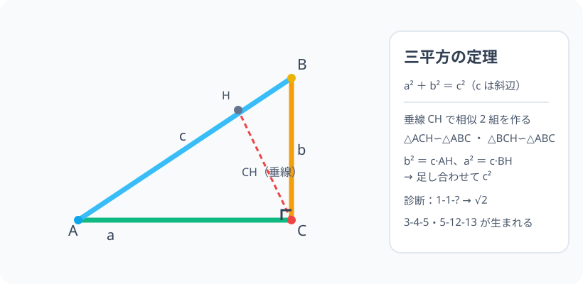

# 三平方の定理：2 辺が分かれば、直角三角形は「もう決まった手」

> [!abstract] このノードの核心
> 直角三角形の直角を挟む 2 辺を $a$・$b$、斜辺を $c$ とすると、**$a^2+b^2 = c^2$** がいつでも成立する。直角から斜辺に垂線を下ろすと 2 つの相似三角形が現れ、**辺の比の掛け算**がこの式を作る。3-4-5・1-1-√2 など史上最頻出の「3 辺トリオ」を産む、幾何と代数の交点。

> [!success] 合格ライン
> 直角三角形に垂線を下ろし、2 つの相似（△ACH∽△ABC・△BCH∽△ABC）から $a^2+b^2=c^2$ を導ける。1-1 なら斜辺 √2（＝診断の答え）を計算できる。3-4-5・5-12-13 の例が言える。

## 記号の読み方

| 表記 | 読み方 | この教材での意味 |
|---|---|---|
| a・b | エー・ビー | 直角を挟む 2 辺（脚） |
| c | シー | 斜辺（直角の向かい側・最長） |
| AH・BH | エーエイチ・ビーエイチ | 斜辺を切り分けた 2 つの部分長 |

> [!tip] 記号の習慣
> 直角の頂点を C とし、対辺の斜辺を c と書く流儀が多い。向かい側の対応（a は ∠A の向かい側）が汎用。

## 前提ノードと入口判定

機械的な前提関係は、プロジェクト内スナップショット `../ontology/math_euler_complete_ontology.json` を参照し、転記している。外部原本は `G:/マイドライブ/Eleanor Arroway/documents/math_euler_complete_ontology.json`。`trigonometry_master_ontology.md` は人間向けの全体地図として使い、IDや依存関係が異なる場合はJSONを優先する。

| 区分 | ノード・知識 | この教材で必要な理由 | 入口での判定 |
|---|---|---|---|
| 必須ノード（JSON正本） | `JH-GEO-SIMILAR-01` 図形の相似と比率の普遍性 | 導出の中核（2 つの相似三角形） | 同じ角の 2 三角形は相似、を説明できる |
| 必須ノード（JSON正本） | `JH-ALG-QUADRATIC-01` 展開・2次方程式 | 式のバランス（2 乗の和・平方根）の処理 | (x+3)(x−3) = x²−9 が展開できる |
| 基礎知識（C類） | 斜辺の定義 | 直角の向かい側・最長の辺 | 直角三角形で斜辺を指せる |

**入口判定の扱い:** JSON の診断問題「1 と 1 の直角三角形の斜辺」を最初の目安にする。1²+1² = 2 だから斜辺は √2。**√2 が「2 の平方根」として自然に出ること**（平方根ノードとの接続）も見える。P0 で確認。

## 到達点

この教材を閉じたとき、次のことを自分の言葉で説明できる。

- 三平方の定理（a²+b²=c²）を、垂線による相似 2 組から導ける。
- 2 辺から斜辺を・斜辺と 1 辺から残りを計算できる。
- 逆定理（a²+b²=c² なら角は直角）を説明できる。
- 3-4-5・1-1-√2・5-12-13 を「覚えるだけでなく作れる」と宣伝できる。

## 入口：「直角三角形の 3 辺は、なぜ勝手に決まる」

2 つの長さが決まると、三角形の形は一意（SSS）——直角三角形では特に、直角があるので「2 辺を指定すると残り 1 辺の長さが自動的に決まる」。その「世の中の約束」を数式にしたのが三平方の定理である。紀元前から測量士が使ったこの式は、四千年の間、幾何の中心を担う。

> [!example] 同じ例を最後まで使う
> 直角 C の三角形 ABC（AC = 3・BC = 4・AB = 5）を使い、導出・検算・逆定理まで通す。

## 核となる図

図のとおり、直角の頂点 C から斜辺 AB に垂線 CH を下ろす。すると △ACH と △BCH の 2 つが、**もとの △ABC と相似**になる（同じ 3 つの角を持つ）。

| 図での要素 | 名前 | 役割 |
|---|---|---|
| AB = c | 斜辺 | 垂直分割の母線 |
| AH・BH | 分割 | 相似からの比例式 |
| CH | 高さ | 相似を作る垂線 |
| △ACH・△BCH | 相似 | 辺の比の乗法の要 |

## まずやってみる

> [!question] 式を見る前の10秒
> 直角を挟む 2 辺 3・4 の三角形を描く。斜辺が整数（5）になるかどうか、筋書きを考えながら 3²+4² を計算して 待つ。

答えを確認する

3²+4² = 9+16 = 25、√25 = 5。奇跡的に整数（3-4-5）。**なぜ整数のままか**はこのページの後の「相似の導出」を見れば「だけ」の話でなく、相似の比による。

## 三平方の定理（導出：相似で）

### 手順

△ABC（∠C = 90°）で、斜辺 AB に頂点 C から垂線 CH を下ろす。このとき

- △ACH ∽ △ABC（直角＋共通角 A → AA）
- △BCH ∽ △ABC（直角＋共通角 B → AA）

### 比例式

△ACH ∽ △ABC より、対応辺

$$
\frac{AC}{AB} = \frac{AH}{AC}\quad\Rightarrow\quad AC^2 = AB\cdot AH\quad\text{（すなわち } b^2 = c\cdot AH\text{）}
$$

△BCH ∽ △ABC より

$$
BC^2 = AB\cdot BH
$$

### 合計

$$
a^2 + b^2 = AB\cdot BH + AB\cdot AH = AB(BH + AH) = AB\cdot AB = c^2
$$

$$
\boxed{\ a^2 + b^2 = c^2\ }
$$

**これが「垂線 1 本で 2 つの相似」から出る。**

## 数値で点検する

### 診断問題：1-1-?

$$
c^2 = 1^2 + 1^2 = 2\quad\Rightarrow\quad c = \sqrt{2}
$$

### 3-4-5・5-12-13

$$
3^2+4^2 = 25 = 5^2\quad\checkmark\qquad
5^2+12^2 = 25+144 = 169 = 13^2\quad\checkmark
$$

### 極端な場合

- 1 本の脚が 0 → c = | 他の 1 辺 |（三角形は潰れても式は回る）。
- a = b → 直角二等辺三角形 1:1:√2 が 自動作られる（√2 は平方根ノードの再会）。

## 3行まとめ

1. 直角三角形では a² + b² = c²（c は斜辺）。
2. 証明は「直角 C からの垂線」→相似 2 組→辺の比の掛け算→同じまとめ。
3. 3-4-5 系（整数トリオ）を多数生む。逆定理で測量にも。

## 理解度サポート：どこまで分かっているか

### まず自己評価

- [ ] **0：未学習** — この定理の呪文だけ知っている
- [ ] **1：見れば分かる** — 垂線分割の図を追える
- [ ] **2：自力で使える** — 3 辺が計算できる
- [ ] **3：説明できる** — 相似からの導出・逆定理・整数トリオの作れ方を説明できる

### 技能ごとの確認問題

| check_id | 確認する技能 | 問い | 答えが曖昧なときに戻る場所 |
|---|---|---|---|
| P0 | JSON指定の入口診断 | 直角を挟む 2 辺が 1 と 1 のとき斜辺は？（答: √2） | 「数値で点検する」 |
| C1 | 導出（相似） | 垂線 CH を引いて相似 2 組を作り、AC² = AB·AH を導く。 | 「導出：相似で」 |
| C2 | 計算 | 3-4-?（答: 5）・5-12-?（答: 13） | 「数値で点検する」 |
| C3 | 逆定理 | 6-8-9 は直角三角形か？（答: 否。6²+8² = 100 ≠ 9² = 81） | 「3行まとめ」逆定理 |
| C4 | 斜辺から | 斜辺 10・1 辺 6 の残りの辺は？（答: 8） | 「数値で点検する」 |
| C5 | 三角比の準備 | この定理と sin²θ+cos²θ=1 の関係を述べる。 | 「次のノードへの橋」 |

解答と判定基準を開く

- **P0の答え:** c = √2。
- **C1の答え:** △ACH ∽ △ABC より AC/AB = AH/AC → AC² = AB·AH。
- **C2の答え:** 5 ・ 13。
- **C3の答え:** 否。（6²+8² = 100 ≠ 9² = 81。90° ではない。）
- **C4の答え:** √(100−36) = √64 = 8（6-8-10）。
- **C5の答え:** 斜辺を 1 に（単位円相当に）した三角形では a²+b²=c² が sin²θ+cos²θ=1 として現れる。（`HS1-TRIG-UNITCIRCLE-01` の円の方程式 x²+y²=1 にもつながる。）

**判定の目安:**

- P0とC1〜C5を正答かつ理由つきで → 次のノードへ
- C1を誤る → 相似の対応関係（△ACH∽△ABC）を描き直す
- C3を誤る → 逆定理の判定（平方の比較）を復習

## よくある取り違え

- 斜辺でなく 1 本の脚に c² を当てる → **c は直角の向かい側**。
- a² + b² = c² を「a+b=c²」と分解して解く → **√/加算ではなく 2 乗の足し算そのもの**。
- 3-4-5 を覚えることで満足 → **面積・整数トリオの作り方は相似（このページ）から**。
- 逆定理を忘れる → **測量は 3 辺から直角を判定（古代の縄張り）**。
- 三角形の種類を確認しないで公式を使う → **直角三角形のみ**（余弦定理の一般版へ続く）。

## 自力確認（teach-back）

教材を閉じて、次を声に出して答える。

1. 二つの相似（△ACH・△BCH）から a²+b² = c² を導く（変形を全部書く）。
2. 3-4-5・1-1-√2・5-12-13 を自分で作り出す。
3. 6-8-? と斜辺 10 から残りの 1 辺を出す。
4. 逆定理（辺から直角の判定）と直近の使い道（測量）を述べる。

## 次のノードへの橋

- **三角比（`HS1-TRIG-DEF-01`）**：3-4-5 の辺の対応が sin・cos・tan の定義に直結。`HS1-TRIG-IDENTITY-01` の sin²+cos²=1 はこの定理の別の顔。
- **余弦定理 `HS1-TRIG-COSINELAW-01`**：直角三角形から一般三角形への拡張版。
- **座標距離・単位円**：2 点間の距離、円の方程式もこの定理の分身である。

## インタラクティブ化の候補（レビュー後に判定）

- **有効候補: 直角三角形の 2 辺スライダー** — a・b を動かすと斜辺 c がリアルタイムで更新される。
- **有効候補: 3-4-5 の分類** — 整数トリオと無理数のトリオの色分け。
- **静的なままで十分:** 図と導出は十分成立。スライダーを 1 つなら「2 辺スライダー」。
- 動かすことそれ自体を合格条件にはしない。
